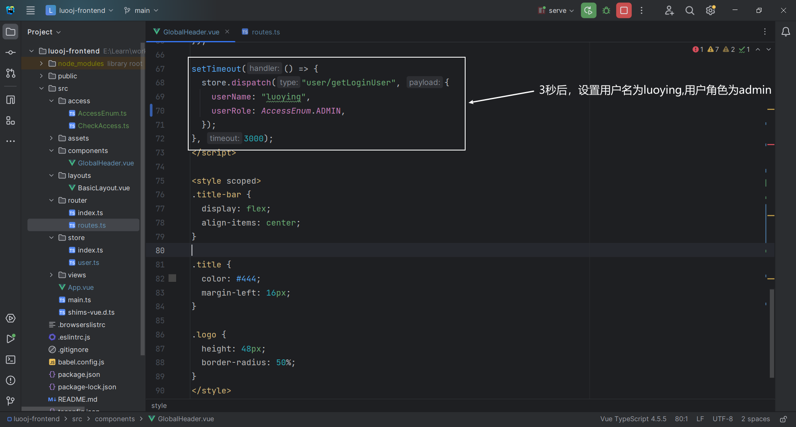
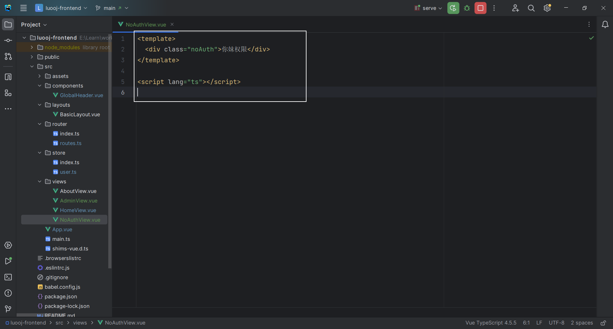

# LuoOJ

## 项目介绍

OJ （Online Judge 在线判题系统）

用于在线评测编程题目的系统。用户可以选择题目，在线做题（编写代码并且提交代码）；系统能根据用户提交的代码、出题人预设的输入和输入用例，先编译代码，运行代码，判断代码运行结果是否正确。其中的判题系统作为开放API，便于开发者开发自己的OJ系统

### OJ系统常用概念

- AC（Accepted）：表示题目通过
- 题目限制
  - 时间限制
  - 内存限制
- 题目描述
- 题目输入
- 题目输出
- 题目输入用例
- 题目输出用例
- 普通测评：管理员预设输入用例和输出用例，判题机运行用户的代码，先给用户的代码喂输入用例得到输出，再与输出用例比对，看是否一致（比对用例文件）
- 特殊测评（SPJ）：管理员预设输入用例和输出用例，比如管理员输入1，用户的输出只要是>0 或 <10 就是正确的（特判程序：不是通比对用例文件这种死板的方式来检验，而是要专门根据这道题目写一个特殊的判断程序，该程序接受题目的输入用例，输出用例，用户的输出，根据这些值来比较是否正确）
- 交互测评：输入由用户决定，输出结果可能多种多样，比较灵活，没办法通过死板的用例文件搞定

### OJ系统的注意点

- 安全性：不能让用户随意引入包，随意遍历，暴力破解，需要使用正确的算法
- 判题过程异步化
- 提交记录：提交之后，有运行的结果、信息（时间内存的花费，做题人，语言等）

### OJ系统的难点

- 判题系统：用户提交代码之后，自动检查用户的代码是否正确，自动得到结果，保证判题系统的安全性


## 项目调研

**现有OJ系统：**

- https://github.com/HimitZH/HOJ （适合学习）        https://docs.hdoi.cn

**注意点：**

- 权限校验
  - 谁能提交代码，谁不能提交代码
- 代码沙箱（安全沙箱）
  - 防止用户代码藏毒。使用隔离的、安全的环境去运行用户的代码
- 资源分配
  - 防止用户疯狂占用资源，导致其他人无法使用。需要限制用户程序的资源占用
- 判题规则
  - 比对用例，验证结果
- 任务调度
  - 服务器资源有限，用户要排队，依次去执行判题


## 架构图


## 核心功能

- 题目模块
  - 创建题目（管理员）
  - 删除题目（管理员）
  - 修改题目（管理员）
  - 搜索题目（管理员&用户）
  - 在线做题
  - 提交代码
- 用户模块
  - 注册
  - 登录
- 判题模块
  - 提交判题
  - 错误处理（内存溢出，超时，安全）
  - 代码沙箱（自主实现） 
  - 开放接口（提供一个独立的新服务）


## 技术选型

**前端**

- Vue3
- Arco Design
- 在线代码编辑器
- 在线文档浏览

**后端**

- Java进程控制
- Java安全管理器，部分JVM知识点
- 虚拟机
- Docker（代码沙箱）
- Spring Cloud 微服务

- 消息队列


## 计划

**初始化**

- 前端
- 后端

**后端**

- 库表设计
- 后端接口代码开发
- 代码沙箱
- 系统优化
  - 微服务改造

**前端**

- 通用项目模板搭建

- 主业务流程

## OJ系统实现方案

**1、用现成的 OJ 系统**
网上有很多开源的 OJ 项目，可以直接下载开源代码自己部署。
比较推荐的是 judge0，这是一个非常成熟的商业 OJ 项目，支持 60 多种编程语言！https://github.com/judge0/judge0

**2、用现成的服务**
直接使用现成的 判题 API 或者 代码沙箱 等服务。

比如 judge0 提供的判题 API。只需要通过 HTTP 调用 submissions 判题接口，把用户的代码、输入值、预期的执行结果作为请求参数发送给 judge0 的服务器，它就能自动帮你编译执行程序，并且返回程序的运行结果。


API 的作用：接受代码、返回执行结果

Judge0 API 地址：https://rapidapi.com/judge0-official/api/judge0-ce
官方文档：https://ce.judge0.com/#submissions-submission-post

流程

1. 先注册
2. 再开通订阅
3. 然后测试 language 接口
4. 测试执行代码接口 submissions

示例接口参数：

```json
{
  "source_code": "#include <stdio.h>\n\nint main(void) {\n  char name[10];\n  scanf(\"%s\", name);\n  printf(\"hello, %s\n\", name);\n  return 0;\n}",
  "language_id": "4",
  "stdin": "Judge0",
  "expected_output": "hello, Judge0"
}
```

预期返回：

```json
{
  "source_code": "includestdiohintmainvoidcharname10scanfsnameprintfhellosname\nreturn0=\n",
  "language_id": 76,
  "stdin": "Judgew==\n",
  "expected_output": "helloJudge0=\n",
  "stdout": null,
  "status_id": 6,
  "created_at": "2023-07-27T13:50:30.433Z",
  "finished_at": "2023-07-27T13:50:31.022Z",
  "time": null,
  "memory": null,
  "stderr": null,
  "token": "8be000ad-2edb-4262-b367-7095a694e028",
  "number_of_runs": 1,
  "cpu_time_limit": "5.0",
  "cpu_extra_time": "1.0",
  "wall_time_limit": "10.0",
  "memory_limit": 128000,
  "stack_limit": 64000,
  "max_processes_and_or_threads": 60,
  "enable_per_process_and_thread_time_limit": false,
  "enable_per_process_and_thread_memory_limit": false,
  "max_file_size": 1024,
  "compile_output": "bWFpbi5jcHA6MToxOiBlcnJvcjogc291cmNlIGZpbGUgaXMgbm90IHZhbGlk\nIFVURi04Cjw4QT53JTxCOT48VSswNUVDPjxCNT7YqDw4Nj4p7ZmoPEE3PjxC\nRT48ODg+PDlEPnI8VSswMDE2PjxBQj48OUQ+PEE5Pjw5RT48RDc+SzxVKzAw\nMUM+anfsnak8OUU+PEE2PjxCOD48QTc+PEI1PjxGOD5ePDk2PlosPDlEPjxB\nOT48OUU+PEFEPjxFQj5uPEFFPn0KXgptYWluLmNwcDoxOjI6IGVycm9yOiB1\nbmtub3duIHR5cGUgbmFtZSAndycKPDhBPnclPEI5PjxVKzA1RUM+PEI1Ptio\nPDg2Pintmag8QTc+PEJFPjw4OD48OUQ+cjxVKzAwMTY+PEFCPjw5RD48QTk+\nPDlFPjxENz5LPFUrMDAxQz5qd+ydqTw5RT48QTY+PEI4PjxBNz48QjU+PEY4\nPl48OTY+Wiw8OUQ+PEE5Pjw5RT48QUQ+PEVCPm48QUU+fQogICAgXgptYWlu\nLmNwcDoxOjM6IGVycm9yOiBleHBlY3RlZCB1bnF1YWxpZmllZC1pZAo8OEE+\ndyU8Qjk+PFUrMDVFQz48QjU+2Kg8ODY+Ke2ZqDxBNz48QkU+PDg4Pjw5RD5y\nPFUrMDAxNj48QUI+PDlEPjxBOT48OUU+PEQ3Pks8VSswMDFDPmp37J2pPDlF\nPjxBNj48Qjg+PEE3PjxCNT48Rjg+Xjw5Nj5aLDw5RD48QTk+PDlFPjxBRD48\nRUI+bjxBRT59CiAgICAgXgptYWluLmNwcDoxOjQ6IGVycm9yOiBzb3VyY2Ug\nZmlsZSBpcyBub3QgdmFsaWQgVVRGLTgKPDhBPnclPEI5PjxVKzA1RUM+PEI1\nPtioPDg2Pintmag8QTc+PEJFPjw4OD48OUQ+cjxVKzAwMTY+PEFCPjw5RD48\nQTk+PDlFPjxENz5LPFUrMDAxQz5qd+ydqTw5RT48QTY+PEI4PjxBNz48QjU+\nPEY4Pl48OTY+Wiw8OUQ+PEE5Pjw5RT48QUQ+PEVCPm48QUU+fQogICAgICBe\nCm1haW4uY3BwOjE6NzogZXJyb3I6IHNvdXJjZSBmaWxlIGlzIG5vdCB2YWxp\nZCBVVEYtOAo8OEE+dyU8Qjk+PFUrMDVFQz48QjU+2Kg8ODY+Ke2ZqDxBNz48\nQkU+PDg4Pjw5RD5yPFUrMDAxNj48QUI+PDlEPjxBOT48OUU+PEQ3Pks8VSsw\nMDFDPmp37J2pPDlFPjxBNj48Qjg+PEE3PjxCNT48Rjg+Xjw5Nj5aLDw5RD48\nQTk+PDlFPjxBRD48RUI+bjxBRT59CiAgICAgICAgICAgICAgICAgIF4KbWFp\nbi5jcHA6MToxMDogZXJyb3I6IHNvdXJjZSBmaWxlIGlzIG5vdCB2YWxpZCBV\nVEYtOAo8OEE+dyU8Qjk+PFUrMDVFQz48QjU+2Kg8ODY+Ke2ZqDxBNz48QkU+\nPDg4Pjw5RD5yPFUrMDAxNj48QUI+PDlEPjxBOT48OUU+PEQ3Pks8VSswMDFD\nPmp37J2pPDlFPjxBNj48Qjg+PEE3PjxCNT48Rjg+Xjw5Nj5aLDw5RD48QTk+\nPDlFPjxBRD48RUI+bjxBRT59CiAgICAgICAgICAgICAgICAgICAgICAgXgpt\nYWluLmNwcDoxOjE1OiBlcnJvcjogc291cmNlIGZpbGUgaXMgbm90IHZhbGlk\nIFVURi04Cjw4QT53JTxCOT48VSswNUVDPjxCNT7YqDw4Nj4p7ZmoPEE3PjxC\nRT48ODg+PDlEPnI8VSswMDE2PjxBQj48OUQ+PEE5Pjw5RT48RDc+SzxVKzAw\nMUM+anfsnak8OUU+PEE2PjxCOD48QTc+PEI1PjxGOD5ePDk2PlosPDlEPjxB\nOT48OUU+PEFEPjxFQj5uPEFFPn0KICA
  "exit_code": null,
  "exit_signal": null,
  "message": null,
  "wall_time": null,
  "compiler_options": null,
  "command_line_arguments": null,
  "redirect_stderr_to_stdout": false,
  "callback_url": null,
  "additional_files": null,
  "enable_network": false,
  "status": {
    "id": 6,
    "description": "Compilation Error"
  },
  "language": {
    "id": 76,
    "name": "C++ (Clang 7.0.1)"
  }
}
```

**3、自主开发（采用）**

**4、把 AI 来当做代码沙箱**
把 AI 当做代码沙箱，直接扔给他一段代码、输入参数，问他能否得到预期的结果，就实现了在线判题逻辑！

**5、移花接木**
可以通过程序操作模拟浏览器，用别人已经开发好的 OJ 系统来帮我们判题。
比如使用 Puppeteer + 无头浏览器，把咱们系统用户提交的代码，像人一样输入到别人的 OJ 网页中，让程序点击提交按钮，并且等别人的 OJ 系统返回判题结果后，再把这个结果返回给我们自己的用户。
缺点就是把核心流程交给了别人，如果别人服务挂了，你的服务也就挂了；而且别人 OJ 系统不支持的题目，可能你也支持不了。


## 初始化

### 前端

1. **确认环境**

   nodeJs 版本：16.16.0（建议16）

```sh
node -v
```

​		npm 版本： 8.11.0（建议8或9）

```sh
npm -v
```

2. **安装Vue CLI脚手架** https://cli.vuejs.org/zh/guide/installation.html

```sh
npm install -g @vue/cli
# OR
yarn global add @vue/cli
```

```sh
# 查看Vue CLI是否安装成功
vue --version
# OR
vue -V
```

3. **创建项目** https://cli.vuejs.org/zh/guide/creating-a-project.html

```sh
vue create luooj-frontend
```


4. **启动**


5. **开启代码美化插件**

Vue CLI脚手架已经帮我们配置了代码美化，自动校验，格式化插件，无需自行配置，我们只需开启即可


6. 引入组件 

快速上手：https://arco.design/vue/docs/start

`安装`

```sh
# npm
npm install --save-dev @arco-design/web-vue
# yarn
yarn add --dev @arco-design/web-vue
```

`完整引入`


### 后端

#### 快速上手

**1、使用后端万用模板**

**2、修改项目名**


**3、修改端口号**


**4、开启分布式Session**


**5、修改数据库并创建**


**6、启动项目，查看接口文档**


#### 模板结构介绍

- doc：存放文档
- sql
  - create_table.sql：初始的建库和建表语句
  - post_es_mapping.json：帖子表在ES中的索引创建语句
- src
  - main
    - java
      - com
        - luoying
          - annotation
            - AuthCheck：权限校验注解，用于权限校验
          - aop
            - AuthInterceptor：权限校验切面，匹配所有使用了AuthCheck注解的方法，然后进行权限校验
            - LogInterceptor：记录请求和响应日志切面，匹配controller包的所有方法
          - common
            - BaseResponse：通用结果返回类
            - DeleteRequest：通用的删除请求类
            - ErrorCode：各种错误码
            - PageRequest：通用的分页请求类
            - ResultUtils：定义了构建通用返回结果的方法
          - config
            - CorsConfig：全局跨域配置
            - CosClientConfig：定义了对象存储的配置
            - JsonConfig：添加 Long 转 json 精度丢失的配置
            - Knife4jConfig：接口文档生成的配置
            - MyBatisPlusConfig：MybatisPlus分页拦截器
            - WxOpenConfig：微信开放平台的配置
          - constant：定义常量
            - CommonConstant：排序方式常量
            - FileConstant：COS 访问地址
            - UserConstant：用户角色常量
          - controller：接受请求
          - esdao：类似mybatis的mapper，用于操作ES
          - exception：异常处理相关
          - job：任务（定时任务，单次任务）
            - cycle：循环执行
            - once：单次任务
          - manager：定义通用的服务
          - mapper：mybatis的数据访问层，用于操作数据库
          - model
            - dto：请求包装类
            - entity：数据库表的实体类
            - enums：枚举
            - vo：响应包装类
          - service：服务层，用于编写业务逻辑
          - utils：工具类，各种公用的方法
          - wxmp：公众号相关
        - MainApplication：主类（项目入口）
    - resources：配置文件
      - mapper：映射文件
      - *.yml：项目配置文件
      - banner.txt：替换SpringBoot logo
      - test_excel.xlsx：excel测试文件
  - test：单元测试代码
  - DockerFile：用于构建docker镜像

## 后端

### 库表设计

**1、用户表**

```sql
-- 用户表
create table if not exists user
(
    id           bigint auto_increment comment 'id' primary key,
    userAccount  varchar(256)                           not null comment '账号',
    userPassword varchar(512)                           not null comment '密码',
    unionId      varchar(256)                           null comment '微信开放平台id',
    mpOpenId     varchar(256)                           null comment '公众号openId',
    userName     varchar(256)                           null comment '用户昵称',
    userAvatar   varchar(1024)                          null comment '用户头像',
    userProfile  varchar(512)                           null comment '用户简介',
    userRole     varchar(256) default 'user'            not null comment '用户角色：user/admin/ban',
    gender       tinyint                                null comment '性别',
    createTime   datetime     default CURRENT_TIMESTAMP not null comment '创建时间',
    updateTime   datetime     default CURRENT_TIMESTAMP not null on update CURRENT_TIMESTAMP comment '更新时间',
    isDelete     tinyint      default 0                 not null comment '是否删除',
    index idx_unionId (unionId)
) comment '用户' collate = utf8mb4_unicode_ci;
```

**2、题目表**

- 题目标题

- 题目内容：存放题目的介绍，输入输出示例，题目提示，具体的详情

- 题目标签：栈，队列，链表，简单，中等，困难

- 题目答案：管理员设置的标准答案（可以采纳一些用户的）

- 提交数：提交答案的次数，便于统计分析

- 通过数：通过题目的人数，便于统计分析

- 判题相关字段

  > 如果题目用例不是很复杂，也不是很多，可以直接存在数据库
  >
  > 如果大于512KB，建议单独存放在一个文件中，数据库只保存文件的url（类似存储用户头像）

  - 判题配置 judgeConfig（json对象）

    - 时间限制 timeLimit
    - 内存限制 memoryLimit
    - 堆栈限制 stackLimit

    ```json
    {
    	"timeLimit":"", //ms
    	"memoryLimit":"",//KB
        "stackLimit":""//KB
    }
    ```

  - 判题用例 judgeCase（json数组）

    - 元素：由输入用例,输出用例组成的对象

    ```json
    [
    	{
    		"input":"1 2",
    		"output":"3 4"
    	},
        {
    		"input":"1 2",
    		"output":"3 4"
    	},
    ]
    ```

  - 存json的好处，后续如果需要加字段，可以直接在程序中为对象加字段，不用修改数据库表

  - 存json的前提

    - 不需要根据json里面的字段去反查这条数据
    - json里面的字段含义相关，属于同一类的值 
    - json里面的字段空间占用不大

- 扩展字段

  - 通过率
  - 判题类型

```sql
-- 题目表
create table if not exists question
(
    id          bigint auto_increment comment 'id' primary key,
    title       varchar(512)                       null comment '题目标题',
    content     text                               null comment '题目内容',
    tags        varchar(1024)                      null comment '标签列表（json 数组）',
    answer      text                               null comment '题目答案',
    submitNum   int      default 0                 not null comment '题目提交数',
    acceptedNum int      default 0                 not null comment '题目通过数',
    judgeConfig varchar(128)                       null comment '判题配置（json对象）',
    judgeCase   text                               null comment '判题用例（json数组）',
    thumbNum    int      default 0                 not null comment '点赞数',
    favourNum   int      default 0                 not null comment '收藏数',
    userId      bigint                             not null comment '创建用户 id',
    createTime  datetime default CURRENT_TIMESTAMP not null comment '创建时间',
    updateTime  datetime default CURRENT_TIMESTAMP not null on update CURRENT_TIMESTAMP comment '更新时间',
    isDelete    tinyint  default 0                 not null comment '是否删除',
    index idx_userId (userId)
) comment '题目' collate = utf8mb4_unicode_ci;
```

**3、题目提交记录表**

- 编程语言

- 题目id

- 提交用户id

- 用户提交的代码 code

- 判题状态 status（0-待判题、1-判题中、2-通过、3-失败）

- 判题信息 judgeInfo （判题过程中得到的一些信息，比如程序执行时间，内存占用，失败原因）（json对象）

  ```json
  {
  	"message":"程序执行信息",
  	"time":1000,  //ms
  	"memory":1000 //KB
  }
  ```

  程序执行信息枚举

  - Accepted 通过
  - Wrong Answer 答案错误
  - Compile Error 编译错误
  - Memory Limit Exceeded 内存超限
  - Time Limit Exceeded 时间超限
  - Presentation Error 展示错误（比如多输出了空格，换行，逗号）
  - Output Limit Exceeded 输出溢出
  - Waiting 等待中
  - Dangerous Operation 危险操作（比如向我们的服务器写文件）
  - RunTime Error 运行错误（提交的代码有问题）
  - System Error 系统错误（我们的系统出问题了）

```sql
-- 题目提交记录表
create table if not exists question_submit
(
    id         bigint auto_increment comment 'id' primary key,
    language   varchar(128)                       not null comment '编程语言',
    questionId bigint                             not null comment '题目id',
    userId     bigint                             not null comment '提交用户id',
    code       text                               not null comment '用户提交的代码',
    judgeInfo  varchar(128)                       null comment '判题信息',
    status     int      default 0                 not null comment '判题状态（0-待判题、1-判题中、2-通过、3-失败）',
    createTime datetime default CURRENT_TIMESTAMP not null comment '创建时间',
    updateTime datetime default CURRENT_TIMESTAMP not null on update CURRENT_TIMESTAMP comment '更新时间',
    isDelete   tinyint  default 0                 not null comment '是否删除',
    index idx_userId (userId),
    index idx_questionId (questionId)
) comment '题目提交记录' collate = utf8mb4_unicode_ci;
```

**小知识**

- 什么时候适合加索引（原则上，能不用索引就不要用；能用单个索引，就不要用联合索引，因为索引也需要占用空间）
  - 单个索引场景：需要根据单个字段查询 where userId = 1
  - 联合索引场景：不需要根据单个字段查询，且需要多个字段绑定在一起查询 where userId = 1 and questionId =2

- 如何选择给哪个字段加索引
  - 枚举值区分度高的字段


### 后端增删改查接口开发

**小知识**

- 防止用户按照id顺序爬取题目，建议id的生成规则改成ASSIGN_ID（非连续自增），而不是自增

  ```java
  /**
   * id
   */
  @TableId(type = IdType.ASSIGN_ID)
  private Long id;
  ```
  
- 逻辑删除字段需要打上@TableLogic注解

  ```java
  /**
   * 是否删除
   */
  @TableLogic
  private Integer isDelete;
  ```

#### 自动生成mapper和service层基础代码


#### 编写QuestionController，实现基本增删改查和权限校验

- 单表复制单表的Controller （比如qustion => post）

- 关联表复制关联表的Controller（比如question_submit => post_thumb）

**1、复制PostController进行全局替换**


**2、定义DTO类**

```java
@Data
public class QuestionJudgeCase {
    /**
     * 输入用例
     */
    private String input;

    /**
     * 输出用例
     */
    private String output;
}
```

```java
@Data
public class QuestionJudgeCconfig {
    /**
     * 时间限制 ms
     */
    private Long timeLimit;

    /**
     * 内存限制 KB
     */
    private Long memoryLimit;

    /**
     * 堆栈限制 KB
     */
    private Long stackLimit;
}
```

```java
/**
 * 创建请求
 *
 */
@Data
public class QuestionAddRequest implements Serializable {
    /**
     * 题目标题
     */
    private String title;

    /**
     * 题目内容
     */
    private String content;

    /**
     * 标签列表（json 数组） 
     */
    private List<String> tags;

    /**
     * 题目答案
     */
    private String answer;

    /**
     * 判题配置（json对象）
     */
    private QuestionJudgeCconfig judgeConfig;

    /**
     * 判题用例（json数组）
     */
    private List<QuestionJudgeCase> judgeCaseList;

    private static final long serialVersionUID = 1L;
}
```

```java
/**
 * 编辑请求
 *
 */
@Data
public class QuestionEditRequest implements Serializable {

    /**
     * id
     */
    private Long id;

    /**
     * 题目标题
     */
    private String title;

    /**
     * 题目内容
     */
    private String content;

    /**
     * 标签列表（json 数组）
     */
    private List<String> tags;

    /**
     * 题目答案
     */
    private String answer;

    /**
     * 判题配置（json对象）
     */
    private QuestionJudgeCconfig judgeConfig;

    /**
     * 判题用例（json数组）
     */
    private List<QuestionJudgeCase> judgeCaseList;

    private static final long serialVersionUID = 1L;
}
```

```java
/**
 * 查询请求
 *
 */
@EqualsAndHashCode(callSuper = true)
@Data
public class QuestionQueryRequest extends PageRequest implements Serializable {
    /**
     * id
     */
    private Long id;

    /**
     * 题目标题
     */
    private String title;

    /**
     * 题目内容
     */
    private String content;

    /**
     * 标签列表（json 数组）
     */
    private List<String> tags;

    /**
     * 题目答案
     */
    private String answer;

    /**
     * 创建用户 id
     */
    private Long userId;

    private static final long serialVersionUID = 1L;
}
```

```java
/**
 * 更新请求
 */
@Data
public class QuestionUpdateRequest implements Serializable {

    /**
     * id
     */
    private Long id;

    /**
     * 题目标题
     */
    private String title;

    /**
     * 题目内容
     */
    private String content;

    /**
     * 标签列表（json 数组）
     */
    private List<String> tags;

    /**
     * 题目答案
     */
    private String answer;

    /**
     * 判题配置（json对象）
     */
    private QuestionJudgeCconfig judgeConfig;

    /**
     * 判题用例（json数组）
     */
    private List<QuestionJudgeCase> judgeCaseList;

    private static final long serialVersionUID = 1L;
}
```

**3、定义VO类（给前端返回的对象，减少传输数据，过滤字段（脱敏），保证安全性）**

```java
/**
 * 题目
 *
 * @TableName question
 */
@Data
public class QuestionVO implements Serializable {
    private final static Gson GSON = new Gson();
    /**
     * id
     */
    private Long id;

    /**
     * 题目标题
     */
    private String title;

    /**
     * 题目内容
     */
    private String content;

    /**
     * 标签列表（json 数组）
     */
    private List<String> tags;

    /**
     * 题目提交数
     */
    private Integer submitNum;

    /**
     * 题目通过数
     */
    private Integer acceptedNum;

    /**
     * 判题配置（json对象）
     */
    private QuestionJudgeCconfig judgeConfig;

    /**
     * 点赞数
     */
    private Integer thumbNum;

    /**
     * 收藏数
     */
    private Integer favourNum;

    /**
     * 创建用户 id
     */
    private Long userId;

    /**
     * 创建时间
     */
    private Date createTime;

    /**
     * 更新时间
     */
    private Date updateTime;

    /**
     *
     */
    private UserVO userVO;

    /**
     * 包装类转对象
     *
     * @param questionVO
     * @return
     */
    public static Question voToObj(QuestionVO questionVO) {
        if (questionVO == null) {
            return null;
        }
        Question question = new Question();
        BeanUtils.copyProperties(questionVO, question);
        List<String> tagList = questionVO.getTags();
        if (tagList != null) {
            question.setTags(GSON.toJson(tagList));
            // question.setTags(JSONUtil.toJsonStr(tagList));
        }
        QuestionJudgeCconfig judgeConfig = questionVO.getJudgeConfig();
        if (judgeConfig != null) {
            question.setJudgeConfig(GSON.toJson(judgeConfig));
            // question.setJudgeConfig(JSONUtil.toJsonStr(judgeConfig));
        }
        return question;
    }

    /**
     * 对象转包装类
     *
     * @param question
     * @return
     */
    public static QuestionVO objToVo(Question question) {
        if (question == null) {
            return null;
        }
        QuestionVO questionVO = new QuestionVO();
        BeanUtils.copyProperties(question, questionVO);
        questionVO.setTags(GSON.fromJson(question.getTags(), new TypeToken<List<String>>() {
        }.getType()));
        // questionVO.setTags(JSONUtil.toList(question.getTags(), String.class));
        questionVO.setJudgeConfig(GSON.fromJson(question.getJudgeConfig(), new TypeToken<QuestionJudgeCconfig>() {
        }.getType()));
        // questionVO.setJudgeConfig(JSONUtil.toBean(question.getJudgeConfig(), QuestionJudgeCconfig.class));
        return questionVO;
    }
}
```

**4、校验Controller的代码，看看除了调用的方法缺失外，还有没有报错**

**5、在service层补全缺失的方法**

```java
/**
* @author 落樱的悔恨
* @description 针对表【question(题目)】的数据库操作Service
* @createDate 2023-11-09 16:32:34
*/
public interface QuestionService extends IService<Question> {
    /**
     * 校验
     *
     * @param question
     * @param add
     */
    void validQuestion(Question question, boolean add);

    /**
     * 获取查询条件
     *
     * @param questionQueryRequest
     * @return
     */
    QueryWrapper<Question> getQueryWrapper(QuestionQueryRequest questionQueryRequest);
    

    /**
     * 获取题目封装
     *
     * @param question
     * @param request
     * @return
     */
    QuestionVO getQuestionVO(Question question, HttpServletRequest request);

    /**
     * 分页获取题目封装
     *
     * @param questionPage
     * @param request
     * @return
     */
    Page<QuestionVO> getQuestionVOPage(Page<Question> questionPage, HttpServletRequest request);
}
```

```java
/**
 * @author 落樱的悔恨
 * @description 针对表【question(题目)】的数据库操作Service实现
 * @createDate 2023-11-09 16:32:34
 */
@Service
public class QuestionServiceImpl extends ServiceImpl<QuestionMapper, Question>
        implements QuestionService {

    private final static Gson GSON = new Gson();

    @Resource
    private UserService userService;

    /**
     * 校验题目是否合法
     *
     * @param question
     * @param add
     */
    @Override
    public void validQuestion(Question question, boolean add) {
        if (question == null) {
            throw new BusinessException(ErrorCode.PARAMS_ERROR);
        }
        String title = question.getTitle();
        String content = question.getContent();
        String tags = question.getTags();
        String answer = question.getAnswer();
        String judgeConfig = question.getJudgeConfig();
        String judgeCase = question.getJudgeCase();
        // 创建时，参数不能为空
        if (add) {
            ThrowUtils.throwIf(StringUtils.isAnyBlank(title, content, tags), ErrorCode.PARAMS_ERROR);
        }
        // 有参数则校验
        if (StringUtils.isNotBlank(title) && title.length() > 80) {
            throw new BusinessException(ErrorCode.PARAMS_ERROR, "标题过长");
        }
        if (StringUtils.isNotBlank(content) && content.length() > 8192) {
            throw new BusinessException(ErrorCode.PARAMS_ERROR, "内容过长");
        }
        if (StringUtils.isNotBlank(answer) && content.length() > 8192) {
            throw new BusinessException(ErrorCode.PARAMS_ERROR, "答案过长");
        }
        if (StringUtils.isNotBlank(judgeCase) && content.length() > 8192) {
            throw new BusinessException(ErrorCode.PARAMS_ERROR, "判题用例过长");
        }
        if (StringUtils.isNotBlank(judgeConfig) && content.length() > 8192) {
            throw new BusinessException(ErrorCode.PARAMS_ERROR, "判题配置过长");
        }
    }

    /**
     * 获取查询包装类
     *
     * @param questionQueryRequest
     * @return
     */
    @Override
    public QueryWrapper<Question> getQueryWrapper(QuestionQueryRequest questionQueryRequest) {
        QueryWrapper<Question> queryWrapper = new QueryWrapper<>();
        if (questionQueryRequest == null) {
            return queryWrapper;
        }
        Long id = questionQueryRequest.getId();
        String title = questionQueryRequest.getTitle();
        String content = questionQueryRequest.getContent();
        List<String> tags = questionQueryRequest.getTags();
        String answer = questionQueryRequest.getAnswer();
        Long userId = questionQueryRequest.getUserId();
        String sortField = questionQueryRequest.getSortField();
        String sortOrder = questionQueryRequest.getSortOrder();
        // 拼接查询条件
        queryWrapper.like(StringUtils.isNotBlank(title), "title", title);
        queryWrapper.like(StringUtils.isNotBlank(content), "content", content);
        queryWrapper.like(StringUtils.isNotBlank(answer), "answer", answer);
        if (CollectionUtils.isNotEmpty(tags)) {
            for (String tag : tags) {
                queryWrapper.like("tags", "\"" + tag + "\"");
            }
        }
        queryWrapper.eq(ObjectUtils.isNotEmpty(id), "id", id);
        queryWrapper.eq(ObjectUtils.isNotEmpty(userId), "userId", userId);
        queryWrapper.eq("isDelete", false);
        queryWrapper.orderBy(SqlUtils.validSortField(sortField), sortOrder.equals(CommonConstant.SORT_ORDER_ASC),
                sortField);
        return queryWrapper;
    }

    @Override
    public QuestionVO getQuestionVO(Question question, HttpServletRequest request) {
        QuestionVO questionVO = QuestionVO.objToVo(question);
        // 1. 关联查询用户信息
        Long userId = question.getUserId();
        User user = null;
        if (userId != null && userId > 0) {
            user = userService.getById(userId);
        }
        UserVO userVO = userService.getUserVO(user);
        questionVO.setUserVO(userVO);
        return questionVO;
    }

    @Override
    public Page<QuestionVO> getQuestionVOPage(Page<Question> questionPage, HttpServletRequest request) {
        List<Question> questionList = questionPage.getRecords();
        Page<QuestionVO> questionVOPage = new Page<>(questionPage.getCurrent(), questionPage.getSize(), questionPage.getTotal());
        if (CollectionUtils.isEmpty(questionList)) {
            return questionVOPage;
        }
        // 1. 关联查询用户信息
        Set<Long> userIdSet = questionList.stream().map(Question::getUserId).collect(Collectors.toSet());
        Map<Long, List<User>> userIdUserListMap = userService.listByIds(userIdSet).stream()
                .collect(Collectors.groupingBy(User::getId));
        // 填充信息
        List<QuestionVO> questionVOList = questionList.stream().map(question -> {
            QuestionVO questionVO = QuestionVO.objToVo(question);
            Long userId = question.getUserId();
            User user = null;
            if (userIdUserListMap.containsKey(userId)) {
                user = userIdUserListMap.get(userId).get(0);
            }
            questionVO.setUserVO(userService.getUserVO(user));
            return questionVO;
        }).collect(Collectors.toList());
        questionVOPage.setRecords(questionVOList);
        return questionVOPage;
    }
}
```

**6、QuestionController基础版**

```java
/**
 * 题目接口
 */
@RestController
@RequestMapping("/question")
@Slf4j
public class QuestionController {

    @Resource
    private QuestionService questionService;

    @Resource
    private UserService userService;

    private final static Gson GSON = new Gson();

    // region 增删改查

    /**
     * 创建
     *
     * @param questionAddRequest
     * @param request
     * @return
     */
    @PostMapping("/add")
    public BaseResponse<Long> addQuestion(@RequestBody QuestionAddRequest questionAddRequest, HttpServletRequest request) {
        if (questionAddRequest == null) {
            throw new BusinessException(ErrorCode.PARAMS_ERROR);
        }
        Question question = new Question();
        BeanUtils.copyProperties(questionAddRequest, question);
        List<String> tags = questionAddRequest.getTags();
        if (tags != null) {
            question.setTags(GSON.toJson(tags));
        }
        List<QuestionJudgeCase> judgeCaseList = questionAddRequest.getJudgeCaseList();
        if (judgeCaseList != null) {
            question.setJudgeCase(GSON.toJson(judgeCaseList));
        }
        QuestionJudgeCconfig judgeConfig = questionAddRequest.getJudgeConfig();
        if (judgeConfig != null) {
            question.setJudgeConfig(GSON.toJson(judgeConfig));
        }
        questionService.validQuestion(question, true);
        User loginUser = userService.getLoginUser(request);
        question.setUserId(loginUser.getId());
        question.setFavourNum(0);
        question.setThumbNum(0);
        boolean result = questionService.save(question);
        ThrowUtils.throwIf(!result, ErrorCode.OPERATION_ERROR);
        long newQuestionId = question.getId();
        return ResultUtils.success(newQuestionId);
    }

    /**
     * 删除
     *
     * @param deleteRequest
     * @param request
     * @return
     */
    @PostMapping("/delete")
    public BaseResponse<Boolean> deleteQuestion(@RequestBody DeleteRequest deleteRequest, HttpServletRequest request) {
        if (deleteRequest == null || deleteRequest.getId() <= 0) {
            throw new BusinessException(ErrorCode.PARAMS_ERROR);
        }
        User user = userService.getLoginUser(request);
        long id = deleteRequest.getId();
        // 判断是否存在
        Question oldQuestion = questionService.getById(id);
        ThrowUtils.throwIf(oldQuestion == null, ErrorCode.NOT_FOUND_ERROR);
        // 仅本人或管理员可删除
        if (!oldQuestion.getUserId().equals(user.getId()) && !userService.isAdmin(request)) {
            throw new BusinessException(ErrorCode.NO_AUTH_ERROR);
        }
        boolean b = questionService.removeById(id);
        return ResultUtils.success(b);
    }

    /**
     * 更新（仅管理员）
     *
     * @param questionUpdateRequest
     * @return
     */
    @PostMapping("/update")
    @AuthCheck(mustRole = UserConstant.ADMIN_ROLE)
    public BaseResponse<Boolean> updateQuestion(@RequestBody QuestionUpdateRequest questionUpdateRequest) {
        if (questionUpdateRequest == null || questionUpdateRequest.getId() <= 0) {
            throw new BusinessException(ErrorCode.PARAMS_ERROR);
        }
        Question question = new Question();
        BeanUtils.copyProperties(questionUpdateRequest, question);
        List<String> tags = questionUpdateRequest.getTags();
        if (tags != null) {
            question.setTags(GSON.toJson(tags));
        }
        List<QuestionJudgeCase> judgeCaseList = questionUpdateRequest.getJudgeCaseList();
        if (judgeCaseList != null) {
            question.setJudgeCase(GSON.toJson(judgeCaseList));
        }
        QuestionJudgeCconfig judgeConfig = questionUpdateRequest.getJudgeConfig();
        if (judgeConfig != null) {
            question.setJudgeConfig(GSON.toJson(judgeConfig));
        }
        // 参数校验
        questionService.validQuestion(question, false);
        long id = questionUpdateRequest.getId();
        // 判断是否存在
        Question oldQuestion = questionService.getById(id);
        ThrowUtils.throwIf(oldQuestion == null, ErrorCode.NOT_FOUND_ERROR);
        boolean result = questionService.updateById(question);
        return ResultUtils.success(result);
    }

    /**
     * 根据 id 获取
     *
     * @param id
     * @return
     */
    @GetMapping("/get/vo")
    public BaseResponse<QuestionVO> getQuestionVOById(long id, HttpServletRequest request) {
        if (id <= 0) {
            throw new BusinessException(ErrorCode.PARAMS_ERROR);
        }
        Question question = questionService.getById(id);
        if (question == null) {
            throw new BusinessException(ErrorCode.NOT_FOUND_ERROR);
        }
        return ResultUtils.success(questionService.getQuestionVO(question, request));
    }

    /**
     * 分页获取列表
     *
     * @param questionQueryRequest
     * @param request
     * @return
     */
    @PostMapping("/list/page")
    @AuthCheck(mustRole = "admin")
    public BaseResponse<Page<Question>> listQuestionByPage(@RequestBody QuestionQueryRequest questionQueryRequest,
                                                           HttpServletRequest request) {
        long current = questionQueryRequest.getCurrent();
        long size = questionQueryRequest.getPageSize();
        // 限制爬虫
        ThrowUtils.throwIf(size > 20, ErrorCode.PARAMS_ERROR);
        Page<Question> questionPage = questionService.page(new Page<>(current, size),
                questionService.getQueryWrapper(questionQueryRequest));
        return ResultUtils.success(questionPage);
    }

    /**
     * 分页获取列表（封装类）
     *
     * @param questionQueryRequest
     * @param request
     * @return
     */
    @PostMapping("/list/page/vo")
    public BaseResponse<Page<QuestionVO>> listQuestionVOByPage(@RequestBody QuestionQueryRequest questionQueryRequest,
                                                               HttpServletRequest request) {
        long current = questionQueryRequest.getCurrent();
        long size = questionQueryRequest.getPageSize();
        // 限制爬虫
        ThrowUtils.throwIf(size > 20, ErrorCode.PARAMS_ERROR);
        Page<Question> questionPage = questionService.page(new Page<>(current, size),
                questionService.getQueryWrapper(questionQueryRequest));
        return ResultUtils.success(questionService.getQuestionVOPage(questionPage, request));
    }

    /**
     * 分页获取当前用户创建的资源列表
     *
     * @param questionQueryRequest
     * @param request
     * @return
     */
    @PostMapping("/my/list/page/vo")
    public BaseResponse<Page<QuestionVO>> listMyQuestionVOByPage(@RequestBody QuestionQueryRequest questionQueryRequest,
                                                                 HttpServletRequest request) {
        if (questionQueryRequest == null) {
            throw new BusinessException(ErrorCode.PARAMS_ERROR);
        }
        User loginUser = userService.getLoginUser(request);
        questionQueryRequest.setUserId(loginUser.getId());
        long current = questionQueryRequest.getCurrent();
        long size = questionQueryRequest.getPageSize();
        // 限制爬虫
        ThrowUtils.throwIf(size > 20, ErrorCode.PARAMS_ERROR);
        Page<Question> questionPage = questionService.page(new Page<>(current, size),
                questionService.getQueryWrapper(questionQueryRequest));
        return ResultUtils.success(questionService.getQuestionVOPage(questionPage, request));
    }

    // endregion

    /**
     * 编辑（用户）
     *
     * @param questionEditRequest
     * @param request
     * @return
     */
    @PostMapping("/edit")
    public BaseResponse<Boolean> editQuestion(@RequestBody QuestionEditRequest questionEditRequest, HttpServletRequest request) {
        if (questionEditRequest == null || questionEditRequest.getId() <= 0) {
            throw new BusinessException(ErrorCode.PARAMS_ERROR);
        }
        Question question = new Question();
        BeanUtils.copyProperties(questionEditRequest, question);
        List<String> tags = questionEditRequest.getTags();
        if (tags != null) {
            question.setTags(GSON.toJson(tags));
        }
        List<QuestionJudgeCase> judgeCaseList = questionEditRequest.getJudgeCaseList();
        if (judgeCaseList != null) {
            question.setJudgeCase(GSON.toJson(judgeCaseList));
        }
        QuestionJudgeCconfig judgeConfig = questionEditRequest.getJudgeConfig();
        if (judgeConfig != null) {
            question.setJudgeConfig(GSON.toJson(judgeConfig));
        }
        // 参数校验
        questionService.validQuestion(question, false);
        User loginUser = userService.getLoginUser(request);
        long id = questionEditRequest.getId();
        // 判断是否存在
        Question oldQuestion = questionService.getById(id);
        ThrowUtils.throwIf(oldQuestion == null, ErrorCode.NOT_FOUND_ERROR);
        // 仅本人或管理员可编辑
        if (!oldQuestion.getUserId().equals(loginUser.getId()) && !userService.isAdmin(loginUser)) {
            throw new BusinessException(ErrorCode.NO_AUTH_ERROR);
        }
        boolean result = questionService.updateById(question);
        return ResultUtils.success(result);
    }

}
```

#### 编写QuestionSubmitController，实现基本增删改查和权限校验

- 单表复制单表的Controller （比如 qustion => post ）

- 关联表复制关联表的Controller（比如 question_submit => post_thumb ）用户给某个帖子点赞，用户给某个题目提交

**1、复制PostThumbController进行全局替换**


**2、定义DTO类**

```java
@Data
public class QuestionSubmitJudgeInfo {
    /**
     * 程序执行信息
     */
    private String message;

    /**
     * 内存消耗 KB
     */
    private Long memory;

    /**
     * 时间消耗 KB
     */
    private Long time;
}
```

```java
package com.luoying.model.dto.questionsubmit;

import lombok.Data;
@Data
public class QuestionSubmitAddRequest {
    /**
     * 编程语言
     */
    private String language;

    /**
     * 题目id
     */
    private Long questionId;

    /**
     * 用户提交的代码
     */
    private String code;

    private static final long serialVersionUID = 1L;
}
```

```java
/**
 * 查询请求
 *
 */
@EqualsAndHashCode(callSuper = true)
@Data
public class QuestionSubmitQueryRequest extends PageRequest implements Serializable {
    /**
     * 编程语言
     */
    private String language;

    /**
     * 题目id
     */
    private Long questionId;

    /**
     * 提交用户id
     */
    private Long userId;

    /**
     * 判题状态（0-待判题、1-判题中、2-通过、3-失败）
     */
    private Integer status;

    private static final long serialVersionUID = 1L;
}
```

**3、定义VO类（给前端返回的对象，减少传输数据，过滤字段（脱敏），保证安全性）**

```java
/**
 * 题目提交VO
 *
 * @TableName question
 */
@Data
public class QuestionSubmitVO implements Serializable {
    private final static Gson GSON = new Gson();
    /**
     * id
     */
    private Long id;

    /**
     * 编程语言
     */
    private String language;

    /**
     * 题目id
     */
    private Long questionId;

    /**
     * 提交用户id
     */
    private Long userId;

    /**
     * 用户提交的代码
     */
    private String code;

    /**
     * 判题信息
     */
    private QuestionSubmitJudgeInfo judgeInfo;

    /**
     * 判题状态（0-待判题、1-判题中、2-通过、3-失败）
     */
    private Integer status;

    /**
     * 创建时间
     */
    private Date createTime;

    /**
     * 更新时间
     */
    private Date updateTime;

    /**
     * 提交用户信息
     */
    private UserVO userVO;

    /**
     * 题目信息
     */
    private QuestionVO questionVO;


    /**
     * 包装类转对象
     *
     * @param questionSubmitVO
     * @return
     */
    public static QuestionSubmit voToObj(QuestionSubmitVO questionSubmitVO) {
        if (questionSubmitVO == null) {
            return null;
        }
        QuestionSubmit questionSubmit = new QuestionSubmit();
        BeanUtils.copyProperties(questionSubmitVO, questionSubmit);
        QuestionSubmitJudgeInfo judgeInfo = questionSubmitVO.getJudgeInfo();
        if (judgeInfo != null) {
            questionSubmit.setJudgeInfo(GSON.toJson(judgeInfo));
        }
        return questionSubmit;
    }

    /**
     * 对象转包装类
     *
     * @param questionSubmit
     * @return
     */
    public static QuestionSubmitVO objToVo(QuestionSubmit questionSubmit) {
        if (questionSubmit == null) {
            return null;
        }
        QuestionSubmitVO questionSubmitVO = new QuestionSubmitVO();
        BeanUtils.copyProperties(questionSubmit, questionSubmitVO);
        questionSubmitVO.setJudgeInfo(GSON.fromJson(questionSubmit.getJudgeInfo(), new TypeToken<QuestionSubmitJudgeInfo>() {
        }.getType()));
        return questionSubmitVO;
    }
}
```

**4、校验Controller的代码，看看除了调用的方法缺失外，还有没有报错**

**5、在service层补全缺失的方法**

```java
/**
* @author 落樱的悔恨
* @description 针对表【question_submit(题目提交记录)】的数据库操作Service
* @createDate 2023-11-09 16:32:34
*/
public interface QuestionSubmitService extends IService<QuestionSubmit> {
    /**
     * 提交
     *
     * @param questionSubmitAddRequest
     * @param loginUser
     * @return 提交记录id
     */
    long doQuestionSubmit(QuestionSubmitAddRequest questionSubmitAddRequest, User loginUser);

    /**
     * 获取查询条件
     *
     * @param questionSubmitQueryRequest
     * @return
     */
    QueryWrapper<QuestionSubmit> getQueryWrapper(QuestionSubmitQueryRequest questionSubmitQueryRequest);


    /**
     * 获取题目提交封装
     *
     * @param questionSubmit
     * @param loginUser
     * @return
     */
    QuestionSubmitVO getQuestionSubmitVO(QuestionSubmit questionSubmit, User loginUser);

    /**
     * 分页获取题目提交封装
     *
     * @param questionSubmitPage
     * @param loginUser
     * @return
     */
    Page<QuestionSubmitVO> getQuestionSubmitVOPage(Page<QuestionSubmit> questionSubmitPage, User loginUser);

}
```

```java
/**
 * @author 落樱的悔恨
 * @description 针对表【question_submit(题目提交记录)】的数据库操作Service实现
 * @createDate 2023-11-09 16:32:34
 */
@Service
public class QuestionSubmitServiceImpl extends ServiceImpl<QuestionSubmitMapper, QuestionSubmit>
        implements QuestionSubmitService {
    @Resource
    private QuestionService questionService;

    @Resource
    private UserService userService;

    /**
     * 题目提交
     *
     * @param questionSubmitAddRequest
     * @param loginUser
     * @return 提交记录id
     */
    @Override
    public long doQuestionSubmit(QuestionSubmitAddRequest questionSubmitAddRequest, User loginUser) {
        // 校验编程语言是否合法
        String language = questionSubmitAddRequest.getLanguage();
        QuestionSubmitLanguageEnum languageEnum = QuestionSubmitLanguageEnum.getEnumByValue(language);
        if (languageEnum == null) {
            throw new BusinessException(ErrorCode.PARAMS_ERROR, "编程语言错误");
        }
        long questionId = questionSubmitAddRequest.getQuestionId();
        // 判断实体是否存在，根据类别获取实体
        Question question = questionService.getById(questionId);
        if (question == null) {
            throw new BusinessException(ErrorCode.NOT_FOUND_ERROR);
        }
        // 是否已题目提交
        long userId = loginUser.getId();
        // 每个用户串行题目提交
        // 锁必须要包裹住事务方法
        QuestionSubmit questionSubmit = new QuestionSubmit();
        questionSubmit.setUserId(userId);
        questionSubmit.setQuestionId(questionId);
        questionSubmit.setLanguage(language);
        questionSubmit.setCode(questionSubmitAddRequest.getCode());
        // 设置初始状态
        questionSubmit.setStatus(QuestionSubmitStatusEnum.WAITING.getValue());
        questionSubmit.setJudgeInfo("{}");
        boolean result = this.save(questionSubmit);
        if (!result) {
            throw new BusinessException(ErrorCode.SYSTEM_ERROR, "题目提交失败");
        }
        return questionSubmit.getQuestionId();
    }

    /**
     * 获取查询包装类
     *
     * @param questionSubmitQueryRequest
     * @return
     */
    @Override
    public QueryWrapper<QuestionSubmit> getQueryWrapper(QuestionSubmitQueryRequest questionSubmitQueryRequest) {
        QueryWrapper<QuestionSubmit> queryWrapper = new QueryWrapper<>();
        if (questionSubmitQueryRequest == null) {
            return queryWrapper;
        }
        String language = questionSubmitQueryRequest.getLanguage();
        Long questionId = questionSubmitQueryRequest.getQuestionId();
        Long userId = questionSubmitQueryRequest.getUserId();
        Integer status = questionSubmitQueryRequest.getStatus();
        String sortField = questionSubmitQueryRequest.getSortField();
        String sortOrder = questionSubmitQueryRequest.getSortOrder();

        // 拼接查询条件
        queryWrapper.like(QuestionSubmitLanguageEnum.getEnumByValue(language) != null, "language", language);
        queryWrapper.eq(ObjectUtils.isNotEmpty(userId), "userId", userId);
        queryWrapper.eq(ObjectUtils.isNotEmpty(questionId), "questionId", questionId);
        queryWrapper.eq(QuestionSubmitStatusEnum.getEnumByValue(status) != null, "status", status);
        queryWrapper.eq("isDelete", false);
        queryWrapper.orderBy(SqlUtils.validSortField(sortField), sortOrder.equals(CommonConstant.SORT_ORDER_ASC),
                sortField);
        return queryWrapper;
    }

    @Override
    public QuestionSubmitVO getQuestionSubmitVO(QuestionSubmit questionSubmit, User loginUser) {
        QuestionSubmitVO questionSubmitVO = QuestionSubmitVO.objToVo(questionSubmit);
        // 脱敏
        // 仅本人能和管理员能看见提交记录的代码
        if (loginUser.getId() != questionSubmit.getUserId() && !userService.isAdmin(loginUser)) {
            questionSubmitVO.setCode(null);
        }
        return questionSubmitVO;
    }

    @Override
    public Page<QuestionSubmitVO> getQuestionSubmitVOPage(Page<QuestionSubmit> questionSubmitPage,
                                                          User loginUser) {
        List<QuestionSubmit> questionSubmitList = questionSubmitPage.getRecords();
        Page<QuestionSubmitVO> questionSubmitVOPage = new Page<>(questionSubmitPage.getCurrent(), questionSubmitPage.getSize(), questionSubmitPage.getTotal());
        if (CollectionUtils.isEmpty(questionSubmitList)) {
            return questionSubmitVOPage;
        }
        // 脱敏
        List<QuestionSubmitVO> questionSubmitVOList = questionSubmitList.stream()
                .map(questionSubmit -> getQuestionSubmitVO(questionSubmit, loginUser))
                .collect(Collectors.toList());
        questionSubmitVOPage.setRecords(questionSubmitVOList);
        return questionSubmitVOPage;
    }
}
```

**5、QuestionSubmitController基础版**

```java
/**
 * 题目提交接口
 */
@RestController
@RequestMapping("/question_submit")
@Slf4j
public class QuestionSubmitController {

    @Resource
    private QuestionSubmitService questionSubmitService;

    @Resource
    private UserService userService;

    /**
     * 提交题目
     *
     * @param questionSubmitAddRequest
     * @param request
     */
    @PostMapping("/")
    public BaseResponse<Long> doQuestionSubmit(@RequestBody QuestionSubmitAddRequest questionSubmitAddRequest,
                                               HttpServletRequest request) {
        if (questionSubmitAddRequest == null || questionSubmitAddRequest.getQuestionId() <= 0) {
            throw new BusinessException(ErrorCode.PARAMS_ERROR);
        }
        // 登录才能提交
        final User loginUser = userService.getLoginUser(request);
        long questionSubmitId = questionSubmitService.doQuestionSubmit(questionSubmitAddRequest, loginUser);
        return ResultUtils.success(questionSubmitId);
    }


    /**
     * 分页获取题目提交列表（仅管理员和该题目的提交用户可以查看）
     *
     * @param questionSubmitQueryRequest
     * @param request
     * @return
     */
    @PostMapping("/list/page")
    public BaseResponse<Page<QuestionSubmitVO>> listQuestionSubmitByPage(@RequestBody QuestionSubmitQueryRequest questionSubmitQueryRequest,
                                                                       HttpServletRequest request) {
        long current = questionSubmitQueryRequest.getCurrent();
        long size = questionSubmitQueryRequest.getPageSize();
        User loginUser = userService.getLoginUser(request);
        // 限制爬虫
        ThrowUtils.throwIf(size > 20, ErrorCode.PARAMS_ERROR);
        Page<QuestionSubmit> questionPage = questionSubmitService.page(new Page<>(current, size),
                questionSubmitService.getQueryWrapper(questionSubmitQueryRequest));
        return ResultUtils.success(questionSubmitService.getQuestionSubmitVOPage(questionPage, loginUser));
    }

}
```

#### 编写枚举类

```java
/**
 * 题目提交状态枚举
 */
public enum QuestionSubmitStatusEnum {
    //0-待判题、1-判题中、2-通过、3-失败
    WAITING("待判题", 0),
    RUNNING("判题中", 1),
    SUCCESS("通过", 2),
    FAILURE("失败", 3);

    private final String text;

    private final Integer value;

    QuestionSubmitStatusEnum(String text, Integer value) {
        this.text = text;
        this.value = value;
    }

    /**
     * 获取值列表
     *
     * @return
     */
    public static List<Integer> getValues() {
        return Arrays.stream(values()).map(item -> item.value).collect(Collectors.toList());
    }

    /**
     * 根据 value 获取枚举
     *
     * @param value
     * @return
     */
    public static QuestionSubmitStatusEnum getEnumByValue(Integer value) {
        if (ObjectUtils.isEmpty(value)) {
            return null;
        }
        for (QuestionSubmitStatusEnum anEnum : QuestionSubmitStatusEnum.values()) {
            if (anEnum.value.equals(value)) {
                return anEnum;
            }
        }
        return null;
    }

    public Integer getValue() {
        return value;
    }

    public String getText() {
        return text;
    }
}
```

```java
/**
 * 题目提交编程语言枚举
 *
 */
public enum QuestionSubmitLanguageEnum {

    JAVA("Java", "Java"),
    CPLUSPLUS("C++", "C++"),
    GOLANG("golang", "golang");


    private final String text;

    private final String value;

    QuestionSubmitLanguageEnum(String text, String value) {
        this.text = text;
        this.value = value;
    }

    /**
     * 获取值列表
     *
     * @return
     */
    public static List<String> getValues() {
        return Arrays.stream(values()).map(item -> item.value).collect(Collectors.toList());
    }

    /**
     * 根据 value 获取枚举
     *
     * @param value
     * @return
     */
    public static QuestionSubmitLanguageEnum getEnumByValue(String value) {
        if (ObjectUtils.isEmpty(value)) {
            return null;
        }
        for (QuestionSubmitLanguageEnum anEnum : QuestionSubmitLanguageEnum.values()) {
            if (anEnum.value.equals(value)) {
                return anEnum;
            }
        }
        return null;
    }

    public String getValue() {
        return value;
    }

    public String getText() {
        return text;
    }
}
```

```java
/**
 * 判题信息消息枚举
 */
public enum JudgeInfoMessagenum {

    ACCEPTED("通过", "Accepted"),
    WRONG_ANSWER("答案错误", "Wrong Answer"),
    COMPILE_ERROR("编译错误", "Compile Error"),
    MEMORY_LIMIT_EXCEEDED("内存超限", "Memory Limit Exceeded"),
    TIME_LIMIT_EXCEEDED("时间超限", "Time Limit Exceeded"),
    PRESENTATION_ERROR("展示错误", "Presentation Error"),
    WAITING("等待中", "Waiting"),
    OUTPUT_LIMIT_EXCEEDED("输出溢出", "Output Limit Exceeded"),
    DANGEROUS_OPERATION("危险操作", "Dangerous Operation"),
    RUNTIME_ERROR("运行错误", "RunTime Error"),
    SYSTEM_ERROR("系统错误", "System Error");

    private final String text;

    private final String value;

    JudgeInfoMessagenum(String text, String value) {
        this.text = text;
        this.value = value;
    }

    /**
     * 获取值列表
     *
     * @return
     */
    public static List<String> getValues() {
        return Arrays.stream(values()).map(item -> item.value).collect(Collectors.toList());
    }

    /**
     * 根据 value 获取枚举
     *
     * @param value
     * @return
     */
    public static JudgeInfoMessagenum getEnumByValue(String value) {
        if (ObjectUtils.isEmpty(value)) {
            return null;
        }
        for (JudgeInfoMessagenum anEnum : JudgeInfoMessagenum.values()) {
            if (anEnum.value.equals(value)) {
                return anEnum;
            }
        }
        return null;
    }

    public String getValue() {
        return value;
    }

    public String getText() {
        return text;
    }
}
```

#### 根据业务定制开发新的功能


## 前端

### 通用项目模板搭建

#### 开发通用布局

**1、提取通用路由文件**


**2、创建通用布局，修改App.vue**


 **3、添加布局（上中下）**


****


**4、 添加菜单栏**

用户操作改变url，url改变页面


**5、菜单栏自适应**


**6、修改favicon**


#### 全局状态管理

https://vuex.vuejs.org/zh/guide

所有页面全局共享的变量，而不是局限在某一个页面中

适合作为全局状态的数据：已登录用户信息

本质：提供了一套增删改查全局变量的 API ，额外多了一些功能

1、安装

安装脚手架时，已经安装了

2、使用

- state：存储的状态信息，比如用户信息
- getters：便捷获取对象的方法
- mutations（尽量同步）：定义了更新变量的方法 
- actions（支持异步）：执行异步操作，并且触发mutations的更改（actions 调用 mutations）


#### 显隐菜单

**1、routes.ts 给路由新增一个标志位，用于判断路由是否隐藏**


**2、不要同时用 v-for 和 v-if 渲染元素，因为v-for会先循环所有的元素，然后才轮到v-if去判断，如果1000个菜单中，只有1个需要展示，就会性能浪费**

建议：先过滤出需要展示的元素，得到数组


#### 全局权限管理

以一套通用的机制定义哪个页面需要哪些权限 

**1、定义权限**


**2、定义通用的权限校验方法** 

创建checkAccess.ts文件，定义检测权限的函数

```ts
import AccessEnum from "@/access/AccessEnum";

/**
 * 判断当前登录用户是否具有某个页面所需的权限
 * @param loginUser 当前登录用户
 * @param requireAccess 目标页面需要的权限
 * @return boolean 有无权限
 */
const checkAccess = (loginUser: any, requireAccess = AccessEnum.NOT_LOGIN) => {
  //获取当前登录用户的权限，如果没有loginUser，则表示未登录
  const loginUserAccess = loginUser?.userRole ?? AccessEnum.NOT_LOGIN;
  // 用户未登录也能访问
  if (requireAccess === AccessEnum.NOT_LOGIN) {
    return true;
  }
  // 用户需要登录才能访问
  if (requireAccess === AccessEnum.USER) {
    if (loginUserAccess !== AccessEnum.NOT_LOGIN) {
      return true;
    }
  }
  // 管理员才能访问
  if (requireAccess === AccessEnum.ADMIN) {
    if (loginUserAccess === AccessEnum.ADMIN) {
      return true;
    }
  }
  return false;
};

export default checkAccess;
```


**3、在路由配置文件，定义某个路由的访问权限**


**4、根据权限过滤菜单**







**5、路由拦截，权限鉴定**


#### 全局项目入口

app.vue中预留一个可以编写全局初始化逻辑的代码


#### 前后端联调

##### 引入Axios

https://www.axios-http.cn/docs/intro

```
npm install axios
```

##### 后端接口调用代码自动生成

https://github.com/ferdikoomen/openapi-typescript-codegen

```sh
npm install openapi-typescript-codegen --save-dev
```

```sh
openapi --input "http://localhost:8085/api/v2/api-docs" --output ./generated --client axios
```

##### 调用service中的代码


##### 自定义请求参数

`1、使用代码生成器提供的全局参数修改对象`

https://github.com/ferdikoomen/openapi-typescript-codegen/blob/master/docs/openapi-object.md


`2、直接定义axios库的全局请求参数，比如拦截器`

https://www.axios-http.cn/docs/interceptors


#### 登录

##### 自动登录

`1、编写远程获取登录用户的代码`


`2、在一个全局位置去触发getLoginUser`

- 路由拦截 router.beforeEach
- 全局页面入口 App.vue
- 全局通用布局
- 全局权限管理（**采用**）

创建index.ts文件，把App.vue中原有的路由拦截，权限校验逻辑放在该文件（**这一部分也包含了权限管理**）

优势：只要不引入，就不会开启，不会对项目有影响

```ts
import store from "@/store";
import AccessEnum from "@/access/AccessEnum";
import router from "@/router";
import checkAccess from "@/access/CheckAccess";

router.beforeEach(async (to, from, next) => {
  let loginUser = store.state.user.loginUser;
  // 如果之前登录过，自动登录
  if (!loginUser || !loginUser.userRole) {
    await store.dispatch("user/getLoginUser");
    loginUser = store.state.user.loginUser;
  }
  const requireAccess = to.meta.access ?? AccessEnum.NOT_LOGIN;
  //目标页面需要登录
  if (requireAccess !== AccessEnum.NOT_LOGIN) {
    // 如果没登录，跳转到登录页面
    if (
      !loginUser ||
      !loginUser.userRole ||
      loginUser.userRole === AccessEnum.NOT_LOGIN
    ) {
      next(`/user/login?redirect=${to.fullPath}`);
      return;
    }
    // 如果登录了，但没有权限，跳转无权限页面
    if (!checkAccess(loginUser, requireAccess as string)) {
      next("/noAuth");
      return;
    }
  }
  //放行，不需要登录或者有权限
  next();
});

```


##### 用户布局

`1、定义路由`

使用Vue-Router自带的子路由机制，实现页面嵌套


`2、新建UserLayout，UserLoginView，UserRegisterView页面，并在routes中引入`


`3、在App.vue根页面中根据路由区分多套布局`

这种在App.vue中通过 if-else区分布局的方式，不是最优雅的。理想情况下是在routes.ts文件中定义多套布局，然后直接读取使用，


##### 登录页面开发

`1、选择组件`


`2、修改用户布局`


`3、完成登录页面`


`4、展示`


#### 注册页面开发

**1、修改登录页面**


**2、完成注册页面**


**3、给logo添加链接，点击后跳转到主页面**


`4、展示`


## 扩展思路

- 支持多种语言
- Remote Judge
- 完善的评测功能：普通测评、特殊测评、交互测评、在线自测、子任务分组评测、文件IO
- 统计分析提交记录
- 权限校验
- 根据通过率来自动给题目打难易度标签