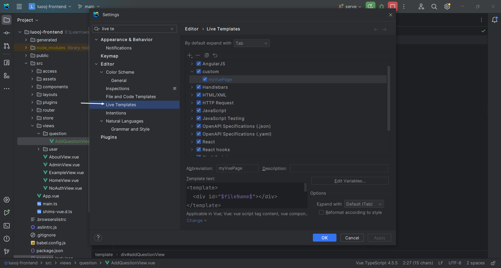
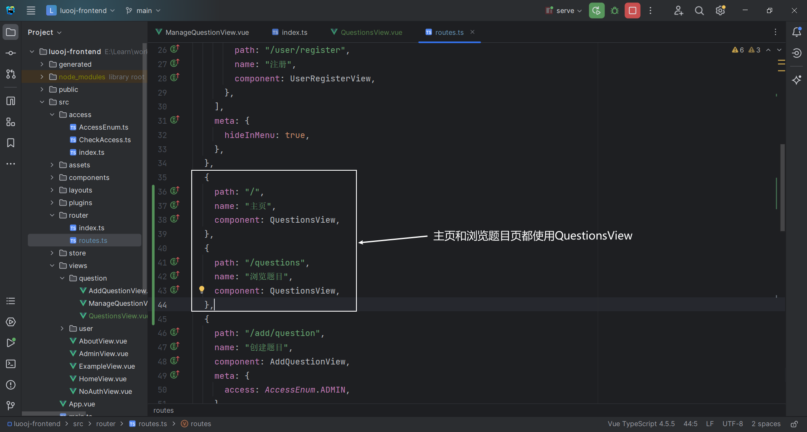
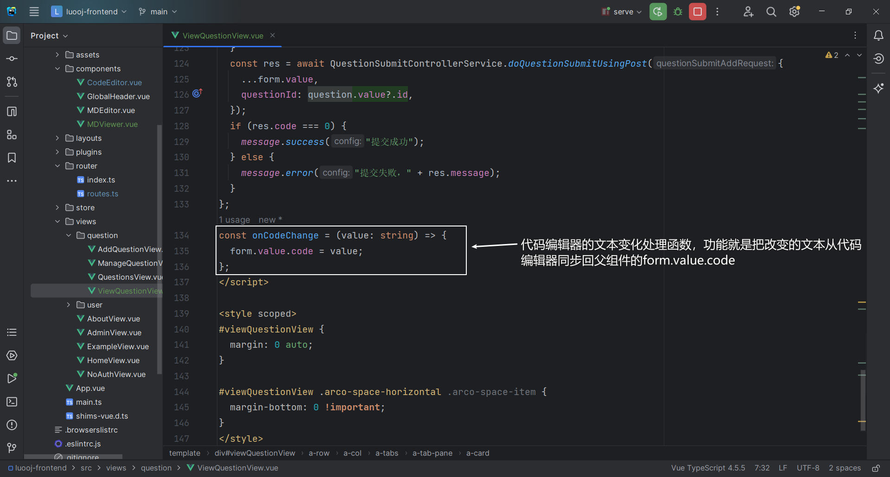

# LuoOJ

## 项目介绍

OJ （Online Judge 在线判题系统）

用于在线评测编程题目的系统。用户可以选择题目，在线做题（编写代码并且提交代码）；系统能根据用户提交的代码、出题人预设的输入和输入用例，先编译代码，运行代码，判断代码运行结果是否正确。其中的判题系统作为开放API，便于开发者开发自己的OJ系统

### OJ系统常用概念

- AC（Accepted）：表示题目通过
- 题目限制
  - 时间限制
  - 内存限制
- 题目描述
- 题目输入
- 题目输出
- 题目输入用例
- 题目输出用例
- 普通测评：管理员预设输入用例和输出用例，判题机运行用户的代码，先给用户的代码喂输入用例得到输出，再与输出用例比对，看是否一致（比对用例文件）
- 特殊测评（SPJ）：管理员预设输入用例和输出用例，比如管理员输入1，用户的输出只要是>0 或 <10 就是正确的（特判程序：不是通比对用例文件这种死板的方式来检验，而是要专门根据这道题目写一个特殊的判断程序，该程序接受题目的输入用例，输出用例，用户的输出，根据这些值来比较是否正确）
- 交互测评：输入由用户决定，输出结果可能多种多样，比较灵活，没办法通过死板的用例文件搞定

### OJ系统的注意点

- 安全性：不能让用户随意引入包，随意遍历，暴力破解，需要使用正确的算法
- 判题过程异步化
- 提交记录：提交之后，有运行的结果、信息（时间内存的花费，做题人，语言等）

### OJ系统的难点

- 判题系统：用户提交代码之后，自动检查用户的代码是否正确，自动得到结果，保证判题系统的安全性


## 项目调研

**现有OJ系统：**

- https://github.com/HimitZH/HOJ （适合学习）        https://docs.hdoi.cn

**注意点：**

- 权限校验
  - 谁能提交代码，谁不能提交代码
- 代码沙箱（安全沙箱）
  - 防止用户代码藏毒。使用隔离的、安全的环境去运行用户的代码
- 资源分配
  - 防止用户疯狂占用资源，导致其他人无法使用。需要限制用户程序的资源占用
- 判题规则
  - 比对用例，验证结果
- 任务调度
  - 服务器资源有限，用户要排队，依次去执行判题


## 架构图


## 核心功能

- 题目模块
  - 创建题目（管理员）
  - 删除题目（管理员）
  - 修改题目（管理员）
  - 搜索题目（管理员&用户）
  - 在线做题
  - 提交代码
- 用户模块
  - 注册
  - 登录
- 判题模块
  - 提交判题
  - 错误处理（内存溢出，超时，安全）
  - 代码沙箱（自主实现） 
  - 开放接口（提供一个独立的新服务）


## 技术选型

**前端**

- Vue3
- Arco Design
- 在线代码编辑器
- 在线文档浏览

**后端**

- Java进程控制
- Java安全管理器，部分JVM知识点
- 虚拟机
- Docker（代码沙箱）
- Spring Cloud 微服务

- 消息队列


## 计划

**初始化**

- 前端
- 后端

**后端**

- 库表设计
- 后端增删改查接口开发
- 判题模块预开发
  - 代码沙箱
  - 判题服务
- 代码沙箱

**前端**

- 通用项目模板搭建
- 题目模块
  - 题目创建页（管理员）

  - 题目管理页（管理员）
    - 查看（搜索）

    - 删除

    - 修改

    - 快捷创建

  - 题目搜索页（用户&管理员可以查看到题目）

  - 在线做题页（ 用户&管理员）

  - 题目提交列表页（用户&管理员）


## OJ系统实现方案

**1、用现成的 OJ 系统**
网上有很多开源的 OJ 项目，可以直接下载开源代码自己部署。
比较推荐的是 judge0，这是一个非常成熟的商业 OJ 项目，支持 60 多种编程语言！https://github.com/judge0/judge0

**2、用现成的服务**
直接使用现成的 判题 API 或者 代码沙箱 等服务。

比如 judge0 提供的判题 API。只需要通过 HTTP 调用 submissions 判题接口，把用户的代码、输入值、预期的执行结果作为请求参数发送给 judge0 的服务器，它就能自动帮你编译执行程序，并且返回程序的运行结果。


API 的作用：接受代码、返回执行结果

Judge0 API 地址：https://rapidapi.com/judge0-official/api/judge0-ce
官方文档：https://ce.judge0.com/#submissions-submission-post

流程

1. 先注册
2. 再开通订阅
3. 然后测试 language 接口
4. 测试执行代码接口 submissions

示例接口参数：

```json
{
  "source_code": "#include <stdio.h>\n\nint main(void) {\n  char name[10];\n  scanf(\"%s\", name);\n  printf(\"hello, %s\n\", name);\n  return 0;\n}",
  "language_id": "4",
  "stdin": "Judge0",
  "expected_output": "hello, Judge0"
}
```

预期返回：

```json
{
  "source_code": "includestdiohintmainvoidcharname10scanfsnameprintfhellosname\nreturn0=\n",
  "language_id": 76,
  "stdin": "Judgew==\n",
  "expected_output": "helloJudge0=\n",
  "stdout": null,
  "status_id": 6,
  "created_at": "2023-07-27T13:50:30.433Z",
  "finished_at": "2023-07-27T13:50:31.022Z",
  "time": null,
  "memory": null,
  "stderr": null,
  "token": "8be000ad-2edb-4262-b367-7095a694e028",
  "number_of_runs": 1,
  "cpu_time_limit": "5.0",
  "cpu_extra_time": "1.0",
  "wall_time_limit": "10.0",
  "memory_limit": 128000,
  "stack_limit": 64000,
  "max_processes_and_or_threads": 60,
  "enable_per_process_and_thread_time_limit": false,
  "enable_per_process_and_thread_memory_limit": false,
  "max_file_size": 1024,
  "compile_output": "bWFpbi5jcHA6MToxOiBlcnJvcjogc291cmNlIGZpbGUgaXMgbm90IHZhbGlk\nIFVURi04Cjw4QT53JTxCOT48VSswNUVDPjxCNT7YqDw4Nj4p7ZmoPEE3PjxC\nRT48ODg+PDlEPnI8VSswMDE2PjxBQj48OUQ+PEE5Pjw5RT48RDc+SzxVKzAw\nMUM+anfsnak8OUU+PEE2PjxCOD48QTc+PEI1PjxGOD5ePDk2PlosPDlEPjxB\nOT48OUU+PEFEPjxFQj5uPEFFPn0KXgptYWluLmNwcDoxOjI6IGVycm9yOiB1\nbmtub3duIHR5cGUgbmFtZSAndycKPDhBPnclPEI5PjxVKzA1RUM+PEI1Ptio\nPDg2Pintmag8QTc+PEJFPjw4OD48OUQ+cjxVKzAwMTY+PEFCPjw5RD48QTk+\nPDlFPjxENz5LPFUrMDAxQz5qd+ydqTw5RT48QTY+PEI4PjxBNz48QjU+PEY4\nPl48OTY+Wiw8OUQ+PEE5Pjw5RT48QUQ+PEVCPm48QUU+fQogICAgXgptYWlu\nLmNwcDoxOjM6IGVycm9yOiBleHBlY3RlZCB1bnF1YWxpZmllZC1pZAo8OEE+\ndyU8Qjk+PFUrMDVFQz48QjU+2Kg8ODY+Ke2ZqDxBNz48QkU+PDg4Pjw5RD5y\nPFUrMDAxNj48QUI+PDlEPjxBOT48OUU+PEQ3Pks8VSswMDFDPmp37J2pPDlF\nPjxBNj48Qjg+PEE3PjxCNT48Rjg+Xjw5Nj5aLDw5RD48QTk+PDlFPjxBRD48\nRUI+bjxBRT59CiAgICAgXgptYWluLmNwcDoxOjQ6IGVycm9yOiBzb3VyY2Ug\nZmlsZSBpcyBub3QgdmFsaWQgVVRGLTgKPDhBPnclPEI5PjxVKzA1RUM+PEI1\nPtioPDg2Pintmag8QTc+PEJFPjw4OD48OUQ+cjxVKzAwMTY+PEFCPjw5RD48\nQTk+PDlFPjxENz5LPFUrMDAxQz5qd+ydqTw5RT48QTY+PEI4PjxBNz48QjU+\nPEY4Pl48OTY+Wiw8OUQ+PEE5Pjw5RT48QUQ+PEVCPm48QUU+fQogICAgICBe\nCm1haW4uY3BwOjE6NzogZXJyb3I6IHNvdXJjZSBmaWxlIGlzIG5vdCB2YWxp\nZCBVVEYtOAo8OEE+dyU8Qjk+PFUrMDVFQz48QjU+2Kg8ODY+Ke2ZqDxBNz48\nQkU+PDg4Pjw5RD5yPFUrMDAxNj48QUI+PDlEPjxBOT48OUU+PEQ3Pks8VSsw\nMDFDPmp37J2pPDlFPjxBNj48Qjg+PEE3PjxCNT48Rjg+Xjw5Nj5aLDw5RD48\nQTk+PDlFPjxBRD48RUI+bjxBRT59CiAgICAgICAgICAgICAgICAgIF4KbWFp\nbi5jcHA6MToxMDogZXJyb3I6IHNvdXJjZSBmaWxlIGlzIG5vdCB2YWxpZCBV\nVEYtOAo8OEE+dyU8Qjk+PFUrMDVFQz48QjU+2Kg8ODY+Ke2ZqDxBNz48QkU+\nPDg4Pjw5RD5yPFUrMDAxNj48QUI+PDlEPjxBOT48OUU+PEQ3Pks8VSswMDFD\nPmp37J2pPDlFPjxBNj48Qjg+PEE3PjxCNT48Rjg+Xjw5Nj5aLDw5RD48QTk+\nPDlFPjxBRD48RUI+bjxBRT59CiAgICAgICAgICAgICAgICAgICAgICAgXgpt\nYWluLmNwcDoxOjE1OiBlcnJvcjogc291cmNlIGZpbGUgaXMgbm90IHZhbGlk\nIFVURi04Cjw4QT53JTxCOT48VSswNUVDPjxCNT7YqDw4Nj4p7ZmoPEE3PjxC\nRT48ODg+PDlEPnI8VSswMDE2PjxBQj48OUQ+PEE5Pjw5RT48RDc+SzxVKzAw\nMUM+anfsnak8OUU+PEE2PjxCOD48QTc+PEI1PjxGOD5ePDk2PlosPDlEPjxB\nOT48OUU+PEFEPjxFQj5uPEFFPn0KICA
  "exit_code": null,
  "exit_signal": null,
  "message": null,
  "wall_time": null,
  "compiler_options": null,
  "command_line_arguments": null,
  "redirect_stderr_to_stdout": false,
  "callback_url": null,
  "additional_files": null,
  "enable_network": false,
  "status": {
    "id": 6,
    "description": "Compilation Error"
  },
  "language": {
    "id": 76,
    "name": "C++ (Clang 7.0.1)"
  }
}
```

**3、自主开发（采用）**

**4、把 AI 来当做代码沙箱**
把 AI 当做代码沙箱，直接扔给他一段代码、输入参数，问他能否得到预期的结果，就实现了在线判题逻辑！

**5、移花接木**
可以通过程序操作模拟浏览器，用别人已经开发好的 OJ 系统来帮我们判题。
比如使用 Puppeteer + 无头浏览器，把咱们系统用户提交的代码，像人一样输入到别人的 OJ 网页中，让程序点击提交按钮，并且等别人的 OJ 系统返回判题结果后，再把这个结果返回给我们自己的用户。
缺点就是把核心流程交给了别人，如果别人服务挂了，你的服务也就挂了；而且别人 OJ 系统不支持的题目，可能你也支持不了。


## 初始化

### 前端

1. **确认环境**

   nodeJs 版本：16.16.0（建议16）

```sh
node -v
```

​		npm 版本： 8.11.0（建议8或9）

```sh
npm -v
```

2. **安装Vue CLI脚手架** https://cli.vuejs.org/zh/guide/installation.html

```sh
npm install -g @vue/cli
# OR
yarn global add @vue/cli
```

```sh
# 查看Vue CLI是否安装成功
vue --version
# OR
vue -V
```

3. **创建项目** https://cli.vuejs.org/zh/guide/creating-a-project.html

```sh
vue create luooj-frontend
```


4. **启动**


5. **开启代码美化插件**

Vue CLI脚手架已经帮我们配置了代码美化，自动校验，格式化插件，无需自行配置，我们只需开启即可


6. 引入组件 

快速上手：https://arco.design/vue/docs/start

`安装`

```sh
# npm
npm install --save-dev @arco-design/web-vue
# yarn
yarn add --dev @arco-design/web-vue
```

`完整引入`


### 后端

#### 快速上手

**1、使用后端万用模板**

**2、修改项目名**


**3、修改端口号**


**4、开启分布式Session**


**5、修改数据库并创建**


**6、启动项目，查看接口文档**


#### 模板结构介绍

- doc：存放文档
- sql
  - create_table.sql：初始的建库和建表语句
  - post_es_mapping.json：帖子表在ES中的索引创建语句
- src
  - main
    - java
      - com
        - luoying
          - annotation
            - AuthCheck：权限校验注解，用于权限校验
          - aop
            - AuthInterceptor：权限校验切面，匹配所有使用了AuthCheck注解的方法，然后进行权限校验
            - LogInterceptor：记录请求和响应日志切面，匹配controller包的所有方法
          - common
            - BaseResponse：通用结果返回类
            - DeleteRequest：通用的删除请求类
            - ErrorCode：各种错误码
            - PageRequest：通用的分页请求类
            - ResultUtils：定义了构建通用返回结果的方法
          - config
            - CorsConfig：全局跨域配置
            - CosClientConfig：定义了对象存储的配置
            - JsonConfig：添加 Long 转 json 精度丢失的配置
            - Knife4jConfig：接口文档生成的配置
            - MyBatisPlusConfig：MybatisPlus分页拦截器
            - WxOpenConfig：微信开放平台的配置
          - constant：定义常量
            - CommonConstant：排序方式常量
            - FileConstant：COS 访问地址
            - UserConstant：用户角色常量
          - controller：接受请求
          - esdao：类似mybatis的mapper，用于操作ES
          - exception：异常处理相关
          - job：任务（定时任务，单次任务）
            - cycle：循环执行
            - once：单次任务
          - manager：定义通用的服务
          - mapper：mybatis的数据访问层，用于操作数据库
          - model
            - dto：请求包装类
            - entity：数据库表的实体类
            - enums：枚举
            - vo：响应包装类
          - service：服务层，用于编写业务逻辑
          - utils：工具类，各种公用的方法
          - wxmp：公众号相关
        - MainApplication：主类（项目入口）
    - resources：配置文件
      - mapper：映射文件
      - *.yml：项目配置文件
      - banner.txt：替换SpringBoot logo
      - test_excel.xlsx：excel测试文件
  - test：单元测试代码
  - DockerFile：用于构建docker镜像

## 后端

### 库表设计

**1、用户表**

```sql
-- 用户表
create table if not exists user
(
    id           bigint auto_increment comment 'id' primary key,
    userAccount  varchar(256)                           not null comment '账号',
    userPassword varchar(512)                           not null comment '密码',
    unionId      varchar(256)                           null comment '微信开放平台id',
    mpOpenId     varchar(256)                           null comment '公众号openId',
    userName     varchar(256)                           null comment '用户昵称',
    userAvatar   varchar(1024)                          null comment '用户头像',
    userProfile  varchar(512)                           null comment '用户简介',
    userRole     varchar(256) default 'user'            not null comment '用户角色：user/admin/ban',
    gender       tinyint                                null comment '性别',
    createTime   datetime     default CURRENT_TIMESTAMP not null comment '创建时间',
    updateTime   datetime     default CURRENT_TIMESTAMP not null on update CURRENT_TIMESTAMP comment '更新时间',
    isDelete     tinyint      default 0                 not null comment '是否删除',
    index idx_unionId (unionId)
) comment '用户' collate = utf8mb4_unicode_ci;
```

**2、题目表**

- 题目标题

- 题目内容：存放题目的介绍，输入输出示例，题目提示，具体的详情

- 题目标签：栈，队列，链表，简单，中等，困难

- 题目答案：管理员设置的标准答案（可以采纳一些用户的）

- 提交数：提交答案的次数，便于统计分析

- 通过数：通过题目的人数，便于统计分析

- 判题相关字段

  > 如果题目用例不是很复杂，也不是很多，可以直接存在数据库
  >
  > 如果大于512KB，建议单独存放在一个文件中，数据库只保存文件的url（类似存储用户头像）

  - 判题配置 judgeConfig（json对象）

    - 时间限制 timeLimit
    - 内存限制 memoryLimit
    - 堆栈限制 stackLimit

    ```json
    {
    	"timeLimit":"", //ms
    	"memoryLimit":"",//KB
        "stackLimit":""//KB
    }
    ```

  - 判题用例 judgeCase（json数组）

    - 元素：由输入用例,输出用例组成的对象

    ```json
    [
    	{
    		"input":"1 2",
    		"output":"3 4"
    	},
        {
    		"input":"1 2",
    		"output":"3 4"
    	},
    ]
    ```

  - 存json的好处，后续如果需要加字段，可以直接在程序中为对象加字段，不用修改数据库表

  - 存json的前提

    - 不需要根据json里面的字段去反查这条数据
    - json里面的字段含义相关，属于同一类的值 
    - json里面的字段空间占用不大

- 扩展字段

  - 通过率
  - 判题类型

```sql
-- 题目表
create table if not exists question
(
    id          bigint auto_increment comment 'id' primary key,
    title       varchar(512)                       null comment '题目标题',
    content     text                               null comment '题目内容',
    tags        varchar(1024)                      null comment '标签列表（json 数组）',
    answer      text                               null comment '题目答案',
    submitNum   int      default 0                 not null comment '题目提交数',
    acceptedNum int      default 0                 not null comment '题目通过数',
    judgeConfig varchar(128)                       null comment '判题配置（json对象）',
    judgeCase   text                               null comment '判题用例（json数组）',
    thumbNum    int      default 0                 not null comment '点赞数',
    favourNum   int      default 0                 not null comment '收藏数',
    userId      bigint                             not null comment '创建用户 id',
    createTime  datetime default CURRENT_TIMESTAMP not null comment '创建时间',
    updateTime  datetime default CURRENT_TIMESTAMP not null on update CURRENT_TIMESTAMP comment '更新时间',
    isDelete    tinyint  default 0                 not null comment '是否删除',
    index idx_userId (userId)
) comment '题目' collate = utf8mb4_unicode_ci;
```

**3、题目提交记录表**

- 编程语言

- 题目id

- 提交用户id

- 用户提交的代码 code

- 判题状态 status（0-待判题、1-判题中、2-通过、3-失败）

- 判题信息 judgeInfo （判题过程中得到的一些信息，比如程序执行时间，内存占用，失败原因）（json对象）

  ```json
  {
  	"message":"程序执行信息",
  	"time":1000,  //ms
  	"memory":1000 //KB
  }
  ```

  程序执行信息枚举

  - Accepted 通过
  - Wrong Answer 答案错误
  - Compile Error 编译错误
  - Memory Limit Exceeded 内存超限
  - Time Limit Exceeded 时间超限
  - Presentation Error 展示错误（比如多输出了空格，换行，逗号）
  - Output Limit Exceeded 输出溢出
  - Waiting 等待中
  - Dangerous Operation 危险操作（比如向我们的服务器写文件）
  - RunTime Error 运行错误（提交的代码有问题）
  - System Error 系统错误（我们的系统出问题了）

```sql
-- 题目提交记录表
create table if not exists question_submit
(
    id         bigint auto_increment comment 'id' primary key,
    language   varchar(128)                       not null comment '编程语言',
    questionId bigint                             not null comment '题目id',
    userId     bigint                             not null comment '提交用户id',
    code       text                               not null comment '用户提交的代码',
    judgeInfo  varchar(128)                       null comment '判题信息',
    status     int      default 0                 not null comment '判题状态（0-待判题、1-判题中、2-成功、3-失败）',
    createTime datetime default CURRENT_TIMESTAMP not null comment '创建时间',
    updateTime datetime default CURRENT_TIMESTAMP not null on update CURRENT_TIMESTAMP comment '更新时间',
    isDelete   tinyint  default 0                 not null comment '是否删除',
    index idx_userId (userId),
    index idx_questionId (questionId)
) comment '题目提交记录' collate = utf8mb4_unicode_ci;
```

**小知识**

- 什么时候适合加索引（原则上，能不用索引就不要用；能用单个索引，就不要用联合索引，因为索引也需要占用空间）
  - 单个索引场景：需要根据单个字段查询 where userId = 1
  - 联合索引场景：不需要根据单个字段查询，且需要多个字段绑定在一起查询 where userId = 1 and questionId =2

- 如何选择给哪个字段加索引
  - 枚举值区分度高的字段


### 后端增删改查接口开发

**小知识**

- 防止用户按照id顺序爬取题目，建议id的生成规则改成ASSIGN_ID（非连续自增），而不是自增

  ```java
  /**
   * id
   */
  @TableId(type = IdType.ASSIGN_ID)
  private Long id;
  ```
  
- 逻辑删除字段需要打上@TableLogic注解

  ```java
  /**
   * 是否删除
   */
  @TableLogic
  private Integer isDelete;
  ```

#### 自动生成mapper和service层基础代码


#### 编写QuestionController，实现基本增删改查和权限校验

- 单表复制单表的Controller （比如qustion => post）

- 关联表复制关联表的Controller（比如question_submit => post_thumb）

**1、复制PostController进行全局替换**


**2、定义DTO类**

```java
@Data
public class QuestionJudgeCase {
    /**
     * 输入用例
     */
    private String input;

    /**
     * 输出用例
     */
    private String output;
}
```

```java
@Data
public class QuestionJudgeCconfig {
    /**
     * 时间限制 ms
     */
    private Long timeLimit;

    /**
     * 内存限制 KB
     */
    private Long memoryLimit;

    /**
     * 堆栈限制 KB
     */
    private Long stackLimit;
}
```

```java
/**
 * 创建请求
 *
 */
@Data
public class QuestionAddRequest implements Serializable {
    /**
     * 题目标题
     */
    private String title;

    /**
     * 题目内容
     */
    private String content;

    /**
     * 标签列表（json 数组） 
     */
    private List<String> tags;

    /**
     * 题目答案
     */
    private String answer;

    /**
     * 判题配置（json对象）
     */
    private QuestionJudgeCconfig judgeConfig;

    /**
     * 判题用例（json数组）
     */
    private List<QuestionJudgeCase> judgeCaseList;

    private static final long serialVersionUID = 1L;
}
```

```java
/**
 * 编辑请求
 *
 */
@Data
public class QuestionEditRequest implements Serializable {

    /**
     * id
     */
    private Long id;

    /**
     * 题目标题
     */
    private String title;

    /**
     * 题目内容
     */
    private String content;

    /**
     * 标签列表（json 数组）
     */
    private List<String> tags;

    /**
     * 题目答案
     */
    private String answer;

    /**
     * 判题配置（json对象）
     */
    private QuestionJudgeCconfig judgeConfig;

    /**
     * 判题用例（json数组）
     */
    private List<QuestionJudgeCase> judgeCaseList;

    private static final long serialVersionUID = 1L;
}
```

```java
/**
 * 查询请求
 *
 */
@EqualsAndHashCode(callSuper = true)
@Data
public class QuestionQueryRequest extends PageRequest implements Serializable {
    /**
     * id
     */
    private Long id;

    /**
     * 题目标题
     */
    private String title;

    /**
     * 题目内容
     */
    private String content;

    /**
     * 标签列表（json 数组）
     */
    private List<String> tags;

    /**
     * 题目答案
     */
    private String answer;

    /**
     * 创建用户 id
     */
    private Long userId;

    private static final long serialVersionUID = 1L;
}
```

```java
/**
 * 更新请求
 */
@Data
public class QuestionUpdateRequest implements Serializable {

    /**
     * id
     */
    private Long id;

    /**
     * 题目标题
     */
    private String title;

    /**
     * 题目内容
     */
    private String content;

    /**
     * 标签列表（json 数组）
     */
    private List<String> tags;

    /**
     * 题目答案
     */
    private String answer;

    /**
     * 判题配置（json对象）
     */
    private QuestionJudgeCconfig judgeConfig;

    /**
     * 判题用例（json数组）
     */
    private List<QuestionJudgeCase> judgeCaseList;

    private static final long serialVersionUID = 1L;
}
```

**3、定义VO类（给前端返回的对象，减少传输数据，过滤字段（脱敏），保证安全性）**

```java
/**
 * 题目
 *
 * @TableName question
 */
@Data
public class QuestionVO implements Serializable {
    private final static Gson GSON = new Gson();
    /**
     * id
     */
    private Long id;

    /**
     * 题目标题
     */
    private String title;

    /**
     * 题目内容
     */
    private String content;

    /**
     * 标签列表（json 数组）
     */
    private List<String> tags;

    /**
     * 题目提交数
     */
    private Integer submitNum;

    /**
     * 题目通过数
     */
    private Integer acceptedNum;

    /**
     * 判题配置（json对象）
     */
    private QuestionJudgeCconfig judgeConfig;

    /**
     * 点赞数
     */
    private Integer thumbNum;

    /**
     * 收藏数
     */
    private Integer favourNum;

    /**
     * 创建用户 id
     */
    private Long userId;

    /**
     * 创建时间
     */
    private Date createTime;

    /**
     * 更新时间
     */
    private Date updateTime;

    /**
     *
     */
    private UserVO userVO;

    /**
     * 包装类转对象
     *
     * @param questionVO
     * @return
     */
    public static Question voToObj(QuestionVO questionVO) {
        if (questionVO == null) {
            return null;
        }
        Question question = new Question();
        BeanUtils.copyProperties(questionVO, question);
        List<String> tagList = questionVO.getTags();
        if (tagList != null) {
            question.setTags(GSON.toJson(tagList));
            // question.setTags(JSONUtil.toJsonStr(tagList));
        }
        QuestionJudgeCconfig judgeConfig = questionVO.getJudgeConfig();
        if (judgeConfig != null) {
            question.setJudgeConfig(GSON.toJson(judgeConfig));
            // question.setJudgeConfig(JSONUtil.toJsonStr(judgeConfig));
        }
        return question;
    }

    /**
     * 对象转包装类
     *
     * @param question
     * @return
     */
    public static QuestionVO objToVo(Question question) {
        if (question == null) {
            return null;
        }
        QuestionVO questionVO = new QuestionVO();
        BeanUtils.copyProperties(question, questionVO);
        questionVO.setTags(GSON.fromJson(question.getTags(), new TypeToken<List<String>>() {
        }.getType()));
        // questionVO.setTags(JSONUtil.toList(question.getTags(), String.class));
        questionVO.setJudgeConfig(GSON.fromJson(question.getJudgeConfig(), new TypeToken<QuestionJudgeCconfig>() {
        }.getType()));
        // questionVO.setJudgeConfig(JSONUtil.toBean(question.getJudgeConfig(), QuestionJudgeCconfig.class));
        return questionVO;
    }
}
```

**4、校验Controller的代码，看看除了调用的方法缺失外，还有没有报错**

**5、在service层补全缺失的方法**

```java
/**
* @author 落樱的悔恨
* @description 针对表【question(题目)】的数据库操作Service
* @createDate 2023-11-09 16:32:34
*/
public interface QuestionService extends IService<Question> {
    /**
     * 校验
     *
     * @param question
     * @param add
     */
    void validQuestion(Question question, boolean add);

    /**
     * 获取查询条件
     *
     * @param questionQueryRequest
     * @return
     */
    QueryWrapper<Question> getQueryWrapper(QuestionQueryRequest questionQueryRequest);
    

    /**
     * 获取题目封装
     *
     * @param question
     * @param request
     * @return
     */
    QuestionVO getQuestionVO(Question question, HttpServletRequest request);

    /**
     * 分页获取题目封装
     *
     * @param questionPage
     * @param request
     * @return
     */
    Page<QuestionVO> getQuestionVOPage(Page<Question> questionPage, HttpServletRequest request);
}
```

```java
/**
 * @author 落樱的悔恨
 * @description 针对表【question(题目)】的数据库操作Service实现
 * @createDate 2023-11-09 16:32:34
 */
@Service
public class QuestionServiceImpl extends ServiceImpl<QuestionMapper, Question>
        implements QuestionService {

    private final static Gson GSON = new Gson();

    @Resource
    private UserService userService;

    /**
     * 校验题目是否合法
     *
     * @param question
     * @param add
     */
    @Override
    public void validQuestion(Question question, boolean add) {
        if (question == null) {
            throw new BusinessException(ErrorCode.PARAMS_ERROR);
        }
        String title = question.getTitle();
        String content = question.getContent();
        String tags = question.getTags();
        String answer = question.getAnswer();
        String judgeConfig = question.getJudgeConfig();
        String judgeCase = question.getJudgeCase();
        // 创建时，参数不能为空
        if (add) {
            ThrowUtils.throwIf(StringUtils.isAnyBlank(title, content, tags), ErrorCode.PARAMS_ERROR);
        }
        // 有参数则校验
        if (StringUtils.isNotBlank(title) && title.length() > 80) {
            throw new BusinessException(ErrorCode.PARAMS_ERROR, "标题过长");
        }
        if (StringUtils.isNotBlank(content) && content.length() > 8192) {
            throw new BusinessException(ErrorCode.PARAMS_ERROR, "内容过长");
        }
        if (StringUtils.isNotBlank(answer) && content.length() > 8192) {
            throw new BusinessException(ErrorCode.PARAMS_ERROR, "答案过长");
        }
        if (StringUtils.isNotBlank(judgeCase) && content.length() > 8192) {
            throw new BusinessException(ErrorCode.PARAMS_ERROR, "判题用例过长");
        }
        if (StringUtils.isNotBlank(judgeConfig) && content.length() > 8192) {
            throw new BusinessException(ErrorCode.PARAMS_ERROR, "判题配置过长");
        }
    }

    /**
     * 获取查询包装类
     *
     * @param questionQueryRequest
     * @return
     */
    @Override
    public QueryWrapper<Question> getQueryWrapper(QuestionQueryRequest questionQueryRequest) {
        QueryWrapper<Question> queryWrapper = new QueryWrapper<>();
        if (questionQueryRequest == null) {
            return queryWrapper;
        }
        Long id = questionQueryRequest.getId();
        String title = questionQueryRequest.getTitle();
        String content = questionQueryRequest.getContent();
        List<String> tags = questionQueryRequest.getTags();
        String answer = questionQueryRequest.getAnswer();
        Long userId = questionQueryRequest.getUserId();
        String sortField = questionQueryRequest.getSortField();
        String sortOrder = questionQueryRequest.getSortOrder();
        // 拼接查询条件
        queryWrapper.like(StringUtils.isNotBlank(title), "title", title);
        queryWrapper.like(StringUtils.isNotBlank(content), "content", content);
        queryWrapper.like(StringUtils.isNotBlank(answer), "answer", answer);
        if (CollectionUtils.isNotEmpty(tags)) {
            for (String tag : tags) {
                queryWrapper.like("tags", "\"" + tag + "\"");
            }
        }
        queryWrapper.eq(ObjectUtils.isNotEmpty(id), "id", id);
        queryWrapper.eq(ObjectUtils.isNotEmpty(userId), "userId", userId);
        queryWrapper.eq("isDelete", false);
        queryWrapper.orderBy(SqlUtils.validSortField(sortField), sortOrder.equals(CommonConstant.SORT_ORDER_ASC),
                sortField);
        return queryWrapper;
    }

    @Override
    public QuestionVO getQuestionVO(Question question, HttpServletRequest request) {
        QuestionVO questionVO = QuestionVO.objToVo(question);
        // 1. 关联查询用户信息
        Long userId = question.getUserId();
        User user = null;
        if (userId != null && userId > 0) {
            user = userService.getById(userId);
        }
        UserVO userVO = userService.getUserVO(user);
        questionVO.setUserVO(userVO);
        return questionVO;
    }

    @Override
    public Page<QuestionVO> getQuestionVOPage(Page<Question> questionPage, HttpServletRequest request) {
        List<Question> questionList = questionPage.getRecords();
        Page<QuestionVO> questionVOPage = new Page<>(questionPage.getCurrent(), questionPage.getSize(), questionPage.getTotal());
        if (CollectionUtils.isEmpty(questionList)) {
            return questionVOPage;
        }
        // 1. 关联查询用户信息
        Set<Long> userIdSet = questionList.stream().map(Question::getUserId).collect(Collectors.toSet());
        Map<Long, List<User>> userIdUserListMap = userService.listByIds(userIdSet).stream()
                .collect(Collectors.groupingBy(User::getId));
        // 填充信息
        List<QuestionVO> questionVOList = questionList.stream().map(question -> {
            QuestionVO questionVO = QuestionVO.objToVo(question);
            Long userId = question.getUserId();
            User user = null;
            if (userIdUserListMap.containsKey(userId)) {
                user = userIdUserListMap.get(userId).get(0);
            }
            questionVO.setUserVO(userService.getUserVO(user));
            return questionVO;
        }).collect(Collectors.toList());
        questionVOPage.setRecords(questionVOList);
        return questionVOPage;
    }
}
```

**6、QuestionController基础版**

```java
/**
 * 题目接口
 */
@RestController
@RequestMapping("/question")
@Slf4j
public class QuestionController {

    @Resource
    private QuestionService questionService;

    @Resource
    private UserService userService;

    private final static Gson GSON = new Gson();

    // region 增删改查

    /**
     * 创建
     *
     * @param questionAddRequest
     * @param request
     * @return
     */
    @PostMapping("/add")
    public BaseResponse<Long> addQuestion(@RequestBody QuestionAddRequest questionAddRequest, HttpServletRequest request) {
        if (questionAddRequest == null) {
            throw new BusinessException(ErrorCode.PARAMS_ERROR);
        }
        Question question = new Question();
        BeanUtils.copyProperties(questionAddRequest, question);
        List<String> tags = questionAddRequest.getTags();
        if (tags != null) {
            question.setTags(GSON.toJson(tags));
        }
        List<QuestionJudgeCase> judgeCaseList = questionAddRequest.getJudgeCaseList();
        if (judgeCaseList != null) {
            question.setJudgeCase(GSON.toJson(judgeCaseList));
        }
        QuestionJudgeCconfig judgeConfig = questionAddRequest.getJudgeConfig();
        if (judgeConfig != null) {
            question.setJudgeConfig(GSON.toJson(judgeConfig));
        }
        questionService.validQuestion(question, true);
        User loginUser = userService.getLoginUser(request);
        question.setUserId(loginUser.getId());
        question.setFavourNum(0);
        question.setThumbNum(0);
        boolean result = questionService.save(question);
        ThrowUtils.throwIf(!result, ErrorCode.OPERATION_ERROR);
        long newQuestionId = question.getId();
        return ResultUtils.success(newQuestionId);
    }

    /**
     * 删除
     *
     * @param deleteRequest
     * @param request
     * @return
     */
    @PostMapping("/delete")
    public BaseResponse<Boolean> deleteQuestion(@RequestBody DeleteRequest deleteRequest, HttpServletRequest request) {
        if (deleteRequest == null || deleteRequest.getId() <= 0) {
            throw new BusinessException(ErrorCode.PARAMS_ERROR);
        }
        User user = userService.getLoginUser(request);
        long id = deleteRequest.getId();
        // 判断是否存在
        Question oldQuestion = questionService.getById(id);
        ThrowUtils.throwIf(oldQuestion == null, ErrorCode.NOT_FOUND_ERROR);
        // 仅本人或管理员可删除
        if (!oldQuestion.getUserId().equals(user.getId()) && !userService.isAdmin(request)) {
            throw new BusinessException(ErrorCode.NO_AUTH_ERROR);
        }
        boolean b = questionService.removeById(id);
        return ResultUtils.success(b);
    }

    /**
     * 更新（仅管理员）
     *
     * @param questionUpdateRequest
     * @return
     */
    @PostMapping("/update")
    @AuthCheck(mustRole = UserConstant.ADMIN_ROLE)
    public BaseResponse<Boolean> updateQuestion(@RequestBody QuestionUpdateRequest questionUpdateRequest) {
        if (questionUpdateRequest == null || questionUpdateRequest.getId() <= 0) {
            throw new BusinessException(ErrorCode.PARAMS_ERROR);
        }
        Question question = new Question();
        BeanUtils.copyProperties(questionUpdateRequest, question);
        List<String> tags = questionUpdateRequest.getTags();
        if (tags != null) {
            question.setTags(GSON.toJson(tags));
        }
        List<QuestionJudgeCase> judgeCaseList = questionUpdateRequest.getJudgeCaseList();
        if (judgeCaseList != null) {
            question.setJudgeCase(GSON.toJson(judgeCaseList));
        }
        QuestionJudgeCconfig judgeConfig = questionUpdateRequest.getJudgeConfig();
        if (judgeConfig != null) {
            question.setJudgeConfig(GSON.toJson(judgeConfig));
        }
        // 参数校验
        questionService.validQuestion(question, false);
        long id = questionUpdateRequest.getId();
        // 判断是否存在
        Question oldQuestion = questionService.getById(id);
        ThrowUtils.throwIf(oldQuestion == null, ErrorCode.NOT_FOUND_ERROR);
        boolean result = questionService.updateById(question);
        return ResultUtils.success(result);
    }

    /**
     * 根据 id 获取
     *
     * @param id
     * @return
     */
    @GetMapping("/get")
    @AuthCheck(mustRole = "admin")
    public BaseResponse<Question> getQuestionById(long id, HttpServletRequest request) {
        if (id <= 0) {
            throw new BusinessException(ErrorCode.PARAMS_ERROR);
        }
        Question question = questionService.getById(id);
        if (question == null) {
            throw new BusinessException(ErrorCode.NOT_FOUND_ERROR);
        }
        return ResultUtils.success(question);
    }

    /**
     * 根据 id 获取封装
     *
     * @param id
     * @return
     */
    @GetMapping("/get/vo")
    public BaseResponse<QuestionVO> getQuestionVOById(long id, HttpServletRequest request) {
        if (id <= 0) {
            throw new BusinessException(ErrorCode.PARAMS_ERROR);
        }
        Question question = questionService.getById(id);
        if (question == null) {
            throw new BusinessException(ErrorCode.NOT_FOUND_ERROR);
        }
        return ResultUtils.success(questionService.getQuestionVO(question, request));
    }

    /**
     * 分页获取列表
     *
     * @param questionQueryRequest
     * @param request
     * @return
     */
    @PostMapping("/list/page")
    @AuthCheck(mustRole = "admin")
    public BaseResponse<Page<Question>> listQuestionByPage(@RequestBody QuestionQueryRequest questionQueryRequest,
                                                           HttpServletRequest request) {
        long current = questionQueryRequest.getCurrent();
        long size = questionQueryRequest.getPageSize();
        // 限制爬虫
        ThrowUtils.throwIf(size > 20, ErrorCode.PARAMS_ERROR);
        Page<Question> questionPage = questionService.page(new Page<>(current, size),
                questionService.getQueryWrapper(questionQueryRequest));
        return ResultUtils.success(questionPage);
    }

    /**
     * 分页获取列表（封装类）
     *
     * @param questionQueryRequest
     * @param request
     * @return
     */
    @PostMapping("/list/page/vo")
    public BaseResponse<Page<QuestionVO>> listQuestionVOByPage(@RequestBody QuestionQueryRequest questionQueryRequest,
                                                               HttpServletRequest request) {
        long current = questionQueryRequest.getCurrent();
        long size = questionQueryRequest.getPageSize();
        // 限制爬虫
        ThrowUtils.throwIf(size > 20, ErrorCode.PARAMS_ERROR);
        Page<Question> questionPage = questionService.page(new Page<>(current, size),
                questionService.getQueryWrapper(questionQueryRequest));
        return ResultUtils.success(questionService.getQuestionVOPage(questionPage, request));
    }

    /**
     * 分页获取当前用户创建的资源列表
     *
     * @param questionQueryRequest
     * @param request
     * @return
     */
    @PostMapping("/my/list/page/vo")
    public BaseResponse<Page<QuestionVO>> listMyQuestionVOByPage(@RequestBody QuestionQueryRequest questionQueryRequest,
                                                                 HttpServletRequest request) {
        if (questionQueryRequest == null) {
            throw new BusinessException(ErrorCode.PARAMS_ERROR);
        }
        User loginUser = userService.getLoginUser(request);
        questionQueryRequest.setUserId(loginUser.getId());
        long current = questionQueryRequest.getCurrent();
        long size = questionQueryRequest.getPageSize();
        // 限制爬虫
        ThrowUtils.throwIf(size > 20, ErrorCode.PARAMS_ERROR);
        Page<Question> questionPage = questionService.page(new Page<>(current, size),
                questionService.getQueryWrapper(questionQueryRequest));
        return ResultUtils.success(questionService.getQuestionVOPage(questionPage, request));
    }

    // endregion

    /**
     * 编辑（用户）
     *
     * @param questionEditRequest
     * @param request
     * @return
     */
    @PostMapping("/edit")
    public BaseResponse<Boolean> editQuestion(@RequestBody QuestionEditRequest questionEditRequest, HttpServletRequest request) {
        if (questionEditRequest == null || questionEditRequest.getId() <= 0) {
            throw new BusinessException(ErrorCode.PARAMS_ERROR);
        }
        Question question = new Question();
        BeanUtils.copyProperties(questionEditRequest, question);
        List<String> tags = questionEditRequest.getTags();
        if (tags != null) {
            question.setTags(GSON.toJson(tags));
        }
        List<QuestionJudgeCase> judgeCaseList = questionEditRequest.getJudgeCaseList();
        if (judgeCaseList != null) {
            question.setJudgeCase(GSON.toJson(judgeCaseList));
        }
        QuestionJudgeCconfig judgeConfig = questionEditRequest.getJudgeConfig();
        if (judgeConfig != null) {
            question.setJudgeConfig(GSON.toJson(judgeConfig));
        }
        // 参数校验
        questionService.validQuestion(question, false);
        User loginUser = userService.getLoginUser(request);
        long id = questionEditRequest.getId();
        // 判断是否存在
        Question oldQuestion = questionService.getById(id);
        ThrowUtils.throwIf(oldQuestion == null, ErrorCode.NOT_FOUND_ERROR);
        // 仅本人或管理员可编辑
        if (!oldQuestion.getUserId().equals(loginUser.getId()) && !userService.isAdmin(loginUser)) {
            throw new BusinessException(ErrorCode.NO_AUTH_ERROR);
        }
        boolean result = questionService.updateById(question);
        return ResultUtils.success(result);
    }

}
```

#### 编写QuestionSubmitController，实现基本增删改查和权限校验

- 单表复制单表的Controller （比如 qustion => post ）

- 关联表复制关联表的Controller（比如 question_submit => post_thumb ）用户给某个帖子点赞，用户给某个题目提交

**1、复制PostThumbController进行全局替换**


**2、定义DTO类**

```java
@Data
public class QuestionSubmitJudgeInfo {
    /**
     * 程序执行信息
     */
    private String message;

    /**
     * 内存消耗 KB
     */
    private Long memory;

    /**
     * 时间消耗 KB
     */
    private Long time;
}
```

```java
package com.luoying.model.dto.questionsubmit;

import lombok.Data;
@Data
public class QuestionSubmitAddRequest {
    /**
     * 编程语言
     */
    private String language;

    /**
     * 题目id
     */
    private Long questionId;

    /**
     * 用户提交的代码
     */
    private String code;

    private static final long serialVersionUID = 1L;
}
```

```java
/**
 * 查询请求
 *
 */
@EqualsAndHashCode(callSuper = true)
@Data
public class QuestionSubmitQueryRequest extends PageRequest implements Serializable {
    /**
     * 编程语言
     */
    private String language;

    /**
     * 题目id
     */
    private Long questionId;

    /**
     * 提交用户id
     */
    private Long userId;

    /**
     * 判题状态（0-待判题、1-判题中、2-通过、3-失败）
     */
    private Integer status;

    private static final long serialVersionUID = 1L;
}
```

**3、定义VO类（给前端返回的对象，减少传输数据，过滤字段（脱敏），保证安全性）**

```java
/**
 * 题目提交VO
 *
 * @TableName question
 */
@Data
public class QuestionSubmitVO implements Serializable {
    private final static Gson GSON = new Gson();
    /**
     * id
     */
    private Long id;

    /**
     * 编程语言
     */
    private String language;

    /**
     * 题目id
     */
    private Long questionId;

    /**
     * 提交用户id
     */
    private Long userId;

    /**
     * 用户提交的代码
     */
    private String code;

    /**
     * 判题信息
     */
    private QuestionSubmitJudgeInfo judgeInfo;

    /**
     * 判题状态（0-待判题、1-判题中、2-通过、3-失败）
     */
    private Integer status;

    /**
     * 创建时间
     */
    private Date createTime;

    /**
     * 更新时间
     */
    private Date updateTime;

    /**
     * 提交用户信息
     */
    private UserVO userVO;

    /**
     * 题目信息
     */
    private QuestionVO questionVO;


    /**
     * 包装类转对象
     *
     * @param questionSubmitVO
     * @return
     */
    public static QuestionSubmit voToObj(QuestionSubmitVO questionSubmitVO) {
        if (questionSubmitVO == null) {
            return null;
        }
        QuestionSubmit questionSubmit = new QuestionSubmit();
        BeanUtils.copyProperties(questionSubmitVO, questionSubmit);
        QuestionSubmitJudgeInfo judgeInfo = questionSubmitVO.getJudgeInfo();
        if (judgeInfo != null) {
            questionSubmit.setJudgeInfo(GSON.toJson(judgeInfo));
        }
        return questionSubmit;
    }

    /**
     * 对象转包装类
     *
     * @param questionSubmit
     * @return
     */
    public static QuestionSubmitVO objToVo(QuestionSubmit questionSubmit) {
        if (questionSubmit == null) {
            return null;
        }
        QuestionSubmitVO questionSubmitVO = new QuestionSubmitVO();
        BeanUtils.copyProperties(questionSubmit, questionSubmitVO);
        questionSubmitVO.setJudgeInfo(GSON.fromJson(questionSubmit.getJudgeInfo(), new TypeToken<QuestionSubmitJudgeInfo>() {
        }.getType()));
        return questionSubmitVO;
    }
}
```

**4、校验Controller的代码，看看除了调用的方法缺失外，还有没有报错**

**5、在service层补全缺失的方法**

```java
/**
* @author 落樱的悔恨
* @description 针对表【question_submit(题目提交记录)】的数据库操作Service
* @createDate 2023-11-09 16:32:34
*/
public interface QuestionSubmitService extends IService<QuestionSubmit> {
    /**
     * 提交
     *
     * @param questionSubmitAddRequest
     * @param loginUser
     * @return 提交记录id
     */
    long doQuestionSubmit(QuestionSubmitAddRequest questionSubmitAddRequest, User loginUser);

    /**
     * 获取查询条件
     *
     * @param questionSubmitQueryRequest
     * @return
     */
    QueryWrapper<QuestionSubmit> getQueryWrapper(QuestionSubmitQueryRequest questionSubmitQueryRequest);


    /**
     * 获取题目提交封装
     *
     * @param questionSubmit
     * @param loginUser
     * @return
     */
    QuestionSubmitVO getQuestionSubmitVO(QuestionSubmit questionSubmit, User loginUser);

    /**
     * 分页获取题目提交封装
     *
     * @param questionSubmitPage
     * @param loginUser
     * @return
     */
    Page<QuestionSubmitVO> getQuestionSubmitVOPage(Page<QuestionSubmit> questionSubmitPage, User loginUser);

}
```

```java
/**
 * @author 落樱的悔恨
 * @description 针对表【question_submit(题目提交记录)】的数据库操作Service实现
 * @createDate 2023-11-09 16:32:34
 */
@Service
public class QuestionSubmitServiceImpl extends ServiceImpl<QuestionSubmitMapper, QuestionSubmit>
        implements QuestionSubmitService {
    @Resource
    private QuestionService questionService;

    @Resource
    private UserService userService;

    /**
     * 题目提交
     *
     * @param questionSubmitAddRequest
     * @param loginUser
     * @return 提交记录id
     */
    @Override
    public long doQuestionSubmit(QuestionSubmitAddRequest questionSubmitAddRequest, User loginUser) {
        // 校验编程语言是否合法
        String language = questionSubmitAddRequest.getLanguage();
        QuestionSubmitLanguageEnum languageEnum = QuestionSubmitLanguageEnum.getEnumByValue(language);
        if (languageEnum == null) {
            throw new BusinessException(ErrorCode.PARAMS_ERROR, "编程语言错误");
        }
        long questionId = questionSubmitAddRequest.getQuestionId();
        // 判断实体是否存在，根据类别获取实体
        Question question = questionService.getById(questionId);
        if (question == null) {
            throw new BusinessException(ErrorCode.NOT_FOUND_ERROR);
        }
        // 是否已题目提交
        long userId = loginUser.getId();
        // 每个用户串行题目提交
        // 锁必须要包裹住事务方法
        QuestionSubmit questionSubmit = new QuestionSubmit();
        questionSubmit.setUserId(userId);
        questionSubmit.setQuestionId(questionId);
        questionSubmit.setLanguage(language);
        questionSubmit.setCode(questionSubmitAddRequest.getCode());
        // 设置初始状态
        questionSubmit.setStatus(QuestionSubmitStatusEnum.WAITING.getValue());
        questionSubmit.setJudgeInfo("{}");
        boolean result = this.save(questionSubmit);
        if (!result) {
            throw new BusinessException(ErrorCode.SYSTEM_ERROR, "题目提交失败");
        }
        return questionSubmit.getQuestionId();
    }

    /**
     * 获取查询包装类
     *
     * @param questionSubmitQueryRequest
     * @return
     */
    @Override
    public QueryWrapper<QuestionSubmit> getQueryWrapper(QuestionSubmitQueryRequest questionSubmitQueryRequest) {
        QueryWrapper<QuestionSubmit> queryWrapper = new QueryWrapper<>();
        if (questionSubmitQueryRequest == null) {
            return queryWrapper;
        }
        String language = questionSubmitQueryRequest.getLanguage();
        Long questionId = questionSubmitQueryRequest.getQuestionId();
        Long userId = questionSubmitQueryRequest.getUserId();
        Integer status = questionSubmitQueryRequest.getStatus();
        String sortField = questionSubmitQueryRequest.getSortField();
        String sortOrder = questionSubmitQueryRequest.getSortOrder();

        // 拼接查询条件
        queryWrapper.like(QuestionSubmitLanguageEnum.getEnumByValue(language) != null, "language", language);
        queryWrapper.eq(ObjectUtils.isNotEmpty(userId), "userId", userId);
        queryWrapper.eq(ObjectUtils.isNotEmpty(questionId), "questionId", questionId);
        queryWrapper.eq(QuestionSubmitStatusEnum.getEnumByValue(status) != null, "status", status);
        queryWrapper.eq("isDelete", false);
        queryWrapper.orderBy(SqlUtils.validSortField(sortField), sortOrder.equals(CommonConstant.SORT_ORDER_ASC),
                sortField);
        return queryWrapper;
    }

    @Override
    public QuestionSubmitVO getQuestionSubmitVO(QuestionSubmit questionSubmit, User loginUser) {
        QuestionSubmitVO questionSubmitVO = QuestionSubmitVO.objToVo(questionSubmit);
        // 脱敏
        // 仅本人能和管理员能看见提交记录的代码
        if (loginUser.getId() != questionSubmit.getUserId() && !userService.isAdmin(loginUser)) {
            questionSubmitVO.setCode(null);
        }
        return questionSubmitVO;
    }

    @Override
    public Page<QuestionSubmitVO> getQuestionSubmitVOPage(Page<QuestionSubmit> questionSubmitPage,
                                                          User loginUser) {
        List<QuestionSubmit> questionSubmitList = questionSubmitPage.getRecords();
        Page<QuestionSubmitVO> questionSubmitVOPage = new Page<>(questionSubmitPage.getCurrent(), questionSubmitPage.getSize(), questionSubmitPage.getTotal());
        if (CollectionUtils.isEmpty(questionSubmitList)) {
            return questionSubmitVOPage;
        }
        // 脱敏
        List<QuestionSubmitVO> questionSubmitVOList = questionSubmitList.stream()
                .map(questionSubmit -> getQuestionSubmitVO(questionSubmit, loginUser))
                .collect(Collectors.toList());
        questionSubmitVOPage.setRecords(questionSubmitVOList);
        return questionSubmitVOPage;
    }
}
```

**5、QuestionSubmitController基础版**

```java
/**
 * 题目提交接口
 */
@RestController
@RequestMapping("/question_submit")
@Slf4j
public class QuestionSubmitController {

    @Resource
    private QuestionSubmitService questionSubmitService;

    @Resource
    private UserService userService;

    /**
     * 提交题目
     *
     * @param questionSubmitAddRequest
     * @param request
     */
    @PostMapping("/")
    public BaseResponse<Long> doQuestionSubmit(@RequestBody QuestionSubmitAddRequest questionSubmitAddRequest,
                                               HttpServletRequest request) {
        if (questionSubmitAddRequest == null || questionSubmitAddRequest.getQuestionId() <= 0) {
            throw new BusinessException(ErrorCode.PARAMS_ERROR);
        }
        // 登录才能提交
        final User loginUser = userService.getLoginUser(request);
        long questionSubmitId = questionSubmitService.doQuestionSubmit(questionSubmitAddRequest, loginUser);
        return ResultUtils.success(questionSubmitId);
    }


    /**
     * 分页获取题目提交列表（仅管理员和该题目的提交用户可以查看）
     *
     * @param questionSubmitQueryRequest
     * @param request
     * @return
     */
    @PostMapping("/list/page")
    public BaseResponse<Page<QuestionSubmitVO>> listQuestionSubmitByPage(@RequestBody QuestionSubmitQueryRequest questionSubmitQueryRequest,
                                                                       HttpServletRequest request) {
        long current = questionSubmitQueryRequest.getCurrent();
        long size = questionSubmitQueryRequest.getPageSize();
        User loginUser = userService.getLoginUser(request);
        // 限制爬虫
        ThrowUtils.throwIf(size > 20, ErrorCode.PARAMS_ERROR);
        Page<QuestionSubmit> questionPage = questionSubmitService.page(new Page<>(current, size),
                questionSubmitService.getQueryWrapper(questionSubmitQueryRequest));
        return ResultUtils.success(questionSubmitService.getQuestionSubmitVOPage(questionPage, loginUser));
    }

}
```

#### 编写枚举类

```java
/**
 * 题目提交状态枚举
 */
public enum QuestionSubmitStatusEnum {
    //0-待判题、1-判题中、2-通过、3-失败
    WAITING("待判题", 0),
    RUNNING("判题中", 1),
    SUCCESS("通过", 2),
    FAILURE("失败", 3);

    private final String text;

    private final Integer value;

    QuestionSubmitStatusEnum(String text, Integer value) {
        this.text = text;
        this.value = value;
    }

    /**
     * 获取值列表
     *
     * @return
     */
    public static List<Integer> getValues() {
        return Arrays.stream(values()).map(item -> item.value).collect(Collectors.toList());
    }

    /**
     * 根据 value 获取枚举
     *
     * @param value
     * @return
     */
    public static QuestionSubmitStatusEnum getEnumByValue(Integer value) {
        if (ObjectUtils.isEmpty(value)) {
            return null;
        }
        for (QuestionSubmitStatusEnum anEnum : QuestionSubmitStatusEnum.values()) {
            if (anEnum.value.equals(value)) {
                return anEnum;
            }
        }
        return null;
    }

    public Integer getValue() {
        return value;
    }

    public String getText() {
        return text;
    }
}
```

```java
/**
 * 题目提交编程语言枚举
 *
 */
public enum QuestionSubmitLanguageEnum {

    JAVA("Java", "Java"),
    CPLUSPLUS("C++", "C++"),
    GOLANG("golang", "golang");


    private final String text;

    private final String value;

    QuestionSubmitLanguageEnum(String text, String value) {
        this.text = text;
        this.value = value;
    }

    /**
     * 获取值列表
     *
     * @return
     */
    public static List<String> getValues() {
        return Arrays.stream(values()).map(item -> item.value).collect(Collectors.toList());
    }

    /**
     * 根据 value 获取枚举
     *
     * @param value
     * @return
     */
    public static QuestionSubmitLanguageEnum getEnumByValue(String value) {
        if (ObjectUtils.isEmpty(value)) {
            return null;
        }
        for (QuestionSubmitLanguageEnum anEnum : QuestionSubmitLanguageEnum.values()) {
            if (anEnum.value.equals(value)) {
                return anEnum;
            }
        }
        return null;
    }

    public String getValue() {
        return value;
    }

    public String getText() {
        return text;
    }
}
```

```java
/**
 * 判题信息消息枚举
 */
public enum JudgeInfoMessagenum {

    ACCEPTED("通过", "Accepted"),
    WRONG_ANSWER("答案错误", "Wrong Answer"),
    COMPILE_ERROR("编译错误", "Compile Error"),
    MEMORY_LIMIT_EXCEEDED("内存超限", "Memory Limit Exceeded"),
    TIME_LIMIT_EXCEEDED("时间超限", "Time Limit Exceeded"),
    PRESENTATION_ERROR("展示错误", "Presentation Error"),
    WAITING("等待中", "Waiting"),
    OUTPUT_LIMIT_EXCEEDED("输出溢出", "Output Limit Exceeded"),
    DANGEROUS_OPERATION("危险操作", "Dangerous Operation"),
    RUNTIME_ERROR("运行错误", "RunTime Error"),
    SYSTEM_ERROR("系统错误", "System Error");

    private final String text;

    private final String value;

    JudgeInfoMessagenum(String text, String value) {
        this.text = text;
        this.value = value;
    }

    /**
     * 获取值列表
     *
     * @return
     */
    public static List<String> getValues() {
        return Arrays.stream(values()).map(item -> item.value).collect(Collectors.toList());
    }

    /**
     * 根据 value 获取枚举
     *
     * @param value
     * @return
     */
    public static JudgeInfoMessagenum getEnumByValue(String value) {
        if (ObjectUtils.isEmpty(value)) {
            return null;
        }
        for (JudgeInfoMessagenum anEnum : JudgeInfoMessagenum.values()) {
            if (anEnum.value.equals(value)) {
                return anEnum;
            }
        }
        return null;
    }

    public String getValue() {
        return value;
    }

    public String getText() {
        return text;
    }
}
```

#### 根据业务定制开发新的功能


### 判题模块预开发

判题服务：调用代码沙箱，把代码和输入交给代码沙箱去执行

代码沙箱：只负责接收代码和输入，返回编译运行的结果，不负责判题（可以作为独立的项目 / 服务，为其他需要运行代码的项目提供服务）


**思考：**为什么代码沙箱要接收一组输入用例，输出一组运行结果

每道题目有多个输入用例，如果每个输入用例单独调用一次代码沙箱，最终会多次调用接口，需要多次网络传输，程序要多次编译，要多次记录执行状态。（调用远程接口想办法尽量一次调用完成工作，减少不必要的多次调用，这是一种常见的性能优化方法）

#### 代码沙箱

**小知识 - Lombok Builder 注解**
以前我们是 new 对象后，再逐行执行 set 方法的方式来给对象赋值的。
还有另外一种可能更方便的方式 builder。

1. 实体类加上 @Builder 等注解

2. 可以使用链式的方式更方便地给对象赋值：

**1、定义代码沙箱的接口，提高通用性**
之后我们的项目代码只调用接口，不调用具体的实现类，这样在你使用其他的代码沙箱实现类时，就不用去修改名称了， 便于扩展。

>  代码沙箱的请求接口中，timeLimit 可加可不加，可自行扩展，即时中断程序。我们的项目是通过判题服务最后来判断代码沙箱的执行时间有没有超过预期

```java
public interface CodeSandBox {

    /**
     * 执行代码
     * @param executeCodeRequest
     * @return
     */
    ExecuteCodeResponse executeCode(ExecuteCodeRequest executeCodeRequest);
}
```

```java
@Data
@Builder
@NoArgsConstructor
@AllArgsConstructor
public class ExecuteCodeRequest {
    private List<String> inputList;

    private String code;

    private String language;
}
```

```java
@Data
@Builder
@NoArgsConstructor
@AllArgsConstructor
public class ExecuteCodeResponse {

    private List<String> outputList;

    /**
     * 执行信息
     */
    private String message;

    /**
     * 执行状态
     */
    private Integer status;

    /**
     * 判题信息
     */
    private QuestionSubmitJudgeInfo judgeInfo;
}
```

**2、定义多种不同的代码沙箱实现**
示例代码沙箱：仅为了跑通业务流程

```java
/**
 * 示例代码沙箱
 */
public class ExampleCodeSandBox implements CodeSandBox {
    @Override
    public ExecuteCodeResponse executeCode(ExecuteCodeRequest executeCodeRequest) {
        System.out.println("示例代码沙箱");
        return null;
    }
}
```

远程代码沙箱：实际调用接口的沙箱

```java
/**
 * 远程代码沙箱（真正调用了我们开发的代码沙箱接口，代码沙箱不在本地实现，而是使用docker）
 */
public class RemoteCodeSandBox implements CodeSandBox {
    @Override
    public ExecuteCodeResponse executeCode(ExecuteCodeRequest executeCodeRequest) {
        System.out.println("远程代码沙箱");
        return null;
    }
}
```

第三方代码沙箱：调用网上现成的代码沙箱，https://github.com/criyle/go-judge

```
/**
 * 第三方代码沙箱（调用网上现成的代码沙箱）
 */
public class ThirdPartyCodeSandBox implements CodeSandBox {
    @Override
    public ExecuteCodeResponse executeCode(ExecuteCodeRequest executeCodeRequest) {
        System.out.println("第三方代码沙箱");
        return null;
    }
}
```

**3、编写单元测试，验证单个代码沙箱的执行**

```java
@SpringBootTest
class CodeSandBoxTest {

    @Test
    void executeCode() {
        CodeSandBox codeSandBox = new ExampleCodeSandBox();
        List<String> inputList= Arrays.asList("1 2","3 4");
        String code = "int main(){}";
        String language = QuestionSubmitLanguageEnum.JAVA.getValue();
        ExecuteCodeRequest codeRequest = ExecuteCodeRequest.builder()
                .inputList(inputList)
                .code(code)
                .language(language)
                .build();
        ExecuteCodeResponse executeCodeResponse = codeSandBox.executeCode(codeRequest);
    }
}
```

问题：我们把 new 某个沙箱的代码写死了，如果后面项目要改用其他沙箱，可能要改很多地方的代码。

**4、使用工厂模式，根据用户传入的字符串参数（沙箱类别），来生成对应的代码沙箱实现类**
此处使用静态工厂模式，实现比较简单，符合我们的需求。

```java
/**
 * 代码沙箱工厂（根据用户传入的字符串参数（沙箱类别），来生成对应的代码沙箱实现类）
 */
public class CodeSandBoxFactory {
    /**
     * 创建代码沙箱示例
     *
     * @param type 代码沙箱类型
     * @return
     */
    public static CodeSandBox newInstance(String type) {
        switch (type) {
            case "example":
                return new ExampleCodeSandBox();
            case "remote":
                return new RemoteCodeSandBox();
            case "thirdParty":
                return new ThirdPartyCodeSandBox();
            default:
                return new ExampleCodeSandBox();
        }
    }
}
```

>  扩展思路：如果确定代码沙箱示例不会出现线程安全问题、可复用，那么可以使用单例工厂模式

```java
public static void main(String[] args) {
    Scanner sc = new Scanner(System.in);
    while (sc.hasNext()) {
        String type = sc.nextLine();
        CodeSandBox codeSandBox = CodeSandBoxFactory.newInstance(type);
        List<String> inputList = Arrays.asList("1 2", "3 4");
        String code = "int main(){}";
        String language = QuestionSubmitLanguageEnum.JAVA.getValue();
        ExecuteCodeRequest codeRequest = ExecuteCodeRequest.builder()
                .inputList(inputList)
                .code(code)
                .language(language)
                .build();
        codeSandBox.executeCode(codeRequest);
    }
}
```

由此，我们可以根据字符串动态生成实例，提高了通用性：

**5、参数配置化**

把项目中的一些可以交给用户去自定义的选项或参数，写到配置文件中。这样开发者只需要改配置文件，而不需要去看你的项目代码，就能够自定义使用你项目的更多功能。

在 Spring 的 Bean 中通过 @Value 注解读取：

```java
@SpringBootTest
class CodeSandBoxTest {
    @Value("${codesandbox.type:example}")
    private String type;

    @Test
    void executeCodeByValue() {
        CodeSandBox codeSandBox = CodeSandBoxFactory.newInstance(type);
        List<String> inputList= Arrays.asList("1 2","3 4");
        String code = "int main(){}";
        String language = QuestionSubmitLanguageEnum.JAVA.getValue();
        ExecuteCodeRequest codeRequest = ExecuteCodeRequest.builder()
                .inputList(inputList)
                .code(code)
                .language(language)
                .build();
        codeSandBox.executeCode(codeRequest);
    }
}
```

```yml
codesandbox:
  type: remote
```

**6、代码沙箱能力增强**
比如：我们需要在调用代码沙箱前，输出请求参数日志；在代码沙箱调用后，输出响应结果日志，便于管理员去分析。

每个代码沙箱类都写一遍 log.info？难道每次调用代码沙箱前后都执行 log？
使用代理模式，提供一个 Proxy，来增强代码沙箱的能力（代理模式的作用就是增强能力）

```java
@Slf4j
public class CodeSandBoxProxy implements CodeSandBox {

    private final CodeSandBox codeSandBox;

    public CodeSandBoxProxy(CodeSandBox codeSandBox) {
        this.codeSandBox = codeSandBox;
    }

    @Override
    public ExecuteCodeResponse executeCode(ExecuteCodeRequest executeCodeRequest) {
        log.info("代码沙箱请求信息，" + executeCodeRequest);
        ExecuteCodeResponse executeCodeResponse = codeSandBox.executeCode(executeCodeRequest);
        log.info("代码沙箱响应信息，" + executeCodeResponse);
        return executeCodeResponse;
    }
}
```

```java
@SpringBootTest
class CodeSandBoxTest {
    @Value("${codesandbox.type:example}")
    private String type;

    @Test
    void executeCodeByValue_Proxy() {
        CodeSandBox codeSandBox = CodeSandBoxFactory.newInstance(type);
        CodeSandBoxProxy codeSandBoxProxy = new CodeSandBoxProxy(codeSandBox);
        List<String> inputList= Arrays.asList("1 2","3 4");
        String code = "int main(){}";
        String language = QuestionSubmitLanguageEnum.JAVA.getValue();
        ExecuteCodeRequest codeRequest = ExecuteCodeRequest.builder()
                .inputList(inputList)
                .code(code)
                .language(language)
                .build();
        codeSandBoxProxy.executeCode(codeRequest);
    }
}
```

`代理模式的实现原理：`

1. 实现被代理的接口
2. 通过构造函数接受一个被代理的接口的实现类
3. 调用被代理的接口实现类，在调用前后增加对应的操作


**7、实现示例代码沙箱**

```java
/**
 * 示例代码沙箱
 */
public class ExampleCodeSandBox implements CodeSandBox {
    @Override
    public ExecuteCodeResponse executeCode(ExecuteCodeRequest executeCodeRequest) {
        List<String> inputList = executeCodeRequest.getInputList();

        ExecuteCodeResponse executeCodeResponse = new ExecuteCodeResponse();
        executeCodeResponse.setOutputList(inputList);
        executeCodeResponse.setMessage("测试执行成功");
        executeCodeResponse.setStatus(QuestionSubmitStatusEnum.SUCCESS.getValue());
        QuestionSubmitJudgeInfo judgeInfo = new QuestionSubmitJudgeInfo();
        judgeInfo.setMessage(JudgeInfoMessagenum.ACCEPTED.getText());
        judgeInfo.setMemory(1000l);
        judgeInfo.setTime(1000l);
        executeCodeResponse.setJudgeInfo(judgeInfo);

        return executeCodeResponse;
    }
}
```

#### 判题服务开发

1、**定义单独的 judgeService 类，而不是把所有判题相关的代码写到 questionSubmitService 里，有利于后续的模块抽离、微服务改造。**、

```java
/**
 * 怕媒体服务
 */
public interface JudgeService {

    /**
     * 判题
     * @param questionSubmitId
     * @return
     */
    QuestionSubmitVO doJudge(long questionSubmitId);
}
```

判题服务业务流程
1、传入题目的提交 id，获取到对应的题目、提交信息（包含代码、编程语言等）
2、如果题目提交状态不为等待中，就不用重复执行了
3、更改判题（题目提交）的状态为 “判题中”，防止重复执行，也能让用户即时看到状态
4、调用沙箱，获取到执行结果
5、根据沙箱的执行结果，设置题目的判题状态和信息

判断逻辑

1. 先判断沙箱执行的结果输出数量是否和预期输出数量相等
2. 依次判断每一项输出和预期输出是否相等
3. 判题题目的限制是否符合要求
4. 可能还有其他的异常情况

```java
@Service
public class JudgeServiceImpl implements JudgeService {
    @Resource
    private QuestionService questionService;

    @Resource
    private QuestionSubmitService questionSubmitService;

    @Resource
    private JudgeManager judgeManager;

    @Value("${codesandbox.type:example}")
    private String type;

    @Override
    public QuestionSubmitVO doJudge(long questionSubmitId) {
        // 1 传入题目的提交 id，获取到对应的题目、提交信息（包含代码、编程语言等）
        QuestionSubmit questionSubmit = questionSubmitService.getById(questionSubmitId);
        if (questionSubmit == null) {
            throw new BusinessException(ErrorCode.NOT_FOUND_ERROR, "提交记录不存在");
        }
        Long questionId = questionSubmit.getQuestionId();
        Question question = questionService.getById(questionId);
        if (question == null) {
            throw new BusinessException(ErrorCode.NOT_FOUND_ERROR, "题目不存");
        }
        // 2 如果题目提交状态不为等待中，就不用重复执行了
        if (!questionSubmit.getStatus().equals(QuestionSubmitStatusEnum.WAITING.getValue())) {
            throw new BusinessException(ErrorCode.OPERATION_ERROR, "已在判题");
        }
        // 3 更改判题（题目提交）的状态为 “判题中”，防止重复执行，也能让用户即时看到状态
        QuestionSubmit questionSubmitUpdate = new QuestionSubmit();
        questionSubmitUpdate.setId(questionSubmitId);
        questionSubmitUpdate.setStatus(QuestionSubmitStatusEnum.RUNNING.getValue());
        boolean update = questionSubmitService.updateById(questionSubmitUpdate);
        if (!update) {
            throw new BusinessException(ErrorCode.SYSTEM_ERROR, "判题状态更新失败");
        }
        // 4、调用沙箱，获取到执行结果
        String code = questionSubmit.getCode();
        // 获取输入用例
        List<QuestionJudgeCase> judgeCaseList = JSONUtil.toList(question.getJudgeCase(), QuestionJudgeCase.class);
        List<String> inputList = judgeCaseList.stream().map(QuestionJudgeCase::getInput).collect(Collectors.toList());

        String language = questionSubmit.getLanguage();
        CodeSandBox codeSandBox = CodeSandBoxFactory.newInstance(type);
        CodeSandBoxProxy codeSandBoxProxy = new CodeSandBoxProxy(codeSandBox);
        ExecuteCodeRequest codeRequest = ExecuteCodeRequest.builder()
                .inputList(inputList)
                .code(code)
                .language(language)
                .build();
        ExecuteCodeResponse executeCodeResponse = codeSandBoxProxy.executeCode(codeRequest);
        List<String> outputList = executeCodeResponse.getOutputList();
        // 5 根据沙箱的执行结果，设置题目的判题状态和信息

        JudgeContext judgeContext = new JudgeContext();
        judgeContext.setOutputList(outputList);
        judgeContext.setInputList(inputList);
        judgeContext.setJudgeCaseList(judgeCaseList);
        judgeContext.setQuestion(question);
        judgeContext.setJudgeInfo(executeCodeResponse.getJudgeInfo());
        judgeContext.setQuestionSubmit(questionSubmit);

        QuestionSubmitJudgeInfo judgeInfo = judgeManager.doJudge(judgeContext);
        // 修改提交记录的判题状态和判题信息
        questionSubmitUpdate = new QuestionSubmit();
        questionSubmitUpdate.setId(questionSubmitId);
        questionSubmitUpdate.setStatus(QuestionSubmitStatusEnum.SUCCESS.getValue());
        questionSubmitUpdate.setJudgeInfo(JSONUtil.toJsonStr(judgeInfo));
        update = questionSubmitService.updateById(questionSubmitUpdate);
        if (!update) {
            throw new BusinessException(ErrorCode.SYSTEM_ERROR, "判题状态更新失败");
        }
        return QuestionSubmitVO.objToVo(questionSubmitService.getById(questionSubmitId));
    }
}
```

**2、 策略模式优化**
我们的判题策略可能会有很多种，比如：我们的代码沙箱本身执行程序需要消耗时间，这个时间可能不同的编程语言是不同的，比如沙箱执行 Java 要额外花 10 秒。

我们可以采用策略模式，针对不同的情况，定义独立的策略，便于分别修改策略和维护。而不是把所有的判题逻辑、if ... else ... 代码全部混在一起写。

实现步骤如下：
1、定义判题策略接口，让代码更加通用化

```java
/**
 * 判题策略
 */
public interface JudgeStrategy {
    /**
     * 执行判题
     * @param judgeContext
     * @return
     */
    QuestionSubmitJudgeInfo doJudge(JudgeContext judgeContext);
}
```

2、定义判题上下文对象，用于定义在策略中传递的参数（可以理解为一种 DTO）

```java
@Data
public class JudgeContext {

    private List<String> inputList;
    
    private List<String> outputList;
    
    private List<QuestionJudgeCase> judgeCaseList;
    
    private Question question;
    
    private QuestionSubmitJudgeInfo judgeInfo;
    
    private QuestionSubmit questionSubmit;
}
```

3、实现默认判题策略，先把 judgeService 中的代码搬运过来

```java
/**
 * 默认判题策略
 */
public class DefaultJudgeStrategy implements JudgeStrategy {
    /**
     * 执行判题
     * @param judgeContext
     * @return
     */
    @Override
    public QuestionSubmitJudgeInfo doJudge(JudgeContext judgeContext) {
        QuestionSubmitJudgeInfo judgeInfo = judgeContext.getJudgeInfo();
        List<String> inputList = judgeContext.getInputList();
        List<String> outputList = judgeContext.getOutputList();
        Question question = judgeContext.getQuestion();
        List<QuestionJudgeCase> judgeCaseList = judgeContext.getJudgeCaseList();

        // 5 根据沙箱的执行结果，设置题目的判题状态和信息
        JudgeInfoMessagenum judgeInfoMessagenum = JudgeInfoMessagenum.ACCEPTED;
        // 5.1 先判断沙箱执行的结果输出数量是否和预期输出数量相等
        if (outputList.size() != inputList.size()) {
            judgeInfoMessagenum = JudgeInfoMessagenum.WRONG_ANSWER;
        }
        // 5.2 依次判断每一项输出和预期输出是否相等
        for (int i = 0; i < judgeCaseList.size(); i++) {
            QuestionJudgeCase judgeCase = judgeCaseList.get(i);
            if (!judgeCase.getOutput().equals(outputList.get(i))) {
                judgeInfoMessagenum = JudgeInfoMessagenum.WRONG_ANSWER;
            }
        }
        // 5.3 判题题目的限制是否符合要求
        QuestionJudgeCconfig questionJudgeCconfig = JSONUtil.toBean(question.getJudgeConfig(), QuestionJudgeCconfig.class);
        Long timeLimit = questionJudgeCconfig.getTimeLimit();
        Long memoryLimit = questionJudgeCconfig.getMemoryLimit();

        Long memory = judgeInfo.getMemory();
        Long time = judgeInfo.getTime();
        if (memory > memoryLimit) {
            judgeInfoMessagenum = JudgeInfoMessagenum.MEMORY_LIMIT_EXCEEDED;
        }
        if (time > timeLimit) {
            judgeInfoMessagenum = JudgeInfoMessagenum.TIME_LIMIT_EXCEEDED;
        }
        QuestionSubmitJudgeInfo judgeInfoResponse = new QuestionSubmitJudgeInfo();
        judgeInfoResponse.setMessage(judgeInfoMessagenum.getValue());
        judgeInfoResponse.setMemory(memory);
        judgeInfoResponse.setTime(time);
        return judgeInfoResponse;
    }
}
```

4、新增Java代码判题策略

```java
/**
 * Java判题策略
 */
public class JavaJudgeStrategy implements JudgeStrategy {
    /**
     * 执行判题
     *
     * @param judgeContext
     * @return
     */
    @Override
    public QuestionSubmitJudgeInfo doJudge(JudgeContext judgeContext) {
        QuestionSubmitJudgeInfo judgeInfo = judgeContext.getJudgeInfo();
        List<String> inputList = judgeContext.getInputList();
        List<String> outputList = judgeContext.getOutputList();
        Question question = judgeContext.getQuestion();
        List<QuestionJudgeCase> judgeCaseList = judgeContext.getJudgeCaseList();

        // 5 根据沙箱的执行结果，设置题目的判题状态和信息
        JudgeInfoMessagenum judgeInfoMessagenum = JudgeInfoMessagenum.ACCEPTED;
        // 5.1 先判断沙箱执行的结果输出数量是否和预期输出数量相等
        if (outputList.size() != inputList.size()) {
            judgeInfoMessagenum = JudgeInfoMessagenum.WRONG_ANSWER;
        }
        // 5.2 依次判断每一项输出和预期输出是否相等
        for (int i = 0; i < judgeCaseList.size(); i++) {
            QuestionJudgeCase judgeCase = judgeCaseList.get(i);
            if (!judgeCase.getOutput().equals(outputList.get(i))) {
                judgeInfoMessagenum = JudgeInfoMessagenum.WRONG_ANSWER;
            }
        }
        // 5.3 判题题目的限制是否符合要求

        QuestionJudgeCconfig questionJudgeCconfig = JSONUtil.toBean(question.getJudgeConfig(), QuestionJudgeCconfig.class);
        Long timeLimit = questionJudgeCconfig.getTimeLimit();
        Long memoryLimit = questionJudgeCconfig.getMemoryLimit();

        Long memory = judgeInfo.getMemory();
        Long time = judgeInfo.getTime();
        if (memory > memoryLimit) {
            judgeInfoMessagenum = JudgeInfoMessagenum.MEMORY_LIMIT_EXCEEDED;
        }
        // java程序需要额外执行10秒钟
        long JAVA_EXTRA_TIME_COST = 10000L;
        if (time - JAVA_EXTRA_TIME_COST > timeLimit) {
            judgeInfoMessagenum = JudgeInfoMessagenum.TIME_LIMIT_EXCEEDED;
        }
        QuestionSubmitJudgeInfo judgeInfoResponse = new QuestionSubmitJudgeInfo();
        judgeInfoResponse.setMessage(judgeInfoMessagenum.getValue());
        judgeInfoResponse.setMemory(memory);
        judgeInfoResponse.setTime(time);
        return judgeInfoResponse;
    }
}
```

5、通过 if ... else ... 的方式选择使用哪种策略

但是，如果选择某种判题策略的过程都写在调用判题服务的代码中，虽则判题策略越来越多，代码会越来越复杂，会有大量 if ... else ...，所以建议单独编写一个判断策略的类。

6、定义 JudgeManager，目的是尽量简化对判题功能的调用，让调用方写最少的代码、调用最简单。通过JudgeContext上下文对象获取

编程语言，根据编程语言选择判题策略，判题策略根据上下文对象执行最终的判题。JudgeServiceImpl只需要调用JudegManager的doJudge方法即可完成判题

```java
/**
 * 判题管理（简化代码）
 */
@Service
public class JudgeManager {

    public QuestionSubmitJudgeInfo doJudge(JudgeContext context) {
        QuestionSubmit questionSubmit = context.getQuestionSubmit();
        String language = questionSubmit.getLanguage();
        JudgeStrategy judgeStrategy = new DefaultJudgeStrategy();
        if ("java".equals(language)) {
            judgeStrategy = new JavaJudgeStrategy();
        }
        return judgeStrategy.doJudge(context);
    }
}
```


### 代码沙箱

代码沙箱：只负责接收代码和输入，返回编译运行的结果，不负责判题（可以作为独立的项目 / 服务，为其他需要运行代码的项目提供服务）

代码沙箱：接收代码 => 编译代码 => 执行代码

#### Java原生实现代码沙箱

##### 新建项目luooj-code-sandbox

> 由于代码沙箱是能够通过 API 调用的独立服务，所以新建一个SpringBoot Web项目，最终该项目需要提供一个能够执行代码，操作代码沙箱的接口


**启动配置**

```yml
server:
  port: 5050
```

**编写测试接口**

```java
@RestController
public class MainController {
    @GetMapping("/health")
    public String healthCheck() {
        return "ok";
    }
}
```

**获取必要的类**

将 luooj-backend 项目的 model 包和 CodeSandBox接口复制到 luooj-code-sandbox 项目，并把 QuestionSubmitJudgeInfo 类复制到

luooj-code-sandbox 项目的 model 包


##### **Java 程序执行流程**

原生：尽可能不借助第三方库和依赖，用最干净、最原始的方式实现代码沙箱

接收代码 => 编译代码（javac） => 执行代码（java）

1. 先编写示例代码，注意要去掉包名，放到 resources 目录下


2. 用 javac 命令编译代码：


3. 用 java 命令执行代码


4. 程序中文乱码问题：编译后的 class 文件出现中文乱码

原因：命令行终端的编码是 GBK，和 java 代码文件本身的编码 UTF-8 不一致，导致乱码。

5. 通过 chcp 命令查看命令行编码，GBK 是 936，UTF-8 是 65001。


但是 不建议 大家改变终端编码来解决编译乱码，因为其他运行你代码的人如果不改变终端编码环境，也会出现乱码，兼容性很差。

6. 推荐的 javac 编译命令，用 -encoding utf-8 参数解决


##### **统一类名**
实际的 OJ 系统中，对用户输入的代码会有一定的要求。便于系统进行统一处理和判题。
此处我们把用户输入代码的类名限制为 Main（参考 Poj），可以减少编译时类名不一致的风险；而且不用从用户代码中提取类名，更方便。
文件名 Main.java，示例代码如下：

```
public class Main {
    public static void main(String[] args) {
        int a = Integer.parseInt(args[0]);
        int b = Integer.parseInt(args[1]);
        System.out.println("结果：a + b = " + (a + b));
    }
}
```

实际执行命令时


##### **核心流程实现**
核心实现思路：用程序代替人工，用程序来操作命令行，去编译执行代码
核心依赖：Java 进程执行管理类 Process 

1. 把用户的代码保存为文件
2. 编译代码，得到 class 文件
3. 执行代码，得到输出结果
4. 收集整理输出结果
5. 文件清理，释放空间
6. 错误处理，提升程序健壮性

**1、保存代码文件**

1. 引入 Hutool 工具类，提高操作文件效率

```java
<!-- https://hutool.cn/docs/index.html#/-->
<dependency>
    <groupId>cn.hutool</groupId>
    <artifactId>hutool-all</artifactId>
    <version>5.8.8</version>
</dependency>
```

新建目录，将每个用户的代码都存放在独立目录下，通过 UUID 随机生成目录名，便于隔离和维护

```java
String userDir = System.getProperty("user.dir");
String globalCodePathName = userDir + File.separator + GLOBAL_CODE_DIR_NAME;
// 判断全局代码目录是否存在，没有则新建
if (!FileUtil.exist(globalCodePathName)) {
    File file = FileUtil.mkdir(globalCodePathName);
}
// 把用户的代码隔离存放
String userCodeParentPath = globalCodePathName + File.separator + UUID.randomUUID();
String userCodePath = userCodeParentPath + File.separator + GLOBAL_JAVA_CLASS_NAME;
File userCodeFile = FileUtil.writeString(code, userCodePath, StandardCharsets.UTF_8);
```


**2、编译代码**

1. 使用 Process 类在终端执行命令

```
String complieCmd = String.format("javac -encoding utf-8 %s", userCodeFile.getAbsolutePath());
Process compileProcess = Runtime.getRuntime().exec(complieCmd);
```

2. 执行 process.waitFor 等待程序执行完成，并通过返回的 exitValue 判断程序是否正常返回，然后从 Process 的输入流 inputStream 和错误流 errorStream 获取控制台输出。

```java
int exitValue = compileProcess.waitFor();
// 正常退出
if (exitValue == 0) {
    System.out.println("编译成功");
    BufferedReader bufferedReader = new BufferedReader(new InputStreamReader(compileProcess.getInputStream()));
    StringBuilder stringBuilder = new StringBuilder();
    String compileOutputLine = "";
    while ((compileOutputLine = bufferedReader.readLine()) != null) {
        stringBuilder.append(compileOutputLine);
    }
    System.out.println(stringBuilder.toString());
} else {
    // 异常退出
    System.out.println("编译失败，错误码：" + exitValue);
    BufferedReader bufferedReader = new BufferedReader(new InputStreamReader(compileProcess.getInputStream()));
    StringBuilder stringBuilder = new StringBuilder();
    String compileOutputLine = "";
    while ((compileOutputLine = bufferedReader.readLine()) != null) {
        stringBuilder.append(compileOutputLine);
    }
    System.out.println(stringBuilder.toString());
    
    BufferedReader errorBufferedReader = new BufferedReader(new InputStreamReader(compileProcess.getErrorStream()));
    StringBuilder errorStringBuilder = new StringBuilder();
    String errorCompileOutputLine = "";
    while ((errorCompileOutputLine = errorBufferedReader.readLine()) != null) {
        errorStringBuilder.append(errorCompileOutputLine);
    }
    System.out.println(errorCompileOutputLine.toString());
}
```

可以把上述代码提取为工具类 ProcessUtils，执行进程并获取输出，并且使用 StringBuilder 拼接控制台输出信息

```java
@Data
public class ExecuteMessage {
    private Integer exitValue;

    private String message;

    private String errorMessage;

    private Long time;
}
```

```java
/**
 * 、
 * 进程工具类
 */
public class ProcessUtils {
    /**
     * 执行进程，并记录信息
     *
     * @param process
     * @param opName
     * @return
     */
    public static ExecuteMessage runProcessAndGetMessage(Process process, String opName) {
        ExecuteMessage executeMessage = new ExecuteMessage();
        try {
            StopWatch watch = new StopWatch();
            watch.start();
            int exitValue = process.waitFor();
            executeMessage.setExitValue(exitValue);
            if (exitValue == 0) {
                System.out.println(opName + "成功");
                BufferedReader bufferedReader = new BufferedReader(new InputStreamReader(process.getInputStream()));
                StringBuilder compileOutputStringBuilder = new StringBuilder();
                String compileOutputLine = "";
                while ((compileOutputLine = bufferedReader.readLine()) != null) {
                    compileOutputStringBuilder.append(compileOutputLine).append("\n");
                }
                executeMessage.setMessage(compileOutputStringBuilder.toString());
            } else {
                // 异常退出
                System.out.println(opName + "失败，错误码：" + exitValue);
                BufferedReader bufferedReader = new BufferedReader(new InputStreamReader(process.getInputStream()));
                StringBuilder compileOutputStringBuilder = new StringBuilder();
                String compileOutputLine = "";
                while ((compileOutputLine = bufferedReader.readLine()) != null) {
                    compileOutputStringBuilder.append(compileOutputLine).append("\n");
                }
                executeMessage.setMessage(compileOutputStringBuilder.toString());

                BufferedReader errorBufferedReader = new BufferedReader(new InputStreamReader(process.getErrorStream()));
                StringBuilder errorCompileOutputStringBuilder = new StringBuilder();
                String errorCompileOutputLine = "";
                while ((errorCompileOutputLine = errorBufferedReader.readLine()) != null) {
                    errorCompileOutputStringBuilder.append(errorCompileOutputLine).append("\n");
                }
                executeMessage.setErrorMessage(errorCompileOutputStringBuilder.toString());
            }
            watch.stop();
            executeMessage.setTime(watch.getLastTaskTimeMillis());
        } catch (Exception e) {
            e.printStackTrace();
        }

        return executeMessage;
    }
}
```

**3、执行程序**
同样是使用 Process 类运行 java 命令，命令中记得增加 -Dfile.encoding=UTF-8 参数，解决输出结果中文乱码

**小知识**

- `java -cp` 是Java命令行的一个选项，用于指定类路径（classpath）。在运行Java程序时，需要告诉Java虚拟机在哪里找到所需的类和资源文件。通过使用 `-cp` 或 `-classpath` 选项，可以指定一个或多个包含这些文件的目录或JAR文件。

-  如果你有一个名为 `MyProgram.class` 的类文件，它位于 `/home/user/myclasses` 目录下，你可以使用以下命令运行该程序：

  ```
   java -cp /home/user/myclasses Main
  ```

- 如果你还有一个名为 `lib.jar` 的JAR文件，其中包含 `MyProgram` 类所需的其他类和资源文件，你可以将它们一起添加到类路径中

  ```
  java -cp /home/user/myclasses:/home/user/lib.jar MyProgram
  ```

```java
List<ExecuteMessage> executeMessageList = new ArrayList<>();
for (String input : inputList) {
       String runCmd = String.format("java -Dfile.encoding=utf-8 -cp %s Main %s", userCodeParentPath, input);
    try {
        Process runProcess = Runtime.getRuntime().exec(runCmd);
        ExecuteMessage executeMessage = ProcessUtils.runProcessAndGetMessage(runProcess, "运行");
        System.out.println(executeMessage);
        executeMessageList.add(executeMessage);
    } catch (IOException e) {
        throw new RuntimeException(e);
    }
}
```

上述命令适用于执行从输入参数（args）中获取值的代码。

很多 OJ 都是 ACM 模式，需要和用户交互，让用户不断输入内容并获取输出，比如：

```java
public class Main {
    public static void main(String[] args) {
        Scanner scanner = new Scanner(System.in);
        int a = scanner.nextInt();
        int b = scanner.nextInt();
        System.out.println("结果：a + b = " + (a + b));
    }
}
```

对于此类程序，我们需要使用 OutputStream 向程序终端发送参数，并及时获取结果，注意最后要关闭流释放资源。

```java
/**
 * 执行交互式进程，并记录信息
 *
 * @param process
 * @return
 */
public static ExecuteMessage runInteractProcessAndGetMessage(Process process, String args) {
    ExecuteMessage executeMessage = new ExecuteMessage();
    try {
        // 使用 OutputStream 向程序终端发送参数
        OutputStream outputStream = process.getOutputStream();
        BufferedWriter bufferedWriter = new BufferedWriter(new OutputStreamWriter(outputStream));
        String[] split = args.split(" ");
        String jonin = StrUtil.join("\n", split) + "\n";
        bufferedWriter.write(jonin);
        // 相当于输了回车，输入结束
        bufferedWriter.flush();
        // 逐行获取进程的正常输出
        InputStream inputStream = process.getInputStream();
        BufferedReader bufferedReader = new BufferedReader(new InputStreamReader(inputStream));
        StringBuilder compileOutputStringBuilder = new StringBuilder();
        String compileOutputLine = "";
        while ((compileOutputLine = bufferedReader.readLine()) != null) {
            compileOutputStringBuilder.append(compileOutputLine);
        }
        executeMessage.setMessage(compileOutputStringBuilder.toString());
        process.waitFor();
        // 关闭流释放资源
        bufferedReader.close();
        inputStream.close();
        bufferedWriter.close();
        outputStream.close();
        process.destroy();
    } catch (Exception e) {
        throw new RuntimeException(e);
    }
    return executeMessage;
}
```

**4、整理输出**

1. 通过 for 循环遍历执行结果，从中获取输出列表

2. 获取程序执行时间：可以使用 Spring 的 StopWatch 获取一段程序的执行时间

   ```java
   StopWatch watch = new StopWatch();
   watch.start();
   watch.stop();
   executeMessage.setTime(watch.getLastTaskTimeMillis());
   ```

此处我们使用一组输入用例中某个用例的执行时长的最大值来统计时间，便于后续判题服务计算程序是否超时

```java
ExecuteCodeResponse executeCodeResponse = new ExecuteCodeResponse();
List<String> outputList = new ArrayList<>();
// 一组输入用例中某个用例执行时长的最大值，便于判断是否超时
long maxTime = 0;
for (ExecuteMessage executeMessage : executeMessageList) {
    String errorMessage = executeMessage.getErrorMessage();
    if (StrUtil.isNotBlank(errorMessage)) {
        executeCodeResponse.setMessage(errorMessage);
        // 执行中存在错误
        executeCodeResponse.setStatus(3);
        break;
    }
    outputList.add((executeMessage.getMessage()));
    Long time = executeMessage.getTime();
    if (time != null) {
        maxTime = Math.max(maxTime, time);
    }
}
executeCodeResponse.setOutputList(outputList);
// 表示正常运行完成
if (outputList.size() == inputList.size()) {
    executeCodeResponse.setStatus(2);
}
QuestionSubmitJudgeInfo questionSubmitJudgeInfo = new QuestionSubmitJudgeInfo();
questionSubmitJudgeInfo.setTime(maxTime);
//要借助第三方库来获取内存占用，非常麻烦，此处不做实现
// questionSubmitJudgeInfo.setMemory();
executeCodeResponse.setJudgeInfo(questionSubmitJudgeInfo);
```

> 扩展：可以每个测试用例都有一个独立的内存、时间占用的统计

获取内存信息
实现比较复杂，因为无法从 Process 对象中获取到子进程号，也不推荐在 Java 原生实现代码沙箱的过程中获取。


**5、文件清理**
防止服务器空间不足，删除代码目录

```java
if (userCodeFile.getParentFile() != null) {
    boolean del = FileUtil.del(userCodeParentPath);
    System.out.println("删除" + (del ? "成功" : "失败"));
}
```

**6、错误处理**
封装一个错误处理方法，当程序抛出异常时，直接返回错误响应。
示例代码如下

```java
private ExecuteCodeResponse getErrorResponse(Throwable e) {
    ExecuteCodeResponse executeCodeResponse = new ExecuteCodeResponse();
    executeCodeResponse.setOutputList(new ArrayList<>());
    executeCodeResponse.setMessage(e.getMessage());
    executeCodeResponse.setStatus(3);
    executeCodeResponse.setJudgeInfo(new QuestionSubmitJudgeInfo());
    return executeCodeResponse;
}
```

##### Java 程序异常情况
用户提交恶意代码，怎么办？

**1、执行超时**
占用时间资源，导致程序卡死，不释放资源：

把写好的代码复制到 resources 中，并且要把类名改为 Main！包名一定要去掉！

```java
/**
 * 无限睡眠（阻塞程序执行）
 */
public class Main {
    private static final long ONE_HOUR = 60 * 60 * 1000;

    public static void main(String[] args) throws Exception {
        Thread.sleep(ONE_HOUR);
    }
}
```

**2、占用内存**
占用内存资源，导致空间浪费：

```java
import java.util.ArrayList;
import java.util.List;

/**
 * 无限占用系统内存
 */
public class Main {
    public static void main(String[] args) {
        List<byte[]> bytesList =new ArrayList<>();
        while (true){
            bytesList.add(new byte[1024]);
        }
    }
}
```

实际运行上述程序时，我们会发现，内存占用到达一定空间后，程序就自动报错：java.lang.OutOfMemoryError: Java heap space，而不是无限增加内存占用，直到系统死机。
这是 JVM 的一个保护机制。

> 可以使用 JVisualVM 或 JConsole （在Java的bin目录）工具，连接到 JVM 虚拟机上来可视化查看运行状态。


**3、读文件，信息泄露**
比如直接通过相对路径获取项目配置文件，获取到密码

```java
import java.io.File;
import java.io.IOException;
import java.nio.file.Files;
import java.nio.file.Paths;
import java.util.List;

/**
 * 读取服务器文件
 */
public class Main {
    public static void main(String[] args) throws IOException {
        String userDir = System.getProperty("user.dir");
        String filePath = userDir + File.separator + "src/main/resources/application.yml";
        List<String> allLines = Files.readAllLines(Paths.get(filePath));
        System.out.println(String.join("\n",allLines));
    }
}
```

**4、写文件，植入木马**
可以直接向服务器上写入文件，比如一个木马程序：java -version 2>&1（示例命令）

1. java -version 用于显示 Java 版本信息。这会将版本信息输出到标准错误流（stderr）而不是标准输出流（stdout）。
2. 2>&1 将标准错误流重定向到标准输出流。这样，Java 版本信息就会被发送到标准输出流。

```java
import java.io.File;
import java.io.IOException;
import java.nio.file.Files;
import java.nio.file.Paths;
import java.util.Arrays;
import java.util.List;

/**
 * 向服务器写文件（植入危险程序）
 */
public class Main {
    public static void main(String[] args) throws IOException {
        String userDir = System.getProperty("user.dir");
        String filePath = userDir + File.separator + "src/main/resources/木马.bat";
        String errorProgram = "java -version 2>&1";
        Files.write(Paths.get(filePath), Arrays.asList(errorProgram));
        System.out.println(String.join("植入木马成功"));
    }
}
```

**5、运行其他程序**
直接通过 Process 执行危险程序，或者电脑上的其他程序

```java
import java.io.BufferedReader;
import java.io.File;
import java.io.IOException;
import java.io.InputStreamReader;
import java.nio.file.Files;
import java.nio.file.Paths;
import java.util.Arrays;
import java.util.List;

/**
 * 运行其他程序（比如木马）
 */
public class Main {
    public static void main(String[] args) throws IOException, InterruptedException {
        String userDir = System.getProperty("user.dir");
        String filePath = userDir + File.separator + "src/main/resources/木马.bat";
        Process process = Runtime.getRuntime().exec(filePath);
        process.waitFor();
        BufferedReader bufferedReader = new BufferedReader(new InputStreamReader(process.getInputStream()));
        String compileOutputLine = "";
        while ((compileOutputLine = bufferedReader.readLine()) != null) {
            System.out.println(compileOutputLine);
        }
        System.out.println("执行木马成功");
    }
}
```

**6、执行高危操作**
甚至都不用写木马文件，直接执行系统自带的危险命令！

- 比如删除服务器的所有文件（太残暴、不演示）
- 比如执行 dir（windows）、ls（linux） 获取你系统上的所有文件信息


##### Java 程序安全控制
针对上面的异常情况，分别有如下方案，可以提高程序安全性。

1. 超时控制
2. 限制给用户程序分配的资源
3. 限制代码 - 黑白名单
4. 限制用户的操作权限
5. 运行环境隔离

**1、超时控制**
通过创建一个守护线程，超时后自动中断 Process 实现。

```java
new Thread(()->{
    try {
        Thread.sleep(TIMEOUT);
        System.out.println("超时了，中断");
        runProcess.destroy();
    } catch (InterruptedException e) {
        e.printStackTrace();
    }
}).start();
```

**2、限制资源分配**
不能让每个 java 进程的执行占用的 JVM 最大堆内存空间都和系统默认的一致（默认8G，执行用户的题目代码也不需要这么多），建议设置小一点，比如说 256MB
在启动 Java 程序时，可以指定 JVM 的参数：-Xmx256m（最大堆空间大小）

```java
String.format("java -Xmx256m -Dfile.encoding=utf-8 -cp %s Main %s", userCodeParentPath, input);
```

注意！-Xmx 参数或者JVM 的堆内存限制，不等同于系统实际占用的最大资源，可能会超出。
如果需要更严格的内存限制，要在系统层面去限制，而不是 JVM 层面的限制。

**小知识 - 什么是 cgroup？**

Linux 系统，可以使用 cgroup 来实现对某个进程的 CPU、内存等资源的分配。cgroup 是 Linux 内核提供的一种机制，可以用来限制进程组（包括子进程）的资源使用，例如内存、CPU、磁盘 I/O 等。通过将 Java 进程放置在特定的 cgroup 中，你可以实现限制其使用的内存和 CPU 数。

**小知识 - 常用 JVM 启动参数**
**1、内存相关参数：**

- -Xms: 设置 JVM 的初始堆内存大小。
- -Xmx: 设置 JVM 的最大堆内存大小。
- -Xss: 设置线程的栈大小。
- -XX:MaxMetaspaceSize: 设置 Metaspace（元空间）的最大大小。
- -XX:MaxDirectMemorySize: 设置直接内存（Direct Memory）的最大大小。

**2、垃圾回收相关参数：**

- -XX:+UseSerialGC: 使用串行垃圾回收器。
- -XX:+UseParallelGC: 使用并行垃圾回收器。
- -XX:+UseConcMarkSweepGC: 使用 CMS 垃圾回收器。
- -XX:+UseG1GC: 使用 G1 垃圾回收器。

**3、线程相关参数：**

- -XX:ParallelGCThreads: 设置并行垃圾回收的线程数。
- -XX:ConcGCThreads: 设置并发垃圾回收的线程数。
- -XX:ThreadStackSize: 设置线程的栈大小。

**4、JIT 编译器相关参数：**

- -XX:TieredStopAtLevel: 设置 JIT 编译器停止编译的层次。

**5、其他资源限制参数：**

- -XX:MaxRAM: 设置 JVM 使用的最大内存。


**3、限制代码 - 黑白名单**
实现
先定义一个黑白名单，比如哪些操作是禁止的，可以就是一个列表

```java
private static final List<String> blackList = Arrays.asList("Files", "read", "write", "exec");
```

此处使用 HuTool 工具库的字典树工具类：WordTree，不用自己写字典树！用 **更少的空间** 存储更多的敏感词汇，并且实现 **更高效** 的敏感词查找
1、先初始化字典树，插入禁用词

```java
private static final WordTree WORD_TREE;
static {
    // 校验代码中是否包含黑名单中的命令 初始化字典树
    WORD_TREE = new WordTree();
    WORD_TREE.addWords(blackList);
}
```

2、校验用户代码是否包含禁用词

```java
// 校验代码中是否包含黑名单中的命令
FoundWord foundWord = WORD_TREE.matchWord(code);
if (foundWord != null) {
    System.out.println("包含禁止词：" + foundWord.getFoundWord());
    return null;
}
```

还可以使用字典树代替列表存储单词，。

字典树的原理：


字典树相关的应用可以写在简历上


本方案缺点
1、无法遍历所有的黑名单
2、不同的编程语言，关键词都不一样，人工成本很大


**4、限制权限 - Java 安全管理器**
目标：限制用户对文件、内存、CPU、网络等资源的操作和访问。
Java 安全管理器（Security Manager）是 Java 提供的保护 JVM、Java 安全的机制，可以实现更严格的资源和操作限制。

编写安全管理器，只需要继承 Security Manager。

1、所有权限放开

```java
/**
 * 默认安全管理器
 */
public class DefaultSecurityManager extends SecurityManager {
    /**
     * 默认放开所有的权限
     *
     * @param perm
     */
    @Override
    public void checkPermission(Permission perm) {
        System.out.println("默认不做任何权限限制");
    }
}
```

开启

```java
System.setSecurityManager(new DefaultSecurityManager());
```

2、所有权限拒绝

```java
/**
 * 禁用所有权限的安全管理器
 */
public class DenyAllSecurityManager extends SecurityManager {
    /**
     * 禁用所有的权限
     *
     * @param perm
     */
    @Override
    public void checkPermission(Permission perm) {
        throw new SecurityException("权限不足，"+perm.toString());
    }
}
```

3、限制读权限

```java
// 检查程序是否允许读文件
@Override
public void checkRead(String file) {
    System.out.println(file);
    if (file.contains("hutool")){
        return;
    }
    throw new SecurityException("checkRead 权限不足，" + file);
}
```

4、限制写文件权限

```java
// 检查程序是否允许写文件
@Override
public void checkWrite(String file) {
    System.out.println(file);
    throw new SecurityException("checkWrite 权限不足，" + file);
    
```

5、限制写文件权限

```java
// 检查程序是否允许删除文件
@Override
public void checkDelete(String file) {
    System.out.println(file);
    throw new SecurityException("checkDelete 权限不足，" + file);
}
```

6、限制执行文件权限

```java
// 检查程序是否允许执行文件
@Override
public void checkExec(String cmd) {
    System.out.println(file);
    throw new SecurityException("checkExec 权限不足，" + cmd);
}
```

7、限制网络连接权限

```java
// // 检查程序是否允许连接网络
@Override
public void checkConnect(String host, int port) {
    throw new SecurityException("checkConnect 权限不足，" + host + ":" + port);
}
```

```java
/**
 * 我的安全管理器
 */
public class MySecurityManager extends SecurityManager {
    // 默认放开所有的权限
    @Override
    public void checkPermission(Permission perm) {
    }

    // 检查程序是否允许执行文件
    @Override
    public void checkExec(String cmd) {
        throw new SecurityException("checkExec 权限不足，" + cmd);
    }

    // 检查程序是否允许读文件
    @Override
    public void checkRead(String file) {
        System.out.println(file);
        if (file.contains("hutool")){
            return;
        }
        throw new SecurityException("checkRead 权限不足，" + file);
    }

    // 检查程序是否允许写文件
    @Override
    public void checkWrite(String file) {
        System.out.println(file);
        throw new SecurityException("checkWrite 权限不足，" + file);
    }

    // 检查程序是否允许删除文件
    @Override
    public void checkDelete(String file) {
        System.out.println(file);
        throw new SecurityException("checkDelete 权限不足，" + file);
    }

    // // 检查程序是否允许连接网络
    @Override
    public void checkConnect(String host, int port) {
        throw new SecurityException("checkConnect 权限不足，" + host + ":" + port);
    }
}
```

**结合项目运用**
实际情况下，不应该在主类（开发者自己写的程序）中开启权限限制，只需要限制子程序的权限即可。
启动子进程执行命令时，设置安全管理器，而不是在外层设置（否则会限制住测试用例的读写和子命令的执行）。

**具体操作如下：**
1、根据需要开发自定义的安全管理器（比如 MySecurityManager）

2、复制 MySecurityManager 类到 resources/security 目录下，移除类的包名 

```java
import java.security.Permission;

/**
 * 我的安全管理器
 */
public class MySecurityManager extends SecurityManager {
    // 默认放开所有的权限
    @Override
    public void checkPermission(Permission perm) {
    }

    // 检查程序是否允许执行文件
    @Override
    public void checkExec(String cmd) {
        throw new SecurityException("checkExec 权限不足，" + cmd);
    }

    // 检查程序是否允许读文件
    @Override
    public void checkRead(String file) {
        System.out.println(file);
        if (file.contains("hutool")){
            return;
        }
        throw new SecurityException("checkRead 权限不足，" + file);
    }

    // 检查程序是否允许写文件
    @Override
    public void checkWrite(String file) {
        System.out.println(file);
        // throw new SecurityException("checkWrite 权限不足，" + file);
    }

    // 检查程序是否允许删除文件
    @Override
    public void checkDelete(String file) {
        System.out.println(file);
        // throw new SecurityException("checkDelete 权限不足，" + file);
    }

    // // 检查程序是否允许连接网络
    @Override
    public void checkConnect(String host, int port) {
        // throw new SecurityException("checkConnect 权限不足，" + host + ":" + port);
    }
}
```

3、手动输入命令编译 MySecurityManager 类，得到 class 文件

4、在运行 java 程序时，指定安全管理器 class 文件的路径、安全管理器的名称。

```java
private static final String SECURITY_MANAGER_PATH = "E:\\Learn\\workspace\\luooj\\luooj-code-sandbox\\src\\main\\resources\\security";
private static final String SECURITY_MANAGERR_CLASS_NAME="MySecurityManager";
```

命令如下：
注意，windows 下要用分号间隔多个类路径！

```java
String.format("java -Xmx256m -Dfile.encoding=utf-8 -cp %s;%s -Djava.security.manager=%s Main %s", userCodeParentPath, SECURITY_MANAGER_PATH, SECURITY_MANAGERR_CLASS_NAME,input);
```

依次执行之前的所有测试用例，发现资源成功被限制。

**安全管理器**

1. 优点
   1. 权限控制很灵活
   2. 实现简单
2. 缺点
   1. 如果要做比较严格的权限控制，需要自己去判断哪些文件，包名需要允许读写，粒度太细，难以精细化控制
   2. 安全管理器本身也是Java代码，也有可能存在漏洞。本质上还是程序层面的控制，没深入系统的层面


**5、运行环境隔离**

原理：操作系统层面上，把用户程序封装到沙箱里，与宿主机（服务器 / 我们的电脑 ）隔离开，使得用户程序无法影响宿主机

实现方式：Docker容器技术（底层是用 cgroup、namespace等方式实现的），也可以直接使用 cgroup 实现


#### Docker实现代码沙箱


## 前端

### 通用项目模板搭建

#### 开发通用布局

**1、提取通用路由文件**


**2、创建通用布局，修改App.vue**


 **3、添加布局（上中下）**


****


**4、 添加菜单栏**

用户操作改变url，url改变页面


**5、菜单栏自适应**


**6、修改favicon**


#### 全局状态管理

https://vuex.vuejs.org/zh/guide

所有页面全局共享的变量，而不是局限在某一个页面中

适合作为全局状态的数据：已登录用户信息

本质：提供了一套增删改查全局变量的 API ，额外多了一些功能

1、安装

安装脚手架时，已经安装了

2、使用

- state：存储的状态信息，比如用户信息
- getters：便捷获取对象的方法
- mutations（尽量同步）：定义了更新变量的方法 
- actions（支持异步）：执行异步操作，并且触发mutations的更改（actions 调用 mutations）


#### 显隐菜单

**1、routes.ts 给路由新增一个标志位，用于判断路由是否隐藏**


**2、不要同时用 v-for 和 v-if 渲染元素，因为v-for会先循环所有的元素，然后才轮到v-if去判断，如果1000个菜单中，只有1个需要展示，就会性能浪费**

建议：先过滤出需要展示的元素，得到数组


#### 全局权限管理

以一套通用的机制定义哪个页面需要哪些权限 

**1、定义权限**


**2、定义通用的权限校验方法** 

创建checkAccess.ts文件，定义检测权限的函数

```ts
import AccessEnum from "@/access/AccessEnum";

/**
 * 判断当前登录用户是否具有某个页面所需的权限
 * @param loginUser 当前登录用户
 * @param requireAccess 目标页面需要的权限
 * @return boolean 有无权限
 */
const checkAccess = (loginUser: any, requireAccess = AccessEnum.NOT_LOGIN) => {
  //获取当前登录用户的权限，如果没有loginUser，则表示未登录
  const loginUserAccess = loginUser?.userRole ?? AccessEnum.NOT_LOGIN;
  // 用户未登录也能访问
  if (requireAccess === AccessEnum.NOT_LOGIN) {
    return true;
  }
  // 用户需要登录才能访问
  if (requireAccess === AccessEnum.USER) {
    if (loginUserAccess !== AccessEnum.NOT_LOGIN) {
      return true;
    }
  }
  // 管理员才能访问
  if (requireAccess === AccessEnum.ADMIN) {
    if (loginUserAccess === AccessEnum.ADMIN) {
      return true;
    }
  }
  return false;
};

export default checkAccess;
```


**3、在路由配置文件，定义某个路由的访问权限**


**4、根据权限过滤菜单**


**5、路由拦截，权限鉴定**


#### 全局项目入口

app.vue中预留一个可以编写全局初始化逻辑的代码


#### 前后端联调

##### 引入Axios

https://www.axios-http.cn/docs/intro

```
npm install axios
```

##### 后端接口调用代码自动生成

https://github.com/ferdikoomen/openapi-typescript-codegen

`1、安装`

```sh
npm install openapi-typescript-codegen --save-dev
```

`2、执行命令，生成代码`

```sh
openapi --input "http://localhost:8085/api/v2/api-docs" --output ./generated --client axios
```

##### 调用service中的代码


##### 自定义请求参数

`1、使用代码生成器提供的全局参数修改对象`

https://github.com/ferdikoomen/openapi-typescript-codegen/blob/master/docs/openapi-object.md


`2、直接定义axios库的全局请求参数，比如拦截器`

https://www.axios-http.cn/docs/interceptors


#### 登录

##### 自动登录

`1、编写远程获取登录用户的代码`


`2、在一个全局位置去触发getLoginUser`

- 路由拦截 router.beforeEach
- 全局页面入口 App.vue
- 全局通用布局
- 全局权限管理（**采用**）

创建index.ts文件，把App.vue中原有的路由拦截，权限校验逻辑放在该文件（**这一部分也包含了权限管理**）

优势：只要不引入，就不会开启，不会对项目有影响

```ts
import store from "@/store";
import AccessEnum from "@/access/AccessEnum";
import router from "@/router";
import checkAccess from "@/access/CheckAccess";

router.beforeEach(async (to, from, next) => {
  let loginUser = store.state.user.loginUser;
  // 如果之前登录过，自动登录
  if (!loginUser || !loginUser.userRole) {
    await store.dispatch("user/getLoginUser");
    loginUser = store.state.user.loginUser;
  }
  const requireAccess = to.meta.access ?? AccessEnum.NOT_LOGIN;
  //目标页面需要登录
  if (requireAccess !== AccessEnum.NOT_LOGIN) {
    // 如果没登录，跳转到登录页面
    if (
      !loginUser ||
      !loginUser.userRole ||
      loginUser.userRole === AccessEnum.NOT_LOGIN
    ) {
      next(`/user/login?redirect=${to.fullPath}`);
      return;
    }
    // 如果登录了，但没有权限，跳转无权限页面
    if (!checkAccess(loginUser, requireAccess as string)) {
      next("/noAuth");
      return;
    }
  }
  //放行，不需要登录或者有权限
  next();
});

```


##### 用户布局

`1、定义路由`

使用Vue-Router自带的子路由机制，实现页面嵌套


`2、新建UserLayout，UserLoginView，UserRegisterView页面，并在routes中引入`


`3、在App.vue根页面中根据路由区分多套布局`

这种在App.vue中通过 if-else区分布局的方式，不是最优雅的。理想情况下是在routes.ts文件中定义多套布局，然后直接读取使用，


##### 登录页面开发

`1、选择组件`


`2、修改用户布局`


`3、完成登录页面`


`4、展示`


#### 注册页面开发

**1、修改登录页面**


**2、完成注册页面**


**3、给logo添加链接，点击后跳转到主页面**


`4、展示`


### 接入组件

> 先接入可能用到的组件，再去写页面，避免因为后续整合组件失败，依赖冲突带来的返工

#### Markdown 编辑器

> 一套通用的文本编辑语法，可以在用于统一网站上的文本样式，简单易学

推荐：https://github.com/bytedance/bytemd

**1、安装Vue3版本的**

```sh
npm i @bytemd/vue-next
```


**3、引入css样式**

```ts
import 'bytemd/dist/index.css'
```


**3、安装插件**

```sh
npm i @bytemd/plugin-highlight
npm i @bytemd/plugin-gfm
```


**4、复制官网示例进行修改**


**5、测试**


**6、隐藏编辑器中需要的操作图标**

****


**7、提高组件的通用性，方便父组件拿到数据**


#### 代码编辑器

微软的：https://github.com/microsoft/monaco-editor

官方整合教程：https://github.com/microsoft/monaco-editor/blob/main/docs/integrate-esm.md

整合教程：http://chart.zhenglinglu.cn/pages/2244bd/#开始安装

**1、安装**

```sh
npm install monaco-editor
```

**2、vue-cli项目（webpack项目）整合monaco-editor** https://github.com/microsoft/monaco-editor/tree/main/webpack-plugin

`安装`

```sh
#把代码编辑器和webpack整合在一起，便于打包，自动加载，按需加载
npm install monaco-editor-webpack-plugin
```

`在vue.config.ts中配置插件`

`全量加载`

```ts
const MonacoWebpackPlugin = require("monaco-editor-webpack-plugin");
module.exports = defineConfig({
  transpileDependencies: true,
  chainWebpack(config) {
    config.plugin("monaco").use(new MonacoWebpackPlugin());
  },
});
```


`按需加载：`

```ts
const MonacoWebpackPlugin = require('monaco-editor-webpack-plugin')
module.exports = {
  chainWebpack: config => {
    config.plugin('monaco-editor').use(MonacoWebpackPlugin, [
      {
        // Languages are loaded on demand at runtime
        languages: ['json', 'go', 'css', 'html', 'java', 'javascript', 'less', 'markdown', 'mysql', 'php', 'python', 'scss', 'shell', 'redis', 'sql', 'typescript', 'xml'], // ['abap', 'apex', 'azcli', 'bat', 'cameligo', 'clojure', 'coffee', 'cpp', 'csharp', 'csp', 'css', 'dart', 'dockerfile', 'ecl', 'fsharp', 'go', 'graphql', 'handlebars', 'hcl', 'html', 'ini', 'java', 'javascript', 'json', 'julia', 'kotlin', 'less', 'lexon', 'lua', 'm3', 'markdown', 'mips', 'msdax', 'mysql', 'objective-c', 'pascal', 'pascaligo', 'perl', 'pgsql', 'php', 'postiats', 'powerquery', 'powershell', 'pug', 'python', 'r', 'razor', 'redis', 'redshift', 'restructuredtext', 'ruby', 'rust', 'sb', 'scala', 'scheme', 'scss', 'shell', 'solidity', 'sophia', 'sql', 'st', 'swift', 'systemverilog', 'tcl', 'twig', 'typescript', 'vb', 'xml', 'yaml'],

        features: ['format', 'find', 'contextmenu', 'gotoError', 'gotoLine', 'gotoSymbol', 'hover' , 'documentSymbols'] //['accessibilityHelp', 'anchorSelect', 'bracketMatching', 'caretOperations', 'clipboard', 'codeAction', 'codelens', 'colorPicker', 'comment', 'contextmenu', 'coreCommands', 'cursorUndo', 'dnd', 'documentSymbols', 'find', 'folding', 'fontZoom', 'format', 'gotoError', 'gotoLine', 'gotoSymbol', 'hover', 'iPadShowKeyboard', 'inPlaceReplace', 'indentation', 'inlineHints', 'inspectTokens', 'linesOperations', 'linkedEditing', 'links', 'multicursor', 'parameterHints', 'quickCommand', 'quickHelp', 'quickOutline', 'referenceSearch', 'rename', 'smartSelect', 'snippets', 'suggest', 'toggleHighContrast', 'toggleTabFocusMode', 'transpose', 'unusualLineTerminators', 'viewportSemanticTokens', 'wordHighlighter', 'wordOperations', 'wordPartOperations']
      }
    ])
  }
}

```

**4、官网示例** https://microsoft.github.io/monaco-editor/playground.html?source=v0.44.0#example-creating-the-editor-hello-world

**5、提高组件的通用性，方便父组件拿到数据**

monaco在读写值时，要使用 toRaw(编辑器示例) 的语法来执行操作，否则会卡死


```ts
<template>
  <div id="code-editor" ref="codeEditorRef"></div>
</template>

<script setup lang="ts">
import * as monaco from "monaco-editor";
import { onMounted, ref, toRaw, withDefaults, defineProps } from "vue";
// 这是为了方便拿到code-editor元素
const codeEditorRef = ref();
const codeEditor = ref();
/**
 * 定义组件属性的类型
 */
interface Props {
  value: string;
  hanndleChange: (v: string) => void;
}

const props = withDefaults(defineProps<Props>(), {
  value: () => "",
  hanndleChange: (v: string) => console.log(v),
});

onMounted(() => {
  if (!codeEditorRef.value) {
    return;
  }
  codeEditor.value = monaco.editor.create(codeEditorRef.value, {
    value: props.value,
    language: "java",
    automaticLayout: true,
    colorDecorators: true,
    minimap: {
      enabled: true,
    },
    readOnly: false,
    lineNumbers: "on",
    theme: "vs-dark",
  });
  codeEditor.value.onDidChangeModelContent(() => {
    props.hanndleChange(toRaw(codeEditor.value).getValue());
  });
});
</script>

<style scoped></style>
```

**6、测试**


###  题目模块

> 后端编写了很多增删改查接口，前端需要使用OpenAPI插件，自动生成后端接口调用代码
>
> ```
> openapi --input "http://localhost:8085/api/v2/api-docs" --output ./generated --client axios
> ```
>
> 生成后需要还原一些配置
>
> 

**小知识-自定义代码模板**

1、在JetBrains 系列编辑器中打开设置，搜索live templates



2、先创建一个自定义模板组，在组下创建一个代码模板


3、实例模板

```vue
<template>
  <div id="$fileName$"></div>
</template>

<script setup lang="ts"></script>
$END$
<style scoped>
#$fileName$ {
}
</style>
```


注意！！！其中的fileName是根据表达式自动生成的

#### 题目创建页

**1、定义路由**


**2、修改背景色**


**3、富文本编辑器添加mode属性**


https://github.com/bytedance/bytemd

**4、开发页面**


**5、使用的组件**


**6、展示**


#### 题目管理页（管理员）

- 删除
- 修改

**1、定义路由**


**2、页面开发**


**3、优化分页**


#### 题目更新页

**1、定义路由**


**2、页面开发**


#### 题目搜索页

**1、定义路由**



**2、安装moment库，帮助我们转换时间格式**

http://momentjs.cn/


 **3、页面开发**


**4、展示**


#### 在线做题页

**1、定义路由**

开启props为true，可以再页面中的props中直接获取到动态参数


**2、MDViewer富文本展示**


**3、修改CodeEditor**


**4、页面开发**




**5、展示**


## 扩展思路

- 支持多种语言
- Remote Judge
- 完善的评测功能：普通测评、特殊测评、交互测评、在线自测、子任务分组评测、文件IO
- 统计分析提交记录
- 根据通过率来自动给题目打难易度标签
- 提交统计页
- 用户个人页
- 用diff editor帮助用户对比自己的代码和标准答案 https://microsoft.github.io/monaco-editor https://microsoft.github.io/monaco-editor/playground.html?source=v0.44.0#example-creating-the-diffeditor-hello-diff-world
- 优化题目管理页
- 增加一个查看代码沙箱状态的接口
- 如果确定代码沙箱示例不会出现线程安全问题、可复用，那么可以使用单例工厂模式
- 自行实现C++的代码沙箱

## 踩坑

