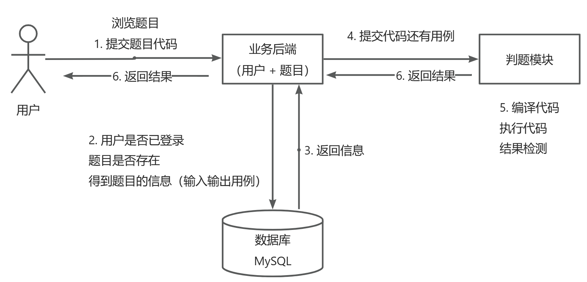

# LuoOJ

## 项目介绍

OJ （Online Judge 在线判题系统）

用于在线评测编程题目的系统。用户可以选择题目，在线做题（编写代码并且提交代码）；系统能根据用户提交的代码、出题人预设的输入和输入用例，先编译代码，运行代码，判断代码运行结果是否正确。其中的判题系统作为开放API，便于开发者开发自己的OJ系统

### OJ系统常用概念

- AC（Accepted）：表示题目通过
- 题目限制
  - 时间限制
  - 内存限制
- 题目描述
- 题目输入
- 题目输出
- 题目输入用例
- 题目输出用例
- 普通测评：管理员预设输入用例和输出用例，判题机运行用户的代码，先给用户的代码喂输入用例得到输出，再与输出用例比对，看是否一致（比对用例文件）
- 特殊测评（SPJ）：管理员预设输入用例和输出用例，比如管理员输入1，用户的输出只要是>0 或 <10 就是正确的（特判程序：不是通比对用例文件这种死板的方式来检验，而是要专门根据这道题目写一个特殊的判断程序，该程序接受题目的输入用例，输出用例，用户的输出，根据这些值来比较是否正确）
- 交互测评：输入由用户决定，输出结果可能多种多样，比较灵活，没办法通过死板的用例文件搞定

### OJ系统的注意点

- 安全性：不能让用户随意引入包，随意遍历，暴力破解，需要使用正确的算法
- 判题过程异步化
- 提交记录：提交之后，有运行的结果、信息（时间内存的花费，做题人，语言等）

### OJ系统的难点

- 判题系统：用户提交代码之后，自动检查用户的代码是否正确，自动得到结果，保证判题系统的安全性


## 项目调研

**现有OJ系统：**

- https://github.com/HimitZH/HOJ （适合学习）        https://docs.hdoi.cn

**注意点：**

- 权限校验
  - 谁能提交代码，谁不能提交代码
- 代码沙箱（安全沙箱）
  - 防止用户代码藏毒。使用隔离的、安全的环境去运行用户的代码
- 资源分配
  - 防止用户疯狂占用资源，导致其他人无法使用。需要限制用户程序的资源占用
- 判题规则
  - 比对用例，验证结果
- 任务调度
  - 服务器资源有限，用户要排队，依次去执行判题


## 架构图




## 核心功能

- 题目模块
  - 创建题目（管理员）
  - 删除题目（管理员）
  - 修改题目（管理员）
  - 搜索题目（管理员&用户）
  - 在线做题
  - 提交代码
- 用户模块
  - 注册
  - 登录
- 判题模块
  - 自主实现代码沙箱
  - 判题
  - 错误处理（内存溢出，超时，安全）
  - 开放接口（提供一个独立的新服务）


## 技术选型

**前端**

- Vue3
- Arco Design
- 在线代码编辑器
- 在线文档浏览

**后端**

- Java进程控制
- Java安全管理器，部分JVM知识点
- 虚拟机
- Docker（代码沙箱）
- Spring Cloud 微服务

- 消息队列

## 计划

**初始化**

- 前端
- 后端

**后端**

- 主业务流程（除了代码沙箱）
- 代码沙箱
- 系统优化
  - 微服务改造

**前端**

- 通用项目模板搭建

- 主业务流程

## OJ系统实现方案

**1、用现成的 OJ 系统**
网上有很多开源的 OJ 项目，可以直接下载开源代码自己部署。
比较推荐的是 judge0，这是一个非常成熟的商业 OJ 项目，支持 60 多种编程语言！https://github.com/judge0/judge0

**2、用现成的服务**
直接使用现成的 判题 API 或者 代码沙箱 等服务。

比如 judge0 提供的判题 API。只需要通过 HTTP 调用 submissions 判题接口，把用户的代码、输入值、预期的执行结果作为请求参数发送给 judge0 的服务器，它就能自动帮你编译执行程序，并且返回程序的运行结果。


API 的作用：接受代码、返回执行结果

Judge0 API 地址：https://rapidapi.com/judge0-official/api/judge0-ce
官方文档：https://ce.judge0.com/#submissions-submission-post

流程

1. 先注册
2. 再开通订阅
3. 然后测试 language 接口
4. 测试执行代码接口 submissions

示例接口参数：

```json
{
  "source_code": "#include <stdio.h>\n\nint main(void) {\n  char name[10];\n  scanf(\"%s\", name);\n  printf(\"hello, %s\n\", name);\n  return 0;\n}",
  "language_id": "4",
  "stdin": "Judge0",
  "expected_output": "hello, Judge0"
}
```

预期返回：

```json
{
  "source_code": "includestdiohintmainvoidcharname10scanfsnameprintfhellosname\nreturn0=\n",
  "language_id": 76,
  "stdin": "Judgew==\n",
  "expected_output": "helloJudge0=\n",
  "stdout": null,
  "status_id": 6,
  "created_at": "2023-07-27T13:50:30.433Z",
  "finished_at": "2023-07-27T13:50:31.022Z",
  "time": null,
  "memory": null,
  "stderr": null,
  "token": "8be000ad-2edb-4262-b367-7095a694e028",
  "number_of_runs": 1,
  "cpu_time_limit": "5.0",
  "cpu_extra_time": "1.0",
  "wall_time_limit": "10.0",
  "memory_limit": 128000,
  "stack_limit": 64000,
  "max_processes_and_or_threads": 60,
  "enable_per_process_and_thread_time_limit": false,
  "enable_per_process_and_thread_memory_limit": false,
  "max_file_size": 1024,
  "compile_output": "bWFpbi5jcHA6MToxOiBlcnJvcjogc291cmNlIGZpbGUgaXMgbm90IHZhbGlk\nIFVURi04Cjw4QT53JTxCOT48VSswNUVDPjxCNT7YqDw4Nj4p7ZmoPEE3PjxC\nRT48ODg+PDlEPnI8VSswMDE2PjxBQj48OUQ+PEE5Pjw5RT48RDc+SzxVKzAw\nMUM+anfsnak8OUU+PEE2PjxCOD48QTc+PEI1PjxGOD5ePDk2PlosPDlEPjxB\nOT48OUU+PEFEPjxFQj5uPEFFPn0KXgptYWluLmNwcDoxOjI6IGVycm9yOiB1\nbmtub3duIHR5cGUgbmFtZSAndycKPDhBPnclPEI5PjxVKzA1RUM+PEI1Ptio\nPDg2Pintmag8QTc+PEJFPjw4OD48OUQ+cjxVKzAwMTY+PEFCPjw5RD48QTk+\nPDlFPjxENz5LPFUrMDAxQz5qd+ydqTw5RT48QTY+PEI4PjxBNz48QjU+PEY4\nPl48OTY+Wiw8OUQ+PEE5Pjw5RT48QUQ+PEVCPm48QUU+fQogICAgXgptYWlu\nLmNwcDoxOjM6IGVycm9yOiBleHBlY3RlZCB1bnF1YWxpZmllZC1pZAo8OEE+\ndyU8Qjk+PFUrMDVFQz48QjU+2Kg8ODY+Ke2ZqDxBNz48QkU+PDg4Pjw5RD5y\nPFUrMDAxNj48QUI+PDlEPjxBOT48OUU+PEQ3Pks8VSswMDFDPmp37J2pPDlF\nPjxBNj48Qjg+PEE3PjxCNT48Rjg+Xjw5Nj5aLDw5RD48QTk+PDlFPjxBRD48\nRUI+bjxBRT59CiAgICAgXgptYWluLmNwcDoxOjQ6IGVycm9yOiBzb3VyY2Ug\nZmlsZSBpcyBub3QgdmFsaWQgVVRGLTgKPDhBPnclPEI5PjxVKzA1RUM+PEI1\nPtioPDg2Pintmag8QTc+PEJFPjw4OD48OUQ+cjxVKzAwMTY+PEFCPjw5RD48\nQTk+PDlFPjxENz5LPFUrMDAxQz5qd+ydqTw5RT48QTY+PEI4PjxBNz48QjU+\nPEY4Pl48OTY+Wiw8OUQ+PEE5Pjw5RT48QUQ+PEVCPm48QUU+fQogICAgICBe\nCm1haW4uY3BwOjE6NzogZXJyb3I6IHNvdXJjZSBmaWxlIGlzIG5vdCB2YWxp\nZCBVVEYtOAo8OEE+dyU8Qjk+PFUrMDVFQz48QjU+2Kg8ODY+Ke2ZqDxBNz48\nQkU+PDg4Pjw5RD5yPFUrMDAxNj48QUI+PDlEPjxBOT48OUU+PEQ3Pks8VSsw\nMDFDPmp37J2pPDlFPjxBNj48Qjg+PEE3PjxCNT48Rjg+Xjw5Nj5aLDw5RD48\nQTk+PDlFPjxBRD48RUI+bjxBRT59CiAgICAgICAgICAgICAgICAgIF4KbWFp\nbi5jcHA6MToxMDogZXJyb3I6IHNvdXJjZSBmaWxlIGlzIG5vdCB2YWxpZCBV\nVEYtOAo8OEE+dyU8Qjk+PFUrMDVFQz48QjU+2Kg8ODY+Ke2ZqDxBNz48QkU+\nPDg4Pjw5RD5yPFUrMDAxNj48QUI+PDlEPjxBOT48OUU+PEQ3Pks8VSswMDFD\nPmp37J2pPDlFPjxBNj48Qjg+PEE3PjxCNT48Rjg+Xjw5Nj5aLDw5RD48QTk+\nPDlFPjxBRD48RUI+bjxBRT59CiAgICAgICAgICAgICAgICAgICAgICAgXgpt\nYWluLmNwcDoxOjE1OiBlcnJvcjogc291cmNlIGZpbGUgaXMgbm90IHZhbGlk\nIFVURi04Cjw4QT53JTxCOT48VSswNUVDPjxCNT7YqDw4Nj4p7ZmoPEE3PjxC\nRT48ODg+PDlEPnI8VSswMDE2PjxBQj48OUQ+PEE5Pjw5RT48RDc+SzxVKzAw\nMUM+anfsnak8OUU+PEE2PjxCOD48QTc+PEI1PjxGOD5ePDk2PlosPDlEPjxB\nOT48OUU+PEFEPjxFQj5uPEFFPn0KICA
  "exit_code": null,
  "exit_signal": null,
  "message": null,
  "wall_time": null,
  "compiler_options": null,
  "command_line_arguments": null,
  "redirect_stderr_to_stdout": false,
  "callback_url": null,
  "additional_files": null,
  "enable_network": false,
  "status": {
    "id": 6,
    "description": "Compilation Error"
  },
  "language": {
    "id": 76,
    "name": "C++ (Clang 7.0.1)"
  }
}
```

**3、自主开发（采用）**

**4、把 AI 来当做代码沙箱**
把 AI 当做代码沙箱，直接扔给他一段代码、输入参数，问他能否得到预期的结果，就实现了在线判题逻辑！

**5、移花接木**
可以通过程序操作模拟浏览器，用别人已经开发好的 OJ 系统来帮我们判题。
比如使用 Puppeteer + 无头浏览器，把咱们系统用户提交的代码，像人一样输入到别人的 OJ 网页中，让程序点击提交按钮，并且等别人的 OJ 系统返回判题结果后，再把这个结果返回给我们自己的用户。
缺点就是把核心流程交给了别人，如果别人服务挂了，你的服务也就挂了；而且别人 OJ 系统不支持的题目，可能你也支持不了。


## 初始化

### 前端

1. **确认环境**

   nodeJs 版本：16.16.0（建议16）

```sh
node -v
```

​		npm 版本： 8.11.0（建议8或9）

```sh
npm -v
```

2. **安装Vue CLI脚手架** https://cli.vuejs.org/zh/guide/installation.html

```sh
npm install -g @vue/cli
# OR
yarn global add @vue/cli
```

```sh
# 查看Vue CLI是否安装成功
vue --version
# OR
vue -V
```

3. **创建项目** https://cli.vuejs.org/zh/guide/creating-a-project.html

```sh
vue create luooj-frontend
```


4. **启动**


5. **开启代码美化插件**

Vue CLI脚手架已经帮我们配置了代码美化，自动校验，格式化插件，无需自行配置，我们只需开启即可


6. 引入组件 

快速上手：https://arco.design/vue/docs/start

`安装`

```sh
# npm
npm install --save-dev @arco-design/web-vue
# yarn
yarn add --dev @arco-design/web-vue
```

`完整引入`


### 后端


## 后端


## 前端

### 通用项目模板搭建

#### 开发通用布局

**1、提取通用路由文件**


**2、创建通用布局，修改App.vue**


 **3、添加布局（上中下）**


**4、 添加菜单栏**

用户操作改变url，url改变页面


 


5、菜单栏自适应


#### 全局状态管理

https://vuex.vuejs.org/zh/guide

所有页面全局共享的变量，而不是局限在某一个页面中

适合作为全局状态的数据：已登录用户信息

本质：提供了一套增删改查全局变量的 API ，额外多了一些功能

1、安装

安装脚手架时，已经安装了

2、使用

- state：存储的状态信息，比如用户信息
- getters：便捷获取对象的方法
- mutations（尽量同步）：定义了更新变量的方法 
- actions（支持异步）：执行异步操作，并且触发mutations的更改（actions 调用 mutations）


#### 全局权限管理

以一套通用的机制定义哪个页面需要哪些权限 

**1、在路由配置文件，定义某个路由的访问权限**


2、在全局页面组件App.vue中，绑定一个全局路由监听，每次访问页面时，根据用户要访问页面的路由信息，判断用户是否有权限访问。有权限就跳转到原页面，没有就拦截或者跳转到401鉴权或登录页


## 扩展思路

- 支持多种语言
- Remote Judge
- 完善的评测功能：普通测评、特殊测评、交互测评、在线自测、子任务分组评测、文件IO
- 统计分析提交记录
- 权限校验