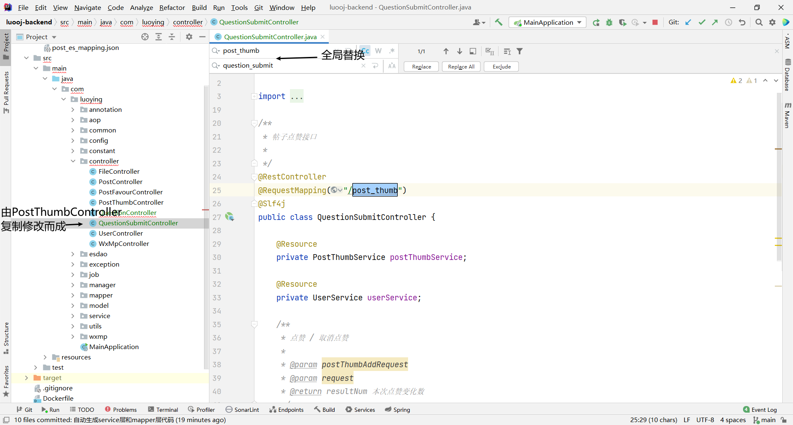
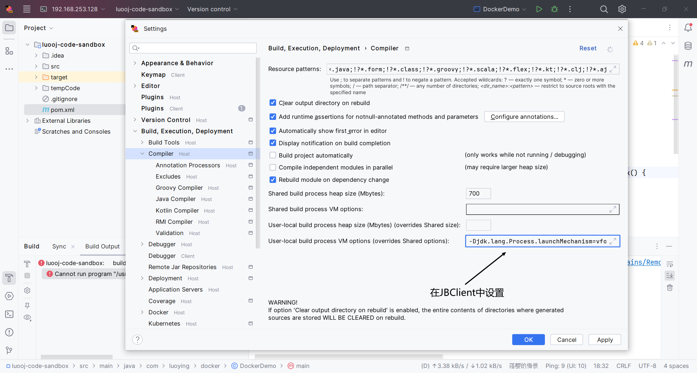
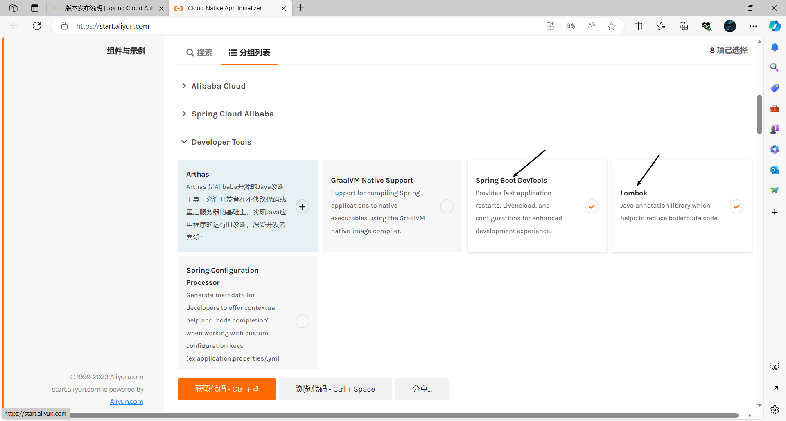
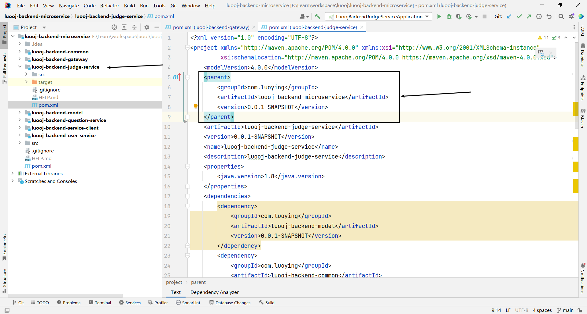
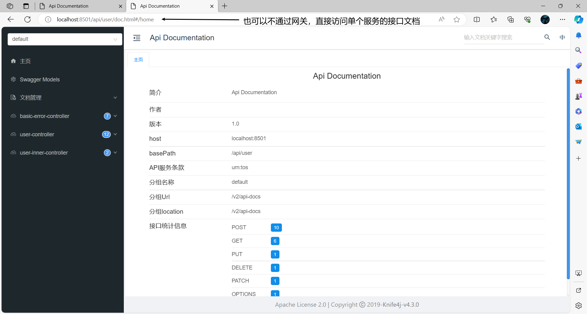
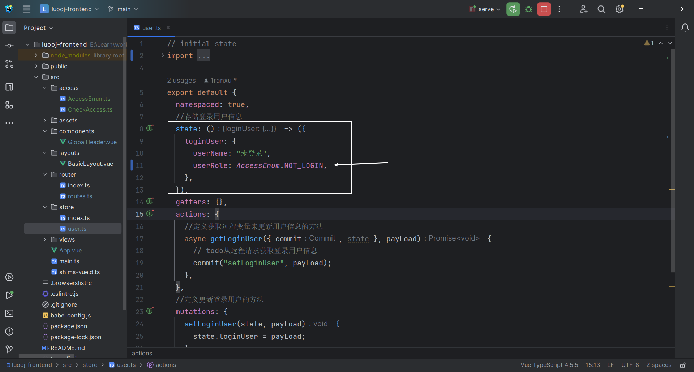
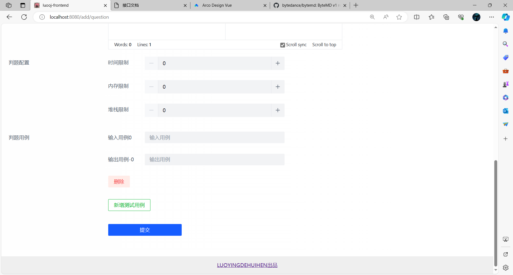
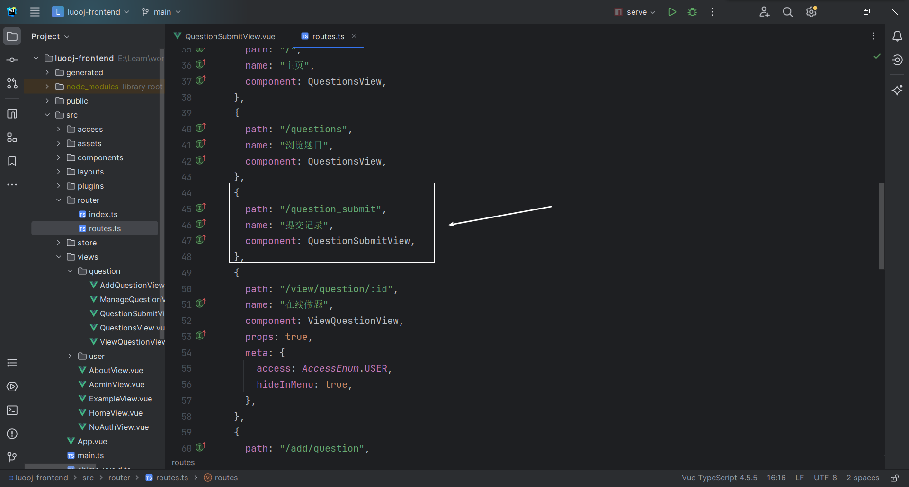
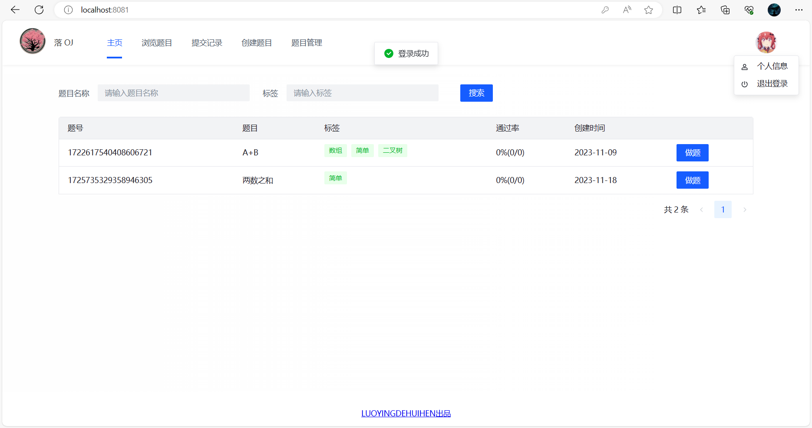

# LuoOJ

## 项目介绍

OJ （Online Judge 在线判题系统）

用于在线评测编程题目的系统。用户可以选择题目，在线做题（编写代码并且提交代码）；系统能根据用户提交的代码、出题人预设的输入和输入用例，先编译代码，运行代码，判断代码运行结果是否正确。其中的判题系统作为开放API，便于开发者开发自己的OJ系统

### OJ系统常用概念

- AC（Accepted）：表示题目通过
- 题目限制
  - 时间限制
  - 内存限制
- 题目描述
- 题目输入
- 题目输出
- 题目输入用例
- 题目输出用例
- 普通测评：管理员预设输入用例和输出用例，判题机运行用户的代码，先给用户的代码喂输入用例得到输出，再与输出用例比对，看是否一致（比对用例文件）
- 特殊测评（SPJ）：管理员预设输入用例和输出用例，比如管理员输入1，用户的输出只要是>0 或 <10 就是正确的（特判程序：不是通比对用例文件这种死板的方式来检验，而是要专门根据这道题目写一个特殊的判断程序，该程序接受题目的输入用例，输出用例，用户的输出，根据这些值来比较是否正确）
- 交互测评：输入由用户决定，输出结果可能多种多样，比较灵活，没办法通过死板的用例文件搞定

### OJ系统的注意点

- 安全性：不能让用户随意引入包，随意遍历，暴力破解，需要使用正确的算法
- 判题过程异步化
- 提交记录：提交之后，有运行的结果、信息（时间内存的花费，做题人，语言等）

### OJ系统的难点

- 判题系统：用户提交代码之后，自动检查用户的代码是否正确，自动得到结果，保证判题系统的安全性


## 项目调研

**现有OJ系统：**

- https://github.com/HimitZH/HOJ （适合学习）        https://docs.hdoi.cn

**注意点：**

- 权限校验
  - 谁能提交代码，谁不能提交代码
- 代码沙箱（安全沙箱）
  - 防止用户代码藏毒。使用隔离的、安全的环境去运行用户的代码
- 资源分配
  - 防止用户疯狂占用资源，导致其他人无法使用。需要限制用户程序的资源占用
- 判题规则
  - 比对用例，验证结果
- 任务调度
  - 服务器资源有限，用户要排队，依次去执行判题


## 架构图


## 核心功能

- 题目模块
  - 创建题目（管理员）
  - 删除题目（管理员）
  - 修改题目（管理员）
  - 搜索题目（管理员&用户）
  - 在线做题
  - 题目提交
- 用户模块
  - 注册
  - 登录
- 判题模块
  - 执行判题
  - 错误处理（内存溢出，超时，安全）
  - 代码沙箱（自主实现） 
  - 开放接口（提供一个独立的新服务）


## 技术选型

**前端**

- Vue3
- Arco Design
- 在线代码编辑器
- 在线文档浏览

**后端**

- Java进程控制
- Java安全管理器，部分JVM知识点
- 虚拟机
- Docker（代码沙箱）
- Spring Cloud 微服务

- 消息队列


## 计划

**初始化**

- 前端
- 后端

**后端**

- 库表设计
- 后端增删改查接口开发
- 判题模块预开发
  - 代码沙箱
  - 判题服务
- 代码沙箱
  - Java原生实现代码沙箱
  - Docker实现代码沙箱
- 系统优化
  - 模板方法优化代码沙箱
  - 代码沙箱提供开放 API
  - 跑通单体项目流程
  - 单体项目改造为微服务
  - 消息队列解耦


**前端**

- 通用项目模板搭建
- 题目模块
  - 题目创建页（管理员）

  - 题目管理页（管理员）
    - 查看（搜索）

    - 删除

    - 修改

    - 快捷创建

  - 题目搜索页（用户&管理员可以查看到题目）

  - 在线做题页（ 用户&管理员）

  - 题目提交列表页（用户&管理员）


## OJ系统实现方案

**1、用现成的 OJ 系统**
网上有很多开源的 OJ 项目，可以直接下载开源代码自己部署。
比较推荐的是 judge0，这是一个非常成熟的商业 OJ 项目，支持 60 多种编程语言！https://github.com/judge0/judge0

**2、用现成的服务**
直接使用现成的 判题 API 或者 代码沙箱 等服务。

比如 judge0 提供的判题 API。只需要通过 HTTP 调用 submissions 判题接口，把用户的代码、输入值、预期的执行结果作为请求参数发送给 judge0 的服务器，它就能自动帮你编译执行程序，并且返回程序的运行结果。


API 的作用：接受代码、返回执行结果

Judge0 API 地址：https://rapidapi.com/judge0-official/api/judge0-ce
官方文档：https://ce.judge0.com/#submissions-submission-post

流程

1. 先注册
2. 再开通订阅
3. 然后测试 language 接口
4. 测试执行代码接口 submissions

示例接口参数：

```json
{
  "source_code": "#include <stdio.h>\n\nint main(void) {\n  char name[10];\n  scanf(\"%s\", name);\n  printf(\"hello, %s\n\", name);\n  return 0;\n}",
  "language_id": "4",
  "stdin": "Judge0",
  "expected_output": "hello, Judge0"
}
```

预期返回：

```json
{
  "source_code": "includestdiohintmainvoidcharname10scanfsnameprintfhellosname\nreturn0=\n",
  "language_id": 76,
  "stdin": "Judgew==\n",
  "expected_output": "helloJudge0=\n",
  "stdout": null,
  "status_id": 6,
  "created_at": "2023-07-27T13:50:30.433Z",
  "finished_at": "2023-07-27T13:50:31.022Z",
  "time": null,
  "memory": null,
  "stderr": null,
  "token": "8be000ad-2edb-4262-b367-7095a694e028",
  "number_of_runs": 1,
  "cpu_time_limit": "5.0",
  "cpu_extra_time": "1.0",
  "wall_time_limit": "10.0",
  "memory_limit": 128000,
  "stack_limit": 64000,
  "max_processes_and_or_threads": 60,
  "enable_per_process_and_thread_time_limit": false,
  "enable_per_process_and_thread_memory_limit": false,
  "max_file_size": 1024,
  "compile_output": "bWFpbi5jcHA6MToxOiBlcnJvcjogc291cmNlIGZpbGUgaXMgbm90IHZhbGlk\nIFVURi04Cjw4QT53JTxCOT48VSswNUVDPjxCNT7YqDw4Nj4p7ZmoPEE3PjxC\nRT48ODg+PDlEPnI8VSswMDE2PjxBQj48OUQ+PEE5Pjw5RT48RDc+SzxVKzAw\nMUM+anfsnak8OUU+PEE2PjxCOD48QTc+PEI1PjxGOD5ePDk2PlosPDlEPjxB\nOT48OUU+PEFEPjxFQj5uPEFFPn0KXgptYWluLmNwcDoxOjI6IGVycm9yOiB1\nbmtub3duIHR5cGUgbmFtZSAndycKPDhBPnclPEI5PjxVKzA1RUM+PEI1Ptio\nPDg2Pintmag8QTc+PEJFPjw4OD48OUQ+cjxVKzAwMTY+PEFCPjw5RD48QTk+\nPDlFPjxENz5LPFUrMDAxQz5qd+ydqTw5RT48QTY+PEI4PjxBNz48QjU+PEY4\nPl48OTY+Wiw8OUQ+PEE5Pjw5RT48QUQ+PEVCPm48QUU+fQogICAgXgptYWlu\nLmNwcDoxOjM6IGVycm9yOiBleHBlY3RlZCB1bnF1YWxpZmllZC1pZAo8OEE+\ndyU8Qjk+PFUrMDVFQz48QjU+2Kg8ODY+Ke2ZqDxBNz48QkU+PDg4Pjw5RD5y\nPFUrMDAxNj48QUI+PDlEPjxBOT48OUU+PEQ3Pks8VSswMDFDPmp37J2pPDlF\nPjxBNj48Qjg+PEE3PjxCNT48Rjg+Xjw5Nj5aLDw5RD48QTk+PDlFPjxBRD48\nRUI+bjxBRT59CiAgICAgXgptYWluLmNwcDoxOjQ6IGVycm9yOiBzb3VyY2Ug\nZmlsZSBpcyBub3QgdmFsaWQgVVRGLTgKPDhBPnclPEI5PjxVKzA1RUM+PEI1\nPtioPDg2Pintmag8QTc+PEJFPjw4OD48OUQ+cjxVKzAwMTY+PEFCPjw5RD48\nQTk+PDlFPjxENz5LPFUrMDAxQz5qd+ydqTw5RT48QTY+PEI4PjxBNz48QjU+\nPEY4Pl48OTY+Wiw8OUQ+PEE5Pjw5RT48QUQ+PEVCPm48QUU+fQogICAgICBe\nCm1haW4uY3BwOjE6NzogZXJyb3I6IHNvdXJjZSBmaWxlIGlzIG5vdCB2YWxp\nZCBVVEYtOAo8OEE+dyU8Qjk+PFUrMDVFQz48QjU+2Kg8ODY+Ke2ZqDxBNz48\nQkU+PDg4Pjw5RD5yPFUrMDAxNj48QUI+PDlEPjxBOT48OUU+PEQ3Pks8VSsw\nMDFDPmp37J2pPDlFPjxBNj48Qjg+PEE3PjxCNT48Rjg+Xjw5Nj5aLDw5RD48\nQTk+PDlFPjxBRD48RUI+bjxBRT59CiAgICAgICAgICAgICAgICAgIF4KbWFp\nbi5jcHA6MToxMDogZXJyb3I6IHNvdXJjZSBmaWxlIGlzIG5vdCB2YWxpZCBV\nVEYtOAo8OEE+dyU8Qjk+PFUrMDVFQz48QjU+2Kg8ODY+Ke2ZqDxBNz48QkU+\nPDg4Pjw5RD5yPFUrMDAxNj48QUI+PDlEPjxBOT48OUU+PEQ3Pks8VSswMDFD\nPmp37J2pPDlFPjxBNj48Qjg+PEE3PjxCNT48Rjg+Xjw5Nj5aLDw5RD48QTk+\nPDlFPjxBRD48RUI+bjxBRT59CiAgICAgICAgICAgICAgICAgICAgICAgXgpt\nYWluLmNwcDoxOjE1OiBlcnJvcjogc291cmNlIGZpbGUgaXMgbm90IHZhbGlk\nIFVURi04Cjw4QT53JTxCOT48VSswNUVDPjxCNT7YqDw4Nj4p7ZmoPEE3PjxC\nRT48ODg+PDlEPnI8VSswMDE2PjxBQj48OUQ+PEE5Pjw5RT48RDc+SzxVKzAw\nMUM+anfsnak8OUU+PEE2PjxCOD48QTc+PEI1PjxGOD5ePDk2PlosPDlEPjxB\nOT48OUU+PEFEPjxFQj5uPEFFPn0KICA
  "exit_code": null,
  "exit_signal": null,
  "message": null,
  "wall_time": null,
  "compiler_options": null,
  "command_line_arguments": null,
  "redirect_stderr_to_stdout": false,
  "callback_url": null,
  "additional_files": null,
  "enable_network": false,
  "status": {
    "id": 6,
    "description": "Compilation Error"
  },
  "language": {
    "id": 76,
    "name": "C++ (Clang 7.0.1)"
  }
}
```

**3、自主开发（采用）**

**4、把 AI 来当做代码沙箱**
把 AI 当做代码沙箱，直接扔给他一段代码、输入参数，问他能否得到预期的结果，就实现了在线判题逻辑！

**5、移花接木**
可以通过程序操作模拟浏览器，用别人已经开发好的 OJ 系统来帮我们判题。
比如使用 Puppeteer + 无头浏览器，把咱们系统用户提交的代码，像人一样输入到别人的 OJ 网页中，让程序点击提交按钮，并且等别人的 OJ 系统返回判题结果后，再把这个结果返回给我们自己的用户。
缺点就是把核心流程交给了别人，如果别人服务挂了，你的服务也就挂了；而且别人 OJ 系统不支持的题目，可能你也支持不了。


## 初始化

### 前端

1. **确认环境**

   nodeJs 版本：16.16.0（建议16）

```sh
node -v
```

​		npm 版本： 8.11.0（建议8或9）

```sh
npm -v
```

2. **安装Vue CLI脚手架** https://cli.vuejs.org/zh/guide/installation.html

```sh
npm install -g @vue/cli
# OR
yarn global add @vue/cli
```

```sh
# 查看Vue CLI是否安装成功
vue --version
# OR
vue -V
```

3. **创建项目** https://cli.vuejs.org/zh/guide/creating-a-project.html

```sh
vue create luooj-frontend
```


4. **启动**


5. **开启代码美化插件**

Vue CLI脚手架已经帮我们配置了代码美化，自动校验，格式化插件，无需自行配置，我们只需开启即可


6. 引入组件 

快速上手：https://arco.design/vue/docs/start

`安装`

```sh
# npm
npm install --save-dev @arco-design/web-vue
# yarn
yarn add --dev @arco-design/web-vue
```

`完整引入`


### 后端

#### 快速上手

**1、使用后端万用模板**

**2、修改项目名**


**3、修改端口号**


**4、开启分布式Session**


**5、修改数据库并创建**


**6、启动项目，查看接口文档**


#### 模板结构介绍

- doc：存放文档
- sql
  - create_table.sql：初始的建库和建表语句
  - post_es_mapping.json：帖子表在ES中的索引创建语句
- src
  - main
    - java
      - com
        - luoying
          - annotation
            - AuthCheck：权限校验注解，用于权限校验
          - aop
            - AuthInterceptor：权限校验切面，匹配所有使用了AuthCheck注解的方法，然后进行权限校验
            - LogInterceptor：记录请求和响应日志切面，匹配controller包的所有方法
          - common
            - BaseResponse：通用结果返回类
            - DeleteRequest：通用的删除请求类
            - ErrorCode：各种错误码
            - PageRequest：通用的分页请求类
            - ResultUtils：定义了构建通用返回结果的方法
          - config
            - CorsConfig：全局跨域配置
            - CosClientConfig：定义了对象存储的配置
            - JsonConfig：添加 Long 转 json 精度丢失的配置
            - Knife4jConfig：接口文档生成的配置
            - MyBatisPlusConfig：MybatisPlus分页拦截器
            - WxOpenConfig：微信开放平台的配置
          - constant：定义常量
            - CommonConstant：排序方式常量
            - FileConstant：COS 访问地址
            - UserConstant：用户角色常量
          - controller：接受请求
          - esdao：类似mybatis的mapper，用于操作ES
          - exception：异常处理相关
          - job：任务（定时任务，单次任务）
            - cycle：循环执行
            - once：单次任务
          - manager：定义通用的服务
          - mapper：mybatis的数据访问层，用于操作数据库
          - model
            - dto：请求包装类
            - entity：数据库表的实体类
            - enums：枚举
            - vo：响应包装类
          - service：服务层，用于编写业务逻辑
          - utils：工具类，各种公用的方法
          - wxmp：公众号相关
        - MainApplication：主类（项目入口）
    - resources：配置文件
      - mapper：映射文件
      - *.yml：项目配置文件
      - banner.txt：替换SpringBoot logo
      - test_excel.xlsx：excel测试文件
  - test：单元测试代码
  - DockerFile：用于构建docker镜像

## 后端

### 库表设计

**1、用户表**

```sql
-- 用户表
create table if not exists user
(
    id           bigint auto_increment comment 'id' primary key,
    userAccount  varchar(256)                           not null comment '账号',
    userPassword varchar(512)                           not null comment '密码',
    unionId      varchar(256)                           null comment '微信开放平台id',
    mpOpenId     varchar(256)                           null comment '公众号openId',
    userName     varchar(256)                           null comment '用户昵称',
    userAvatar   varchar(1024)                          null comment '用户头像',
    userProfile  varchar(512)                           null comment '用户简介',
    userRole     varchar(256) default 'user'            not null comment '用户角色：user/admin/ban',
    gender       tinyint                                null comment '性别',
    createTime   datetime     default CURRENT_TIMESTAMP not null comment '创建时间',
    updateTime   datetime     default CURRENT_TIMESTAMP not null on update CURRENT_TIMESTAMP comment '更新时间',
    isDelete     tinyint      default 0                 not null comment '是否删除',
    index idx_unionId (unionId)
) comment '用户' collate = utf8mb4_unicode_ci;
```

**2、题目表**

- 题目标题

- 题目内容：存放题目的介绍，输入输出示例，题目提示，具体的详情

- 题目标签：栈，队列，链表，简单，中等，困难

- 题目答案：管理员设置的标准答案（可以采纳一些用户的）

- 提交数：提交答案的次数，便于统计分析

- 通过数：通过题目的人数，便于统计分析

- 判题相关字段

  > 如果题目用例不是很复杂，也不是很多，可以直接存在数据库
  >
  > 如果大于512KB，建议单独存放在一个文件中，数据库只保存文件的url（类似存储用户头像）

  - 判题配置 judgeConfig（json对象）

    - 时间限制 timeLimit
    - 内存限制 memoryLimit
    - 堆栈限制 stackLimit

    ```json
    {
    	"timeLimit":"", //ms
    	"memoryLimit":"",//KB
        "stackLimit":""//KB
    }
    ```

  - 判题用例 judgeCase（json数组）

    - 元素：由输入用例,输出用例组成的对象

    ```json
    [
    	{
    		"input":"1 2",
    		"output":"3 4"
    	},
        {
    		"input":"1 2",
    		"output":"3 4"
    	},
    ]
    ```

  - 存json的好处，后续如果需要加字段，可以直接在程序中为对象加字段，不用修改数据库表

  - 存json的前提

    - 不需要根据json里面的字段去反查这条数据
    - json里面的字段含义相关，属于同一类的值 
    - json里面的字段空间占用不大

- 扩展字段

  - 通过率
  - 判题类型

```sql
-- 题目表
create table if not exists question
(
    id          bigint auto_increment comment 'id' primary key,
    title       varchar(512)                       null comment '题目标题',
    content     text                               null comment '题目内容',
    tags        varchar(1024)                      null comment '标签列表（json 数组）',
    answer      text                               null comment '题目答案',
    submitNum   int      default 0                 not null comment '题目提交数',
    acceptedNum int      default 0                 not null comment '题目通过数',
    judgeConfig varchar(128)                       null comment '判题配置（json对象）',
    judgeCase   text                               null comment '判题用例（json数组）',
    thumbNum    int      default 0                 not null comment '点赞数',
    favourNum   int      default 0                 not null comment '收藏数',
    userId      bigint                             not null comment '创建用户 id',
    createTime  datetime default CURRENT_TIMESTAMP not null comment '创建时间',
    updateTime  datetime default CURRENT_TIMESTAMP not null on update CURRENT_TIMESTAMP comment '更新时间',
    isDelete    tinyint  default 0                 not null comment '是否删除',
    index idx_userId (userId)
) comment '题目' collate = utf8mb4_unicode_ci;
```

**3、题目提交记录表**

- 编程语言

- 题目id

- 提交用户id

- 用户提交的代码 code

- 判题状态 status（0-待判题、1-判题中、2-已判题、3-失败）

- 判题信息 judgeInfo （判题过程中得到的一些信息，比如程序执行时间，内存占用，失败原因）（json对象）

  ```json
  {
  	"message":"程序执行信息",
  	"time":1000,  //ms
  	"memory":1000 //KB
  }
  ```

  程序执行信息枚举

  - Accepted 通过
  - Wrong Answer 答案错误
  - Compile Error 编译错误
  - Memory Limit Exceeded 内存超限
  - Time Limit Exceeded 时间超限
  - Presentation Error 展示错误（比如多输出了空格，换行，逗号）
  - Output Limit Exceeded 输出溢出
  - Waiting 等待中
  - Dangerous Operation 危险操作（比如向我们的服务器写文件）
  - RunTime Error 运行错误（提交的代码有问题）
  - System Error 系统错误（我们的系统出问题了）

```sql
-- 题目提交记录表
create table if not exists question_submit
(
    id         bigint auto_increment comment 'id' primary key,
    language   varchar(128)                       not null comment '编程语言',
    questionId bigint                             not null comment '题目id',
    userId     bigint                             not null comment '提交用户id',
    code       text                               not null comment '用户提交的代码',
    judgeInfo  varchar(128)                       null comment '判题信息',
    status     int      default 0                 not null comment '判题状态（0-待判题、1-判题中、2-成功、3-失败）',
    createTime datetime default CURRENT_TIMESTAMP not null comment '创建时间',
    updateTime datetime default CURRENT_TIMESTAMP not null on update CURRENT_TIMESTAMP comment '更新时间',
    isDelete   tinyint  default 0                 not null comment '是否删除',
    index idx_userId (userId),
    index idx_questionId (questionId)
) comment '题目提交记录' collate = utf8mb4_unicode_ci;
```

**小知识**

- 什么时候适合加索引（原则上，能不用索引就不要用；能用单个索引，就不要用联合索引，因为索引也需要占用空间）
  - 单个索引场景：需要根据单个字段查询 where userId = 1
  - 联合索引场景：不需要根据单个字段查询，且需要多个字段绑定在一起查询 where userId = 1 and questionId =2

- 如何选择给哪个字段加索引
  - 枚举值区分度高的字段


### 后端增删改查接口开发

**小知识**

- 防止用户按照id顺序爬取题目，建议id的生成规则改成ASSIGN_ID（非连续自增），而不是自增

  ```java
  /**
   * id
   */
  @TableId(type = IdType.ASSIGN_ID)
  private Long id;
  ```
  
- 逻辑删除字段需要打上@TableLogic注解

  ```java
  /**
   * 是否删除
   */
  @TableLogic
  private Integer isDelete;
  ```

#### 自动生成mapper和service层基础代码


#### 编写QuestionController，实现基本增删改查和权限校验

- 单表复制单表的Controller （比如qustion => post）

- 关联表复制关联表的Controller（比如question_submit => post_thumb）

**1、复制PostController进行全局替换**


**2、定义DTO类**

```java
@Data
public class QuestionJudgeCase {
    /**
     * 输入用例
     */
    private String input;

    /**
     * 输出用例
     */
    private String output;
}
```

```java
@Data
public class QuestionJudgeCconfig {
    /**
     * 时间限制 ms
     */
    private Long timeLimit;

    /**
     * 内存限制 KB
     */
    private Long memoryLimit;

    /**
     * 堆栈限制 KB
     */
    private Long stackLimit;
}
```

```java
/**
 * 创建请求
 *
 */
@Data
public class QuestionAddRequest implements Serializable {
    /**
     * 题目标题
     */
    private String title;

    /**
     * 题目内容
     */
    private String content;

    /**
     * 标签列表（json 数组） 
     */
    private List<String> tags;

    /**
     * 题目答案
     */
    private String answer;

    /**
     * 判题配置（json对象）
     */
    private QuestionJudgeCconfig judgeConfig;

    /**
     * 判题用例（json数组）
     */
    private List<QuestionJudgeCase> judgeCaseList;

    private static final long serialVersionUID = 1L;
}
```

```java
/**
 * 编辑请求
 *
 */
@Data
public class QuestionEditRequest implements Serializable {

    /**
     * id
     */
    private Long id;

    /**
     * 题目标题
     */
    private String title;

    /**
     * 题目内容
     */
    private String content;

    /**
     * 标签列表（json 数组）
     */
    private List<String> tags;

    /**
     * 题目答案
     */
    private String answer;

    /**
     * 判题配置（json对象）
     */
    private QuestionJudgeCconfig judgeConfig;

    /**
     * 判题用例（json数组）
     */
    private List<QuestionJudgeCase> judgeCaseList;

    private static final long serialVersionUID = 1L;
}
```

```java
/**
 * 查询请求
 *
 */
@EqualsAndHashCode(callSuper = true)
@Data
public class QuestionQueryRequest extends PageRequest implements Serializable {
    /**
     * id
     */
    private Long id;

    /**
     * 题目标题
     */
    private String title;

    /**
     * 题目内容
     */
    private String content;

    /**
     * 标签列表（json 数组）
     */
    private List<String> tags;

    /**
     * 题目答案
     */
    private String answer;

    /**
     * 创建用户 id
     */
    private Long userId;

    private static final long serialVersionUID = 1L;
}
```

```java
/**
 * 更新请求
 */
@Data
public class QuestionUpdateRequest implements Serializable {

    /**
     * id
     */
    private Long id;

    /**
     * 题目标题
     */
    private String title;

    /**
     * 题目内容
     */
    private String content;

    /**
     * 标签列表（json 数组）
     */
    private List<String> tags;

    /**
     * 题目答案
     */
    private String answer;

    /**
     * 判题配置（json对象）
     */
    private QuestionJudgeCconfig judgeConfig;

    /**
     * 判题用例（json数组）
     */
    private List<QuestionJudgeCase> judgeCaseList;

    private static final long serialVersionUID = 1L;
}
```

**3、定义VO类（给前端返回的对象，减少传输数据，过滤字段（脱敏），保证安全性）**

```java
/**
 * 题目
 *
 * @TableName question
 */
@Data
public class QuestionVO implements Serializable {
    private final static Gson GSON = new Gson();
    /**
     * id
     */
    private Long id;

    /**
     * 题目标题
     */
    private String title;

    /**
     * 题目内容
     */
    private String content;

    /**
     * 标签列表（json 数组）
     */
    private List<String> tags;

    /**
     * 题目提交数
     */
    private Integer submitNum;

    /**
     * 题目通过数
     */
    private Integer acceptedNum;

    /**
     * 判题配置（json对象）
     */
    private QuestionJudgeCconfig judgeConfig;

    /**
     * 点赞数
     */
    private Integer thumbNum;

    /**
     * 收藏数
     */
    private Integer favourNum;

    /**
     * 创建用户 id
     */
    private Long userId;

    /**
     * 创建时间
     */
    private Date createTime;

    /**
     * 更新时间
     */
    private Date updateTime;

    /**
     *
     */
    private UserVO userVO;

    /**
     * 包装类转对象
     *
     * @param questionVO
     * @return
     */
    public static Question voToObj(QuestionVO questionVO) {
        if (questionVO == null) {
            return null;
        }
        Question question = new Question();
        BeanUtils.copyProperties(questionVO, question);
        List<String> tagList = questionVO.getTags();
        if (tagList != null) {
            question.setTags(GSON.toJson(tagList));
            // question.setTags(JSONUtil.toJsonStr(tagList));
        }
        QuestionJudgeCconfig judgeConfig = questionVO.getJudgeConfig();
        if (judgeConfig != null) {
            question.setJudgeConfig(GSON.toJson(judgeConfig));
            // question.setJudgeConfig(JSONUtil.toJsonStr(judgeConfig));
        }
        return question;
    }

    /**
     * 对象转包装类
     *
     * @param question
     * @return
     */
    public static QuestionVO objToVo(Question question) {
        if (question == null) {
            return null;
        }
        QuestionVO questionVO = new QuestionVO();
        BeanUtils.copyProperties(question, questionVO);
        questionVO.setTags(GSON.fromJson(question.getTags(), new TypeToken<List<String>>() {
        }.getType()));
        // questionVO.setTags(JSONUtil.toList(question.getTags(), String.class));
        questionVO.setJudgeConfig(GSON.fromJson(question.getJudgeConfig(), new TypeToken<QuestionJudgeCconfig>() {
        }.getType()));
        // questionVO.setJudgeConfig(JSONUtil.toBean(question.getJudgeConfig(), QuestionJudgeCconfig.class));
        return questionVO;
    }
}
```

**4、校验Controller的代码，看看除了调用的方法缺失外，还有没有报错**

**5、在service层补全缺失的方法**

```java
/**
* @author 落樱的悔恨
* @description 针对表【question(题目)】的数据库操作Service
* @createDate 2023-11-09 16:32:34
*/
public interface QuestionService extends IService<Question> {
    /**
     * 校验
     *
     * @param question
     * @param add
     */
    void validQuestion(Question question, boolean add);

    /**
     * 获取查询条件
     *
     * @param questionQueryRequest
     * @return
     */
    QueryWrapper<Question> getQueryWrapper(QuestionQueryRequest questionQueryRequest);
    

    /**
     * 获取题目封装
     *
     * @param question
     * @param request
     * @return
     */
    QuestionVO getQuestionVO(Question question, HttpServletRequest request);

    /**
     * 分页获取题目封装
     *
     * @param questionPage
     * @param request
     * @return
     */
    Page<QuestionVO> getQuestionVOPage(Page<Question> questionPage, HttpServletRequest request);
}
```

```java
/**
 * @author 落樱的悔恨
 * @description 针对表【question(题目)】的数据库操作Service实现
 * @createDate 2023-11-09 16:32:34
 */
@Service
public class QuestionServiceImpl extends ServiceImpl<QuestionMapper, Question>
        implements QuestionService {

    private final static Gson GSON = new Gson();

    @Resource
    private UserService userService;

    /**
     * 校验题目是否合法
     *
     * @param question
     * @param add
     */
    @Override
    public void validQuestion(Question question, boolean add) {
        if (question == null) {
            throw new BusinessException(ErrorCode.PARAMS_ERROR);
        }
        String title = question.getTitle();
        String content = question.getContent();
        String tags = question.getTags();
        String answer = question.getAnswer();
        String judgeConfig = question.getJudgeConfig();
        String judgeCase = question.getJudgeCase();
        // 创建时，参数不能为空
        if (add) {
            ThrowUtils.throwIf(StringUtils.isAnyBlank(title, content, tags), ErrorCode.PARAMS_ERROR);
        }
        // 有参数则校验
        if (StringUtils.isNotBlank(title) && title.length() > 80) {
            throw new BusinessException(ErrorCode.PARAMS_ERROR, "标题过长");
        }
        if (StringUtils.isNotBlank(content) && content.length() > 8192) {
            throw new BusinessException(ErrorCode.PARAMS_ERROR, "内容过长");
        }
        if (StringUtils.isNotBlank(answer) && content.length() > 8192) {
            throw new BusinessException(ErrorCode.PARAMS_ERROR, "答案过长");
        }
        if (StringUtils.isNotBlank(judgeCase) && content.length() > 8192) {
            throw new BusinessException(ErrorCode.PARAMS_ERROR, "判题用例过长");
        }
        if (StringUtils.isNotBlank(judgeConfig) && content.length() > 8192) {
            throw new BusinessException(ErrorCode.PARAMS_ERROR, "判题配置过长");
        }
    }

    /**
     * 获取查询包装类
     *
     * @param questionQueryRequest
     * @return
     */
    @Override
    public QueryWrapper<Question> getQueryWrapper(QuestionQueryRequest questionQueryRequest) {
        QueryWrapper<Question> queryWrapper = new QueryWrapper<>();
        if (questionQueryRequest == null) {
            return queryWrapper;
        }
        Long id = questionQueryRequest.getId();
        String title = questionQueryRequest.getTitle();
        String content = questionQueryRequest.getContent();
        List<String> tags = questionQueryRequest.getTags();
        String answer = questionQueryRequest.getAnswer();
        Long userId = questionQueryRequest.getUserId();
        String sortField = questionQueryRequest.getSortField();
        String sortOrder = questionQueryRequest.getSortOrder();
        // 拼接查询条件
        queryWrapper.like(StringUtils.isNotBlank(title), "title", title);
        queryWrapper.like(StringUtils.isNotBlank(content), "content", content);
        queryWrapper.like(StringUtils.isNotBlank(answer), "answer", answer);
        if (CollectionUtils.isNotEmpty(tags)) {
            for (String tag : tags) {
                queryWrapper.like("tags", "\"" + tag + "\"");
            }
        }
        queryWrapper.eq(ObjectUtils.isNotEmpty(id), "id", id);
        queryWrapper.eq(ObjectUtils.isNotEmpty(userId), "userId", userId);
        queryWrapper.eq("isDelete", false);
        queryWrapper.orderBy(SqlUtils.validSortField(sortField), sortOrder.equals(CommonConstant.SORT_ORDER_ASC),
                sortField);
        return queryWrapper;
    }

    @Override
    public QuestionVO getQuestionVO(Question question, HttpServletRequest request) {
        QuestionVO questionVO = QuestionVO.objToVo(question);
        // 1. 关联查询用户信息
        Long userId = question.getUserId();
        User user = null;
        if (userId != null && userId > 0) {
            user = userService.getById(userId);
        }
        UserVO userVO = userService.getUserVO(user);
        questionVO.setUserVO(userVO);
        return questionVO;
    }

    @Override
    public Page<QuestionVO> getQuestionVOPage(Page<Question> questionPage, HttpServletRequest request) {
        List<Question> questionList = questionPage.getRecords();
        Page<QuestionVO> questionVOPage = new Page<>(questionPage.getCurrent(), questionPage.getSize(), questionPage.getTotal());
        if (CollectionUtils.isEmpty(questionList)) {
            return questionVOPage;
        }
        // 1. 关联查询用户信息
        Set<Long> userIdSet = questionList.stream().map(Question::getUserId).collect(Collectors.toSet());
        Map<Long, List<User>> userIdUserListMap = userService.listByIds(userIdSet).stream()
                .collect(Collectors.groupingBy(User::getId));
        // 填充信息
        List<QuestionVO> questionVOList = questionList.stream().map(question -> {
            QuestionVO questionVO = QuestionVO.objToVo(question);
            Long userId = question.getUserId();
            User user = null;
            if (userIdUserListMap.containsKey(userId)) {
                user = userIdUserListMap.get(userId).get(0);
            }
            questionVO.setUserVO(userService.getUserVO(user));
            return questionVO;
        }).collect(Collectors.toList());
        questionVOPage.setRecords(questionVOList);
        return questionVOPage;
    }
}
```

**6、QuestionController基础版**

```java
/**
 * 题目接口
 */
@RestController
@RequestMapping("/question")
@Slf4j
public class QuestionController {

    @Resource
    private QuestionService questionService;

    @Resource
    private UserService userService;

    private final static Gson GSON = new Gson();

    // region 增删改查

    /**
     * 创建
     *
     * @param questionAddRequest
     * @param request
     * @return
     */
    @PostMapping("/add")
    public BaseResponse<Long> addQuestion(@RequestBody QuestionAddRequest questionAddRequest, HttpServletRequest request) {
        if (questionAddRequest == null) {
            throw new BusinessException(ErrorCode.PARAMS_ERROR);
        }
        Question question = new Question();
        BeanUtils.copyProperties(questionAddRequest, question);
        List<String> tags = questionAddRequest.getTags();
        if (tags != null) {
            question.setTags(GSON.toJson(tags));
        }
        List<QuestionJudgeCase> judgeCaseList = questionAddRequest.getJudgeCaseList();
        if (judgeCaseList != null) {
            question.setJudgeCase(GSON.toJson(judgeCaseList));
        }
        QuestionJudgeCconfig judgeConfig = questionAddRequest.getJudgeConfig();
        if (judgeConfig != null) {
            question.setJudgeConfig(GSON.toJson(judgeConfig));
        }
        questionService.validQuestion(question, true);
        User loginUser = userService.getLoginUser(request);
        question.setUserId(loginUser.getId());
        question.setFavourNum(0);
        question.setThumbNum(0);
        boolean result = questionService.save(question);
        ThrowUtils.throwIf(!result, ErrorCode.OPERATION_ERROR);
        long newQuestionId = question.getId();
        return ResultUtils.success(newQuestionId);
    }

    /**
     * 删除
     *
     * @param deleteRequest
     * @param request
     * @return
     */
    @PostMapping("/delete")
    public BaseResponse<Boolean> deleteQuestion(@RequestBody DeleteRequest deleteRequest, HttpServletRequest request) {
        if (deleteRequest == null || deleteRequest.getId() <= 0) {
            throw new BusinessException(ErrorCode.PARAMS_ERROR);
        }
        User user = userService.getLoginUser(request);
        long id = deleteRequest.getId();
        // 判断是否存在
        Question oldQuestion = questionService.getById(id);
        ThrowUtils.throwIf(oldQuestion == null, ErrorCode.NOT_FOUND_ERROR);
        // 仅本人或管理员可删除
        if (!oldQuestion.getUserId().equals(user.getId()) && !userService.isAdmin(request)) {
            throw new BusinessException(ErrorCode.NO_AUTH_ERROR);
        }
        boolean b = questionService.removeById(id);
        return ResultUtils.success(b);
    }

    /**
     * 更新（仅管理员）
     *
     * @param questionUpdateRequest
     * @return
     */
    @PostMapping("/update")
    @AuthCheck(mustRole = UserConstant.ADMIN_ROLE)
    public BaseResponse<Boolean> updateQuestion(@RequestBody QuestionUpdateRequest questionUpdateRequest) {
        if (questionUpdateRequest == null || questionUpdateRequest.getId() <= 0) {
            throw new BusinessException(ErrorCode.PARAMS_ERROR);
        }
        Question question = new Question();
        BeanUtils.copyProperties(questionUpdateRequest, question);
        List<String> tags = questionUpdateRequest.getTags();
        if (tags != null) {
            question.setTags(GSON.toJson(tags));
        }
        List<QuestionJudgeCase> judgeCaseList = questionUpdateRequest.getJudgeCaseList();
        if (judgeCaseList != null) {
            question.setJudgeCase(GSON.toJson(judgeCaseList));
        }
        QuestionJudgeCconfig judgeConfig = questionUpdateRequest.getJudgeConfig();
        if (judgeConfig != null) {
            question.setJudgeConfig(GSON.toJson(judgeConfig));
        }
        // 参数校验
        questionService.validQuestion(question, false);
        long id = questionUpdateRequest.getId();
        // 判断是否存在
        Question oldQuestion = questionService.getById(id);
        ThrowUtils.throwIf(oldQuestion == null, ErrorCode.NOT_FOUND_ERROR);
        boolean result = questionService.updateById(question);
        return ResultUtils.success(result);
    }

    /**
     * 根据 id 获取
     *
     * @param id
     * @return
     */
    @GetMapping("/get")
    @AuthCheck(mustRole = "admin")
    public BaseResponse<Question> getQuestionById(long id, HttpServletRequest request) {
        if (id <= 0) {
            throw new BusinessException(ErrorCode.PARAMS_ERROR);
        }
        Question question = questionService.getById(id);
        if (question == null) {
            throw new BusinessException(ErrorCode.NOT_FOUND_ERROR);
        }
        return ResultUtils.success(question);
    }

    /**
     * 根据 id 获取封装
     *
     * @param id
     * @return
     */
    @GetMapping("/get/vo")
    public BaseResponse<QuestionVO> getQuestionVOById(long id, HttpServletRequest request) {
        if (id <= 0) {
            throw new BusinessException(ErrorCode.PARAMS_ERROR);
        }
        Question question = questionService.getById(id);
        if (question == null) {
            throw new BusinessException(ErrorCode.NOT_FOUND_ERROR);
        }
        return ResultUtils.success(questionService.getQuestionVO(question, request));
    }

    /**
     * 分页获取列表
     *
     * @param questionQueryRequest
     * @param request
     * @return
     */
    @PostMapping("/list/page")
    @AuthCheck(mustRole = "admin")
    public BaseResponse<Page<Question>> listQuestionByPage(@RequestBody QuestionQueryRequest questionQueryRequest,
                                                           HttpServletRequest request) {
        long current = questionQueryRequest.getCurrent();
        long size = questionQueryRequest.getPageSize();
        // 限制爬虫
        ThrowUtils.throwIf(size > 20, ErrorCode.PARAMS_ERROR);
        Page<Question> questionPage = questionService.page(new Page<>(current, size),
                questionService.getQueryWrapper(questionQueryRequest));
        return ResultUtils.success(questionPage);
    }

    /**
     * 分页获取列表（封装类）
     *
     * @param questionQueryRequest
     * @param request
     * @return
     */
    @PostMapping("/list/page/vo")
    public BaseResponse<Page<QuestionVO>> listQuestionVOByPage(@RequestBody QuestionQueryRequest questionQueryRequest,
                                                               HttpServletRequest request) {
        long current = questionQueryRequest.getCurrent();
        long size = questionQueryRequest.getPageSize();
        // 限制爬虫
        ThrowUtils.throwIf(size > 20, ErrorCode.PARAMS_ERROR);
        Page<Question> questionPage = questionService.page(new Page<>(current, size),
                questionService.getQueryWrapper(questionQueryRequest));
        return ResultUtils.success(questionService.getQuestionVOPage(questionPage, request));
    }

    /**
     * 分页获取当前用户创建的资源列表
     *
     * @param questionQueryRequest
     * @param request
     * @return
     */
    @PostMapping("/my/list/page/vo")
    public BaseResponse<Page<QuestionVO>> listMyQuestionVOByPage(@RequestBody QuestionQueryRequest questionQueryRequest,
                                                                 HttpServletRequest request) {
        if (questionQueryRequest == null) {
            throw new BusinessException(ErrorCode.PARAMS_ERROR);
        }
        User loginUser = userService.getLoginUser(request);
        questionQueryRequest.setUserId(loginUser.getId());
        long current = questionQueryRequest.getCurrent();
        long size = questionQueryRequest.getPageSize();
        // 限制爬虫
        ThrowUtils.throwIf(size > 20, ErrorCode.PARAMS_ERROR);
        Page<Question> questionPage = questionService.page(new Page<>(current, size),
                questionService.getQueryWrapper(questionQueryRequest));
        return ResultUtils.success(questionService.getQuestionVOPage(questionPage, request));
    }

    // endregion

    /**
     * 编辑（用户）
     *
     * @param questionEditRequest
     * @param request
     * @return
     */
    @PostMapping("/edit")
    public BaseResponse<Boolean> editQuestion(@RequestBody QuestionEditRequest questionEditRequest, HttpServletRequest request) {
        if (questionEditRequest == null || questionEditRequest.getId() <= 0) {
            throw new BusinessException(ErrorCode.PARAMS_ERROR);
        }
        Question question = new Question();
        BeanUtils.copyProperties(questionEditRequest, question);
        List<String> tags = questionEditRequest.getTags();
        if (tags != null) {
            question.setTags(GSON.toJson(tags));
        }
        List<QuestionJudgeCase> judgeCaseList = questionEditRequest.getJudgeCaseList();
        if (judgeCaseList != null) {
            question.setJudgeCase(GSON.toJson(judgeCaseList));
        }
        QuestionJudgeCconfig judgeConfig = questionEditRequest.getJudgeConfig();
        if (judgeConfig != null) {
            question.setJudgeConfig(GSON.toJson(judgeConfig));
        }
        // 参数校验
        questionService.validQuestion(question, false);
        User loginUser = userService.getLoginUser(request);
        long id = questionEditRequest.getId();
        // 判断是否存在
        Question oldQuestion = questionService.getById(id);
        ThrowUtils.throwIf(oldQuestion == null, ErrorCode.NOT_FOUND_ERROR);
        // 仅本人或管理员可编辑
        if (!oldQuestion.getUserId().equals(loginUser.getId()) && !userService.isAdmin(loginUser)) {
            throw new BusinessException(ErrorCode.NO_AUTH_ERROR);
        }
        boolean result = questionService.updateById(question);
        return ResultUtils.success(result);
    }

}
```

#### 编写QuestionSubmitController，实现基本增删改查和权限校验

- 单表复制单表的Controller （比如 qustion => post ）

- 关联表复制关联表的Controller（比如 question_submit => post_thumb ）用户给某个帖子点赞，用户给某个题目提交

**1、复制PostThumbController进行全局替换**




**2、定义DTO类**

```java
@Data
public class QuestionSubmitJudgeInfo {
    /**
     * 程序执行信息
     */
    private String message;

    /**
     * 内存消耗 KB
     */
    private Long memory;

    /**
     * 时间消耗 KB
     */
    private Long time;
}
```

```java
package com.luoying.model.dto.questionsubmit;

import lombok.Data;
@Data
public class QuestionSubmitAddRequest {
    /**
     * 编程语言
     */
    private String language;

    /**
     * 题目id
     */
    private Long questionId;

    /**
     * 用户提交的代码
     */
    private String code;

    private static final long serialVersionUID = 1L;
}
```

```java
/**
 * 查询请求
 *
 */
@EqualsAndHashCode(callSuper = true)
@Data
public class QuestionSubmitQueryRequest extends PageRequest implements Serializable {
    /**
     * 编程语言
     */
    private String language;

    /**
     * 题目id
     */
    private Long questionId;

    /**
     * 提交用户id
     */
    private Long userId;

    /**
     * 判题状态（0-待判题、1-判题中、2-通过、3-失败）
     */
    private Integer status;

    private static final long serialVersionUID = 1L;
}
```

**3、定义VO类（给前端返回的对象，减少传输数据，过滤字段（脱敏），保证安全性）**

```java
/**
 * 题目提交VO
 *
 * @TableName question
 */
@Data
public class QuestionSubmitVO implements Serializable {
    private final static Gson GSON = new Gson();
    /**
     * id
     */
    private Long id;

    /**
     * 编程语言
     */
    private String language;

    /**
     * 题目id
     */
    private Long questionId;

    /**
     * 提交用户id
     */
    private Long userId;

    /**
     * 用户提交的代码
     */
    private String code;

    /**
     * 判题信息
     */
    private QuestionSubmitJudgeInfo judgeInfo;

    /**
     * 判题状态（0-待判题、1-判题中、2-通过、3-失败）
     */
    private Integer status;

    /**
     * 创建时间
     */
    private Date createTime;

    /**
     * 更新时间
     */
    private Date updateTime;

    /**
     * 提交用户信息
     */
    private UserVO userVO;

    /**
     * 题目信息
     */
    private QuestionVO questionVO;


    /**
     * 包装类转对象
     *
     * @param questionSubmitVO
     * @return
     */
    public static QuestionSubmit voToObj(QuestionSubmitVO questionSubmitVO) {
        if (questionSubmitVO == null) {
            return null;
        }
        QuestionSubmit questionSubmit = new QuestionSubmit();
        BeanUtils.copyProperties(questionSubmitVO, questionSubmit);
        QuestionSubmitJudgeInfo judgeInfo = questionSubmitVO.getJudgeInfo();
        if (judgeInfo != null) {
            questionSubmit.setJudgeInfo(GSON.toJson(judgeInfo));
        }
        return questionSubmit;
    }

    /**
     * 对象转包装类
     *
     * @param questionSubmit
     * @return
     */
    public static QuestionSubmitVO objToVo(QuestionSubmit questionSubmit) {
        if (questionSubmit == null) {
            return null;
        }
        QuestionSubmitVO questionSubmitVO = new QuestionSubmitVO();
        BeanUtils.copyProperties(questionSubmit, questionSubmitVO);
        questionSubmitVO.setJudgeInfo(GSON.fromJson(questionSubmit.getJudgeInfo(), new TypeToken<QuestionSubmitJudgeInfo>() {
        }.getType()));
        return questionSubmitVO;
    }
}
```

**4、校验Controller的代码，看看除了调用的方法缺失外，还有没有报错**

**5、在service层补全缺失的方法**

```java
/**
* @author 落樱的悔恨
* @description 针对表【question_submit(题目提交记录)】的数据库操作Service
* @createDate 2023-11-09 16:32:34
*/
public interface QuestionSubmitService extends IService<QuestionSubmit> {
    /**
     * 提交
     *
     * @param questionSubmitAddRequest
     * @param loginUser
     * @return 提交记录id
     */
    long doQuestionSubmit(QuestionSubmitAddRequest questionSubmitAddRequest, User loginUser);

    /**
     * 获取查询条件
     *
     * @param questionSubmitQueryRequest
     * @return
     */
    QueryWrapper<QuestionSubmit> getQueryWrapper(QuestionSubmitQueryRequest questionSubmitQueryRequest);


    /**
     * 获取题目提交封装
     *
     * @param questionSubmit
     * @param loginUser
     * @return
     */
    QuestionSubmitVO getQuestionSubmitVO(QuestionSubmit questionSubmit, User loginUser);

    /**
     * 分页获取题目提交封装
     *
     * @param questionSubmitPage
     * @param loginUser
     * @return
     */
    Page<QuestionSubmitVO> getQuestionSubmitVOPage(Page<QuestionSubmit> questionSubmitPage, User loginUser);

}
```

```java
/**
 * @author 落樱的悔恨
 * @description 针对表【question_submit(题目提交记录)】的数据库操作Service实现
 * @createDate 2023-11-09 16:32:34
 */
@Service
public class QuestionSubmitServiceImpl extends ServiceImpl<QuestionSubmitMapper, QuestionSubmit>
        implements QuestionSubmitService {
    @Resource
    private QuestionService questionService;

    @Resource
    private UserService userService;

    /**
     * 题目提交
     *
     * @param questionSubmitAddRequest
     * @param loginUser
     * @return 提交记录id
     */
    @Override
    public long doQuestionSubmit(QuestionSubmitAddRequest questionSubmitAddRequest, User loginUser) {
        // 校验编程语言是否合法
        String language = questionSubmitAddRequest.getLanguage();
        QuestionSubmitLanguageEnum languageEnum = QuestionSubmitLanguageEnum.getEnumByValue(language);
        if (languageEnum == null) {
            throw new BusinessException(ErrorCode.PARAMS_ERROR, "编程语言错误");
        }
        long questionId = questionSubmitAddRequest.getQuestionId();
        // 判断实体是否存在，根据类别获取实体
        Question question = questionService.getById(questionId);
        if (question == null) {
            throw new BusinessException(ErrorCode.NOT_FOUND_ERROR);
        }
        // 是否已题目提交
        long userId = loginUser.getId();
        // 每个用户串行题目提交
        // 锁必须要包裹住事务方法
        QuestionSubmit questionSubmit = new QuestionSubmit();
        questionSubmit.setUserId(userId);
        questionSubmit.setQuestionId(questionId);
        questionSubmit.setLanguage(language);
        questionSubmit.setCode(questionSubmitAddRequest.getCode());
        // 设置初始状态
        questionSubmit.setStatus(QuestionSubmitStatusEnum.WAITING.getValue());
        questionSubmit.setJudgeInfo("{}");
        boolean result = this.save(questionSubmit);
        if (!result) {
            throw new BusinessException(ErrorCode.SYSTEM_ERROR, "题目提交失败");
        }
        return questionSubmit.getQuestionId();
    }

    /**
     * 获取查询包装类
     *
     * @param questionSubmitQueryRequest
     * @return
     */
    @Override
    public QueryWrapper<QuestionSubmit> getQueryWrapper(QuestionSubmitQueryRequest questionSubmitQueryRequest) {
        QueryWrapper<QuestionSubmit> queryWrapper = new QueryWrapper<>();
        if (questionSubmitQueryRequest == null) {
            return queryWrapper;
        }
        String language = questionSubmitQueryRequest.getLanguage();
        Long questionId = questionSubmitQueryRequest.getQuestionId();
        Long userId = questionSubmitQueryRequest.getUserId();
        Integer status = questionSubmitQueryRequest.getStatus();
        String sortField = questionSubmitQueryRequest.getSortField();
        String sortOrder = questionSubmitQueryRequest.getSortOrder();

        // 拼接查询条件
        queryWrapper.like(QuestionSubmitLanguageEnum.getEnumByValue(language) != null, "language", language);
        queryWrapper.eq(ObjectUtils.isNotEmpty(userId), "userId", userId);
        queryWrapper.eq(ObjectUtils.isNotEmpty(questionId), "questionId", questionId);
        queryWrapper.eq(QuestionSubmitStatusEnum.getEnumByValue(status) != null, "status", status);
        queryWrapper.eq("isDelete", false);
        queryWrapper.orderBy(SqlUtils.validSortField(sortField), sortOrder.equals(CommonConstant.SORT_ORDER_ASC),
                sortField);
        return queryWrapper;
    }

    @Override
    public QuestionSubmitVO getQuestionSubmitVO(QuestionSubmit questionSubmit, User loginUser) {
        QuestionSubmitVO questionSubmitVO = QuestionSubmitVO.objToVo(questionSubmit);
        // 脱敏
        // 仅本人能和管理员能看见提交记录的代码
        if (loginUser.getId() != questionSubmit.getUserId() && !userService.isAdmin(loginUser)) {
            questionSubmitVO.setCode(null);
        }
        return questionSubmitVO;
    }

    @Override
    public Page<QuestionSubmitVO> getQuestionSubmitVOPage(Page<QuestionSubmit> questionSubmitPage,
                                                          User loginUser) {
        List<QuestionSubmit> questionSubmitList = questionSubmitPage.getRecords();
        Page<QuestionSubmitVO> questionSubmitVOPage = new Page<>(questionSubmitPage.getCurrent(), questionSubmitPage.getSize(), questionSubmitPage.getTotal());
        if (CollectionUtils.isEmpty(questionSubmitList)) {
            return questionSubmitVOPage;
        }
        // 脱敏
        List<QuestionSubmitVO> questionSubmitVOList = questionSubmitList.stream()
                .map(questionSubmit -> getQuestionSubmitVO(questionSubmit, loginUser))
                .collect(Collectors.toList());
        questionSubmitVOPage.setRecords(questionSubmitVOList);
        return questionSubmitVOPage;
    }
}
```

**5、QuestionSubmitController基础版**

```java
/**
 * 题目提交接口
 */
@RestController
@RequestMapping("/question_submit")
@Slf4j
public class QuestionSubmitController {

    @Resource
    private QuestionSubmitService questionSubmitService;

    @Resource
    private UserService userService;

    /**
     * 提交题目
     *
     * @param questionSubmitAddRequest
     * @param request
     */
    @PostMapping("/")
    public BaseResponse<Long> doQuestionSubmit(@RequestBody QuestionSubmitAddRequest questionSubmitAddRequest,
                                               HttpServletRequest request) {
        if (questionSubmitAddRequest == null || questionSubmitAddRequest.getQuestionId() <= 0) {
            throw new BusinessException(ErrorCode.PARAMS_ERROR);
        }
        // 登录才能提交
        final User loginUser = userService.getLoginUser(request);
        long questionSubmitId = questionSubmitService.doQuestionSubmit(questionSubmitAddRequest, loginUser);
        return ResultUtils.success(questionSubmitId);
    }


    /**
     * 分页获取题目提交列表（仅管理员和该题目的提交用户可以查看）
     *
     * @param questionSubmitQueryRequest
     * @param request
     * @return
     */
    @PostMapping("/list/page")
    public BaseResponse<Page<QuestionSubmitVO>> listQuestionSubmitByPage(@RequestBody QuestionSubmitQueryRequest questionSubmitQueryRequest,
                                                                       HttpServletRequest request) {
        long current = questionSubmitQueryRequest.getCurrent();
        long size = questionSubmitQueryRequest.getPageSize();
        User loginUser = userService.getLoginUser(request);
        // 限制爬虫
        ThrowUtils.throwIf(size > 20, ErrorCode.PARAMS_ERROR);
        Page<QuestionSubmit> questionPage = questionSubmitService.page(new Page<>(current, size),
                questionSubmitService.getQueryWrapper(questionSubmitQueryRequest));
        return ResultUtils.success(questionSubmitService.getQuestionSubmitVOPage(questionPage, loginUser));
    }

}
```

#### 编写枚举类

```java
/**
 * 题目提交状态枚举
 */
public enum QuestionSubmitStatusEnum {
    //0-待判题、1-判题中、2-通过、3-失败
    WAITING("待判题", 0),
    RUNNING("判题中", 1),
    SUCCESS("通过", 2),
    FAILURE("失败", 3);

    private final String text;

    private final Integer value;

    QuestionSubmitStatusEnum(String text, Integer value) {
        this.text = text;
        this.value = value;
    }

    /**
     * 获取值列表
     *
     * @return
     */
    public static List<Integer> getValues() {
        return Arrays.stream(values()).map(item -> item.value).collect(Collectors.toList());
    }

    /**
     * 根据 value 获取枚举
     *
     * @param value
     * @return
     */
    public static QuestionSubmitStatusEnum getEnumByValue(Integer value) {
        if (ObjectUtils.isEmpty(value)) {
            return null;
        }
        for (QuestionSubmitStatusEnum anEnum : QuestionSubmitStatusEnum.values()) {
            if (anEnum.value.equals(value)) {
                return anEnum;
            }
        }
        return null;
    }

    public Integer getValue() {
        return value;
    }

    public String getText() {
        return text;
    }
}
```

```java
/**
 * 题目提交编程语言枚举
 *
 */
public enum QuestionSubmitLanguageEnum {

    JAVA("Java", "Java"),
    CPLUSPLUS("C++", "C++"),
    GOLANG("golang", "golang");


    private final String text;

    private final String value;

    QuestionSubmitLanguageEnum(String text, String value) {
        this.text = text;
        this.value = value;
    }

    /**
     * 获取值列表
     *
     * @return
     */
    public static List<String> getValues() {
        return Arrays.stream(values()).map(item -> item.value).collect(Collectors.toList());
    }

    /**
     * 根据 value 获取枚举
     *
     * @param value
     * @return
     */
    public static QuestionSubmitLanguageEnum getEnumByValue(String value) {
        if (ObjectUtils.isEmpty(value)) {
            return null;
        }
        for (QuestionSubmitLanguageEnum anEnum : QuestionSubmitLanguageEnum.values()) {
            if (anEnum.value.equals(value)) {
                return anEnum;
            }
        }
        return null;
    }

    public String getValue() {
        return value;
    }

    public String getText() {
        return text;
    }
}
```

```java
/**
 * 判题信息消息枚举
 */
public enum JudgeInfoMessagenum {

    ACCEPTED("通过", "Accepted"),
    WRONG_ANSWER("答案错误", "Wrong Answer"),
    COMPILE_ERROR("编译错误", "Compile Error"),
    MEMORY_LIMIT_EXCEEDED("内存超限", "Memory Limit Exceeded"),
    TIME_LIMIT_EXCEEDED("时间超限", "Time Limit Exceeded"),
    PRESENTATION_ERROR("展示错误", "Presentation Error"),
    WAITING("等待中", "Waiting"),
    OUTPUT_LIMIT_EXCEEDED("输出溢出", "Output Limit Exceeded"),
    DANGEROUS_OPERATION("危险操作", "Dangerous Operation"),
    RUNTIME_ERROR("运行错误", "RunTime Error"),
    SYSTEM_ERROR("系统错误", "System Error");

    private final String text;

    private final String value;

    JudgeInfoMessagenum(String text, String value) {
        this.text = text;
        this.value = value;
    }

    /**
     * 获取值列表
     *
     * @return
     */
    public static List<String> getValues() {
        return Arrays.stream(values()).map(item -> item.value).collect(Collectors.toList());
    }

    /**
     * 根据 value 获取枚举
     *
     * @param value
     * @return
     */
    public static JudgeInfoMessagenum getEnumByValue(String value) {
        if (ObjectUtils.isEmpty(value)) {
            return null;
        }
        for (JudgeInfoMessagenum anEnum : JudgeInfoMessagenum.values()) {
            if (anEnum.value.equals(value)) {
                return anEnum;
            }
        }
        return null;
    }

    public String getValue() {
        return value;
    }

    public String getText() {
        return text;
    }
}
```

#### 根据业务定制开发新的功能


### 判题模块预开发

判题服务：调用代码沙箱，把代码和输入交给代码沙箱去执行

代码沙箱：只负责接收代码和输入，返回编译运行的结果，不负责判题（可以作为独立的项目 / 服务，为其他需要运行代码的项目提供服务）


**思考：**为什么代码沙箱要接收一组输入用例，输出一组运行结果

每道题目有多个输入用例，如果每个输入用例单独调用一次代码沙箱，最终会多次调用接口，需要多次网络传输，程序要多次编译，要多次记录执行状态。（调用远程接口想办法尽量一次调用完成工作，减少不必要的多次调用，这是一种常见的性能优化方法）

#### 代码沙箱

**小知识 - Lombok Builder 注解**
以前我们是 new 对象后，再逐行执行 set 方法的方式来给对象赋值的。
还有另外一种可能更方便的方式 builder。

1. 实体类加上 @Builder 等注解

2. 可以使用链式的方式更方便地给对象赋值：

**1、定义代码沙箱的接口，提高通用性**
之后我们的项目代码只调用接口，不调用具体的实现类，这样在你使用其他的代码沙箱实现类时，就不用去修改名称了， 便于扩展。

>  代码沙箱的请求接口中，timeLimit 可加可不加，可自行扩展，即时中断程序。我们的项目是通过判题服务最后来判断代码沙箱的执行时间有没有超过预期

```java
public interface CodeSandBox {

    /**
     * 执行代码
     * @param executeCodeRequest
     * @return
     */
    ExecuteCodeResponse executeCode(ExecuteCodeRequest executeCodeRequest);
}
```

```java
@Data
@Builder
@NoArgsConstructor
@AllArgsConstructor
public class ExecuteCodeRequest {
    private List<String> inputList;

    private String code;

    private String language;
}
```

```java
@Data
@Builder
@NoArgsConstructor
@AllArgsConstructor
public class ExecuteCodeResponse {

    private List<String> outputList;

    /**
     * 执行信息
     */
    private String message;

    /**
     * 执行状态
     */
    private Integer status;

    /**
     * 判题信息
     */
    private QuestionSubmitJudgeInfo judgeInfo;
}
```

**2、定义多种不同的代码沙箱实现**
示例代码沙箱：仅为了跑通业务流程

```java
/**
 * 示例代码沙箱
 */
public class ExampleCodeSandBox implements CodeSandBox {
    @Override
    public ExecuteCodeResponse executeCode(ExecuteCodeRequest executeCodeRequest) {
        System.out.println("示例代码沙箱");
        return null;
    }
}
```

远程代码沙箱：实际调用接口的沙箱

```java
/**
 * 远程代码沙箱（真正调用了我们开发的代码沙箱接口，代码沙箱不在本地实现，而是使用docker）
 */
public class RemoteCodeSandBox implements CodeSandBox {
    @Override
    public ExecuteCodeResponse executeCode(ExecuteCodeRequest executeCodeRequest) {
        System.out.println("远程代码沙箱");
        return null;
    }
}
```

第三方代码沙箱：调用网上现成的代码沙箱，https://github.com/criyle/go-judge

```
/**
 * 第三方代码沙箱（调用网上现成的代码沙箱）
 */
public class ThirdPartyCodeSandBox implements CodeSandBox {
    @Override
    public ExecuteCodeResponse executeCode(ExecuteCodeRequest executeCodeRequest) {
        System.out.println("第三方代码沙箱");
        return null;
    }
}
```

**3、编写单元测试，验证单个代码沙箱的执行**

```java
@SpringBootTest
class CodeSandBoxTest {

    @Test
    void executeCode() {
        CodeSandBox codeSandBox = new ExampleCodeSandBox();
        List<String> inputList= Arrays.asList("1 2","3 4");
        String code = "int main(){}";
        String language = QuestionSubmitLanguageEnum.JAVA.getValue();
        ExecuteCodeRequest codeRequest = ExecuteCodeRequest.builder()
                .inputList(inputList)
                .code(code)
                .language(language)
                .build();
        ExecuteCodeResponse executeCodeResponse = codeSandBox.executeCode(codeRequest);
    }
}
```

问题：我们把 new 某个沙箱的代码写死了，如果后面项目要改用其他沙箱，可能要改很多地方的代码。

**4、使用工厂模式，根据用户传入的字符串参数（沙箱类别），来生成对应的代码沙箱实现类**
此处使用静态工厂模式，实现比较简单，符合我们的需求。

```java
/**
 * 代码沙箱工厂（根据用户传入的字符串参数（沙箱类别），来生成对应的代码沙箱实现类）
 */
public class CodeSandBoxFactory {
    /**
     * 创建代码沙箱示例
     *
     * @param type 代码沙箱类型
     * @return
     */
    public static CodeSandBox newInstance(String type) {
        switch (type) {
            case "example":
                return new ExampleCodeSandBox();
            case "remote":
                return new RemoteCodeSandBox();
            case "thirdParty":
                return new ThirdPartyCodeSandBox();
            default:
                return new ExampleCodeSandBox();
        }
    }
}
```

>  扩展思路：如果确定代码沙箱示例不会出现线程安全问题、可复用，那么可以使用单例工厂模式

```java
public static void main(String[] args) {
    Scanner sc = new Scanner(System.in);
    while (sc.hasNext()) {
        String type = sc.nextLine();
        CodeSandBox codeSandBox = CodeSandBoxFactory.newInstance(type);
        List<String> inputList = Arrays.asList("1 2", "3 4");
        String code = "int main(){}";
        String language = QuestionSubmitLanguageEnum.JAVA.getValue();
        ExecuteCodeRequest codeRequest = ExecuteCodeRequest.builder()
                .inputList(inputList)
                .code(code)
                .language(language)
                .build();
        codeSandBox.executeCode(codeRequest);
    }
}
```

由此，我们可以根据字符串动态生成实例，提高了通用性：

**5、参数配置化**

把项目中的一些可以交给用户去自定义的选项或参数，写到配置文件中。这样开发者只需要改配置文件，而不需要去看你的项目代码，就能够自定义使用你项目的更多功能。

在 Spring 的 Bean 中通过 @Value 注解读取：

```java
@SpringBootTest
class CodeSandBoxTest {
    @Value("${codesandbox.type:example}")
    private String type;

    @Test
    void executeCodeByValue() {
        CodeSandBox codeSandBox = CodeSandBoxFactory.newInstance(type);
        List<String> inputList= Arrays.asList("1 2","3 4");
        String code = "int main(){}";
        String language = QuestionSubmitLanguageEnum.JAVA.getValue();
        ExecuteCodeRequest codeRequest = ExecuteCodeRequest.builder()
                .inputList(inputList)
                .code(code)
                .language(language)
                .build();
        codeSandBox.executeCode(codeRequest);
    }
}
```

```yml
codesandbox:
  type: remote
```

**6、代码沙箱能力增强**
比如：我们需要在调用代码沙箱前，输出请求参数日志；在代码沙箱调用后，输出响应结果日志，便于管理员去分析。

每个代码沙箱类都写一遍 log.info？难道每次调用代码沙箱前后都执行 log？
使用代理模式，提供一个 Proxy，来增强代码沙箱的能力（代理模式的作用就是增强能力）

```java
@Slf4j
public class CodeSandBoxProxy implements CodeSandBox {

    private final CodeSandBox codeSandBox;

    public CodeSandBoxProxy(CodeSandBox codeSandBox) {
        this.codeSandBox = codeSandBox;
    }

    @Override
    public ExecuteCodeResponse executeCode(ExecuteCodeRequest executeCodeRequest) {
        log.info("代码沙箱请求信息，" + executeCodeRequest);
        ExecuteCodeResponse executeCodeResponse = codeSandBox.executeCode(executeCodeRequest);
        log.info("代码沙箱响应信息，" + executeCodeResponse);
        return executeCodeResponse;
    }
}
```

```java
@SpringBootTest
class CodeSandBoxTest {
    @Value("${codesandbox.type:example}")
    private String type;

    @Test
    void executeCodeByValue_Proxy() {
        CodeSandBox codeSandBox = CodeSandBoxFactory.newInstance(type);
        CodeSandBoxProxy codeSandBoxProxy = new CodeSandBoxProxy(codeSandBox);
        List<String> inputList= Arrays.asList("1 2","3 4");
        String code = "int main(){}";
        String language = QuestionSubmitLanguageEnum.JAVA.getValue();
        ExecuteCodeRequest codeRequest = ExecuteCodeRequest.builder()
                .inputList(inputList)
                .code(code)
                .language(language)
                .build();
        codeSandBoxProxy.executeCode(codeRequest);
    }
}
```

`代理模式的实现原理：`

1. 实现被代理的接口
2. 通过构造函数接受一个被代理的接口的实现类
3. 调用被代理的接口实现类，在调用前后增加对应的操作


**7、实现示例代码沙箱**

```java
/**
 * 示例代码沙箱
 */
public class ExampleCodeSandBox implements CodeSandBox {
    @Override
    public ExecuteCodeResponse executeCode(ExecuteCodeRequest executeCodeRequest) {
        List<String> inputList = executeCodeRequest.getInputList();

        ExecuteCodeResponse executeCodeResponse = new ExecuteCodeResponse();
        executeCodeResponse.setOutputList(inputList);
        executeCodeResponse.setMessage("测试执行成功");
        executeCodeResponse.setStatus(QuestionSubmitStatusEnum.SUCCESS.getValue());
        QuestionSubmitJudgeInfo judgeInfo = new QuestionSubmitJudgeInfo();
        judgeInfo.setMessage(JudgeInfoMessagenum.ACCEPTED.getText());
        judgeInfo.setMemory(1000l);
        judgeInfo.setTime(1000l);
        executeCodeResponse.setJudgeInfo(judgeInfo);

        return executeCodeResponse;
    }
}
```

#### 判题服务开发

1、**定义单独的 judgeService 类，而不是把所有判题相关的代码写到 questionSubmitService 里，有利于后续的模块抽离、微服务改造。**、

```java
/**
 * 怕媒体服务
 */
public interface JudgeService {

    /**
     * 判题
     * @param questionSubmitId
     * @return
     */
    QuestionSubmitVO doJudge(long questionSubmitId);
}
```

判题服务业务流程
1、传入题目的提交 id，获取到对应的题目、提交信息（包含代码、编程语言等）
2、如果题目提交状态不为等待中，就不用重复执行了
3、更改判题（题目提交）的状态为 “判题中”，防止重复执行，也能让用户即时看到状态
4、调用沙箱，获取到执行结果
5、根据沙箱的执行结果，设置题目的判题状态和信息

判断逻辑

1. 先判断沙箱执行的结果输出数量是否和预期输出数量相等
2. 依次判断每一项输出和预期输出是否相等
3. 判题题目的限制是否符合要求
4. 可能还有其他的异常情况

```java
@Service
public class JudgeServiceImpl implements JudgeService {
    @Resource
    private QuestionService questionService;

    @Resource
    private QuestionSubmitService questionSubmitService;

    @Resource
    private JudgeManager judgeManager;

    @Value("${codesandbox.type:example}")
    private String type;

    @Override
    public QuestionSubmitVO doJudge(long questionSubmitId) {
        // 1 传入题目的提交 id，获取到对应的题目、提交信息（包含代码、编程语言等）
        QuestionSubmit questionSubmit = questionSubmitService.getById(questionSubmitId);
        if (questionSubmit == null) {
            throw new BusinessException(ErrorCode.NOT_FOUND_ERROR, "提交记录不存在");
        }
        Long questionId = questionSubmit.getQuestionId();
        Question question = questionService.getById(questionId);
        if (question == null) {
            throw new BusinessException(ErrorCode.NOT_FOUND_ERROR, "题目不存");
        }
        // 2 如果题目提交状态不为等待中，就不用重复执行了
        if (!questionSubmit.getStatus().equals(QuestionSubmitStatusEnum.WAITING.getValue())) {
            throw new BusinessException(ErrorCode.OPERATION_ERROR, "已在判题");
        }
        // 3 更改判题（题目提交）的状态为 “判题中”，防止重复执行，也能让用户即时看到状态
        QuestionSubmit questionSubmitUpdate = new QuestionSubmit();
        questionSubmitUpdate.setId(questionSubmitId);
        questionSubmitUpdate.setStatus(QuestionSubmitStatusEnum.RUNNING.getValue());
        boolean update = questionSubmitService.updateById(questionSubmitUpdate);
        if (!update) {
            throw new BusinessException(ErrorCode.SYSTEM_ERROR, "判题状态更新失败");
        }
        // 4、调用沙箱，获取到执行结果
        String code = questionSubmit.getCode();
        // 获取输入用例
        List<QuestionJudgeCase> judgeCaseList = JSONUtil.toList(question.getJudgeCase(), QuestionJudgeCase.class);
        List<String> inputList = judgeCaseList.stream().map(QuestionJudgeCase::getInput).collect(Collectors.toList());

        String language = questionSubmit.getLanguage();
        CodeSandBox codeSandBox = CodeSandBoxFactory.newInstance(type);
        CodeSandBoxProxy codeSandBoxProxy = new CodeSandBoxProxy(codeSandBox);
        ExecuteCodeRequest codeRequest = ExecuteCodeRequest.builder()
                .inputList(inputList)
                .code(code)
                .language(language)
                .build();
        ExecuteCodeResponse executeCodeResponse = codeSandBoxProxy.executeCode(codeRequest);
        List<String> outputList = executeCodeResponse.getOutputList();
        // 5 根据沙箱的执行结果，设置题目的判题状态和信息

        JudgeContext judgeContext = new JudgeContext();
        judgeContext.setOutputList(outputList);
        judgeContext.setInputList(inputList);
        judgeContext.setJudgeCaseList(judgeCaseList);
        judgeContext.setQuestion(question);
        judgeContext.setJudgeInfo(executeCodeResponse.getJudgeInfo());
        judgeContext.setQuestionSubmit(questionSubmit);

        QuestionSubmitJudgeInfo judgeInfo = judgeManager.doJudge(judgeContext);
        // 修改提交记录的判题状态和判题信息
        questionSubmitUpdate = new QuestionSubmit();
        questionSubmitUpdate.setId(questionSubmitId);
        questionSubmitUpdate.setStatus(QuestionSubmitStatusEnum.SUCCESS.getValue());
        questionSubmitUpdate.setJudgeInfo(JSONUtil.toJsonStr(judgeInfo));
        update = questionSubmitService.updateById(questionSubmitUpdate);
        if (!update) {
            throw new BusinessException(ErrorCode.SYSTEM_ERROR, "判题状态更新失败");
        }
        return QuestionSubmitVO.objToVo(questionSubmitService.getById(questionSubmitId));
    }
}
```

**2、 策略模式优化**
我们的判题策略可能会有很多种，比如：我们的代码沙箱本身执行程序需要消耗时间，这个时间可能不同的编程语言是不同的，比如沙箱执行 Java 要额外花 10 秒。

我们可以采用策略模式，针对不同的情况，定义独立的策略，便于分别修改策略和维护。而不是把所有的判题逻辑、if ... else ... 代码全部混在一起写。

实现步骤如下：
1、定义判题策略接口，让代码更加通用化

```java
/**
 * 判题策略
 */
public interface JudgeStrategy {
    /**
     * 执行判题
     * @param judgeContext
     * @return
     */
    QuestionSubmitJudgeInfo doJudge(JudgeContext judgeContext);
}
```

2、定义判题上下文对象，用于定义在策略中传递的参数（可以理解为一种 DTO）

```java
@Data
public class JudgeContext {

    private List<String> inputList;
    
    private List<String> outputList;
    
    private List<QuestionJudgeCase> judgeCaseList;
    
    private Question question;
    
    private QuestionSubmitJudgeInfo judgeInfo;
    
    private QuestionSubmit questionSubmit;
}
```

3、实现默认判题策略，先把 judgeService 中的代码搬运过来

```java
/**
 * 默认判题策略
 */
public class DefaultJudgeStrategy implements JudgeStrategy {
    /**
     * 执行判题
     * @param judgeContext
     * @return
     */
    @Override
    public QuestionSubmitJudgeInfo doJudge(JudgeContext judgeContext) {
        QuestionSubmitJudgeInfo judgeInfo = judgeContext.getJudgeInfo();
        List<String> inputList = judgeContext.getInputList();
        List<String> outputList = judgeContext.getOutputList();
        Question question = judgeContext.getQuestion();
        List<QuestionJudgeCase> judgeCaseList = judgeContext.getJudgeCaseList();

        // 5 根据沙箱的执行结果，设置题目的判题状态和信息
        JudgeInfoMessagenum judgeInfoMessagenum = JudgeInfoMessagenum.ACCEPTED;
        // 5.1 先判断沙箱执行的结果输出数量是否和预期输出数量相等
        if (outputList.size() != inputList.size()) {
            judgeInfoMessagenum = JudgeInfoMessagenum.WRONG_ANSWER;
        }
        // 5.2 依次判断每一项输出和预期输出是否相等
        for (int i = 0; i < judgeCaseList.size(); i++) {
            QuestionJudgeCase judgeCase = judgeCaseList.get(i);
            if (!judgeCase.getOutput().equals(outputList.get(i))) {
                judgeInfoMessagenum = JudgeInfoMessagenum.WRONG_ANSWER;
            }
        }
        // 5.3 判题题目的限制是否符合要求
        QuestionJudgeCconfig questionJudgeCconfig = JSONUtil.toBean(question.getJudgeConfig(), QuestionJudgeCconfig.class);
        Long timeLimit = questionJudgeCconfig.getTimeLimit();
        Long memoryLimit = questionJudgeCconfig.getMemoryLimit();

        Long memory = judgeInfo.getMemory();
        Long time = judgeInfo.getTime();
        if (memory > memoryLimit) {
            judgeInfoMessagenum = JudgeInfoMessagenum.MEMORY_LIMIT_EXCEEDED;
        }
        if (time > timeLimit) {
            judgeInfoMessagenum = JudgeInfoMessagenum.TIME_LIMIT_EXCEEDED;
        }
        QuestionSubmitJudgeInfo judgeInfoResponse = new QuestionSubmitJudgeInfo();
        judgeInfoResponse.setMessage(judgeInfoMessagenum.getValue());
        judgeInfoResponse.setMemory(memory);
        judgeInfoResponse.setTime(time);
        return judgeInfoResponse;
    }
}
```

4、新增Java代码判题策略

```java
/**
 * Java判题策略
 */
public class JavaJudgeStrategy implements JudgeStrategy {
    /**
     * 执行判题
     *
     * @param judgeContext
     * @return
     */
    @Override
    public QuestionSubmitJudgeInfo doJudge(JudgeContext judgeContext) {
        QuestionSubmitJudgeInfo judgeInfo = judgeContext.getJudgeInfo();
        List<String> inputList = judgeContext.getInputList();
        List<String> outputList = judgeContext.getOutputList();
        Question question = judgeContext.getQuestion();
        List<QuestionJudgeCase> judgeCaseList = judgeContext.getJudgeCaseList();

        // 5 根据沙箱的执行结果，设置题目的判题状态和信息
        JudgeInfoMessagenum judgeInfoMessagenum = JudgeInfoMessagenum.ACCEPTED;
        // 5.1 先判断沙箱执行的结果输出数量是否和预期输出数量相等
        if (outputList.size() != inputList.size()) {
            judgeInfoMessagenum = JudgeInfoMessagenum.WRONG_ANSWER;
        }
        // 5.2 依次判断每一项输出和预期输出是否相等
        for (int i = 0; i < judgeCaseList.size(); i++) {
            QuestionJudgeCase judgeCase = judgeCaseList.get(i);
            if (!judgeCase.getOutput().equals(outputList.get(i))) {
                judgeInfoMessagenum = JudgeInfoMessagenum.WRONG_ANSWER;
            }
        }
        // 5.3 判题题目的限制是否符合要求

        QuestionJudgeCconfig questionJudgeCconfig = JSONUtil.toBean(question.getJudgeConfig(), QuestionJudgeCconfig.class);
        Long timeLimit = questionJudgeCconfig.getTimeLimit();
        Long memoryLimit = questionJudgeCconfig.getMemoryLimit();

        Long memory = judgeInfo.getMemory();
        Long time = judgeInfo.getTime();
        if (memory > memoryLimit) {
            judgeInfoMessagenum = JudgeInfoMessagenum.MEMORY_LIMIT_EXCEEDED;
        }
        // java程序需要额外执行10秒钟
        long JAVA_EXTRA_TIME_COST = 10000L;
        if (time - JAVA_EXTRA_TIME_COST > timeLimit) {
            judgeInfoMessagenum = JudgeInfoMessagenum.TIME_LIMIT_EXCEEDED;
        }
        QuestionSubmitJudgeInfo judgeInfoResponse = new QuestionSubmitJudgeInfo();
        judgeInfoResponse.setMessage(judgeInfoMessagenum.getValue());
        judgeInfoResponse.setMemory(memory);
        judgeInfoResponse.setTime(time);
        return judgeInfoResponse;
    }
}
```

5、通过 if ... else ... 的方式选择使用哪种策略

但是，如果选择某种判题策略的过程都写在调用判题服务的代码中，虽则判题策略越来越多，代码会越来越复杂，会有大量 if ... else ...，所以建议单独编写一个判断策略的类。

6、定义 JudgeManager，目的是尽量简化对判题功能的调用，让调用方写最少的代码、调用最简单。通过JudgeContext上下文对象获取

编程语言，根据编程语言选择判题策略，判题策略根据上下文对象执行最终的判题。JudgeServiceImpl只需要调用JudegManager的doJudge方法即可完成判题

```java
/**
 * 判题管理（简化代码）
 */
@Service
public class JudgeManager {

    public QuestionSubmitJudgeInfo doJudge(JudgeContext context) {
        QuestionSubmit questionSubmit = context.getQuestionSubmit();
        String language = questionSubmit.getLanguage();
        JudgeStrategy judgeStrategy = new DefaultJudgeStrategy();
        if ("java".equals(language)) {
            judgeStrategy = new JavaJudgeStrategy();
        }
        return judgeStrategy.doJudge(context);
    }
}
```


### 代码沙箱

代码沙箱：只负责接收代码和输入，返回编译运行的结果，不负责判题（可以作为独立的项目 / 服务，为其他需要运行代码的项目提供服务）

代码沙箱：接收代码 => 编译代码 => 执行代码

#### Java原生实现代码沙箱

##### 新建项目luooj-code-sandbox

> 由于代码沙箱是能够通过 API 调用的独立服务，所以新建一个SpringBoot Web项目，最终该项目需要提供一个能够执行代码，操作代码沙箱的接口


**启动配置**

```yml
server:
  port: 5050
```

**编写测试接口**

```java
@RestController
public class MainController {
    @GetMapping("/health")
    public String healthCheck() {
        return "ok";
    }
}
```

**获取必要的类**

将 luooj-backend 项目的 model 包和 CodeSandBox接口复制到 luooj-code-sandbox 项目，并把 QuestionSubmitJudgeInfo 类复制到

luooj-code-sandbox 项目的 model 包


##### **Java 程序执行流程**

原生：尽可能不借助第三方库和依赖，用最干净、最原始的方式实现代码沙箱

接收代码 => 编译代码（javac） => 执行代码（java）

1. 先编写示例代码，注意要去掉包名，放到 resources 目录下


2. 用 javac 命令编译代码：


3. 用 java 命令执行代码


4. 程序中文乱码问题：编译后的 class 文件出现中文乱码

原因：命令行终端的编码是 GBK，和 java 代码文件本身的编码 UTF-8 不一致，导致乱码。

5. 通过 chcp 命令查看命令行编码，GBK 是 936，UTF-8 是 65001。


但是 不建议 大家改变终端编码来解决编译乱码，因为其他运行你代码的人如果不改变终端编码环境，也会出现乱码，兼容性很差。

6. 推荐的 javac 编译命令，用 -encoding utf-8 参数解决


##### **统一类名**
实际的 OJ 系统中，对用户输入的代码会有一定的要求。便于系统进行统一处理和判题。
此处我们把用户输入代码的类名限制为 Main（参考 Poj），可以减少编译时类名不一致的风险；而且不用从用户代码中提取类名，更方便。
文件名 Main.java，示例代码如下：

```
public class Main {
    public static void main(String[] args) {
        int a = Integer.parseInt(args[0]);
        int b = Integer.parseInt(args[1]);
        System.out.println("结果：a + b = " + (a + b));
    }
}
```

实际执行命令时


##### **核心流程实现**
核心实现思路：用程序代替人工，用程序来操作命令行，去编译执行代码
核心依赖：Java 进程执行管理类 Process 

1. 把用户的代码保存为文件
2. 编译代码，得到 class 文件
3. 执行代码，得到输出结果
4. 收集整理输出结果
5. 文件清理，释放空间
6. 错误处理，提升程序健壮性

**1、保存代码文件**

1. 引入 Hutool 工具类，提高操作文件效率

```java
<!-- https://hutool.cn/docs/index.html#/-->
<dependency>
    <groupId>cn.hutool</groupId>
    <artifactId>hutool-all</artifactId>
    <version>5.8.8</version>
</dependency>
```

新建目录，将每个用户的代码都存放在独立目录下，通过 UUID 随机生成目录名，便于隔离和维护

```java
String userDir = System.getProperty("user.dir");
String globalCodePathName = userDir + File.separator + GLOBAL_CODE_DIR_NAME;
// 判断全局代码目录是否存在，没有则新建
if (!FileUtil.exist(globalCodePathName)) {
    File file = FileUtil.mkdir(globalCodePathName);
}
// 把用户的代码隔离存放
String userCodeParentPath = globalCodePathName + File.separator + UUID.randomUUID();
String userCodePath = userCodeParentPath + File.separator + GLOBAL_JAVA_CLASS_NAME;
File userCodeFile = FileUtil.writeString(code, userCodePath, StandardCharsets.UTF_8);
```


**2、编译代码**

1. 使用 Process 类在终端执行命令

```
String complieCmd = String.format("javac -encoding utf-8 %s", userCodeFile.getAbsolutePath());
Process compileProcess = Runtime.getRuntime().exec(complieCmd);
```

2. 执行 process.waitFor 等待程序执行完成，并通过返回的 exitValue 判断程序是否正常返回，然后从 Process 的输入流 inputStream 和错误流 errorStream 获取控制台输出。

```java
int exitValue = compileProcess.waitFor();
// 正常退出
if (exitValue == 0) {
    System.out.println("编译成功");
    BufferedReader bufferedReader = new BufferedReader(new InputStreamReader(compileProcess.getInputStream()));
    StringBuilder stringBuilder = new StringBuilder();
    String compileOutputLine = "";
    while ((compileOutputLine = bufferedReader.readLine()) != null) {
        stringBuilder.append(compileOutputLine);
    }
    System.out.println(stringBuilder.toString());
} else {
    // 异常退出
    System.out.println("编译失败，错误码：" + exitValue);
    BufferedReader bufferedReader = new BufferedReader(new InputStreamReader(compileProcess.getInputStream()));
    StringBuilder stringBuilder = new StringBuilder();
    String compileOutputLine = "";
    while ((compileOutputLine = bufferedReader.readLine()) != null) {
        stringBuilder.append(compileOutputLine);
    }
    System.out.println(stringBuilder.toString());
    
    BufferedReader errorBufferedReader = new BufferedReader(new InputStreamReader(compileProcess.getErrorStream()));
    StringBuilder errorStringBuilder = new StringBuilder();
    String errorCompileOutputLine = "";
    while ((errorCompileOutputLine = errorBufferedReader.readLine()) != null) {
        errorStringBuilder.append(errorCompileOutputLine);
    }
    System.out.println(errorCompileOutputLine.toString());
}
```

可以把上述代码提取为工具类 ProcessUtils，执行进程并获取输出，并且使用 StringBuilder 拼接控制台输出信息

```java
@Data
public class ExecuteMessage {
    private Integer exitValue;

    private String message;

    private String errorMessage;

    private Long time;
}
```

```java
/**
 * 、
 * 进程工具类
 */
public class ProcessUtils {
    /**
     * 执行进程，并记录信息
     *
     * @param process
     * @param opName
     * @return
     */
    public static ExecuteMessage runProcessAndGetMessage(Process process, String opName) {
        ExecuteMessage executeMessage = new ExecuteMessage();
        try {
            StopWatch watch = new StopWatch();
            watch.start();
            int exitValue = process.waitFor();
            executeMessage.setExitValue(exitValue);
            if (exitValue == 0) {
                System.out.println(opName + "成功");
                BufferedReader bufferedReader = new BufferedReader(new InputStreamReader(process.getInputStream()));
                StringBuilder compileOutputStringBuilder = new StringBuilder();
                String compileOutputLine = "";
                while ((compileOutputLine = bufferedReader.readLine()) != null) {
                    compileOutputStringBuilder.append(compileOutputLine).append("\n");
                }
                executeMessage.setMessage(compileOutputStringBuilder.toString());
            } else {
                // 异常退出
                System.out.println(opName + "失败，错误码：" + exitValue);
                BufferedReader bufferedReader = new BufferedReader(new InputStreamReader(process.getInputStream()));
                StringBuilder compileOutputStringBuilder = new StringBuilder();
                String compileOutputLine = "";
                while ((compileOutputLine = bufferedReader.readLine()) != null) {
                    compileOutputStringBuilder.append(compileOutputLine).append("\n");
                }
                executeMessage.setMessage(compileOutputStringBuilder.toString());

                BufferedReader errorBufferedReader = new BufferedReader(new InputStreamReader(process.getErrorStream()));
                StringBuilder errorCompileOutputStringBuilder = new StringBuilder();
                String errorCompileOutputLine = "";
                while ((errorCompileOutputLine = errorBufferedReader.readLine()) != null) {
                    errorCompileOutputStringBuilder.append(errorCompileOutputLine).append("\n");
                }
                executeMessage.setErrorMessage(errorCompileOutputStringBuilder.toString());
            }
            watch.stop();
            executeMessage.setTime(watch.getLastTaskTimeMillis());
        } catch (Exception e) {
            e.printStackTrace();
        }

        return executeMessage;
    }
}
```

**3、执行程序**
同样是使用 Process 类运行 java 命令，命令中记得增加 -Dfile.encoding=UTF-8 参数，解决输出结果中文乱码

**小知识**

- `java -cp` 是Java命令行的一个选项，用于指定类路径（classpath）。在运行Java程序时，需要告诉Java虚拟机在哪里找到所需的类和资源文件。通过使用 `-cp` 或 `-classpath` 选项，可以指定一个或多个包含这些文件的目录或JAR文件。

-  如果你有一个名为 `MyProgram.class` 的类文件，它位于 `/home/user/myclasses` 目录下，你可以使用以下命令运行该程序：

  ```
   java -cp /home/user/myclasses Main
  ```

- 如果你还有一个名为 `lib.jar` 的JAR文件，其中包含 `MyProgram` 类所需的其他类和资源文件，你可以将它们一起添加到类路径中

  ```
  java -cp /home/user/myclasses:/home/user/lib.jar MyProgram
  ```

```java
List<ExecuteMessage> executeMessageList = new ArrayList<>();
for (String input : inputList) {
       String runCmd = String.format("java -Dfile.encoding=utf-8 -cp %s Main %s", userCodeParentPath, input);
    try {
        Process runProcess = Runtime.getRuntime().exec(runCmd);
        ExecuteMessage executeMessage = ProcessUtils.runProcessAndGetMessage(runProcess, "运行");
        System.out.println(executeMessage);
        executeMessageList.add(executeMessage);
    } catch (IOException e) {
        throw new RuntimeException(e);
    }
}
```

上述命令适用于执行从输入参数（args）中获取值的代码。

很多 OJ 都是 ACM 模式，需要和用户交互，让用户不断输入内容并获取输出，比如：

```java
public class Main {
    public static void main(String[] args) {
        Scanner scanner = new Scanner(System.in);
        int a = scanner.nextInt();
        int b = scanner.nextInt();
        System.out.println("结果：a + b = " + (a + b));
    }
}
```

对于此类程序，我们需要使用 OutputStream 向程序终端发送参数，并及时获取结果，注意最后要关闭流释放资源。

```java
/**
 * 执行交互式进程，并记录信息
 *
 * @param process
 * @return
 */
public static ExecuteMessage runInteractProcessAndGetMessage(Process process, String args) {
    ExecuteMessage executeMessage = new ExecuteMessage();
    try {
        // 使用 OutputStream 向程序终端发送参数
        OutputStream outputStream = process.getOutputStream();
        BufferedWriter bufferedWriter = new BufferedWriter(new OutputStreamWriter(outputStream));
        String[] split = args.split(" ");
        String jonin = StrUtil.join("\n", split) + "\n";
        bufferedWriter.write(jonin);
        // 相当于输了回车，输入结束
        bufferedWriter.flush();
        // 逐行获取进程的正常输出
        InputStream inputStream = process.getInputStream();
        BufferedReader bufferedReader = new BufferedReader(new InputStreamReader(inputStream));
        StringBuilder compileOutputStringBuilder = new StringBuilder();
        String compileOutputLine = "";
        while ((compileOutputLine = bufferedReader.readLine()) != null) {
            compileOutputStringBuilder.append(compileOutputLine);
        }
        executeMessage.setMessage(compileOutputStringBuilder.toString());
        process.waitFor();
        // 关闭流释放资源
        bufferedReader.close();
        inputStream.close();
        bufferedWriter.close();
        outputStream.close();
        process.destroy();
    } catch (Exception e) {
        throw new RuntimeException(e);
    }
    return executeMessage;
}
```

**4、整理输出**

1. 通过 for 循环遍历执行结果，从中获取输出列表

2. 获取程序执行时间：可以使用 Spring 的 StopWatch 获取一段程序的执行时间

   ```java
   StopWatch watch = new StopWatch();
   watch.start();
   watch.stop();
   executeMessage.setTime(watch.getLastTaskTimeMillis());
   ```

此处我们使用一组输入用例中某个用例的执行时长的最大值来统计时间，便于后续判题服务计算程序是否超时

```java
ExecuteCodeResponse executeCodeResponse = new ExecuteCodeResponse();
List<String> outputList = new ArrayList<>();
// 一组输入用例中某个用例执行时长的最大值，便于判断是否超时
long maxTime = 0;
for (ExecuteMessage executeMessage : executeMessageList) {
    String errorMessage = executeMessage.getErrorMessage();
    if (StrUtil.isNotBlank(errorMessage)) {
        executeCodeResponse.setMessage(errorMessage);
        // 执行中存在错误
        executeCodeResponse.setStatus(3);
        break;
    }
    outputList.add((executeMessage.getMessage()));
    Long time = executeMessage.getTime();
    if (time != null) {
        maxTime = Math.max(maxTime, time);
    }
}
executeCodeResponse.setOutputList(outputList);
// 表示正常运行完成
if (outputList.size() == inputList.size()) {
    executeCodeResponse.setStatus(2);
}
QuestionSubmitJudgeInfo questionSubmitJudgeInfo = new QuestionSubmitJudgeInfo();
questionSubmitJudgeInfo.setTime(maxTime);
//要借助第三方库来获取内存占用，非常麻烦，此处不做实现
// questionSubmitJudgeInfo.setMemory();
executeCodeResponse.setJudgeInfo(questionSubmitJudgeInfo);
```

> 扩展：可以每个测试用例都有一个独立的内存、时间占用的统计

获取内存信息
实现比较复杂，因为无法从 Process 对象中获取到子进程号，也不推荐在 Java 原生实现代码沙箱的过程中获取。


**5、文件清理**
防止服务器空间不足，删除代码目录

```java
if (userCodeFile.getParentFile() != null) {
    boolean del = FileUtil.del(userCodeParentPath);
    System.out.println("删除" + (del ? "成功" : "失败"));
}
```

**6、错误处理**
封装一个错误处理方法，当程序抛出异常时，直接返回错误响应。
示例代码如下

```java
private ExecuteCodeResponse getErrorResponse(Throwable e) {
    ExecuteCodeResponse executeCodeResponse = new ExecuteCodeResponse();
    executeCodeResponse.setOutputList(new ArrayList<>());
    executeCodeResponse.setMessage(e.getMessage());
    executeCodeResponse.setStatus(3);
    executeCodeResponse.setJudgeInfo(new QuestionSubmitJudgeInfo());
    return executeCodeResponse;
}
```

##### Java 程序异常情况
用户提交恶意代码，怎么办？

**1、执行超时**
占用时间资源，导致程序卡死，不释放资源：

把写好的代码复制到 resources 中，并且要把类名改为 Main！包名一定要去掉！

```java
/**
 * 无限睡眠（阻塞程序执行）
 */
public class Main {
    private static final long ONE_HOUR = 60 * 60 * 1000;

    public static void main(String[] args) throws Exception {
        Thread.sleep(ONE_HOUR);
    }
}
```

**2、占用内存**
占用内存资源，导致空间浪费：

```java
import java.util.ArrayList;
import java.util.List;

/**
 * 无限占用系统内存
 */
public class Main {
    public static void main(String[] args) {
        List<byte[]> bytesList =new ArrayList<>();
        while (true){
            bytesList.add(new byte[1024]);
        }
    }
}
```

实际运行上述程序时，我们会发现，内存占用到达一定空间后，程序就自动报错：java.lang.OutOfMemoryError: Java heap space，而不是无限增加内存占用，直到系统死机。
这是 JVM 的一个保护机制。

> 可以使用 JVisualVM 或 JConsole （在Java的bin目录）工具，连接到 JVM 虚拟机上来可视化查看运行状态。


**3、读文件，信息泄露**
比如直接通过相对路径获取项目配置文件，获取到密码

```java
import java.io.File;
import java.io.IOException;
import java.nio.file.Files;
import java.nio.file.Paths;
import java.util.List;

/**
 * 读取服务器文件
 */
public class Main {
    public static void main(String[] args) throws IOException {
        String userDir = System.getProperty("user.dir");
        String filePath = userDir + File.separator + "src/main/resources/application.yml";
        List<String> allLines = Files.readAllLines(Paths.get(filePath));
        System.out.println(String.join("\n",allLines));
    }
}
```

**4、写文件，植入木马**
可以直接向服务器上写入文件，比如一个木马程序：java -version 2>&1（示例命令）

1. java -version 用于显示 Java 版本信息。这会将版本信息输出到标准错误流（stderr）而不是标准输出流（stdout）。
2. 2>&1 将标准错误流重定向到标准输出流。这样，Java 版本信息就会被发送到标准输出流。

```java
import java.io.File;
import java.io.IOException;
import java.nio.file.Files;
import java.nio.file.Paths;
import java.util.Arrays;
import java.util.List;

/**
 * 向服务器写文件（植入危险程序）
 */
public class Main {
    public static void main(String[] args) throws IOException {
        String userDir = System.getProperty("user.dir");
        String filePath = userDir + File.separator + "src/main/resources/木马.bat";
        String errorProgram = "java -version 2>&1";
        Files.write(Paths.get(filePath), Arrays.asList(errorProgram));
        System.out.println(String.join("植入木马成功"));
    }
}
```

**5、运行其他程序**
直接通过 Process 执行危险程序，或者电脑上的其他程序

```java
import java.io.BufferedReader;
import java.io.File;
import java.io.IOException;
import java.io.InputStreamReader;
import java.nio.file.Files;
import java.nio.file.Paths;
import java.util.Arrays;
import java.util.List;

/**
 * 运行其他程序（比如木马）
 */
public class Main {
    public static void main(String[] args) throws IOException, InterruptedException {
        String userDir = System.getProperty("user.dir");
        String filePath = userDir + File.separator + "src/main/resources/木马.bat";
        Process process = Runtime.getRuntime().exec(filePath);
        process.waitFor();
        BufferedReader bufferedReader = new BufferedReader(new InputStreamReader(process.getInputStream()));
        String compileOutputLine = "";
        while ((compileOutputLine = bufferedReader.readLine()) != null) {
            System.out.println(compileOutputLine);
        }
        System.out.println("执行木马成功");
    }
}
```

**6、执行高危操作**
甚至都不用写木马文件，直接执行系统自带的危险命令！

- 比如删除服务器的所有文件（太残暴、不演示）
- 比如执行 dir（windows）、ls（linux） 获取你系统上的所有文件信息


##### Java 程序安全控制
针对上面的异常情况，分别有如下方案，可以提高程序安全性。

1. 超时控制
2. 限制给用户程序分配的资源
3. 限制代码 - 黑白名单
4. 限制用户的操作权限
5. 运行环境隔离

**1、超时控制**
通过创建一个守护线程，超时后自动中断 Process 实现。

```java
new Thread(()->{
    try {
        Thread.sleep(TIMEOUT);
        System.out.println("超时了，中断");
        runProcess.destroy();
    } catch (InterruptedException e) {
        e.printStackTrace();
    }
}).start();
```

**2、限制资源分配**
不能让每个 java 进程的执行占用的 JVM 最大堆内存空间都和系统默认的一致（默认8G，执行用户的题目代码也不需要这么多），建议设置小一点，比如说 256MB
在启动 Java 程序时，可以指定 JVM 的参数：-Xmx256m（最大堆空间大小）

```java
String.format("java -Xmx256m -Dfile.encoding=utf-8 -cp %s Main %s", userCodeParentPath, input);
```

注意！-Xmx 参数或者JVM 的堆内存限制，不等同于系统实际占用的最大资源，可能会超出。
如果需要更严格的内存限制，要在系统层面去限制，而不是 JVM 层面的限制。

**小知识 - 什么是 cgroup？**

Linux 系统，可以使用 cgroup 来实现对某个进程的 CPU、内存等资源的分配。cgroup 是 Linux 内核提供的一种机制，可以用来限制进程组（包括子进程）的资源使用，例如内存、CPU、磁盘 I/O 等。通过将 Java 进程放置在特定的 cgroup 中，你可以实现限制其使用的内存和 CPU 数。

**小知识 - 常用 JVM 启动参数**
**1、内存相关参数：**

- -Xms: 设置 JVM 的初始堆内存大小。
- -Xmx: 设置 JVM 的最大堆内存大小。
- -Xss: 设置线程的栈大小。
- -XX:MaxMetaspaceSize: 设置 Metaspace（元空间）的最大大小。
- -XX:MaxDirectMemorySize: 设置直接内存（Direct Memory）的最大大小。

**2、垃圾回收相关参数：**

- -XX:+UseSerialGC: 使用串行垃圾回收器。
- -XX:+UseParallelGC: 使用并行垃圾回收器。
- -XX:+UseConcMarkSweepGC: 使用 CMS 垃圾回收器。
- -XX:+UseG1GC: 使用 G1 垃圾回收器。

**3、线程相关参数：**

- -XX:ParallelGCThreads: 设置并行垃圾回收的线程数。
- -XX:ConcGCThreads: 设置并发垃圾回收的线程数。
- -XX:ThreadStackSize: 设置线程的栈大小。

**4、JIT 编译器相关参数：**

- -XX:TieredStopAtLevel: 设置 JIT 编译器停止编译的层次。

**5、其他资源限制参数：**

- -XX:MaxRAM: 设置 JVM 使用的最大内存。


**3、限制代码 - 黑白名单**
实现
先定义一个黑白名单，比如哪些操作是禁止的，可以就是一个列表

```java
private static final List<String> blackList = Arrays.asList("Files", "read", "write", "exec");
```

此处使用 HuTool 工具库的字典树工具类：WordTree，不用自己写字典树！用 **更少的空间** 存储更多的敏感词汇，并且实现 **更高效** 的敏感词查找
1、先初始化字典树，插入禁用词

```java
private static final WordTree WORD_TREE;
static {
    // 校验代码中是否包含黑名单中的命令 初始化字典树
    WORD_TREE = new WordTree();
    WORD_TREE.addWords(blackList);
}
```

2、校验用户代码是否包含禁用词

```java
// 校验代码中是否包含黑名单中的命令
FoundWord foundWord = WORD_TREE.matchWord(code);
if (foundWord != null) {
    System.out.println("包含禁止词：" + foundWord.getFoundWord());
    return null;
}
```

还可以使用字典树代替列表存储单词，。

字典树的原理：


字典树相关的应用可以写在简历上


本方案缺点
1、无法遍历所有的黑名单
2、不同的编程语言，关键词都不一样，人工成本很大


**4、限制权限 - Java 安全管理器**
目标：限制用户对文件、内存、CPU、网络等资源的操作和访问。
Java 安全管理器（Security Manager）是 Java 提供的保护 JVM、Java 安全的机制，可以实现更严格的资源和操作限制。

编写安全管理器，只需要继承 Security Manager。

1、所有权限放开

```java
/**
 * 默认安全管理器
 */
public class DefaultSecurityManager extends SecurityManager {
    /**
     * 默认放开所有的权限
     *
     * @param perm
     */
    @Override
    public void checkPermission(Permission perm) {
        System.out.println("默认不做任何权限限制");
    }
}
```

开启

```java
System.setSecurityManager(new DefaultSecurityManager());
```

2、所有权限拒绝

```java
/**
 * 禁用所有权限的安全管理器
 */
public class DenyAllSecurityManager extends SecurityManager {
    /**
     * 禁用所有的权限
     *
     * @param perm
     */
    @Override
    public void checkPermission(Permission perm) {
        throw new SecurityException("权限不足，"+perm.toString());
    }
}
```

3、限制读权限

```java
// 检查程序是否允许读文件
@Override
public void checkRead(String file) {
    System.out.println(file);
    if (file.contains("hutool")){
        return;
    }
    throw new SecurityException("checkRead 权限不足，" + file);
}
```

4、限制写文件权限

```java
// 检查程序是否允许写文件
@Override
public void checkWrite(String file) {
    System.out.println(file);
    throw new SecurityException("checkWrite 权限不足，" + file);
    
```

5、限制写文件权限

```java
// 检查程序是否允许删除文件
@Override
public void checkDelete(String file) {
    System.out.println(file);
    throw new SecurityException("checkDelete 权限不足，" + file);
}
```

6、限制执行文件权限

```java
// 检查程序是否允许执行文件
@Override
public void checkExec(String cmd) {
    System.out.println(file);
    throw new SecurityException("checkExec 权限不足，" + cmd);
}
```

7、限制网络连接权限

```java
// // 检查程序是否允许连接网络
@Override
public void checkConnect(String host, int port) {
    throw new SecurityException("checkConnect 权限不足，" + host + ":" + port);
}
```

```java
/**
 * 我的安全管理器
 */
public class MySecurityManager extends SecurityManager {
    // 默认放开所有的权限
    @Override
    public void checkPermission(Permission perm) {
    }

    // 检查程序是否允许执行文件
    @Override
    public void checkExec(String cmd) {
        throw new SecurityException("checkExec 权限不足，" + cmd);
    }

    // 检查程序是否允许读文件
    @Override
    public void checkRead(String file) {
        System.out.println(file);
        if (file.contains("hutool")){
            return;
        }
        throw new SecurityException("checkRead 权限不足，" + file);
    }

    // 检查程序是否允许写文件
    @Override
    public void checkWrite(String file) {
        System.out.println(file);
        throw new SecurityException("checkWrite 权限不足，" + file);
    }

    // 检查程序是否允许删除文件
    @Override
    public void checkDelete(String file) {
        System.out.println(file);
        throw new SecurityException("checkDelete 权限不足，" + file);
    }

    // // 检查程序是否允许连接网络
    @Override
    public void checkConnect(String host, int port) {
        throw new SecurityException("checkConnect 权限不足，" + host + ":" + port);
    }
}
```

**结合项目运用**
实际情况下，不应该在主类（开发者自己写的程序）中开启权限限制，只需要限制子程序的权限即可。
启动子进程执行命令时，设置安全管理器，而不是在外层设置（否则会限制住测试用例的读写和子命令的执行）。

**具体操作如下：**
1、根据需要开发自定义的安全管理器（比如 MySecurityManager）

2、复制 MySecurityManager 类到 resources/security 目录下，移除类的包名 

```java
import java.security.Permission;

/**
 * 我的安全管理器
 */
public class MySecurityManager extends SecurityManager {
    // 默认放开所有的权限
    @Override
    public void checkPermission(Permission perm) {
    }

    // 检查程序是否允许执行文件
    @Override
    public void checkExec(String cmd) {
        throw new SecurityException("checkExec 权限不足，" + cmd);
    }

    // 检查程序是否允许读文件
    @Override
    public void checkRead(String file) {
        System.out.println(file);
        if (file.contains("hutool")){
            return;
        }
        throw new SecurityException("checkRead 权限不足，" + file);
    }

    // 检查程序是否允许写文件
    @Override
    public void checkWrite(String file) {
        System.out.println(file);
        // throw new SecurityException("checkWrite 权限不足，" + file);
    }

    // 检查程序是否允许删除文件
    @Override
    public void checkDelete(String file) {
        System.out.println(file);
        // throw new SecurityException("checkDelete 权限不足，" + file);
    }

    // // 检查程序是否允许连接网络
    @Override
    public void checkConnect(String host, int port) {
        // throw new SecurityException("checkConnect 权限不足，" + host + ":" + port);
    }
}
```

3、手动输入命令编译 MySecurityManager 类，得到 class 文件

4、在运行 java 程序时，指定安全管理器 class 文件的路径、安全管理器的名称。

```java
private static final String SECURITY_MANAGER_PATH = "E:\\Learn\\workspace\\luooj\\luooj-code-sandbox\\src\\main\\resources\\security";
private static final String SECURITY_MANAGERR_CLASS_NAME="MySecurityManager";
```

命令如下：
注意，windows 下要用分号间隔多个类路径！

```java
String.format("java -Xmx256m -Dfile.encoding=utf-8 -cp %s;%s -Djava.security.manager=%s Main %s", userCodeParentPath, SECURITY_MANAGER_PATH, SECURITY_MANAGERR_CLASS_NAME,input);
```

依次执行之前的所有测试用例，发现资源成功被限制。

**安全管理器**

1. 优点
   1. 权限控制很灵活
   2. 实现简单
2. 缺点
   1. 如果要做比较严格的权限控制，需要自己去判断哪些文件，包名需要允许读写，粒度太细，难以精细化控制
   2. 安全管理器本身也是Java代码，也有可能存在漏洞。本质上还是程序层面的控制，没深入系统的层面


**5、运行环境隔离**

原理：操作系统层面上，把用户程序封装到沙箱里，与宿主机（服务器 / 我们的电脑 ）隔离开，使得用户程序无法影响宿主机

实现方式：Docker容器技术（底层是用 cgroup、namespace等方式实现的），也可以直接使用 cgroup 实现


#### Docker实现代码沙箱

##### Docker 容器技术

为什么要用 Docker 容器技术？
为了进一步提升系统的安全性，把不同的程序和宿主机进行隔离，使得某个程序（应用）的执行不会影响到系统本身。

Docker 技术可以实现程序和宿主机的隔离。


什么是容器？
理解为对一系列应用程序、服务和环境的封装，从而把程序运行在一个隔离的、密闭的、隐私的空间内，对外整体提供服务。
可以把一个容器理解为一个新的电脑（定制化的操作系统）。


##### Docker 基本概念
镜像：用来创建容器的安装包，可以理解为电脑安装操作系统的系统镜像
容器：通过镜像来创建的一套运行环境，一个容器里可以运行多个程序，可以理解为一个电脑实例
Dockerfile：制作镜像的文件，可以理解为制作镜像的一个清单


镜像仓库：存放镜像的仓库，用户可以从仓库下载现成的镜像，也可以把做好的镜像放到仓库里
推荐使用 docker 官方的镜像仓库：https://hub.docker.com/search?q=nginx

##### Docker 实现核心
对应题目：Docker 能实现哪些资源的隔离？

看图理解：
1、Docker 运行在 Linux 内核上
2、CGroups：实现了容器的资源隔离，底层是 Linux Cgroup 命令，能够控制进程使用的资源
3）Networking 网络：实现容器的网络隔离，docker 容器内部的网络互不影响
4）Namespaces 命名空间：可以把进程隔离在不同的命名空间下，每个容器他都可以有自己的命名空间，不同的命名空间下的进程互不影响。
5）Storage 存储空间：容器内的文件是相互隔离的，也可以去使用宿主机的文件


> do cker compose：是一种同时启动多个容器的集群操作工具（容器管理工具），一般情况下，开发者仅做了解即可，实际使用 docker compose 时去百度配置文件

##### 安装 Docker
一般情况下，不建议在 Windows 系统上安装Docker，建议使用虚拟机安装，虚拟机内存建议5~6G。

##### 命令行操作 Docker
1、查看命令用法

```sh
docker --help
```

查看具体子命令的用法：

```sh
docker run --help	
```

2、从远程仓库拉取现成的镜像

用法

```sh
docker pull [OPTIONS] NAME[:TAG|@DIGEST]
```

```sh
#示例
docker pull hello-world
```

3、根据镜像创建容器实例：

```sh
docker create [OPTIONS] IMAGE [COMMAND] [ARG...]
```

```sh
#创建容器实例，得到容器实例 containerId
docker create hello-world
```

4、查看容器状态：

```sh
docker ps -a
```

5、启动容器：

```sh
docker start [OPTIONS] CONTAINER [CONTAINER...]
```

```sh
#启动示例
docker start vigilant_swartz
```

6、查看日志

```sh
docker logs [OPTIONS] CONTAINER
```

```sh
docker logs vigilant_swartz
```

7、删除容器实例

```sh
docker rm [OPTIONS] CONTAINER [CONTAINER...]
```

```sh
#删除示例
docker rm vigilant_swartz
```

8、删除镜像

```sh
docker rmi [OPTIONS] IMAGE [IMAGE...]
```

```sh
#强制删除
docker rmi -f feb5d9fea6a5
```

9、其他：构建镜像（build）、推送镜像（push）、运行容器（run）、执行容器命令（exec）等


##### Java 操作 Docker

使用 Docker-Java：https://github.com/docker-java/docker-java
官方入门：https://github.com/docker-java/docker-java/blob/main/docs/getting_started.md


**1、先引入依赖**

```xml
<!-- https://mvnrepository.com/artifact/com.github.docker-java/docker-java -->
<dependency>
    <groupId>com.github.docker-java</groupId>
    <artifactId>docker-java</artifactId>
    <version>3.3.0</version>
</dependency>

<!-- https://mvnrepository.com/artifact/com.github.docker-java/docker-java-transport-httpclient5 -->
<dependency>
    <groupId>com.github.docker-java</groupId>
    <artifactId>docker-java-transport-httpclient5</artifactId>
    <version>3.3.0</version>
</dependency>
```

- DockerClientConfig：用于定义初始化 DockerClient 的配置（类比 MySQL 的连接、线程数配置）
- DockerHttpClient（操作 Docker 的接口）：用于向 Docker 守护进程发送请求的客户端，低层封装（**不推荐**使用），你要自己构建请求参数（简单地理解成 JDBC）
- DockerClient（**推荐**）：真正和 Docker 守护进程交互的、最方便的 SDK，高层封装，对 DockerHttpClient 再进行了一层封装（理解成 MyBatis），提供了现成的增删改查

**2、远程开发**
**使用 IDEA Development 先上传代码到 Linux**


**然后使用 JetBrains 远程开发完全连接 Linux 实时开发。**


如果无法启动程序，修改 JBClient settings 的compiler 配置：-Djdk.lang.Process.launchMechanism=vfork



如果启动 DockerDemo 报 Connect 失败：
1）增加用户权限
2）重启虚拟机！重启远程开发环境！重启程序！

常用操作
1、拉取镜像

```java
// 获取默认的dockerClient
DockerClient dockerClient = DockerClientBuilder.getInstance().build();
// 获取拉取镜像命令
String image = "nginx:latest";
PullImageCmd pullImageCmd = dockerClient.pullImageCmd(image);
// 回调函数
PullImageResultCallback pullImageResultCallback = new PullImageResultCallback() {
    @Override
    public void onNext(PullResponseItem item) {
        System.out.println("下载镜像状态：" + item.getStatus());
        super.onNext(item);
    }
};
// 执行命令
pullImageCmd
        .exec(pullImageResultCallback)
        .awaitCompletion();

System.out.println("下载完成");
```

2、创建容器

```java
// 创建容器
CreateContainerCmd containerCmd = dockerClient.createContainerCmd(image);
CreateContainerResponse createContainerResponse = containerCmd
        .withCmd("ehco","hello docker")
        .exec();
System.out.println(createContainerResponse);
String containerId =createContainerResponse.getId();
//CreateContainerResponse(id=2fdc4084c57873bbc54b30565fb778f9fd7e3006a59990e3326473c25c7fd422, warnings=[])
```

3、查看容器状态

```java
// 查看容器状态
ListContainersCmd listContainersCmd = dockerClient.listContainersCmd();
List<Container> containerList = listContainersCmd.withShowAll(true).exec();
for (Container container : containerList) {
    System.out.println(container);
}
```

4、启动容器

```java
// 启动容器
StartContainerCmd startContainerCmd = dockerClient.startContainerCmd(containerId);
startContainerCmd.exec();
```

5、查看日志

```java
// 查看日志
LogContainerResultCallback logContainerResultCallback = new LogContainerResultCallback() {
    @Override
    public void onNext(Frame item) {
        System.out.println(item.getStreamType());
        System.out.println("日志：" + new String(item.getPayload()));
        super.onNext(item);
    }
};
dockerClient.logContainerCmd(containerId)
        .withStdErr(true)
        .withStdOut(true)
        .exec(logContainerResultCallback)
    //阻塞等待日志输出
        .awaitCompletion();
```

6、删除容器

```java
// 删除容器
dockerClient.removeContainerCmd(containerId).withForce(true).exec();
```

7、删除镜像

```java
// 删除镜像
dockerClient.removeImageCmd(image).withForce(true).exec();
```


##### Docker 实现代码沙箱
实现思路：docker 负责运行 java 程序，并且得到结果。

流程几乎和 Java 原生实现流程相同：

1. 把用户的代码保存为文件
2. 编译代码，得到 class 文件
3. 把编译好的文件上传到容器环境内
4. 在容器中执行代码，得到输出结果
5. 收集整理输出结果
6. 文件清理，释放空间
7. 错误处理，提升程序健壮性

> 扩展：模板方法设计模式，定义同一套实现流程，让不同的子类去实现流程中的具体步骤。执行步骤一样，每个步骤的实现方式不一样。

**1、创建容器，上传编译文件**
`自定义容器的两种方式`

1. 在已有镜像的基础上再扩充：比如拉取现成的 Java 环境（包含 jdk），再把编译后的文件复制到容器里。
2. 完全自定义容器：适合比较成熟的项目，比如封装多个语言的环境和实现


`思考：我们每个测试用例都单独创建一个容器，每个容器只执行一次 java 命令？`
浪费性能，所以要创建一个 可交互 的容器，能接受多次输入并且输出。

创建容器时，可以指定文件路径（Volume） 映射，作用是把本地的文件同步到容器中，可以让容器访问。
也可以叫容器挂载目录

```java
HostConfig hostConfig = new HostConfig();
hostConfig.setBinds(new Bind(userCodeParentPath,new Volume("/app")));
```


`启动容器，执行代码`
进入容器执行代码
Docker 执行容器命令（操作已启动容器）

```sh
docker exec [OPTIONS] CONTAINER COMMAND [ARG...]
```

执行示例

```java
docker exec focused_jackson java -cp /app Main 1 3
```

注意，要把命令按照空格拆分，作为一个数组传递，否则可能会被识别为一个字符串，而不是多个参数。

创建命令

```java
String[] split = input.split(" ");
String[] cmdArray = ArrayUtil.append(new String[]{"java", "-cp", "/app", "Main"}, split);
ExecCreateCmdResponse execCreateCmdResponse = dockerClient
        .execCreateCmd(containerId)
        .withCmd(cmdArray)
        .withAttachStderr(true)
        .withAttachStdin(true)
        .withAttachStdout(true)
        .exec();
```

执行命令，通过回调接口来获取程序的输出结果，并且通过 StreamType 来区分标准输出和错误输出。

```java
String execId = execCreateCmdResponse.getId();
ExecStartResultCallback execStartResultCallback = new ExecStartResultCallback() {
    @Override
    public void onNext(Frame frame) {
        StreamType streamType = frame.getStreamType();
        if (StreamType.STDERR.equals(streamType)){
            System.out.println("输出错误结果" + new String(frame.getPayload()));
        }else {
            System.out.println("输出结果" + new String(frame.getPayload()));
        }
        super.onNext(frame);
    }
};
try {
    dockerClient.execStartCmd(execId).exec(execStartResultCallback).awaitCompletion();
} catch (InterruptedException e) {
    System.out.println("程序执行异常");
    throw new RuntimeException(e);
}
```

尽量复用之前的 ExecuteMessage 对象，在异步接口中填充正常和异常信息，这样之后流程的代码都可以复用。


获取程序执行时间：和 Java 原生一样，使用 StopWatch 在执行前后统计时间。


获取程序占用内存
程序占用的内存每个时刻都在变化，所以你不可能获取到所有时间点的内存。
我们要做的是，定义一个周期，定期地获取程序的内存。 
Docker-Java 提供了内存定期统计的操作

```java
// 获取占用的内存
final long[] maxMemory = {0L};
StatsCmd statsCmd = dockerClient.statsCmd(containerId);
ResultCallback<Statistics> statisticsResultCallback = statsCmd.exec(new ResultCallback<Statistics>() {
    @Override
    public void onNext(Statistics statistics) {
        System.out.println("内存占用：" + statistics.getMemoryStats().getUsage());
        maxMemory[0] = Math.max(maxMemory[0], statistics.getMemoryStats().getUsage().longValue());
    }
    @Override
    public void onStart(Closeable closeable) {
    }
    @Override
    public void onError(Throwable throwable) {
    }
    @Override
    public void onComplete() {
    }
    @Override
    public void close() throws IOException {
    }
});
statsCmd.exec(statisticsResultCallback);
```

注意，程序执行完后要关闭统计命令

```java
statsCmd.close();
```


##### Docker 容器安全性
**1、超时控制**
执行容器时，可以增加超时参数控制值

```
dockerClient
        .execStartCmd(execId)
        .exec(execStartResultCallback)
        .awaitCompletion(TIMEOUT, TimeUnit.MILLISECONDS);
```

但是，这种方式无论超时与否，都会往下执行，无法判断是否超时。
解决方案：可以定义一个标志，如果程序执行完成，把超时标志设置为 false。

```java
// 判断是否超时
boolean[] isTimeOut = new boolean[]{true};
ExecStartResultCallback execStartResultCallback = new ExecStartResultCallback() {
    @Override
    public void onNext(Frame frame) {
        ...
    }
    @Override
    public void onComplete() {
        isTimeOut[0] = false;
        super.onComplete();
    }
};	
```

**2、内存资源**
通过 HostConfig 的 withMemory 等方法，设置容器的最大内存和资源限制

```java
HostConfig hostConfig = new HostConfig();
hostConfig.setBinds(new Bind(userCodeParentPath, new Volume("/app")));
hostConfig.withMemory(100 * 1000 * 1000L);
// 不让内存往硬盘写
hostConfig.withMemorySwap(0L);
hostConfig.withCpuCount(1L);
CreateContainerResponse createContainerResponse = containerCmd
        .withHostConfig(hostConfig)
        .withAttachStdin(true)
        .withAttachStdout(true)
        .withAttachStderr(true)
        .withTty(true)
        .exec();
```

**3、网络资源**
创建容器时，设置网络配置为关闭

```java
CreateContainerResponse createContainerResponse = containerCmd
        .withNetworkDisabled(true)
```

**4、权限管理**
Docker 容器已经做了系统层面的隔离，比较安全，但不能保证绝对安全。
1、结合 Java 安全管理器和其他策略去使用
2、限制用户不能向 root 根目录写文件：

```java
CreateContainerResponse createContainerResponse = containerCmd
        .withReadonlyRootfs(true)
```

3、Linux 自带的一些安全管理措施，比如 seccomp（Secure Computing Mode）是 Linux 内核的一个 安全子系统，它允许你限制由进程执行的系统调用，从而减少潜在的攻击面和提高容器的安全性。通过配置 seccomp  规则，你可以控制容器内进程可以使用的系统调用类型和参数。
示例 seccomp 配置文件 profile.json：

```json
{
 "defaultAction": "SCMP_ACT_ALLOW",
 "syscalls": [
  {
   "name": "write",
   "action": "SCMP_ACT_ALLOW"
  },
  {
   "name": "read",
   "action": "SCMP_ACT_ALLOW"
  }
 ]
}
```

在 hostConfig 中开启安全机制：

```
String profileConfig = ResourceUtil.readUtf8Str("profile.json");
hostConfig.withSecurityOpts(Arrays.asList("seccomp=" + profileConfig));  
```


### 系统优化 


#### 模板方法优化代码沙箱
**模板方法：**定义一套通用的执行流程，让子类负责每个步骤的具体实现

**适用场景：**适用于有规范的流程，且执行流程可以复用

**作用：**大幅节省重复代码量，便于项目扩展、更好维护


##### 抽象出具体的流程
定义一个模板方法抽象类。

先复制具体的实现类，把代码从完整的方法抽离成一个一个子方法

```java
@Slf4j
public abstract class JavaCodeSandBoxTemplate implements CodeSandBox {
    private static final String GLOBAL_CODE_DIR_NAME = "tempCode";

    private static final String GLOBAL_JAVA_CLASS_NAME = "Main.java";

    private static final long TIMEOUT = 5000L;


    @Override
    public ExecuteCodeResponse executeCode(ExecuteCodeRequest executeCodeRequest) {
        List<String> inputList = executeCodeRequest.getInputList();
        String code = executeCodeRequest.getCode();
        String language = executeCodeRequest.getLanguage();
        // 1. 把用户的代码保存为文件
        File userCodeFile = saveCodeFile(code);

        // 2. 编译代码，得到 class 文件
        ExecuteMessage compileCodeFileExecuteMessage = compileCodeFile(userCodeFile);
        System.out.println(compileCodeFileExecuteMessage);

        // 3. 执行代码，得到输出结果
        List<ExecuteMessage> executeMessageList = runCodeFile(userCodeFile, inputList);
        // 4. 收集整理输出结果
        ExecuteCodeResponse executeCodeResponse = getOutputResponse(executeMessageList);

        // 5. 文件清理，释放空间
        boolean b = deleteFile(userCodeFile);
        if (!b) {
            log.error("deleteFile error userCodeFilePath={}", userCodeFile.getAbsolutePath());
        }
        return executeCodeResponse;
    }


    /**
     * 1. 把用户的代码保存为文件
     *
     * @param code
     * @return
     */
    public File saveCodeFile(String code) {

        String userDir = System.getProperty("user.dir");
        String globalCodePathName = userDir + File.separator + GLOBAL_CODE_DIR_NAME;
        // 判断全局代码目录是否存在，没有则新建
        if (!FileUtil.exist(globalCodePathName)) {
            FileUtil.mkdir(globalCodePathName);
        }
        // 把用户的代码隔离存放
        String userCodeParentPath = globalCodePathName + File.separator + UUID.randomUUID();
        String userCodePath = userCodeParentPath + File.separator + GLOBAL_JAVA_CLASS_NAME;
        File userCodeFile = FileUtil.writeString(code, userCodePath, StandardCharsets.UTF_8);
        return userCodeFile;
    }

    /**
     * 2. 编译代码
     *
     * @param userCodeFile
     * @return
     */
    public ExecuteMessage compileCodeFile(File userCodeFile) {
        String complieCmd = String.format("javac -encoding utf-8 %s", userCodeFile.getAbsolutePath());
        try {
            Process compileProcess = Runtime.getRuntime().exec(complieCmd);
            ExecuteMessage executeMessage = ProcessUtils.runProcessAndGetMessage(compileProcess, "编译");
            if (executeMessage.getExitValue() != 0) {
                throw new RuntimeException("编译错误");
            }
            return executeMessage;
        } catch (Exception e) {
            // return getErrorResponse(e);
            throw new RuntimeException(e);
        }
    }

    /**
     * 3. 执行字节码文件，获得执行结果列表
     *
     * @param inputList
     * @return
     */
    public List<ExecuteMessage> runCodeFile(File userCodeFile, List<String> inputList) {
        String userCodeParentPath = userCodeFile.getParentFile().getAbsolutePath();
        List<ExecuteMessage> executeMessageList = new ArrayList<>();
        for (String input : inputList) {
            String runCmd = String.format("java -Xmx256m -Dfile.encoding=utf-8 -cp %s Main %s", userCodeParentPath, input);
            try {
                Process runProcess = Runtime.getRuntime().exec(runCmd);
                // 超时控制
                new Thread(() -> {
                    try {
                        Thread.sleep(TIMEOUT);
                        System.out.println("超时了，中断");
                        runProcess.destroy();
                    } catch (InterruptedException e) {
                        e.printStackTrace();
                    }
                }).start();
                ExecuteMessage executeMessage = ProcessUtils.runProcessAndGetMessage(runProcess, "运行");
                System.out.println(executeMessage);
                executeMessageList.add(executeMessage);
            } catch (Exception e) {
                throw new RuntimeException("程序执行异常，" + e);
            }
        }
        return executeMessageList;
    }

    /**
     * 4. 获取输出结果
     *
     * @param executeMessageList
     * @return
     */
    public ExecuteCodeResponse getOutputResponse(List<ExecuteMessage> executeMessageList) {
        ExecuteCodeResponse executeCodeResponse = new ExecuteCodeResponse();
        List<String> outputList = new ArrayList<>();
        // 一组输入用例中某个用例执行时长的最大值，便于判断是否超时
        long maxTime = 0;
        for (ExecuteMessage executeMessage : executeMessageList) {
            String errorMessage = executeMessage.getErrorMessage();
            if (StrUtil.isNotBlank(errorMessage)) {
                executeCodeResponse.setMessage(errorMessage);
                // 执行中存在错误
                executeCodeResponse.setStatus(3);
                break;
            }
            outputList.add((executeMessage.getMessage()));
            Long time = executeMessage.getTime();
            if (time != null) {
                maxTime = Math.max(maxTime, time);
            }
        }
        executeCodeResponse.setOutputList(outputList);
        // 表示正常运行完成
        if (outputList.size() == executeMessageList.size()) {
            executeCodeResponse.setStatus(2);
        }
        QuestionSubmitJudgeInfo questionSubmitJudgeInfo = new QuestionSubmitJudgeInfo();
        questionSubmitJudgeInfo.setTime(maxTime);
        executeCodeResponse.setJudgeInfo(questionSubmitJudgeInfo);
        return executeCodeResponse;
    }

    /**
     * 5. 删除文件
     *
     * @param userCodeFile
     * @return
     */
    public boolean deleteFile(File userCodeFile) {
        if (userCodeFile.getParentFile() != null) {
            String userCodeParentPath = userCodeFile.getParentFile().getAbsolutePath();
            boolean del = FileUtil.del(userCodeParentPath);
            System.out.println("删除" + (del ? "成功" : "失败"));
            return del;
        }
        return true;
    }


    /**
     * 6. 错误处理，提升程序健壮性
     */
    private ExecuteCodeResponse getErrorResponse(Throwable e) {
        ExecuteCodeResponse executeCodeResponse = new ExecuteCodeResponse();
        executeCodeResponse.setOutputList(new ArrayList<>());
        executeCodeResponse.setMessage(e.getMessage());
        executeCodeResponse.setStatus(3);
        executeCodeResponse.setJudgeInfo(new QuestionSubmitJudgeInfo());
        return executeCodeResponse;
    }
}
```


##### 定义子类的具体实现
**Java 原生代码沙箱实现，直接复用模板方法定义好的方法实现**

```java
/**
 * Java原生代码沙箱
 */
@Component
public class JavaNativeCodeSandBox extends JavaCodeSandBoxTemplate {
    @Override
    public ExecuteCodeResponse executeCode(ExecuteCodeRequest executeCodeRequest) {
        return super.executeCode(executeCodeRequest);
    }
}
```

**Docker 代码沙箱实现，需要自行重写 RunFile**

```java
/**
 * Java原生代码沙箱
 */
@Component
public class JavaDockerCodeSandBox extends JavaCodeSandBoxTemplate {

    private static final long TIMEOUT = 5000L;

    private static final boolean FIRST_INIT = false;

    @Override
    public ExecuteCodeResponse executeCode(ExecuteCodeRequest executeCodeRequest) {
        return super.executeCode(executeCodeRequest);
    }

    /**
     * * 床创建容器，执行代码，得到结果
     * * @param userCodeFile
     *
     * @param inputList
     * @return
     */
    @Override
    public List<ExecuteMessage> runCodeFile(File userCodeFile, List<String> inputList) {
        String userCodeParentPath = userCodeFile.getParentFile().getAbsolutePath();
        // 1.拉取镜像
        DockerClient dockerClient = DockerClientBuilder.getInstance().build();
        String image = "openjdk:8-alpine";
        if (FIRST_INIT) {
            // 拉取jdk镜像
            PullImageCmd pullImageCmd = dockerClient.pullImageCmd(image);
            // 回调函数
            PullImageResultCallback pullImageResultCallback = new PullImageResultCallback() {
                @Override
                public void onNext(PullResponseItem item) {
                    System.out.println("下载镜像状态：" + item.getStatus());
                    super.onNext(item);
                }
            };
            // 执行拉取镜像命令
            try {
                pullImageCmd
                        .exec(pullImageResultCallback)
                        .awaitCompletion();
            } catch (InterruptedException e) {
                System.out.println("拉取镜像异常");
                throw new RuntimeException(e);
            }
            System.out.println("下载完成");
        }

        // 2.创建容器
        CreateContainerCmd containerCmd = dockerClient.createContainerCmd(image);
        HostConfig hostConfig = new HostConfig();
        // 把本地存放字节码文件的目录映射到容器的内的/app目录
        hostConfig.setBinds(new Bind(userCodeParentPath, new Volume("/app")));
        // 限制最大内存
        hostConfig.withMemory(100 * 1000 * 1000L);
        // 不让内存往硬盘写
        hostConfig.withMemorySwap(0L);
        hostConfig.withCpuCount(1L);
//        hostConfig.withSecurityOpts(Arrays.asList("seccomp=安全管理配置字符串"));
        CreateContainerResponse createContainerResponse = containerCmd
                .withReadonlyRootfs(true)
                .withNetworkDisabled(true)
                .withHostConfig(hostConfig)
                .withAttachStdin(true)
                .withAttachStdout(true)
                .withAttachStderr(true)
                .withTty(true)
                .exec();
        System.out.println(createContainerResponse);
        String containerId = createContainerResponse.getId();

        // 3.启动容器
        StartContainerCmd startContainerCmd = dockerClient.startContainerCmd(containerId);
        startContainerCmd.exec();
        // docker exec focused_jackson java -cp /app Main 1 3
        // 4.执行命令并获取结果
        List<ExecuteMessage> executeMessageList = new ArrayList<>();
        for (String input : inputList) {
            // 为每个输入用例的执行计时
            StopWatch stopWatch = new StopWatch();
            // 构造命令
            String[] split = input.split(" ");
            String[] cmdArray = ArrayUtil.append(new String[]{"java", "-cp", "/app", "Main"}, split);
            ExecCreateCmdResponse execCreateCmdResponse = dockerClient
                    .execCreateCmd(containerId)
                    .withCmd(cmdArray)
                    .withAttachStderr(true)
                    .withAttachStdin(true)
                    .withAttachStdout(true)
                    .exec();
            System.out.println("创建执行命令：" + cmdArray);


            ExecuteMessage executeMessage = new ExecuteMessage();
            final String[] message = {null};
            final String[] errorMessage = {null};
            // 每个输入用例的执行时间
            long time = 0L;
            // 判断是否超时
            boolean[] isTimeOut = new boolean[]{true};
            String execId = execCreateCmdResponse.getId();
            // 执行命令时的回调函数
            ExecStartResultCallback execStartResultCallback = new ExecStartResultCallback() {
                @Override
                public void onNext(Frame frame) {
                    StreamType streamType = frame.getStreamType();
                    if (StreamType.STDERR.equals(streamType)) {
                        errorMessage[0] = new String(frame.getPayload());
                        System.out.println("输出错误结果" + errorMessage[0]);
                    } else {
                        message[0] = new String(frame.getPayload());
                        System.out.println("输出结果" + message[0]);
                    }
                    super.onNext(frame);
                }

                @Override
                public void onComplete() {
                    isTimeOut[0] = false;
                    super.onComplete();
                }
            };

            // 获取占用的内存
            final long[] maxMemory = {0L};
            StatsCmd statsCmd = dockerClient.statsCmd(containerId);
            ResultCallback<Statistics> statisticsResultCallback = statsCmd.exec(new ResultCallback<Statistics>() {
                @Override
                public void onNext(Statistics statistics) {
                    System.out.println("内存占用：" + statistics.getMemoryStats().getUsage());
                    maxMemory[0] = Math.max(maxMemory[0], statistics.getMemoryStats().getUsage().longValue());
                }

                @Override
                public void onStart(Closeable closeable) {

                }

                @Override
                public void onError(Throwable throwable) {

                }

                @Override
                public void onComplete() {

                }

                @Override
                public void close() throws IOException {

                }
            });
            statsCmd.exec(statisticsResultCallback);

            // 执行
            try {
                stopWatch.start();
                dockerClient
                        .execStartCmd(execId)
                        .exec(execStartResultCallback)
                        .awaitCompletion(TIMEOUT, TimeUnit.MILLISECONDS);
                stopWatch.stop();
                time = stopWatch.getLastTaskTimeMillis();
                // 关闭内存统计
                statsCmd.close();
            } catch (InterruptedException e) {
                System.out.println("程序执行异常");
                throw new RuntimeException(e);
            }
            // 封装执行结果
            executeMessage.setMessage(message[0]);
            executeMessage.setErrorMessage(errorMessage[0]);
            executeMessage.setTime(time);
            executeMessage.setMemory(maxMemory[0]);
            executeMessageList.add(executeMessage);
        }
        return executeMessageList;
    }

}
```

#### 代码沙箱提供开放 API
##### 在 controller 中暴露 CodeSandbox 定义的接口

```java
@RestController
public class MainController {
    // 定义鉴权请求头和密钥
    @Resource
    private JavaNativeCodeSandBox javaNativeCodeSandBox;

    /**
     * 执行代码
     *
     * @param executeCodeRequest
     * @return
     */
    @PostMapping("/executeCode")
    ExecuteCodeResponse executeCode(@RequestBody ExecuteCodeRequest executeCodeRequest, HttpServletRequest request, HttpServletResponse response) {
        if (executeCodeRequest == null) {
            throw new RuntimeException("请求参数为空");
        }
        return javaNativeCodeSandBox.executeCode(executeCodeRequest);
    }
}
```

##### 调用安全性
如果将服务不做任何的权限校验，直接发到公网，是不安全的。

**1、调用方与服务提供方之间约定一个字符串 （最好加密）**

1. 优点：实现最简单，比较适合内部系统之间相互调用（相对可信的环境内部调用）
2. 缺点：不够灵活，如果 key 泄露或变更，需要重启代码

代码沙箱服务，先定义约定的字符串，改造请求，从请求头中获取认证信息，并校验

```java
@RestController
public class MainController {
    // 定义鉴权请求头和密钥
    private static final String AUTH_REQUEST_HEADER = "auth";
    private static final String AUTH_REQUEST_SECRET = "secretKey";
    @Resource
    private JavaNativeCodeSandBox javaNativeCodeSandBox;

    /**
     * 执行代码
     *
     * @param executeCodeRequest
     * @return
     */
    @PostMapping("/executeCode")
    ExecuteCodeResponse executeCode(@RequestBody ExecuteCodeRequest executeCodeRequest, HttpServletRequest request, HttpServletResponse response) {
        String authHeader = request.getHeader(AUTH_REQUEST_HEADER);
        if (!AUTH_REQUEST_SECRET.equals(authHeader)) {
            response.setStatus(403);
            return null;
        }
        if (executeCodeRequest == null) {
            throw new RuntimeException("请求参数为空");
        }
        return javaNativeCodeSandBox.executeCode(executeCodeRequest);
    }
}
```

调用方，在调用时补充请求头

```java
public class RemoteCodeSandBox implements CodeSandBox {
    // 定义鉴权请求头和密钥
    private static final String AUTH_REQUEST_HEADER = "auth";
    private static final String AUTH_REQUEST_SECRET = "secretKey";
    @Override
    public ExecuteCodeResponse executeCode(ExecuteCodeRequest executeCodeRequest) {
        System.out.println("远程代码沙箱");
        String jsonStr = JSONUtil.toJsonStr(executeCodeRequest);
        String url = "http://localhost:5050/executeCode";
        String responseStr = HttpUtil.createPost(url)
                .header(AUTH_REQUEST_HEADER,AUTH_REQUEST_SECRET)
                .body(jsonStr)
                .execute()
                .body();
        if (StringUtils.isBlank(responseStr)) {
            throw new BusinessException(ErrorCode.API_REQUEST_ERROR, "executeCode remoteSandBox error message = " + responseStr);
        }
        System.out.println(responseStr);

        return JSONUtil.toBean(responseStr, ExecuteCodeResponse.class);
    }
}
```

**2、API 签名认证**
给允许调用的人员分配 accessKey、secretKey，然后校验这两组 key 是否匹配

#### 跑通单体项目流程
1、移动 questionSubmitController 代码到 questionController 中

2、由于后端改了接口地址，前端需要重新生成接口调用代码，还需要更改前端某些页面调用的接口

3、后端调试

扩展：

#### 单体项目改造为微服务
##### 什么是微服务
**服务：**提供某类功能的代码

**微服务：**专注于提供某类特定功能的代码，而不是把所有的代码全部放到同一个项目里。会把整个大的项目按照一定的功能、逻辑进行拆分，拆分为多个子模块，每个子模块可以独立运行、独立负责一类功能，子模块之间相互调用、互不影响。

一个公司：一个人干活，这个人 icu 了，公司直接倒闭

一个公司有多个不同类的岗位，多个人干活，一个组跨了还有其他组可以正常工作，不会说公司直接倒闭。各组之间可能需要交互，来完成大的目标。

**微服务的几个重要的实现因素：**服务拆分、服务调用、服务管理


##### 微服务实现技术

Spring Cloud

**Spring Cloud Alibaba**（**采用**）

Dubbo（DubboX）

RPC（GRPC、TRPC）

**本质：**是通过 HTTP、或者其他的网络协议进行通讯来实现的。


##### Spring Cloud Alibaba
https://github.com/alibaba/spring-cloud-alibaba
**中文文档：**https://sca.aliyun.com/zh-cn/**（推荐学习）**

**本质：**是在 Spring Cloud 的基础上，进行了增强，补充了一些额外的能力，根据阿里多年的业务沉淀做了一些定制化的开发

1. Spring Cloud Gateway：网关

2. Nacos：服务注册和配置中心

3. Sentinel：熔断限流

4. Seata：分布式事务

5. RocketMQ：消息队列，削峰填谷

6. Docker：使用Docker进行容器化部署

7. Kubernetes：使用k8s进行容器化部署


**选择对应的版本：**https://sca.aliyun.com/zh-cn/docs/2021.0.5.0/overview/version-explain
此处选择 2021.0.5.0：


**微服务请求流程：**


> 扩展：可以了解另一个分布式微服务框架 https://github.com/Nepxion/Discovery


##### 改造前思考

从业务需求出发，思考单机和分布式的区别。

**用户登录功能：**需要改造为分布式登录（微服务网关中改造）

**其他内容：**

- 有没有用到单机的锁？改造为分布式锁
- 有没有用到本地缓存？改造为分布式缓存（Redis）
- 需不需要用到分布式事务？比如操作多个库


###### 微服务的划分
从业务出发，想一下哪些功能 / 职责是一起的？

**依赖服务：**

- 注册中心：Nacos
- 微服务网关（luooj-backend-gateway：8504 端口）：Gateway 聚合所有的接口，统一接受处理前端的请求

**公共模块：**

- common 公共模块（luooj-backend-common）：全局异常处理器、请求响应封装类、公用的工具类等
- model 模型模块（luooj-backend-model）：很多服务公用的实体类
- 公用接口模块（luooj-backend-service-client）：只存放接口，不存放实现（多个服务之间要共享）

**业务功能：**

1. 用户服务（luooj-backend-user-service：8501 端口）
   1. 注册（后端已实现，前端已实现）
   2. 登录（后端已实现，前端已实现）
   3. 用户管理
2. 题目服务（luooj-backend-question-service：8502 端口）
   1. 创建题目（管理员）
   2. 删除题目（管理员）
   3. 修改题目（管理员）
   4. 搜索题目（用户&管理员）
   5. 在线做题（用户&管理员）
   6. 题目提交（用户&管理员）
3. 判题服务（luooj-backend-judge-service，8503 端口，较重的操作）
   1. 执行判题
   2. 错误处理（内存溢出、安全性、超时）
   3. 自主实现 代码沙箱（安全沙箱）
   4. 开放接口（提供一个独立的新服务）
4. 文件服务（luooj-backend-judge-service，8505端口）

>  代码沙箱服务本身就是独立的，不用纳入 Spring Cloud 的管理


###### 路由划分

用 springboot 的 context-path 统一修改每个服务提供者的接口请求前缀，比如：

**用户服务：**

- /api/user
- /api/user/inner（内部调用，网关层面要做限制）

**题目服务：**

- /api/question（包括题目提交）
- /api/question/inner（内部调用，网关层面要做限制）

**判题服务：**

- /api/judge
- /api/judge/inner（内部调用，网关层面要做限制）

**文件服务：**

- /api/file

##### Nacos 注册中心

**中文教程：**https://sca.aliyun.com/zh-cn/docs/2021.0.5.0/user-guide/nacos/overview
**Nacos 官网教程：**https://nacos.io/zh-cn/docs/quick-start.html


###### 下载Nacos

https://github.com/alibaba/nacos/releases/tag/2.2.0

一定要选择 2.2.0 版本！！！

安装好后，进入 bin 目录启动

```sh
startup.cmd -m standalone
```


###### 使用用脚手架创建项目

Spring Cloud 有相当多的依赖，参差不齐，不建议随意找一套配置、或者自己写。

脚手架：https://start.aliyun.com/ 给项目增加全局依赖配置文件。


**1、新建项目**





**2、补充 Spring Cloud 依赖**

```xml
<dependency>
    <groupId>org.springframework.cloud</groupId>
    <artifactId>spring-cloud-dependencies</artifactId>
    <version>2021.0.5</version>
    <type>pom</type>
    <scope>import</scope>
</dependency>
```

**3、使用 new modules 和 spring boot Initializer 依次创建各模块**


**4、各模块之间绑定子父依赖关系**

1. 父模块定义 modules


2. 子模块引入 parent 语法，可以通过继承父模块配置，统一项目的定义和版本号。





##### 同步代码和依赖
**1、common 公共模块（luooj-backend-common）：全局异常处理器、请求响应封装类、公用的工具类等**


在 luooj-backend-microservice 的 pom.xml 中引入公共类

```xml
<!-- https://mvnrepository.com/artifact/com.baomidou/mybatis-plus-boot-starter -->
<dependency>
    <groupId>com.baomidou</groupId>
    <artifactId>mybatis-plus-boot-starter</artifactId>
    <version>3.5.2</version>
</dependency>
<!-- https://mvnrepository.com/artifact/org.apache.commons/commons-lang3 -->
<dependency>
    <groupId>org.apache.commons</groupId>
    <artifactId>commons-lang3</artifactId>
</dependency>
<!-- https://mvnrepository.com/artifact/com.google.code.gson/gson -->
<dependency>
    <groupId>com.google.code.gson</groupId>
    <artifactId>gson</artifactId>
    <version>2.9.1</version>
</dependency>
<!-- https://github.com/alibaba/easyexcel -->
<dependency>
    <groupId>com.alibaba</groupId>
    <artifactId>easyexcel</artifactId>
    <version>3.1.1</version>
</dependency>
<!-- https://hutool.cn/docs/index.html#/-->
<dependency>
    <groupId>cn.hutool</groupId>
    <artifactId>hutool-all</artifactId>
    <version>5.8.8</version>
</dependency>
<!-- https://mvnrepository.com/artifact/org.apache.commons/commons-collections4 -->
<dependency>
    <groupId>org.apache.commons</groupId>
    <artifactId>commons-collections4</artifactId>
    <version>4.4</version>
</dependency>
```

**2、model 模型模块（luooj-backend-model）：很多服务公用的实体类**
直接复制 model 包，注意代码沙箱 model 的引入


**3、公用接口模块（luooj-backend-service-client）：只存放接口，不存放实现（多个服务之间要共享）**

1. `先无脑搬运所有的 service，judgeService 也需要搬运。引入 common 和 model 依赖，指定 openfeign（客户端调用工具）的版本`


**4、业务服务模块**

1. `给所有业务服务引入公共依赖和service-client依赖`


2. `给网关引入公共依赖`


3. `所有业务服务主类引入注解`

```java
@SpringBootApplication
@MapperScan("com.luoying.luoojbackenduserservice.mapper")
@EnableScheduling
@EnableAspectJAutoProxy(proxyTargetClass = true, exposeProxy = true)
// 这是为了能扫描到exception里的bean
@ComponentScan("com.luoying")
```

4. `引入controller、mapper、service`


4. `引入 application.yml 配置`

```yml
# 公共配置文件
spring:
  application:
    name: luooj-backend-user-service
  # 默认 dev 环境
  profiles:
    active: dev
  # 支持 swagger3
  mvc:
    pathmatch:
      matching-strategy: ant_path_matcher
  # session 配置
  session:
    store-type: redis
    # 30 天过期
    timeout: 2592000
  # 数据库配置
  datasource:
    driver-class-name: com.mysql.cj.jdbc.Driver
    url: jdbc:mysql://localhost:3306/luooj
    username: root
    password: 123
  # Redis 配置
  redis:
    database: 1
    host: localhost
    port: 6379
    timeout: 5000
    password: 123
  # 文件上传
  servlet:
    multipart:
      # 大小限制
      max-file-size: 10MB
server:
  address: 0.0.0.0
  port: 8501
  servlet:
    context-path: /api/user
    # cookie 30 天过期
    session:
      cookie:
        max-age: 2592000
mybatis-plus:
  configuration:
    map-underscore-to-camel-case: false
    log-impl: org.apache.ibatis.logging.stdout.StdOutImpl
  global-config:
    db-config:
      logic-delete-field: isDelete # 全局逻辑删除的实体字段名
      logic-delete-value: 1 # 逻辑已删除值（默认为 1）
      logic-not-delete-value: 0 # 逻辑未删除值（默认为 0）
codesandbox:
  type: remote
```

```yml
# 公共配置文件
spring:
  application:
    name: luooj-backend-question-service
  # 默认 dev 环境
  profiles:
    active: dev
  # 支持 swagger3
  mvc:
    pathmatch:
      matching-strategy: ant_path_matcher
  # session 配置
  session:
    store-type: redis
    # 30 天过期
    timeout: 2592000
  # 数据库配置
  datasource:
    driver-class-name: com.mysql.cj.jdbc.Driver
    url: jdbc:mysql://localhost:3306/luooj
    username: root
    password: 123
  # Redis 配置
  redis:
    database: 1
    host: localhost
    port: 6379
    timeout: 5000
    password: 123
  # 文件上传
  servlet:
    multipart:
      # 大小限制
      max-file-size: 10MB
server:
  address: 0.0.0.0
  port: 8502
  servlet:
    context-path: /api/question
    # cookie 30 天过期
    session:
      cookie:
        max-age: 2592000
mybatis-plus:
  configuration:
    map-underscore-to-camel-case: false
    log-impl: org.apache.ibatis.logging.stdout.StdOutImpl
  global-config:
    db-config:
      logic-delete-field: isDelete # 全局逻辑删除的实体字段名
      logic-delete-value: 1 # 逻辑已删除值（默认为 1）
      logic-not-delete-value: 0 # 逻辑未删除值（默认为 0）
codesandbox:
  type: remote
```

```yml
# 公共配置文件
spring:
  application:
    name: luooj-backend-judge-service
  # 默认 dev 环境
  profiles:
    active: dev
  # 支持 swagger3
  mvc:
    pathmatch:
      matching-strategy: ant_path_matcher
  # session 配置
  session:
    store-type: redis
    # 30 天过期
    timeout: 2592000
  # 数据库配置
  datasource:
    driver-class-name: com.mysql.cj.jdbc.Driver
    url: jdbc:mysql://localhost:3306/luooj
    username: root
    password: 123
  # Redis 配置
  redis:
    database: 1
    host: localhost
    port: 6379
    timeout: 5000
    password: 123
  # 文件上传
  servlet:
    multipart:
      # 大小限制
      max-file-size: 10MB
server:
  address: 0.0.0.0
  port: 8503
  servlet:
    context-path: /api/judge
    # cookie 30 天过期
    session:
      cookie:
        max-age: 2592000
mybatis-plus:
  configuration:
    map-underscore-to-camel-case: false
    log-impl: org.apache.ibatis.logging.stdout.StdOutImpl
  global-config:
    db-config:
      logic-delete-field: isDelete # 全局逻辑删除的实体字段名
      logic-delete-value: 1 # 逻辑已删除值（默认为 1）
      logic-not-delete-value: 0 # 逻辑未删除值（默认为 0）
codesandbox:
  type: remote
```

5. `修改Controller的请求前缀`


##### 服务内部调用
**问题：**题目服务依赖用户服务和判题服务，判题服务依赖题目服务，但是代码已经分到不同的子项目，找不到对应的 Bean。

**解决：**可以使用 Open Feign 组件实现跨服务的远程调用。

**Open Feign：**Http 调用客户端，提供了更方便的方式来让你远程调用其他服务，不用关心服务的调用地址，它会从Nacos 注册中心获取服务调用地址


###### 梳理服务的调用关系

确定每个服务依赖了其他服务的哪些接口

**用户服务：**没有其他的依赖

**题目服务：**

- userService.getById(userId)
- userService.getUserVO(user)
- userService.listByIds(userIdSet)
- userService.isAdmin(loginUser)
- userService.getLoginUser(request)
- judgeService.doJudge(questionSubmitId)

**判题服务：**

- questionService.getById(questionId)
- questionSubmitService.getById(questionSubmitId)
- questionSubmitService.updateById(questionSubmitUpdate)


###### 确认要提供哪些服务

**用户服务：**

- userService.getById(userId)
- userService.getUserVO(user)
- userService.listByIds(userIdSet)
- userService.isAdmin(loginUser)
- userService.getLoginUser(request)

**题目服务：**

- questionService.getById(questionId)
- questionSubmitService.getById(questionSubmitId)
- questionSubmitService.updateById(questionSubmitUpdate)

**判题服务：**

- judgeService.doJudge(questionSubmitId)


###### 实现 service-client 接口

开启 openfeign 的支持，把我们的接口暴露出去（服务注册到注册中心上），作为 API 给其他服务调用（其他服务从注册中心寻找）


**服务提供者：**理解为接口的实现方，实际提供服务的模块（把服务注册到注册中心上）
**服务消费者：**理解为接口的调用方，需要去注册中心找到服务提供者，然后调用。（从注册中心寻找服务调用）

**注意事项：**

1. 要给接口打上@FeignClient注解，指明要找的服务名称和请求前缀
2. 要给接口的每个方法打上请求注解，注意区分 Get、Post
3. 要给请求参数打上注解，比如 RequestParam、RequestBody
4. FeignClient 定义的请求路径一定要和服务提供方实际的请求路径保持一致
5. 对于用户服务，有一些接口调用不利于远程参数传递（比如request）、或者实现起来非常简单（工具类），可以直接用默认方法，无需远程调用，节约性能

1. `定义FeignClient接口`

```java
/**
 * 用户服务
 */
@FeignClient(name = "luooj-backend-user-service", path = "/api/user/inner")
public interface UserFeignClient {

    /**
     * 根据id获取用户
     *
     * @param userId
     * @return
     */
    @GetMapping("/get/id")
    User getById(@RequestParam("userId") long userId);

    /**
     * 根据id列表获取用户列表
     * @param ids
     * @return
     */
    @GetMapping("/get/ids")
    List<User> listByIds(@RequestParam("ids") Collection<Long> ids);

    /**
     * 获取当前登录用户
     *
     * @param request
     * @return
     */
    default User getLoginUser(HttpServletRequest request) {
        // 先判断是否已登录
        Object userObj = request.getSession().getAttribute(USER_LOGIN_STATE);
        User currentUser = (User) userObj;
        if (currentUser == null || currentUser.getId() == null) {
            throw new BusinessException(ErrorCode.NOT_LOGIN_ERROR);
        }
        return currentUser;
    }


    /**
     * 是否为管理员
     *
     * @param user
     * @return
     */
    default boolean isAdmin(User user) {
        return user != null && UserRoleEnum.ADMIN.getValue().equals(user.getUserRole());
    }

    /**
     * 获取脱敏的用户信息
     *
     * @param user
     * @return
     */
    default UserVO getUserVO(User user) {
        if (user == null) {
            return null;
        }
        UserVO userVO = new UserVO();
        BeanUtils.copyProperties(user, userVO);
        return userVO;
    }

}
```

```java
/**
 * 题目服务
 */
@FeignClient(name = "luooj-backend-question-service", path = "/api/question/inner")
public interface QuestionFeignClient {
    @GetMapping("/get/id")
    Question getQuestionById(@RequestParam("questionId") long questionId);


    @GetMapping("/question_submit/get/id")
    QuestionSubmit getQuestionSubmitById(@RequestParam("questionSubmitId") long questionSubmitId);

    @PostMapping("/question_submit/update")
    Boolean updateQuestionSubmitById(@RequestBody QuestionSubmit questionSubmit);

}
```

```java
/**
 * 判题服务
 */
@FeignClient(name = "luooj-backend-judge-service", path = "/api/judge/inner")
public interface JudgeFeignClient {
    @PostMapping("/do")
    QuestionSubmitVO doJudge(@RequestParam("questionSubmitId") long questionSubmitId);
}
```

2. `修改各业务服务的调用代码为 FeignClient`

3. `编写 FeignClient 服务的实现类，注意要和 service-client 中定义的客户端保持一致`

```java
/**
 * 该服务仅内部调用，不是给前端的
 */
@RestController
@RequestMapping("/inner")
public class UserInnerController implements UserFeignClient {

    @Resource
    private UserService userService;
    /**
     * 根据id获取用户
     *
     * @param userId
     * @return
     */
    @Override
    @GetMapping("/get/id")
    public User getById(@RequestParam("userId") long userId) {
        return userService.getById(userId);
    }

    /**
     * 根据id列表获取用户列表
     *
     * @param ids
     * @return
     */
    @Override
    @GetMapping("/get/ids")
    public List<User> listByIds(@RequestParam("ids") Collection<Long> ids) {
        return userService.listByIds(ids);
    }
}

```

```java
/**
 * 该服务仅内部调用，不是给前端的
 */
public class QuestionInnerController implements QuestionFeignClient {

    @Resource
    private QuestionService questionService;
    
    @Resource
    private QuestionSubmitService questionSubmitService;
    @Override
    public Question getQuestionById(long questionId) {
        return questionService.getById(questionId);
    }

    @Override
    public QuestionSubmit getQuestionSubmitById(long questionSubmitId) {
        return questionSubmitService.getById(questionSubmitId);
    }

    @Override
    public Boolean updateQuestionSubmitById(QuestionSubmit questionSubmit) {
        return questionSubmitService.updateById(questionSubmit);
    }
}
```

```java
@RestController
@RequestMapping("/inner")
public class JudgeInnerController implements JudgeFeignClient {
    @Resource
    private JudgeService judgeService;

    @Override
    public QuestionSubmitVO doJudge(long questionSubmitId) {
        return judgeService.doJudge(questionSubmitId);
    }
}
```

4. `开启 Nacos 的配置，让服务之间能够互相发现`

   https://sca.aliyun.com/zh-cn/docs/2022.0.0.0/user-guide/nacos/quick-start

   1. luooj-backend-microservice 引入 Nacos 依赖（脚手架创建项目时已引入）

   ```xml
   <dependency>
       <groupId>com.alibaba.cloud</groupId>
       <artifactId>spring-cloud-starter-alibaba-nacos-discovery</artifactId>
   </dependency>
   ```

   2. 给所有业务服务（包括网关、service-client）增加配置

   ```yml
   spring:
     cloud:
       nacos:
         discovery:
           server-addr: 127.0.0.1:8848
   ```

   3. 给业务服务项目启动类打上注解，开启服务发现、找到对应的客户端 Bean 的位置

   ```java
   @EnableDiscoveryClient
   @EnableFeignClients(basePackages = {"com.luoying.luoojbackendserviceclient.service"})
   ```

   4. 给网关项目启动类打上注解，开启服务发现

   ```java
   @EnableDiscoveryClient
   ```

   5. luooj-backend-microservice 引入负载均衡器依赖

   ```xml
   <dependency>
       <groupId>org.springframework.cloud</groupId>
       <artifactId>spring-cloud-starter-loadbalancer</artifactId>
       <version>3.1.5</version>
   </dependency>
   ```

5. `启动项目，测试依赖能否注入，能否完成相互调用`


##### 微服务网关

**微服务网关（luooj-backend-gateway）：**Gateway 聚合所有的接口，统一接受处理前端的请求
**为什么要用？**

- 所有的服务端口不同，增大了前端调用成本
- 所有服务是分散的，可能需要集中进行管理、操作，比如集中解决跨域、鉴权、接口文档、服务的路由、接口安全性、流量染色、限流等

>  Gateway中想自定义一些功能，需要对这个技术有比较深的理解

**Gateway 是应用层网关：**会有一定的业务逻辑（比如根据用户信息判断权限）
**Nginx 是接入层网关：**比如每个请求的日志，通常没有业务逻辑


###### 接口路由
统一地接受前端的请求，转发请求到对应的服务

如何找到路由？可以编写一套路由配置，通过 api 地址前缀来找到对应的服务

```yml
spring:
  application:
    name: luooj-backend-gateway
  cloud:
    nacos:
      discovery:
        server-addr: 127.0.0.1:8848
    gateway:
      routes:
        - id: luooj-backend-user-service
          uri: lb://luooj-backend-user-service
          predicates:
            - Path=/api/user/**
        - id: luooj-backend-question-service
          uri: lb://luooj-backend-question-service
          predicates:
            - Path=/api/question/**
        - id: luooj-backend-judge-service
          uri: lb://luooj-backend-judge-service
          predicates:
            - Path=/api/judge/**
  main:
    web-application-type: reactive

server:
  port: 8504
```


```java
@SpringBootApplication(exclude = {DataSourceAutoConfiguration.class})
@EnableDiscoveryClient
public class LuoojBackendGatewayApplication {

    public static void main(String[] args) {
        SpringApplication.run(LuoojBackendGatewayApplication.class, args);
    }

}
```


###### 聚合文档

以一个全局的视角集中查看管理接口文档
使用 Knife4j 接口文档生成器，非常方便：https://doc.xiaominfo.com/docs/middleware-sources/spring-cloud-gateway/spring-gateway-introduction
`1、先给所有业务服务引入依赖，同时开启接口文档的配置`
https://doc.xiaominfo.com/docs/quick-start#openapi2

```xml
<dependency>
    <groupId>com.github.xiaoymin</groupId>
    <artifactId>knife4j-openapi2-spring-boot-starter</artifactId>
    <version>4.3.0</version>
</dependency>
```

```yml
knife4j:
  enable: true
```

`2、给网关配置集中管理接口文档`

https://doc.xiaominfo.com/docs/middleware-sources/spring-cloud-gateway/spring-gateway-introduction#使用

[Spring Cloud Gateway网关下的文档聚合?就用它了 | Knife4j (xiaominfo.com)](https://doc.xiaominfo.com/docs/blog/gateway/knife4j-gateway-introduce#42-服务发现自动聚合discover)

网关项目引入依赖

```
<dependency>
    <groupId>com.github.xiaoymin</groupId>
    <artifactId>knife4j-gateway-spring-boot-starter</artifactId>
    <version>4.3.0</version>
</dependency>
```

引入配置

```yml
knife4j:
  gateway:
    # ① 第一个配置，开启gateway聚合组件
    enabled: true
    # ② 第二行配置，设置聚合模式采用discover服务发现的模式
    strategy: discover
    discover:
      # ③ 第三行配置，开启discover模式
      enabled: true
      # ④ 第四行配置，聚合子服务全部为Swagger2规范的文档
      version: swagger2
```

`3、访问地址即可查看聚合接口文档`http://localhost:8504/doc.html





###### 分布式 Session 登录

1、所有业务服务application.yml 增加 redis 配置

```yml
spring:
  redis:
  database: 1
  host: localhost
  port: 6379
  timeout: 5000
  password: 123 #设置了密码就写，没有就不写
```

2、luooj-backend-microservice 补充依赖

```xml
<!-- redis -->
<dependency>
    <groupId>org.springframework.boot</groupId>
    <artifactId>spring-boot-starter-data-redis</artifactId>
</dependency>
<dependency>
    <groupId>org.springframework.session</groupId>
    <artifactId>spring-session-data-redis</artifactId>
</dependency>
```


必须引入 spring data redis 依赖：

解决 cookie 跨路径问题，所有业务服务种cookie的路径改为/api

```yml
server:
  address: 0.0.0.0
  port: 8503
  servlet:
    context-path: /api/judge
    # cookie 30 天过期
    session:
      cookie:
        max-age: 2592000
        path: /api
```


###### 跨域解决
全局解决跨域配置

```java
// 处理跨域
@Configuration
public class CorsConfig {
    // 自定义跨域拦截器
    @Bean
    public CorsWebFilter corsFilter() {
        CorsConfiguration config = new CorsConfiguration();
        config.addAllowedMethod("*");
        config.setAllowCredentials(true);
        // todo 实际改为线上真实域名、本地域名
        config.setAllowedOriginPatterns(Arrays.asList("*"));
        //给请求的响应加一个允许跨域的响应头
        config.addAllowedHeader("*");
        UrlBasedCorsConfigurationSource source = new UrlBasedCorsConfigurationSource(new PathPatternParser());
        source.registerCorsConfiguration("/**", config);
        return new CorsWebFilter(source);
    }
}
```

###### 权限校验

可以使用 Spring Cloud Gateway 的 GlobalFilter请求拦截器，接受到请求后根据请求的路径判断能否访问。

```java
import org.springframework.cloud.gateway.filter.GatewayFilterChain;
import org.springframework.cloud.gateway.filter.GlobalFilter;
import org.springframework.core.Ordered;
import org.springframework.core.io.buffer.DataBuffer;
import org.springframework.core.io.buffer.DataBufferFactory;
import org.springframework.http.HttpStatus;
import org.springframework.http.server.reactive.ServerHttpRequest;
import org.springframework.http.server.reactive.ServerHttpResponse;
import org.springframework.stereotype.Component;
import org.springframework.util.AntPathMatcher;
import org.springframework.web.server.ServerWebExchange;
import reactor.core.publisher.Mono;

import java.nio.charset.StandardCharsets;
@Component
public class GlobalAuthFilter implements GlobalFilter , Ordered {
    private AntPathMatcher antPathMatcher = new AntPathMatcher();

    @Override
    public Mono<Void> filter(ServerWebExchange exchange, GatewayFilterChain chain) {
        ServerHttpRequest serverHttpRequest = exchange.getRequest();
        String path = serverHttpRequest.getURI().getPath();
        // 判断路径中是否包含 inner，只允许内部调用
        if (antPathMatcher.match("/**/inner/**", path)) {
            ServerHttpResponse response = exchange.getResponse();
            response.setStatusCode(HttpStatus.FORBIDDEN);
            DataBufferFactory dataBufferFactory = response.bufferFactory();
            DataBuffer dataBuffer = dataBufferFactory.wrap("无权限".getBytes(StandardCharsets.UTF_8));
            return response.writeWith(Mono.just(dataBuffer));
        }
        // todo 统一权限校验，通过 JWT 获取登录用户信息
        return chain.filter(exchange);
    }

    /**
     * 把该拦截器的优先级设置为最高
     * @return
     */
    @Override
    public int getOrder() {
        return 0;
    }
}
```

> 扩展：可以在网关实现 Sentinel 接口限流降级，参考教程https://sca.aliyun.com/zh-cn/docs/2021.0.5.0/user-guide/sentinel/overview
> 扩展：可以使用 JWT Token 实现用户登录，在网关层面通过 token 获取登录信息，实现鉴权

> Redisson RateLimiter 也可以实现限流。

##### 思考

有必要用微服务么？有必要用 Spring Cloud 实现微服务么？

企业内跨部门合作，其他部门不可能配合我们去使用Spring Cloud进行微服务改造。因为其他部门的项目可能使用其他语言实现。

企业内部一般使用 API（RPC、HTTP）实现跨部门、跨服务的调用，数据格式和调用代码全部自动生成，保持统一，同时解耦。


#### 消息队列解耦
此处选用 RabbitMQ 消息队列改造项目，解耦判题服务和题目服务，题目服务只需要向消息队列发消息，判题服务从消息队列中取消息去执行判题，然后异步更新数据库即可


##### 基本代码引入
1、题目服务和判题服务引入依赖，因为这两个服务需要使用mq
注意，使用的版本一定要和你的 springboot 版本一致！！！！！！！

```xml
<dependency>
    <groupId>org.springframework.boot</groupId>
    <artifactId>spring-boot-starter-amqp</artifactId>
    <version>2.7.2</version>
</dependency>
```

2、题目服务和判题服务的 yml 中引入配置

```yml
spring:
  rabbitmq:
    host: localhost
    port: 5672
    username: guest
    password: guest
```

3、创建交换机和队列

```java
@Slf4j
public class InitRabbitMq {
    private static final String EXCHANGE_NAME = "oj_exchange";
    private static final String QUEUE_NAME = "oj_queue";

    public static void doInit() {
        try {
            ConnectionFactory connectionFactory = new ConnectionFactory();
            connectionFactory.setHost("localhost");
            Connection connection = connectionFactory.newConnection();
            Channel channel = connection.createChannel();
            // 创建交换机
            channel.exchangeDeclare(EXCHANGE_NAME, "direct");
            // 创建队列
            channel.queueDeclare(QUEUE_NAME, true, false, false, null);
            // 绑定交换机
            channel.queueBind(QUEUE_NAME, EXCHANGE_NAME, "oj_routingKey");
            log.info("消息队列启动成功");
        } catch (Exception e) {
            log.error("消息队列启动失败");
        }
    }

    public static void main(String[] args) {
        doInit();

    }
}
```

4、生产者代码-题目服务

```java
@Component
public class MessageProducer {
    @Resource
    private RabbitTemplate rabbitTemplate;

    /**
     * 发送消息
     * @param exchange
     * @param routingKey
     * @param message
     */
    public void sendMessage(String exchange, String routingKey, String message) {
        rabbitTemplate.convertAndSend(exchange, routingKey, message);
    }
}
```

5、消费者代码-判题服务

```java
@Component
@Slf4j
public class MessageConsumer {
    //指定程序监听的消息队列和确认机制
    @RabbitListener(queues = {"oj-queue"}, ackMode = "MANUAL")
    public void receiveMessage(String message, Channel channel, @Header(AmqpHeaders.DELIVERY_TAG) long deliveryTag)
            throws IOException {
        log.info("receiveMessage message={}", message);       
        channel.basicAck(deliveryTag, false);
    }
}
```

##### 项目异步化改造
要传递的消息是什么？题目提交 id

题目服务中，把原本的本地异步执行改为向消息队列发送消息

```java
// 发送消息
messageProducer.sendMessage(EXCHANGE_NAME, ROUTING_KEY, String.valueOf(questionSubmit.getId()));
// 执行判题服务
/*CompletableFuture.runAsync(() -> {
    judgeService.doJudge(questionSubmit.getId());
});*/
```

判题服务中，监听消息，执行判题：

```java
@Component
@Slf4j
public class MessageConsumer {

    @Resource
    private JudgeService judgeService;

    //指定程序监听的消息队列和确认机制
    @RabbitListener(queues = {"oj-queue"}, ackMode = "MANUAL")
    public void receiveMessage(String message, Channel channel, @Header(AmqpHeaders.DELIVERY_TAG) long deliveryTag)
            throws IOException {
        log.info("receiveMessage message={}", message);
        long questionSubmitId = Long.parseLong(message);
        try {
            judgeService.doJudge(questionSubmitId);
            channel.basicAck(deliveryTag, false);
        } catch (Exception e) {
            channel.basicNack(deliveryTag,false,true);
        }
    }
}
```

> 扩展：处理消息重试，避免消息积压
> 扩展：压力测试，验证

## 前端

### 通用项目模板搭建

#### 开发通用布局

**1、提取通用路由文件**


**2、创建通用布局，修改App.vue**


 **3、添加布局（上中下）**


****


**4、 添加菜单栏**

用户操作改变url，url改变页面


**5、菜单栏自适应**


**6、修改favicon**


#### 全局状态管理

https://vuex.vuejs.org/zh/guide

所有页面全局共享的变量，而不是局限在某一个页面中

适合作为全局状态的数据：已登录用户信息

本质：提供了一套增删改查全局变量的 API ，额外多了一些功能

1、安装

安装脚手架时，已经安装了

2、使用

- state：存储的状态信息，比如用户信息
- getters：便捷获取对象的方法
- mutations（尽量同步）：定义了更新变量的方法 
- actions（支持异步）：执行异步操作，并且触发mutations的更改（actions 调用 mutations）


#### 显隐菜单

**1、routes.ts 给路由新增一个标志位，用于判断路由是否隐藏**


**2、不要同时用 v-for 和 v-if 渲染元素，因为v-for会先循环所有的元素，然后才轮到v-if去判断，如果1000个菜单中，只有1个需要展示，就会性能浪费**

建议：先过滤出需要展示的元素，得到数组


#### 全局权限管理

以一套通用的机制定义哪个页面需要哪些权限 

**1、定义权限**


**2、定义通用的权限校验方法** 

创建checkAccess.ts文件，定义检测权限的函数

```ts
import AccessEnum from "@/access/AccessEnum";

/**
 * 判断当前登录用户是否具有某个页面所需的权限
 * @param loginUser 当前登录用户
 * @param requireAccess 目标页面需要的权限
 * @return boolean 有无权限
 */
const checkAccess = (loginUser: any, requireAccess = AccessEnum.NOT_LOGIN) => {
  //获取当前登录用户的权限，如果没有loginUser，则表示未登录
  const loginUserAccess = loginUser?.userRole ?? AccessEnum.NOT_LOGIN;
  // 用户未登录也能访问
  if (requireAccess === AccessEnum.NOT_LOGIN) {
    return true;
  }
  // 用户需要登录才能访问
  if (requireAccess === AccessEnum.USER) {
    if (loginUserAccess !== AccessEnum.NOT_LOGIN) {
      return true;
    }
  }
  // 管理员才能访问
  if (requireAccess === AccessEnum.ADMIN) {
    if (loginUserAccess === AccessEnum.ADMIN) {
      return true;
    }
  }
  return false;
};

export default checkAccess;
```


**3、在路由配置文件，定义某个路由的访问权限**


**4、根据权限过滤菜单**





**5、路由拦截，权限鉴定**


#### 全局项目入口

app.vue中预留一个可以编写全局初始化逻辑的代码


#### 前后端联调

##### 引入Axios

https://www.axios-http.cn/docs/intro

```
npm install axios
```

##### 后端接口调用代码自动生成

https://github.com/ferdikoomen/openapi-typescript-codegen

`1、安装`

```sh
npm install openapi-typescript-codegen --save-dev
```

`2、执行命令，生成代码`

```sh
openapi --input "http://localhost:8085/api/v2/api-docs" --output ./generated --client axios
```

##### 调用service中的代码


##### 自定义请求参数

`1、使用代码生成器提供的全局参数修改对象`

https://github.com/ferdikoomen/openapi-typescript-codegen/blob/master/docs/openapi-object.md


`2、直接定义axios库的全局请求参数，比如拦截器`

https://www.axios-http.cn/docs/interceptors


#### 登录

##### 自动登录

`1、编写远程获取登录用户的代码`


`2、在一个全局位置去触发getLoginUser`

- 路由拦截 router.beforeEach
- 全局页面入口 App.vue
- 全局通用布局
- 全局权限管理（**采用**）

创建index.ts文件，把App.vue中原有的路由拦截，权限校验逻辑放在该文件（**这一部分也包含了权限管理**）

优势：只要不引入，就不会开启，不会对项目有影响

```ts
import store from "@/store";
import AccessEnum from "@/access/AccessEnum";
import router from "@/router";
import checkAccess from "@/access/CheckAccess";

router.beforeEach(async (to, from, next) => {
  let loginUser = store.state.user.loginUser;
  // 如果之前登录过，自动登录
  if (!loginUser || !loginUser.userRole) {
    await store.dispatch("user/getLoginUser");
    loginUser = store.state.user.loginUser;
  }
  const requireAccess = to.meta.access ?? AccessEnum.NOT_LOGIN;
  //目标页面需要登录
  if (requireAccess !== AccessEnum.NOT_LOGIN) {
    // 如果没登录，跳转到登录页面
    if (
      !loginUser ||
      !loginUser.userRole ||
      loginUser.userRole === AccessEnum.NOT_LOGIN
    ) {
      next(`/user/login?redirect=${to.fullPath}`);
      return;
    }
    // 如果登录了，但没有权限，跳转无权限页面
    if (!checkAccess(loginUser, requireAccess as string)) {
      next("/noAuth");
      return;
    }
  }
  //放行，不需要登录或者有权限
  next();
});

```


##### 用户布局

`1、定义路由`

使用Vue-Router自带的子路由机制，实现页面嵌套


`2、新建UserLayout，UserLoginView，UserRegisterView页面，并在routes中引入`


`3、在App.vue根页面中根据路由区分多套布局`

这种在App.vue中通过 if-else区分布局的方式，不是最优雅的。理想情况下是在routes.ts文件中定义多套布局，然后直接读取使用，


##### 登录页面开发

`1、选择组件`


`2、修改用户布局`


`3、完成登录页面`


`4、展示`


#### 注册页面开发

**1、修改登录页面**


**2、完成注册页面**


**3、给logo添加链接，点击后跳转到主页面**


`4、展示`


### 接入组件

> 先接入可能用到的组件，再去写页面，避免因为后续整合组件失败，依赖冲突带来的返工

#### Markdown 编辑器

> 一套通用的文本编辑语法，可以在用于统一网站上的文本样式，简单易学

推荐：https://github.com/bytedance/bytemd

**1、安装Vue3版本的**

```sh
npm i @bytemd/vue-next
```


**3、引入css样式**

```ts
import 'bytemd/dist/index.css'
```


**3、安装插件**

```sh
npm i @bytemd/plugin-highlight
npm i @bytemd/plugin-gfm
```


**4、复制官网示例进行修改**


**5、测试**


**6、隐藏编辑器中需要的操作图标**

****


**7、提高组件的通用性，方便父组件拿到数据**


#### 代码编辑器

微软的：https://github.com/microsoft/monaco-editor

官方整合教程：https://github.com/microsoft/monaco-editor/blob/main/docs/integrate-esm.md

整合教程：http://chart.zhenglinglu.cn/pages/2244bd/#开始安装

**1、安装**

```sh
npm install monaco-editor
```

**2、vue-cli项目（webpack项目）整合monaco-editor** https://github.com/microsoft/monaco-editor/tree/main/webpack-plugin

`安装`

```sh
#把代码编辑器和webpack整合在一起，便于打包，自动加载，按需加载
npm install monaco-editor-webpack-plugin
```

`在vue.config.ts中配置插件`

`全量加载`

```ts
const MonacoWebpackPlugin = require("monaco-editor-webpack-plugin");
module.exports = defineConfig({
  transpileDependencies: true,
  chainWebpack(config) {
    config.plugin("monaco").use(new MonacoWebpackPlugin());
  },
});
```


`按需加载：`

```ts
const MonacoWebpackPlugin = require('monaco-editor-webpack-plugin')
module.exports = {
  chainWebpack: config => {
    config.plugin('monaco-editor').use(MonacoWebpackPlugin, [
      {
        // Languages are loaded on demand at runtime
        languages: ['json', 'go', 'css', 'html', 'java', 'javascript', 'less', 'markdown', 'mysql', 'php', 'python', 'scss', 'shell', 'redis', 'sql', 'typescript', 'xml'], // ['abap', 'apex', 'azcli', 'bat', 'cameligo', 'clojure', 'coffee', 'cpp', 'csharp', 'csp', 'css', 'dart', 'dockerfile', 'ecl', 'fsharp', 'go', 'graphql', 'handlebars', 'hcl', 'html', 'ini', 'java', 'javascript', 'json', 'julia', 'kotlin', 'less', 'lexon', 'lua', 'm3', 'markdown', 'mips', 'msdax', 'mysql', 'objective-c', 'pascal', 'pascaligo', 'perl', 'pgsql', 'php', 'postiats', 'powerquery', 'powershell', 'pug', 'python', 'r', 'razor', 'redis', 'redshift', 'restructuredtext', 'ruby', 'rust', 'sb', 'scala', 'scheme', 'scss', 'shell', 'solidity', 'sophia', 'sql', 'st', 'swift', 'systemverilog', 'tcl', 'twig', 'typescript', 'vb', 'xml', 'yaml'],

        features: ['format', 'find', 'contextmenu', 'gotoError', 'gotoLine', 'gotoSymbol', 'hover' , 'documentSymbols'] //['accessibilityHelp', 'anchorSelect', 'bracketMatching', 'caretOperations', 'clipboard', 'codeAction', 'codelens', 'colorPicker', 'comment', 'contextmenu', 'coreCommands', 'cursorUndo', 'dnd', 'documentSymbols', 'find', 'folding', 'fontZoom', 'format', 'gotoError', 'gotoLine', 'gotoSymbol', 'hover', 'iPadShowKeyboard', 'inPlaceReplace', 'indentation', 'inlineHints', 'inspectTokens', 'linesOperations', 'linkedEditing', 'links', 'multicursor', 'parameterHints', 'quickCommand', 'quickHelp', 'quickOutline', 'referenceSearch', 'rename', 'smartSelect', 'snippets', 'suggest', 'toggleHighContrast', 'toggleTabFocusMode', 'transpose', 'unusualLineTerminators', 'viewportSemanticTokens', 'wordHighlighter', 'wordOperations', 'wordPartOperations']
      }
    ])
  }
}

```

**4、官网示例** https://microsoft.github.io/monaco-editor/playground.html?source=v0.44.0#example-creating-the-editor-hello-world

**5、提高组件的通用性，方便父组件拿到数据**

monaco在读写值时，要使用 toRaw(编辑器示例) 的语法来执行操作，否则会卡死


```ts
<template>
  <div
    id="code-editor"
    ref="codeEditorRef"
    style="min-height: 500px; height: 70vh"
  ></div>
</template>

<script setup lang="ts">
import * as monaco from "monaco-editor";
import { onMounted, ref, toRaw, withDefaults, defineProps, watch } from "vue";

const codeEditorRef = ref();
const codeEditor = ref();

/**
 * 定义组件属性的类型
 */
interface Props {
  value: string;
  hanndleChange: (v: string) => void;
  language: string;
}

const props = withDefaults(defineProps<Props>(), {
  value: () => "",
  hanndleChange: (v: string) => console.log(v),
  language: () => "java",
});

watch(
  () => props.language,
  () => {
    console.log(props.language);
    if (!codeEditorRef.value) {
      return;
    }
    if (codeEditor.value) {
      monaco.editor.setModelLanguage(
        toRaw(codeEditor.value).getModel(),
        props.language
      );
    }
  }
);

onMounted(() => {
  if (!codeEditorRef.value) {
    return;
  }
  codeEditor.value = monaco.editor.create(codeEditorRef.value, {
    value: props.value,
    language: props.language,
    automaticLayout: true,
    colorDecorators: true,
    minimap: {
      enabled: true,
    },
    readOnly: false,
    lineNumbers: "on",
    theme: "vs-dark",
  });
  codeEditor.value.onDidChangeModelContent(() => {
    props.hanndleChange(toRaw(codeEditor.value).getValue());
  });
});
</script>

<style scoped></style>
```

**6、测试**


###  题目模块

> 后端编写了很多增删改查接口，前端需要使用OpenAPI插件，自动生成后端接口调用代码
>
> ```
> openapi --input "http://localhost:8085/api/v2/api-docs" --output ./generated --client axios
> ```
>
> 生成后需要还原一些配置
>
> 

**小知识-自定义代码模板**

1、在JetBrains 系列编辑器中打开设置，搜索live templates


2、先创建一个自定义模板组，在组下创建一个代码模板


3、实例模板

```vue
<template>
  <div id="$fileName$"></div>
</template>

<script setup lang="ts"></script>
$END$
<style scoped>
#$fileName$ {
}
</style>
```


注意！！！其中的fileName是根据表达式自动生成的

#### 题目创建页

**1、定义路由**


**2、修改背景色**


**3、富文本编辑器添加mode属性**


https://github.com/bytedance/bytemd

**4、开发页面**


**5、使用的组件**


**6、展示**




#### 题目管理页（管理员）

- 删除
- 修改

**1、定义路由**


**2、页面开发**


**3、优化分页**


#### 题目更新页

**1、定义路由**


**2、页面开发**


#### 题目搜索页

**1、定义路由**


**2、安装moment库，帮助我们转换时间格式**

http://momentjs.cn/


 **3、页面开发**


**4、展示**


#### 在线做题页

**1、定义路由**

开启props为true，可以再页面中的props中直接获取到动态参数


**2、MDViewer富文本展示**


**3、修改CodeEditor**


**4、页面开发**


**5、展示**


#### 题目提交列表页

**1、定义路由**



**2、页面开发**


**3、展示**


## 优化

### 前端全局拦截优化

**问题：**每次使用OpenAPI生成代码后，OpenAPI.ts中的 WITH_CREDENTIALS 会重置为 false，且

**解决：**在`src/plugins/axios.ts` 中设置对应的Cookie信息，并且多环境

```ts
// 其实就是在页面初始化加载axios时，修改OpenAPI
// 携带凭证
OpenAPI.WITH_CREDENTIALS = true;
// 区分多环境
const baseUrl =
  process.env.NODE_ENV === "development" ? "http://localhost:8504" : "线上域名";

OpenAPI.BASE = baseUrl;
console.log("当前环境：", process.env.NODE_ENV, "请求地址", baseUrl);
```


### Docker代码沙箱使用流程优化

- 判断镜像是否存在

```java
List<Image> images = dockerClient.listImagesCmd().exec();
// 判断要拉取的镜像是否已经存在
boolean isImageExists = images.stream().anyMatch(image -> Arrays.asList(image.getRepoTags()).contains(IMAGE_NAME));
```

- 容器是否存在，容器是否启动等情况，减少资源浪费

```java
// 2.创建容器
// 判断容器是否存在
List<Container> containers = dockerClient.listContainersCmd().exec();
Optional<Container> containerOptional = containers.stream().filter(container -> Arrays.
String containerId;
if (containerOptional.isPresent()){
    // 存在
    Container container =containerOptional.get();
    // 判断容器是否启动，未启动则手动启动
    if(!"running".equals(container.getState())){
        dockerClient.startContainerCmd(container.getId()).exec();
    }
    containerId = container.getId();
}else {
    // 容器不存在，创建容器
    CreateContainerCmd containerCmd = dockerClient.createContainerCmd(IMAGE_NAME).withN
    HostConfig hostConfig = new HostConfig();
    // 把本地存放字节码文件的目录映射到容器的内的/app目录
    hostConfig.setBinds(new Bind(userCodeParentPath, new Volume("/app")));
    // 限制最大内存
    hostConfig.withMemory(100 * 1000 * 1000L);
    // 不让内存往硬盘写
    hostConfig.withMemorySwap(0L);
    hostConfig.withCpuCount(1L);
  hostConfig.withSecurityOpts(Arrays.asList("seccomp=安全管理配置字符串"));
    CreateContainerResponse createContainerResponse = containerCmd
            .withReadonlyRootfs(true)
            .withNetworkDisabled(true)
            .withHostConfig(hostConfig)
            .withAttachStdin(true)
            .withAttachStdout(true)
            .withAttachStderr(true)
            .withTty(true)
            .exec();
    System.out.println(createContainerResponse);
    containerId = createContainerResponse.getId();
    // 3.启动容器
    StartContainerCmd startContainerCmd = dockerClient.startContainerCmd(containerId);
    startContainerCmd.exec();
}
```


### 代码沙箱模板方法优化

代码沙箱在执行 java 代码的过程中，会先编译出.class文件，再运行，最后删除.class文件及其父目录

**问题：**如果执行过程中抛异常，会导致程序到达不了最后一步的文件删除

**解决：**使用try catch finally，在finally代码块中进行文件删除

```java
File userCodeFile = null;
ExecuteCodeResponse executeCodeResponse = null;
try {
    List<String> inputList = executeCodeRequest.getInputList();
    String code = executeCodeRequest.getCode();
    String language = executeCodeRequest.getLanguage();
    // 1. 把用户的代码保存为文件
    userCodeFile = saveCodeFile(code);
    // 2. 编译代码，得到 class 文件
    ExecuteMessage compileCodeFileExecuteMessage = compileCodeFile(userCodeFile);
    System.out.println(compileCodeFileExecuteMessage);
    // 3. 执行代码，得到输出结果
    List<ExecuteMessage> executeMessageList = runCodeFile(userCodeFile, inputList);
    // 4. 收集整理输出结果
    executeCodeResponse = getOutputResponse(executeMessageList);
} catch (Exception e) {
    throw new RuntimeException(e);
} finally {
    // 5. 文件清理，释放空间
    boolean b = deleteFile(userCodeFile);
    if (!b) {
        log.error("deleteFile error userCodeFilePath={}", userCodeFile.getAbsolutePath());
    }
}
return executeCodeResponse;
```


### 优化GlobalHeader

1、右上角显示头像

2、用户登录后鼠标悬停显示个人信息和退出登录，未登录显示用户登录和用户注册




Arco图标是一个独立的库，需要额外引入并注册使用。

```ts
import ArcoVueIcon from '@arco-design/web-vue/es/icon';
app.use(ArcoVueIcon)
```

```vue
<a-dropdown trigger="hover">
  <!--头像-->
  <a-avatar shape="circle">
    <template
      v-if="loginUser && loginUser.userRole != AccessEnum.NOT_LOGIN"
    >
      <template v-if="loginUser.userAvatar">
        
      </template>
      <!--默认头像-->
      <template v-else>
        <a-avatar>
          <IconUser />
        </a-avatar>
      </template>
    </template>
    <template v-else>
      <a-avatar>未登录</a-avatar>
    </template>
  </a-avatar>
  <!--下拉框-->
  <template #content>
    <!--登录后-->
    <template
      v-if="loginUser && loginUser.userRole != AccessEnum.NOT_LOGIN"
    >
      <a-doption>
        <template #icon>
          <icon-user />
        </template>
        <template #default>
          <a-anchor-link>个人信息</a-anchor-link>
        </template>
      </a-doption>
      <a-doption>
        <template #icon>
          <icon-poweroff />
        </template>
        <template #default>
          <a-anchor-link @click="logout">退出登录</a-anchor-link>
        </template>
      </a-doption>
    </template>
    <!--登录前-->
    <template v-else>
      <a-doption>
        <template #icon>
          <icon-import />
        </template>
        <template #default>
          <a-anchor-link href="/user/login">登录</a-anchor-link>
        </template>
      </a-doption>
      <a-doption>
        <template #icon>
          <icon-user />
        </template>
        <template #default>
          <a-anchor-link href="/user/register">注册</a-anchor-link>
        </template>
      </a-doption>
    </template>
  </template>
</a-dropdown>
```

```ts
const loginUser = ref<LoginUserVO>();
watchEffect(() => {
  loginUser.value = store.state.user?.loginUser;
});
```

```ts
const logout = async () => {
  const res = await UserControllerService.userLogoutUsingPost();
  if (res.code === 0) {
    location.reload();
    message.success("退出成功");
  } else {
    message.error("退出失败，", res.message);
  }
};
```

```vue
.userAvatar {
  height: 160px;
  width: 160px;
  border-radius: 50%;
  object-fit: cover;
}
```


### 优化底部样式

```vue
<a-layout-footer class="footer">
  <a-link href="https://github.com/1ranxu" target="_blank">
    <icon-github />
  </a-link>
  LUOYINGDEHUIHEN出品
</a-layout-footer>
```


### 优化注册页面

1、添加校验规则

```vue
:rules="[
  { required: true, message: '账号不能为空' },
  { minLength: 4, message: '账号长度不能低于四位' },
]"


:rules="[
  { required: true, message: '密码不能为空' },
  { minLength: 6, message: '密码长度不能低于六位' },
]"
```

2、前端判断两次密码是否一致

```ts
if (form.userAccount.length < 4 || form.userPassword.length < 6) {
  return;
}
if (
  form.checkPassword?.length !== form.userPassword?.length ||
  form.checkPassword !== form.userPassword
) {
  message.error("两次输入密码不一致");
  return;
}
```


### 新增个人信息页

**1、定义路由**

```ts
{
  path: "/_userInfo",
  name: "个人信息",
  component: UserInfoView,
  meta: {
    access: AccessEnum.USER,
    hideInMenu: true,
  },
},
```

**2、添加链接**

```vue
<a-doption>
  <template #icon>
    <icon-user />
  </template>
  <template #default>
    <a-anchor-link href="/_userInfo">个人信息</a-anchor-link>
  </template>
</a-doption>
```

**3、页面开发：后端暂时未提供头像上传服务**

```vue
<template>
  <div id="userInfoView">
    <a-descriptions-item>
      <a-avatar :size="100" shape="circle">
        
      </a-avatar>
    </a-descriptions-item>
    <a-card title="我的信息">
      <a-descriptions :data="data" size="large" column="1" bordered />
      <template #extra>
        <a-badge status="success" text="在线" />
      </template>
    </a-card>
    <a-modal
      width="30%"
      :visible="visible"
      placement="right"
      @ok="handleOk"
      @cancel="closeModel"
      unmountOnClose
    >
      <div style="text-align: center">
        <a-upload
          action="/"
          :fileList="file ? [file] : []"
          :show-file-list="false"
          @change="onChange"
          :custom-request="uploadAvatar"
        >
          <template #upload-button>
            <div
              class="arco-upload-list-picture custom-upload-avatar"
              v-if="updateForm.userAvatar"
            >
              <a-avatar :size="70" shape="circle">
                
              </a-avatar>
              <div class="arco-upload-list-picture-mask">
                <IconEdit />
              </div>
            </div>
          </template>
        </a-upload>
      </div>
      <a-form
        :model="loginUser"
        label-align="right"
        title="个人信息"
        style="max-width: 480px; margin: 0 auto"
      >
        <a-form-item field="用户昵称" label="昵称 :">
          <a-input v-model="updateForm.userName" placeholder="请输入用户昵称" />
        </a-form-item>
        <a-form-item field="userProfile" label="简介 :">
          <a-textarea
            v-model="updateForm.userProfile"
            placeholder="请输入简介"
          />
        </a-form-item>
      </a-form>
    </a-modal>
    <div>
      <a-button
        shape="round"
        status="success"
        size="small"
        type="outline"
        style="margin: 10px"
      >
        <a-link @click="toIndex">首页</a-link>
      </a-button>
      <a-button
        shape="round"
        status="normal"
        size="medium"
        type="outline"
        style="margin: 10px"
        @click="openModalForm"
        >修改用户信息
      </a-button>
    </div>
  </div>
</template>
<script setup lang="ts">
import { useStore } from "vuex";
import {
  FileControllerService,
  UserControllerService,
  UserUpdateMyRequest,
} from "../../../generated";
import { ref } from "vue";
import { FileItem, Message } from "@arco-design/web-vue";
import { useRouter } from "vue-router";

const router = useRouter();

const file = ref();
/**
 * 获取用户信息
 */
const store = useStore();

let loginUser = store.state.user.loginUser;

const data = [
  {
    label: "用户昵称：",
    value: loginUser.userName,
  },
  {
    label: "我的简介：",
    value: loginUser.userProfile,
  },
  {
    label: "用户角色：",
    value: loginUser.userRole === "user" ? "普通用户" : "管理员",
  },
];

const visible = ref(false);

const updateForm = ref<UserUpdateMyRequest>({
  ...store.state.user?.loginUser,
});

// 从表单中获取的用户头像
let userAvatarImg = updateForm.value.userAvatar;

/**
 * 上传头像
 */
const uploadAvatar = async () => {
  const res = await FileControllerService.uploadFileUsingPost(file?.value.file);
  if (res.code === 0) {
    userAvatarImg = res.data;
    Message.success("上传成功，点击确认即可修改头像");
  } else {
    Message.error("上传失败！" + res.data);
  }
};
/**
 * 打开弹窗
 */
const openModalForm = () => {
  visible.value = true;
};
/**
 * 确定修改按钮
 */
const handleOk = async () => {
  const res = await UserControllerService.updateMyUserUsingPost({
    ...updateForm.value,
    userAvatar: userAvatarImg,
  });
  if (res.code === 0) {
    Message.success("更新成功！");
    visible.value = false;
    location.reload();
  } else {
    Message.error("更新失败！", res.msg);
  }
};
const closeModel = () => {
  visible.value = false;
};
/**
 * 回到首页
 * @param question
 */
const toIndex = () => {
  router.push({
    path: `/`,
  });
};
const onChange = async (_: never, currentFile: FileItem) => {
  file.value = {
    ...currentFile,
  };
};
</script>

<style scoped>
#userInfoView {
  margin: 0 auto;
  padding: 10px;
  max-width: 820px;
  border-radius: 10px;
  box-shadow: 0px 0px 10px rgba(35, 7, 7, 0.21);
}
</style>
```


### 微服务项目添加文件服务

#### 创建项目

#### 修改pom

**1、修改父依赖**

```xml
<parent>
    <groupId>com.luoying</groupId>
    <artifactId>luooj-backend-microservice</artifactId>
    <version>0.0.1-SNAPSHOT</version>
</parent>
```

**2、添加依赖**

```xml
<dependency>
    <groupId>com.luoying</groupId>
    <artifactId>luooj-backend-common</artifactId>
    <version>0.0.1-SNAPSHOT</version>
</dependency>
<dependency>
    <groupId>com.luoying</groupId>
    <artifactId>luooj-backend-model</artifactId>
    <version>0.0.1-SNAPSHOT</version>
</dependency>
<dependency>
    <groupId>com.luoying</groupId>
    <artifactId>luooj-backend-service-client</artifactId>
    <version>0.0.1-SNAPSHOT</version>
</dependency>
<dependency>
    <groupId>com.github.xiaoymin</groupId>
    <artifactId>knife4j-openapi2-spring-boot-starter</artifactId>
    <version>4.3.0</version>
</dependency>
<!-- https://cloud.tencent.com/document/product/436/10199-->
<dependency>
    <groupId>com.qcloud</groupId>
    <artifactId>cos_api</artifactId>
    <version>5.6.89</version>
</dependency>
```

**3、父模块定义 modules**

```xml
<modules>
    <module>luooj-backend-common</module>
    <module>luooj-backend-model</module>
    <module>luooj-backend-service-client</module>
    <module>luooj-backend-user-service</module>
    <module>luooj-backend-question-service</module>
    <module>luooj-backend-judge-service</module>
    <module>luooj-backend-gateway</module>
    <module>luooj-backend-file-service</module>
</modules>
```

#### 修改配置文件

```yml
# 公共配置文件
spring:
  application:
    name: luooj-backend-file-service
  # 默认 dev 环境
  profiles:
    active: dev
  # 支持 swagger3
  mvc:
    pathmatch:
      matching-strategy: ant_path_matcher
  # session 配置
  session:
    # todo 取消注释开启分布式 session（须先配置 Redis）
    store-type: redis
    # 30 天过期
    timeout: 2592000
  # 数据库配置
  # todo 需替换配置
  datasource:
    driver-class-name: com.mysql.cj.jdbc.Driver
    url: jdbc:mysql://localhost:3306/luooj
    username: root
    password: 123
  # Redis 配置
  # todo 需替换配置，然后取消注释
  redis:
    database: 1
    host: localhost
    port: 6379
    timeout: 5000
    password: 123
  # Elasticsearch 配置
  # todo 需替换配置，然后取消注释
  #  elasticsearch:
  #    uris: http://localhost:9200
  #    username: root
  #    password: 123456
  # 文件上传
  servlet:
    multipart:
      # 大小限制
      max-file-size: 10MB
server:
  address: 0.0.0.0
  port: 8505
  servlet:
    context-path: /api/file
    # cookie 30 天过期
    session:
      cookie:
        max-age: 2592000
        path: /api
  cloud:
    nacos:
      discovery:
        server-addr: 127.0.0.1:8848
mybatis-plus:
  configuration:
    map-underscore-to-camel-case: false
    log-impl: org.apache.ibatis.logging.stdout.StdOutImpl
  global-config:
    db-config:
      logic-delete-field: isDelete # 全局逻辑删除的实体字段名
      logic-delete-value: 1 # 逻辑已删除值（默认为 1）
      logic-not-delete-value: 0 # 逻辑未删除值（默认为 0）
# 对象存储
# todo 需替换配置
cos:
  client:
    accessKey: xxx
    secretKey: xxx
    region: xxx
    bucket: xxx
codesandbox:
  type: remote
knife4j:
  enable: true
```

#### 主类添加注解

```java
@SpringBootApplication(exclude = {DataSourceAutoConfiguration.class})
@EnableScheduling
@EnableAspectJAutoProxy(proxyTargetClass = true, exposeProxy = true)
@ComponentScan("com.luoying")
@EnableDiscoveryClient
@EnableFeignClients(basePackages = {"com.luoying.luoojbackendserviceclient.service"})
```

#### 完善controller

```java
import cn.hutool.core.io.FileUtil;
import com.luoying.luoojbackendcommon.common.BaseResponse;
import com.luoying.luoojbackendcommon.common.ErrorCode;
import com.luoying.luoojbackendcommon.common.ResultUtils;
import com.luoying.luoojbackendcommon.constant.FileConstant;
import com.luoying.luoojbackendcommon.exception.BusinessException;
import com.luoying.luoojbackendfileservice.manager.CosManager;
import com.luoying.luoojbackendmodel.dto.file.UploadFileRequest;
import com.luoying.luoojbackendmodel.entity.User;
import com.luoying.luoojbackendmodel.enums.FileUploadBizEnum;
import com.luoying.luoojbackendserviceclient.service.UserFeighClient;
import lombok.extern.slf4j.Slf4j;
import org.apache.commons.lang3.RandomStringUtils;
import org.springframework.web.bind.annotation.PostMapping;
import org.springframework.web.bind.annotation.RequestMapping;
import org.springframework.web.bind.annotation.RequestPart;
import org.springframework.web.bind.annotation.RestController;
import org.springframework.web.multipart.MultipartFile;

import javax.annotation.Resource;
import javax.servlet.http.HttpServletRequest;
import java.io.File;
import java.util.Arrays;

/**
 * 文件接口
 *
 */
@RestController
@RequestMapping("/")
@Slf4j
public class FileController {

    @Resource
    private UserFeighClient userFeighClient;

    @Resource
    private CosManager cosManager;

    /**
     * 文件上传
     *
     * @param multipartFile
     * @param uploadFileRequest
     * @param request
     * @return
     */
    @PostMapping("/upload")
    public BaseResponse<String> uploadFile(@RequestPart("file") MultipartFile multipartFile,
                                           UploadFileRequest uploadFileRequest, HttpServletRequest request) {
        String biz = uploadFileRequest.getBiz();
        FileUploadBizEnum fileUploadBizEnum = FileUploadBizEnum.getEnumByValue(biz);
        if (fileUploadBizEnum == null) {
            throw new BusinessException(ErrorCode.PARAMS_ERROR);
        }
        validFile(multipartFile, fileUploadBizEnum);
        User loginUser = this.userFeighClient.getLoginUser(request);
        // 文件目录：根据业务、用户来划分
        String uuid = RandomStringUtils.randomAlphanumeric(8);
        String filename = uuid + "-" + multipartFile.getOriginalFilename();
        String filepath = String.format("/%s/%s/%s", fileUploadBizEnum.getValue(), loginUser.getId(), filename);
        File file = null;
        try {
            // 上传文件
            file = File.createTempFile(filepath, null);
            multipartFile.transferTo(file);
            cosManager.putObject(filepath, file);
            // 返回可访问地址
            return ResultUtils.success(FileConstant.COS_HOST + filepath);
        } catch (Exception e) {
            log.error("file upload error, filepath = " + filepath, e);
            throw new BusinessException(ErrorCode.SYSTEM_ERROR, "上传失败");
        } finally {
            if (file != null) {
                // 删除临时文件
                boolean delete = file.delete();
                if (!delete) {
                    log.error("file delete error, filepath = {}", filepath);
                }
            }
        }
    }

    /**
     * 校验文件
     *
     * @param multipartFile
     * @param fileUploadBizEnum 业务类型
     */
    private void validFile(MultipartFile multipartFile, FileUploadBizEnum fileUploadBizEnum) {
        // 文件大小
        long fileSize = multipartFile.getSize();
        // 文件后缀
        String fileSuffix = FileUtil.getSuffix(multipartFile.getOriginalFilename());
        final long ONE_M = 1024 * 1024L;
        if (FileUploadBizEnum.USER_AVATAR.equals(fileUploadBizEnum)) {
            if (fileSize > ONE_M) {
                throw new BusinessException(ErrorCode.PARAMS_ERROR, "文件大小不能超过 1M");
            }
            if (!Arrays.asList("jpeg", "jpg", "svg", "png", "webp").contains(fileSuffix)) {
                throw new BusinessException(ErrorCode.PARAMS_ERROR, "文件类型错误");
            }
        }
    }
}
```


### 优化通过数，提交数

#### 设置提交数

`QuestionSubmitServiceImpl.java` 的 `doQuestionSubmit` 方法中设置提交数，提交了就更新数据库

```java
// 设置提交数
Integer submitNum = question.getSubmitNum();
Question updateQuestion = new Question();
synchronized (question.getSubmitNum()) {
    submitNum = submitNum + 1;
    updateQuestion.setId(questionId);
    updateQuestion.setSubmitNum(submitNum);
    boolean save = questionService.updateById(updateQuestion);
    if (!save) {
        throw new BusinessException(ErrorCode.OPERATION_ERROR, "数据保存失败");
    }
}
```

#### 设置通过数

消息队列的消费者中设置通过数，只有通过了判题服务，得到 `Accept` 结果，才算提交通过

```java
import com.luoying.luoojbackendcommon.common.ErrorCode;
import com.luoying.luoojbackendcommon.exception.BusinessException;
import com.luoying.luoojbackendjudgeservice.judge.JudgeService;
import com.luoying.luoojbackendmodel.entity.Question;
import com.luoying.luoojbackendmodel.entity.QuestionSubmit;
import com.luoying.luoojbackendmodel.enums.JudgeInfoMessagenum;
import com.luoying.luoojbackendmodel.enums.QuestionSubmitStatusEnum;
import com.luoying.luoojbackendmodel.vo.QuestionSubmitVO;
import com.luoying.luoojbackendserviceclient.service.QuestionFeignClient;
import com.rabbitmq.client.Channel;
import lombok.extern.slf4j.Slf4j;
import org.springframework.amqp.rabbit.annotation.RabbitListener;
import org.springframework.amqp.support.AmqpHeaders;
import org.springframework.messaging.handler.annotation.Header;
import org.springframework.stereotype.Component;

import javax.annotation.Resource;
import java.io.IOException;


@Component
@Slf4j
public class MessageConsumer {

    @Resource
    private JudgeService judgeService;

    @Resource
    private QuestionFeignClient questionFeignClient;

    private static final String QUEUE_NAME = "oj_queue";

    //指定程序监听的消息队列和确认机制
    @RabbitListener(queues = {QUEUE_NAME}, ackMode = "MANUAL")
    public void receiveMessage(String message, Channel channel, @Header(AmqpHeaders.DELIVERY_TAG) long deliveryTag)
            throws IOException {
        log.info("receiveMessage message={}", message);
        long questionSubmitId = Long.parseLong(message);
        try {
            // 判题
            judgeService.doJudge(questionSubmitId);
            // 判断是否判题成功且通过
            QuestionSubmit questionSubmit = questionFeignClient.getQuestionSubmitById(questionSubmitId);
            QuestionSubmitVO questionSubmitVO = QuestionSubmitVO.objToVo(questionSubmit);
            if (!QuestionSubmitStatusEnum.SUCCESS.getValue().equals(questionSubmit.getStatus())) {
                throw new BusinessException(ErrorCode.OPERATION_ERROR, "判题失败");
            }
            // 设置通过数
            if (!JudgeInfoMessagenum.ACCEPTED.getValue().equals(questionSubmitVO.getJudgeInfo().getMessage())) {
                channel.basicAck(deliveryTag, false);
                return;
            }
            Long questionId = questionSubmit.getQuestionId();
            Question question = questionFeignClient.getQuestionById(questionId);
            Integer acceptedNum = question.getAcceptedNum();
            Question updateQuestion = new Question();
            synchronized (question.getAcceptedNum()) {
                acceptedNum = acceptedNum + 1;
                updateQuestion.setId(questionId);
                updateQuestion.setAcceptedNum(acceptedNum);
                boolean save = questionFeignClient.updateQuestionById(updateQuestion);
                if (!save) {
                    throw new BusinessException(ErrorCode.OPERATION_ERROR, "保存数据失败");
                }
            }
            // 确认消息
            channel.basicAck(deliveryTag, false);
        } catch (Exception e) {
            channel.basicNack(deliveryTag, false, false);
        }
    }
}
```

#### QuestionFeignClient 提供接口

```java
@PostMapping("/update")
Boolean updateQuestionById(@RequestBody Question question);
```

#### QuestionInnerController 实现接口

```java
@Override
@PostMapping("/update")
public Boolean updateQuestionById(@RequestBody Question question){
    return questionService.updateById(question);
}
```

### 优化通过率展示

```vue
<template #acceptedRate="{ record }">
  {{
    `${
      record.submitNum
        ? (record.acceptedNum / record.submitNum).toFixed(4) * 100
        : "0"
    }%(${record.acceptedNum}/${record.submitNum})`
  }}
</template>
```


### 新增用户管理页

**1、定义路由，仅管理员可见**

```ts
{
  path: "/_userManage",
  name: "用户管理",
  component: UserManageView,
  meta: {
    access: ACCESS_ENUM.ADMIN,
  },
},
```

**2、开发页面**

```vue
<template>
  <div id="userManageView">
    <a-form
      :model="searchParams"
      layout="inline"
      style="justify-content: center; align-content: center; margin: 25px"
    >
      <a-form-item field="title" label="用户id：" tooltip="请输入用户的id">
        <a-input v-model="searchParams.id" placeholder="请输入要搜索的用户id" />
      </a-form-item>
      <a-form-item field="title" label="用户昵称：" tooltip="请输入用户昵称">
        <a-input
          v-model="searchParams.userName"
          placeholder="请输入要搜索的用户名称"
        />
      </a-form-item>
      <a-form-item>
        <a-button type="outline" shape="round" status="normal" @click="doSubmit"
          >搜 索
        </a-button>
      </a-form-item>
      <a-form-item>
        <a-button type="outline" shape="round" status="normal" @click="loadData"
          >刷 新
        </a-button>
      </a-form-item>
    </a-form>
    <a-table
      :column-resizable="true"
      :ref="tableRef"
      :columns="columns"
      :data="dataList"
      :pagination="{
        showTotal: true,
        pageSize: searchParams.pageSize,
        current: searchParams.current,
        total,
        showJumper: true,
        showPageSize: true,
      }"
      @page-change="onPageChange"
      @pageSizeChange="onPageSizeChange"
    >
      <template #userAvatar="{ record }">
        <a-avatar :size="70" shape="circle">
          
        </a-avatar>
      </template>

      <template #userRole="{ record }">
        <!-- user普通用户 admin管理员 -->
        <a-tag v-if="record.userRole === 'user'" color="arcoblue"
          >普通用户
        </a-tag>
        <a-tag v-if="record.userRole === 'admin'" color="green">管理员</a-tag>
      </template>

      <template #createTime="{ record }">
        {{ moment(record.createTime).format("YYYY-MM-DD HH:mm:ss") }}
      </template>

      <template #updateTime="{ record }">
        {{ moment(record.updateTime).format("YYYY-MM-DD HH:mm:ss") }}
      </template>

      <template #optional="{ record }">
        <a-space>
          <a-button
            shape="round"
            type="outline"
            @click="openModalForm(record.id)"
            >修改
          </a-button>
          <a-popconfirm
            content="确定要删除此题目吗?"
            type="error"
            okText="是"
            cancelText="否"
            @cancel="
              () => {
                message.warning(`已取消`);
              }
            "
            @ok="doDelete(record)"
          >
            <a-button shape="round" type="outline" status="danger"
              >删除
            </a-button>
          </a-popconfirm>
        </a-space>
      </template>
    </a-table>
    <a-modal
      width="30%"
      :visible="visible"
      placement="right"
      @ok="handleOk"
      @cancel="closeModel"
      unmountOnClose
    >
      <div style="text-align: center">
        <a-upload
          action="/"
          :fileList="file ? [file] : []"
          :show-file-list="false"
          @change="onChange"
          :custom-request="uploadAvatar"
        >
          <template #upload-button>
            <a-avatar :size="70" shape="circle">
              
            </a-avatar>
          </template>
        </a-upload>
      </div>
      <a-form
        label-align="right"
        title="个人信息"
        style="max-width: 480px; margin: 0 auto"
      >
        <a-form-item field="昵称" label="昵称 :">
          <a-input v-model="userInfo.userName" placeholder="请输入用户昵称" />
        </a-form-item>
        <a-form-item field="账号" label="账号 :">
          <a-input v-model="userInfo.userAccount" placeholder="请输入账号" />
        </a-form-item>
        <a-form-item field="用户角色" label="角色 :">
          <a-select v-model="userInfo.userRole" placeholder="请选择用户角色">
            <a-option value="admin">管理员</a-option>
            <a-option value="user">普通用户</a-option>
          </a-select>
        </a-form-item>
        <a-form-item field="性别" label="性别 :">
          <a-select v-model="userInfo.gender" placeholder="请选择用户性别">
            <a-option value="0">男</a-option>
            <a-option value="1">女</a-option>
          </a-select>
        </a-form-item>
        <a-form-item field="userProfile" label="简介 :">
          <a-textarea
            v-model="userInfo.userProfile"
            placeholder="请输入用户简介"
          />
        </a-form-item>
      </a-form>
    </a-modal>
  </div>
</template>

<script setup lang="ts">
import { onMounted, ref, watchEffect } from "vue";
import {
  FileControllerService,
  User,
  UserControllerService,
} from "../../../generated";
import message from "@arco-design/web-vue/es/message";
import moment from "moment";
import { useRouter } from "vue-router";
import { FileItem, Message } from "@arco-design/web-vue";

const router = useRouter();
const tableRef = ref();
const file = ref();

const visible = ref(false);
const userInfo = ref<User>();

const dataList = ref([]);
const total = ref(0);
const searchParams = ref({
  id: undefined,
  userName: "",
  pageSize: 10,
  current: 1,
});

const loadData = async () => {
  const res = await UserControllerService.listUserByPageUsingPost({
    ...searchParams.value,
    sortField: "createTime",
    sortOrder: "descend",
  });
  if (res.code === 0) {
    dataList.value = res.data.records;
    total.value = res.data.total;
  } else {
    message.error("加载失败，" + res.message);
  }
};

/**
 * 监听 searchParams 变量，改变时触发页面的重新加载
 */
watchEffect(() => {
  loadData();
});

/**
 * 页面加载时，请求数据
 */
onMounted(() => {
  loadData();
});

const columns = [
  {
    title: "id",
    dataIndex: "id",
    align: "center",
  },
  {
    title: "账号",
    dataIndex: "userAccount",
    align: "center",
  },
  {
    title: "名称",
    dataIndex: "userName",
    align: "center",
  },
  {
    title: "头像",
    slotName: "userAvatar",
    align: "center",
    width: 64,
  },
  {
    title: "简介",
    dataIndex: "userProfile",
    align: "center",
  },
  {
    title: "性别",
    dataIndex: "gender",
    align: "center",
  },
  {
    title: "角色",
    slotName: "userRole",
    align: "center",
  },
  {
    title: "创建时间",
    slotName: "createTime",
    align: "center",
  },
  {
    title: "更新时间",
    slotName: "updateTime",
    align: "center",
  },
  {
    title: "操作",
    slotName: "optional",
    align: "center",
  },
];
/**
 * 分页
 * @param page
 */
const onPageChange = (page: number) => {
  searchParams.value = {
    ...searchParams.value,
    current: page,
  };
};

/**
 * 分页大小
 * @param size
 */
const onPageSizeChange = (size: number) => {
  searchParams.value = {
    ...searchParams.value,
    pageSize: size,
  };
};
/**
 * 打开弹窗,获取到用户信息
 */
const openModalForm = async (userId: any) => {
  const res = await UserControllerService.getUserByIdUsingGet(userId);
  console.log("res:", res.data);
  userInfo.value = res.data;
  console.log(userInfo.value);
  visible.value = true;
};
/**
 * 删除
 * @param user
 */
const doDelete = async (user: User) => {
  const res = await UserControllerService.deleteUserUsingPost({
    id: user.id,
  });
  if (res.code === 0) {
    message.success("删除成功");
    loadData();
  } else {
    message.error("删除失败");
  }
};

/**
 * 确认搜索，重新加载数据
 */
const doSubmit = () => {
  // 这里需要重置搜索页号
  searchParams.value = {
    ...searchParams.value,
    current: 1,
  };
};

// 从表单中获取的用户头像
let userAvatarImg = userInfo.value?.userAvatar;

/**
 * 上传头像
 */
const uploadAvatar = async () => {
  const res = await FileControllerService.uploadFileUsingPost(file?.value.file);
  if (res.code === 0) {
    userAvatarImg = res.data;
    Message.success("上传成功，点击确认即可修改头像");
  } else {
    Message.error("上传失败！" + res.data);
  }
};

/**
 * 确定修改按钮
 */
const handleOk = async () => {
  const res = await UserControllerService.updateUserUsingPost({
    ...userInfo.value,
    userAvatar: userAvatarImg,
  });
  if (res.code === 0) {
    Message.success("更新成功！");
    visible.value = false;
    location.reload();
  } else {
    Message.error("更新失败！", res.msg);
  }
};
const closeModel = () => {
  visible.value = false;
};

const onChange = async (_: never, currentFile: FileItem) => {
  file.value = {
    ...currentFile,
  };
};
</script>

<style scoped>
#userManageView {
  padding: 5px;
  box-shadow: 0px 0px 10px rgba(35, 7, 7, 0.21);
  border-radius: 10px;
}
</style>
```


### 优化提交记录页面

#### 前端

**1、添加刷新按钮**

```vue
<a-form-item>
  <a-button type="outline" shape="round" status="normal" @click="loadData"
    >刷新
  </a-button>
</a-form-item>
```

**2、修改页面（更好的展示）**

```vue
<template>
  <div id="questionSubmitView">
    <a-form
      :model="searchParams"
      layout="inline"
      style="justify-content: center; align-content: center; margin: 25px"
    >
      <a-form-item field="language" label="编程语言" tooltip="请选择编程语言">
        <a-select
          v-model="searchParams.language"
          :style="{ width: '320px' }"
          placeholder="请选择语言"
        >
          <a-option>java</a-option>
          <a-option>cpp</a-option>
        </a-select>
      </a-form-item>
      <a-form-item>
        <a-button type="outline" shape="round" status="normal" @click="doSearch"
          >搜索
        </a-button>
      </a-form-item>
      <a-form-item>
        <a-button type="outline" shape="round" status="normal" @click="loadData"
          >刷新
        </a-button>
      </a-form-item>
    </a-form>
    <a-divider size="0" />
    <a-table
      :columns="columns"
      :data="dataList"
      :pagination="{
        showTotal: true,
        current: searchParams.current,
        pageSize: searchParams.pageSize,
        total,
        showJumper: true,
        showPageSize: true,
      }"
      @page-change="onPageChange"
      @pageSizeChange="onPageSizeChange"
    >
      <template #message="{ record }">
        <a-tag
          v-if="record.judgeInfo.message === JudgeInfoMessageEnum.ACCEPTED"
          color="blue"
          bordered
        >
          {{ record.judgeInfo.message }}
        </a-tag>
        <a-tag
          v-else-if="record.judgeInfo.message === JudgeInfoMessageEnum.WAITING"
          color="green"
          bordered
        >
          {{ record.judgeInfo.message }}
        </a-tag>
        <a-tag v-else color="red" bordered>
          {{ record.judgeInfo.message }}
        </a-tag>
      </template>
      <template #memory="{ record }">
        {{ record.judgeInfo.memory ? record.judgeInfo.memory : 0 }} K
      </template>

      <template #time="{ record }">
        {{ record.judgeInfo.time ? record.judgeInfo.time : 0 }} ms
      </template>

      <template #status="{ record }">
        <!-- 0-待判题、1-判题中、2-已判题、3-失败 -->
        <a-tag v-if="record.status === 0" color="gray">待判题</a-tag>
        <a-tag v-if="record.status === 1" color="arcoblue">判题中</a-tag>
        <a-tag v-if="record.status === 2" color="green">已判题</a-tag>
        <a-tag v-if="record.status === 3" color="red">失败</a-tag>
      </template>

      <template #questionTitle="{ record }">
        <a-button type="text" @click="toDoQuestion(record.questionVO)"
          >{{ record.questionVO.title }}
        </a-button>
      </template>

      <template #userName="{ record }">
        {{ record.userVO?.userName ? record.userVO?.userName : "无名者" }}
      </template>

      <template #createTime="{ record }">
        {{ moment(record.createTime).format("YYYY-MM-DD HH:mm:ss") }}
      </template>
    </a-table>
  </div>
</template>
```

**3、修改列定义**

```ts
const columns = [
  {
    title: "提交号",
    dataIndex: "id",
    align: "center",
  },
  {
    title: "编程语言",
    dataIndex: "language",
    align: "center",
  },
  {
    title: "判题信息",
    children: [
      {
        title: "判题结果",
        slotName: "message",
        align: "center",
        width: 100,
      },
      {
        title: "内存消耗",
        slotName: "memory",
        align: "center",
        width: 100,
      },
      {
        title: "时间消耗",
        slotName: "time",
        align: "center",
        width: 100,
      },
    ],
  },
  {
    title: "提交状态",
    slotName: "status",
    align: "center",
  },
  {
    title: "题目",
    slotName: "questionTitle",
    align: "center",
  },
  {
    title: "提交者",
    slotName: "userName",
    align: "center",
  },
  {
    title: "提交时间",
    slotName: "createTime",
    align: "center",
  },
];
```

**4、添加判题信息枚举**

```ts
/**
 * 判题信息枚举
 */
const JudgeInfoMessageEnum = {
  ACCEPTED: "Accepted",
  WRONG_ANSWER: "Wrong Answer",
  COMPILE_ERROR: "Compile Error",
  MEMORY_LIMIT_EXCEEDED: "Memory Limit Exceeded",
  TIME_LIMIT_EXCEEDED: "Time Limit Exceeded",
  PRESENTATION_ERROR: "Presentation Error",
  WAITING: "Waiting",
  OUTPUT_LIMIT_EXCEEDED: "Output Limit Exceeded",
  DANGEROUS_OPERATION: "Dangerous Operation",
  RUNTIME_ERROR: "RunTime Error",
  SYSTEM_ERROR: "System Error",
};

export default JudgeInfoMessageEnum;
```

**5、添加每页大小选择和页面跳转**

```vue
<a-table
  :columns="columns"
  :data="dataList"
  :pagination="{
    showTotal: true,
    current: searchParams.current,
    pageSize: searchParams.pageSize,
    total,
    showJumper: true,
    showPageSize: true,
  }"
  @page-change="onPageChange"
  @pageSizeChange="onPageSizeChange"
>
```

```ts
/**
 * 页面切换
 * @param page
 */
const onPageChange = (page: number) => {
  searchParams.value = {
    ...searchParams.value,
    current: page,
  };
};
```

```ts
/**
 * 页面大小切换
 * @param size
 */
const onPageSizeChange = (size: number) => {
  searchParams.value = {
    ...searchParams.value,
    pageSize: size,
  };
};
```

**6、修改搜索框样式**

```vue
<a-form
  :model="searchParams"
  layout="inline"
  style="justify-content: center; align-content: center; margin: 25px"
>
  <a-form-item field="language" label="编程语言" tooltip="请选择编程语言">
    <a-select
      v-model="searchParams.language"
      :style="{ width: '320px' }"
      placeholder="请选择语言"
    >
      <a-option>java</a-option>
      <a-option>cpp</a-option>
    </a-select>
  </a-form-item>
  <a-form-item>
    <a-button type="outline" shape="round" status="normal" @click="doSearch"
      >搜索
    </a-button>
  </a-form-item>
  <a-form-item>
    <a-button type="outline" shape="round" status="normal" @click="loadData"
      >刷新
    </a-button>
  </a-form-item>
</a-form>
```

#### 后端

**修改 `QuestionSubmitServiceImpl` 的 getQuestionSubmitVOPage 方法**

**把用户信息UserVO和题目信息QuestionVO封装到对应的提交记录QuestionSubmitVO中**

```java
@Override
public Page<QuestionSubmitVO> getQuestionSubmitVOPage(Page<QuestionSubmit> questionSubmitPage,
                                                      User loginUser) {
    List<QuestionSubmit> questionSubmitList = questionSubmitPage.getRecords();
    Page<QuestionSubmitVO> questionSubmitVOPage = new Page<>(questionSubmitPage.getCurrent(), questionSubmitPage.getSize(), questionSubmitPage.getTotal());
    if (CollectionUtils.isEmpty(questionSubmitList)) {
        return questionSubmitVOPage;
    }
    // 1. 关联查询用户信息
    Set<Long> userIdSet = questionSubmitList.stream().map(QuestionSubmit::getUserId).collect(Collectors.toSet());
    Map<Long, List<User>> userIdUserListMap = userFeighClient.listByIds(userIdSet).stream()
            .collect(Collectors.groupingBy(User::getId));
    // 2. 关联查询题目信息
    Set<Long> questionIdSet = questionSubmitList.stream().map(QuestionSubmit::getQuestionId).collect(Collectors.toSet());
    Map<Long, List<Question>> questionIdUserListMap = questionService.listByIds(questionIdSet).stream()
            .collect(Collectors.groupingBy(Question::getId));
    // 3. 填充信息
    List<QuestionSubmitVO> questionSubmitVOList = questionSubmitList.stream().map(questionSubmit -> {
        QuestionSubmitVO questionSubmitVO = QuestionSubmitVO.objToVo(questionSubmit);
        Long userId = questionSubmit.getUserId();
        Long questionId = questionSubmit.getQuestionId();
        User user = null;
        Question question = null;
        if (userIdUserListMap.containsKey(userId)) {
            user = userIdUserListMap.get(userId).get(0);
        }
        if (questionIdUserListMap.containsKey(questionId)) {
            question = questionIdUserListMap.get(questionId).get(0);
        }
        questionSubmitVO.setUserVO(userFeighClient.getUserVO(user));
        questionSubmitVO.setQuestionVO(QuestionVO.objToVo(question));
        return questionSubmitVO;
    }).collect(Collectors.toList());
    questionSubmitVOPage.setRecords(questionSubmitVOList);
    return questionSubmitVOPage;
}
```


### 优化创建题目页

**1、根据路由展示不同标题**

```vue
<template #title>
  <h2 v-if="route.path.startsWith('/update/question')">修改题目</h2>
  <h2 v-else>创建题目</h2>
</template>
```

**2、整体优化**

```vue
<template>
  <div id="addQuestionView">
    <a-card :width="880">
      <template #title>
        <h2 v-if="route.path.startsWith('/update/question')">修改题目</h2>
        <h2 v-else>创建题目</h2>
      </template>
      <a-form :model="form" label-align="left">
        <a-form-item field="title" label="题目标题" tooltip="请输入标题">
          <a-input v-model="form.title" placeholder="请输入题目标题" />
        </a-form-item>
        <a-form-item field="tags" label="标签" tooltip="请输入标签">
          <a-input-tag
            v-model="form.tags"
            placeholder="请输入标签"
            allow-clear
          />
        </a-form-item>

        <a-form-item field="content" tooltip="请输入内容" label="题目内容">
          <MDEditor :value="form.content" :hanndle-change="onContentChange" />
        </a-form-item>

        <a-form-item field="answer" tooltip="请输入答案" label="题目答案">
          <MDEditor :value="form.answer" :hanndle-change="onAnswerChange" />
        </a-form-item>
        <a-form-item
          tooltip="请设置配置"
          label="判题配置"
          :content-flex="false"
          :merge-props="false"
        >
          <a-space direction="vertical" style="min-width: 480px">
            <a-form-item field="judgeConfig.timeLimit" label="时间限制">
              <a-input-number
                v-model="form.judgeConfig.timeLimit"
                placeholder="请输入时间限制"
                mode="button"
                min="0"
                size="large"
              />
              ms
            </a-form-item>
            <a-form-item field="judgeConfig.timeLimit" label="内存限制">
              <a-input-number
                v-model="form.judgeConfig.memoryLimit"
                placeholder="请输入内存限制"
                mode="button"
                min="0"
                size="large"
              />
              KB
            </a-form-item>
            <a-form-item field="judgeConfig.timeLimit" label="堆栈限制">
              <a-input-number
                v-model="form.judgeConfig.stackLimit"
                placeholder="请输入堆栈限制"
                mode="button"
                min="0"
                size="large"
              />
              KB
            </a-form-item>
          </a-space>
        </a-form-item>
        <a-form-item
          tooltip="请设置用例"
          label="判题用例"
          :content-flex="false"
          :merge-props="false"
        >
          <a-form-item
            v-for="(judgeCase, index) of form.judgeCaseList"
            :key="index"
            no-style
          >
            <a-space direction="vertical" style="min-width: 480px">
              <a-form-item
                :field="`form.judgeCaseList[${index}].input`"
                :label="`输入用例-${index}`"
                :key="index"
              >
                <a-textarea
                  v-model="judgeCase.input"
                  placeholder="输入用例"
                  allow-clear
                />
              </a-form-item>
              <a-form-item
                :field="`form.judgeCaseList[${index}].output`"
                :label="`输出用例-${index}`"
                :key="index"
              >
                <a-textarea
                  v-model="judgeCase.output"
                  placeholder="输出用例"
                  allow-clear
                />
              </a-form-item>

              <a-button @click="handleDelete(index)" status="danger"
                >删除
              </a-button>
            </a-space>
          </a-form-item>
          <div style="margin-top: 32px">
            <a-button @click="handleAdd" type="outline" status="success"
              >新增测试用例
            </a-button>
          </div>
        </a-form-item>
        <div style="margin-top: 16px"></div>
        <a-form-item>
          <a-button
            type="primary"
            style="min-width: 200px"
            @click="handleSubmit"
            >提交
          </a-button>
        </a-form-item>
      </a-form>
    </a-card>
  </div>
</template>
```

**3、样式**

```vue
#addQuestionView {
  max-width: 840px;
  margin: auto;
}
```


### 优化题目管理页

**1、去除内容和答案字段(内容和答案一般比较长，不适合放在列表页查看），去除判题用例、修改时间、点赞数、收藏数字段**

**2、优化标签展示样式**

```vue
<template #tags="{ record }">
  <a-space wrap>
    <a-tag
      v-for="(tag, index) of JSON.parse(record.tags)"
      :key="index"
      color="green"
      >{{ tag }}
    </a-tag>
  </a-space>
</template>
```

**3、优化判题配置展示样式**

把每道题目的judgeConfig从json字符串转为对象，再把judgeConfig的每个属性单独加入到每道题目中

```ts
const loadData = async () => {
  const res = await QuestionControllerService.listQuestionByPageUsingPost({
    ...searchParams.value,
  });
  if (res.code === 0) {
    res.data.records.map(async (record: any) => {
      const judgeConfig = JSON.parse(record.judgeConfig);
      record["timeLimit"] = judgeConfig.timeLimit;
      record["memoryLimit"] = judgeConfig.memoryLimit;
      record["stackLimit"] = judgeConfig.stackLimit;
      return record;
    });
    dataList.value = res.data.records;
    total.value = res.data.total;
  } else {
    message.error("加载失败，" + res.message);
  }
};
```

**4、为题目标题添加插槽**

可以点击标题跳转到做题页面

```vue
<template #title="{ record }">
  <a-button type="text" @click="toDoQuestion(record)"
    >{{ record.title }}
  </a-button>
</template>
```

```ts
/**
 * 跳转到做题页面
 * @param question
 */
const toDoQuestion = (question: Question) => {
  router.push({
    path: `/view/question/${question.id}`,
  });
};
```

**5、修改columns**

```ts
const columns = [
  {
    title: "id",
    dataIndex: "id",
    align: "center",
    width: 190,
  },
  {
    title: "题目",
    slotName: "title",
    align: "center",
    width: 180,
  },
  /*  {
      title: "内容",
      dataIndex: "content",
    },*/
  {
    title: "标签",
    slotName: "tags",
    align: "center",
    width: 20,
  },
  /*  {
      title: "答案",
      dataIndex: "answer",
    },*/
  {
    title: "提交数",
    dataIndex: "submitNum",
    align: "center",
    width: 90,
  },
  {
    title: "通过数",
    dataIndex: "acceptedNum",
    align: "center",
    width: 90,
  },
  {
    title: "判题配置",
    dataIndex: "judgeConfig",
    children: [
      {
        title: "时间限制",
        dataIndex: "timeLimit",
        align: "center",
        width: 100,
      },
      {
        title: "内存限制",
        dataIndex: "memoryLimit",
        align: "center",
        width: 100,
      },
      {
        title: "堆栈限制",
        dataIndex: "stackLimit",
        align: "center",
        width: 100,
      },
    ],
  },
  /*  {
      title: "判题用例",
      dataIndex: "judgeCase",
    },*/
  {
    title: "创建者id",
    dataIndex: "userId",
    align: "center",
  },
  {
    title: "创建时间",
    slotName: "createTime",
    align: "center",
    width: 110,
  },
  {
    title: "操作",
    slotName: "optional",
    align: "center",
    width: 80,
  },
];
```

**6、添加搜索框**

```vue
<a-form
  :model="searchParams"
  layout="inline"
  style="justify-content: center; align-content: center; margin: 25px"
>
  <a-form-item field="title" label="题目名称：" tooltip="请输入题目名称">
    <a-input
      v-model="searchParams.title"
      placeholder="请输入题目名称"
      style="min-width: 280px"
    />
  </a-form-item>
  <a-form-item field="tags" label="标签" tooltip="请输入题目标签">
    <a-input-tag
      v-model="searchParams.tags"
      placeholder="请输入标签"
      style="min-width: 280px"
    />
  </a-form-item>
  <a-form-item>
    <a-button type="outline" shape="round" status="normal" @click="doSearch"
      >搜 索
    </a-button>
  </a-form-item>
</a-form>
```

```ts
// 搜索参数
const searchParams = ref({
  title: "",
  tags: [],
  pageSize: 10,
  current: 1,
});

/**
 * 搜索函数
 */
const doSearch = () => {
  searchParams.value = {
    ...searchParams.value,
    current: 1,
  };
  // loadData();
};
```

**7、添加每页大小选择和页面跳转**

```vue
<a-table
  :columns="columns"
  :data="dataList"
  :pagination="{
    showTotal: true,
    current: searchParams.current,
    pageSize: searchParams.pageSize,
    total,
    showJumper: true,
    showPageSize: true,
  }"
  @page-change="onPageChange"
  @pageSizeChange="onPageSizeChange"
>
```

```ts
/**
 * 页面切换
 * @param page
 */
const onPageChange = (page: number) => {
  searchParams.value = {
    ...searchParams.value,
    current: page,
  };
};

/**
 * 页面大小切换
 * @param size
 */
const onPageSizeChange = (size: number) => {
  searchParams.value = {
    ...searchParams.value,
    pageSize: size,
  };
};
```

**8、优化操作选项**

**如果使用气泡确认框 `a-popconfirm` 报错  `ResizeObserver loop completed with undelivered notifications`，可能是未设置宽度**

```vue
<template #optional="{ record }">
  <a-space>
    <a-button type="outline" shape="round" @click="doUpdate(record)"
      >修改
    </a-button>
    <a-popconfirm
      content="确定要删除此题目吗?"
      style="width: 180px"
      type="error"
      okText="是"
      cancelText="否"
      @cancel="
        () => {
          message.warning(`已取消`);
        }
      "
      @ok="doDelete(record)"
    >
      <a-button shape="round" type="outline" status="danger"
        >删除
      </a-button>
    </a-popconfirm>
  </a-space>
</template>
```


### 优化浏览题目页

**1、添加每页大小选择和页面跳转**

```vue
<a-table
  :columns="columns"
  :data="dataList"
  :pagination="{
    showTotal: true,
    current: searchParams.current,
    pageSize: searchParams.pageSize,
    total,
    showJumper: true,
    showPageSize: true,
  }"
  @page-change="onPageChange"
  @pageSizeChange="onPageSizeChange"
>
```

```ts
/**
 * 页面切换
 * @param page
 */
const onPageChange = (page: number) => {
  searchParams.value = {
    ...searchParams.value,
    current: page,
  };
};

/**
 * 页面大小切换
 * @param size
 */
const onPageSizeChange = (size: number) => {
  searchParams.value = {
    ...searchParams.value,
    pageSize: size,
  };
};
```

**2、`浏览题目`改为``题库`**

```ts
{
  path: "/questions",
  name: "题库",
  component: QuestionsView,
},
```

**3、修改搜索框样式**

```vue
<a-form
  :model="searchParams"
  layout="inline"
  style="justify-content: center; align-content: center; margin: 25px"
>
  <a-form-item field="title" label="题目名称" tooltip="请输入题目名称">
    <a-input
      v-model="searchParams.title"
      placeholder="请输入题目名称"
      style="min-width: 280px"
    />
  </a-form-item>
  <a-form-item field="tags" label="标签" tooltip="请输入题目标签">
    <a-input-tag
      v-model="searchParams.tags"
      placeholder="请输入标签"
      style="min-width: 280px"
    />
  </a-form-item>
  <a-form-item>
    <a-button type="outline" shape="round" status="normal" @click="doSearch"
      >搜索
    </a-button>
  </a-form-item>
</a-form>
```

**4、修改columns**

```ts
const columns = [
  {
    title: "状态",
    slotName: "isAccepted",
    align: "center",
  },
  {
    title: "题目",
    slotName: "title",
    align: "center",
  },
  {
    title: "标签",
    slotName: "tags",
    align: "center",
  },
  {
    title: "通过率",
    slotName: "acceptedRate",
    align: "center",
  },
  {
    title: "创建时间",
    slotName: "createTime",
    align: "center",
  },
];
```

**5、修改通过率展示样式**

保留四位小数

```vue
<template #acceptedRate="{ record }">
  {{
    `${
      record.submitNum
        ? (record.acceptedNum / record.submitNum).toFixed(4) * 100
        : "0"
    }%(${record.acceptedNum}/${record.submitNum})`
  }}
</template>
```

**6、为题目标题添加插槽**

可以点击标题跳转到做题页面

```vue
<template #title="{ record }">
  <a-button type="text" @click="toDoQuestion(record)"
    >{{ record.title }}
  </a-button>
</template>
```


## 扩展

### 使用redisson进行限流

**这里对题目提交接口进行限流**

```xml
<!-- https://mvnrepository.com/artifact/org.redisson/redisson -->
<dependency>
  <groupId>org.redisson</groupId>
  <artifactId>redisson</artifactId>
  <version>3.24.3</version>
</dependency>
```

```java
@Configuration
public class RedissonClientConfig {
    @Bean
    public RRateLimiter rateLimiter() {
        Config config = new Config();
        config.useSingleServer().setAddress("redis://127.0.0.1:6379").setDatabase(1).setPassword("123");
        RedissonClient redissonClient = Redisson.create(config);

        String key = "myRateLimiter";
        RRateLimiter rateLimiter = redissonClient.getRateLimiter(key);
        // 每五秒产生三个令牌
        rateLimiter.setRate(RateType.OVERALL, 3, 5, RateIntervalUnit.SECONDS);
        return rateLimiter;
    }
}
```

```java
// 在接口中使用
if (!rateLimiter.tryAcquire()){
    throw new BusinessException(ErrorCode.API_REQUEST_ERROR,"系统繁忙，请稍后再试");
}
```


### Sentinel限流

官方文档：https://sentinelguard.io/zh-cn/docs/metrics.html

**1、下载客户端**

**客户端教程：**https://sentinelguard.io/zh-cn/docs/dashboard.html

**Sentinel客户端下载地址：**https://github.com/alibaba/Sentinel/releases 下载jar包

使用java -jar 命令启动即可

```sh
java -Dserver.port=8505 -Dcsp.sentinel.dashboard.server=localhost:8505 -Dproject.name=luooj-backend-question-service -jar sentinel-dashboard-1.8.6.jar
```


限流只是Sentinel众多功能中的一个，还可以进行熔断等等。Sentinel根据资源进行限流，请求地址，服务，代码段都可以是一种资源

**实现对题目提交接口进行限流，即将请求地址表示为一种资源。**

**2、引入依赖（使用脚手架创建项目时已引入）**

```xml
<dependency>
  <groupId>com.alibaba.cloud</groupId>
  <artifactId>spring-cloud-starter-alibaba-sentinel</artifactId>
</dependency>
```

**3、在接口上使用注解SentinelResource**

参数value表示资源名称，参数blockHandler表示异常的处理方法，返回类型需要与原方法相匹配

注解配置：https://sentinelguard.io/zh-cn/docs/annotation-support.html  https://github.com/alibaba/Sentinel/wiki/注解支持

```java
/**
 * 提交题目
 *
 * @param questionSubmitAddRequest
 * @param request
 */
@PostMapping("/question_submit")
@SentinelResource(value = "doQuestionSubmit", blockHandler = "handleException")
public BaseResponse<Long> doQuestionSubmit(@RequestBody QuestionSubmitAddRequest questionSubmitAddRequest,
                                           HttpServletRequest request) {
    /*if (!rateLimiter.tryAcquire()){
        throw new BusinessException(ErrorCode.API_REQUEST_ERROR,"系统繁忙，请稍后再试");
    }*/
    if (questionSubmitAddRequest == null || questionSubmitAddRequest.getQuestionId() <= 0) {
        throw new BusinessException(ErrorCode.PARAMS_ERROR);
    }
    // 登录才能提交
    final User loginUser = userFeignClient.getLoginUser(request);
    long questionSubmitId = questionSubmitService.doQuestionSubmit(questionSubmitAddRequest, loginUser);
    return ResultUtils.success(questionSubmitId);
}
public BaseResponse<Long> handleException(BlockException exception){
    log.info("限流异常信息"+exception);
    return ResultUtils.success(-1L);
}
```

**4、定义规则**

通过流控规则来指定允许该资源通过的请求次数。例如下面的代码定义了资源 `doQuestionSubmit` 每秒最多只能通过 1 个请求。

```java
static {
    initFlowRules();
}
private static void initFlowRules(){
    List<FlowRule> rules = new ArrayList<>();
    FlowRule rule = new FlowRule();
    rule.setResource("doQuestionSubmit");
    rule.setGrade(RuleConstant.FLOW_GRADE_QPS);
    // Set limit QPS to 1.
    rule.setCount(1);
    rules.add(rule);
    FlowRuleManager.loadRules(rules);
}
```


### JWT鉴权

#### **后端**

**1、microservice 引入依赖**

```xml
<dependency>
    <groupId>io.jsonwebtoken</groupId>
    <artifactId>jjwt</artifactId>
    <version>0.9.1</version>
</dependency>
```

**2、gateway 模块中配置放行的路由**

```yml
gateway:
  excludedUrls: /api/user/get/login,/api/user/logout,/user/register,/api/user/update/my,/api/user/login,/user/getLoginUser,/api/user/register,/api/question/list/page/vo,/api/file
```

**3、common 模块提供 JwtUtils**

```java
import io.jsonwebtoken.Claims;
import io.jsonwebtoken.Jwts;
import io.jsonwebtoken.SignatureAlgorithm;
import org.apache.commons.lang3.StringUtils;

import java.util.Date;
import java.util.Map;

/**
 * JWT 工具类
 *
 * @author Shier
 */
public class JwtUtils {

    /**
     * TOKEN的有效期1小时（S）
     */
    private static final int TOKEN_TIME_OUT = 7 * 24 * 3600;

    /**
     * 加密KEY
     */
    private static final String TOKEN_SECRET = "shier";


    /**
     * 生成Token
     *
     * @param params
     * @return
     */
    public static String getToken(Map params) {
        long currentTime = System.currentTimeMillis();
        return Jwts.builder()
                // 加密方式
                .signWith(SignatureAlgorithm.HS512, TOKEN_SECRET)
                // 过期时间戳
                .setExpiration(new Date(currentTime + TOKEN_TIME_OUT * 1000))
                .addClaims(params)
                .compact();
    }


    /**
     * 获取Token中的claims信息
     */
    public static Claims getClaims(String token) {
        return Jwts.parser()
                .setSigningKey(TOKEN_SECRET)
                .parseClaimsJws(token).getBody();
    }


    /**
     * 是否有效 true-有效，false-失效
     */
    public static boolean verifyToken(String token) {

        if (StringUtils.isEmpty(token)) {
            return false;
        }

        try {
            Claims claims = Jwts.parser()
                    .setSigningKey("shier")
                    .parseClaimsJws(token)
                    .getBody();
        } catch (Exception e) {
            return false;
        }

        return true;
    }
}
```

**4、gateway 模块中创建AuthFilter类**

```java
/**
 * JWT统一鉴权 全局过滤器
 *
 * @author 落樱的悔恨
 */
// 不使用则可以注释掉@Component注解
@Component 
public class AuthFilter implements GlobalFilter, Ordered {
    /**
     * 如果配置文件中的字符串是用,隔开的 springboot 在value时会自动变成 List<String> 的数组
     * 配置不需要校验的链接
     */
    @Value("#{'${gateway.excludedUrls}'.split(',')}")
    private List<String> excludedUrls;

    /**
     * 过滤器核心代码
     *
     * @param exchange
     * @param chain
     * @return
     */
    @Override
    public Mono<Void> filter(ServerWebExchange exchange, GatewayFilterChain chain) {
        // 1.排除不需要权限校验的连接
        // 当前请求连接
        String path = exchange.getRequest().getURI().getPath();
        // 如果 当前链接不需要校验则直接放行
        if (excludedUrls.contains(path)) {
            return chain.filter(exchange);
        }
        // 2.获取token并校验
        String token = exchange.getRequest().getHeaders().getFirst("Authorization");
        // 不为空时把 ("Bearer"去掉) 有时候前端传来的 token是带这个的
        if (!StringUtils.isEmpty(token)) {
            token = token.replace("Bearer ", "");
        }
        ServerHttpResponse response = exchange.getResponse();
        // 3.如果校验失败，相应状态码 401
        // 2、使用工具类，判断token是否有效
        boolean verifyToken = JwtUtils.verifyToken(token);
        // 3、如果token失效，返回状态码401，拦截
        if (!verifyToken) {
            Map<String, Object> responseData = new HashMap<>();
            responseData.put("errCode", 401);
            responseData.put("errMessage", "用户未登录");
            return responseError(response, responseData);
        }
        return chain.filter(exchange);

    }

    /**
     * 响应错误数据 这个方法就是将这个map转化为JSON
     *
     * @param response
     * @param responseData
     * @return
     */
    private Mono<Void> responseError(ServerHttpResponse response, Map<String, Object> responseData) {
        // 将信息转换为 JSON
        ObjectMapper objectMapper = new ObjectMapper();
        byte[] data = new byte[0];
        try {
            data = objectMapper.writeValueAsBytes(responseData);
        } catch (JsonProcessingException e) {
            e.printStackTrace();
        }
        // 输出错误信息到页面
        DataBuffer buffer = response.bufferFactory().wrap(data);
        response.setStatusCode(HttpStatus.UNAUTHORIZED);
        response.getHeaders().add("Content-Type", "application/json;charset=UTF-8");
        return response.writeWith(Mono.just(buffer));
    }

    /**
     * 配置执行顺序
     *
     * @return
     */
    @Override
    public int getOrder() {
        return Ordered.LOWEST_PRECEDENCE;
    }
}
```

**5、model 模块 LoginUserVO 添加 token字段**

```java
/**
 * Jwt token
 */
private String token;
```

**6、user-service 模块userLogin方法生成 token 返回给前端**

```java
@Override
public LoginUserVO userLogin(String userAccount, String userPassword, HttpServletRequest request) {
    // 1. 校验
    if (StringUtils.isAnyBlank(userAccount, userPassword)) {
        throw new BusinessException(ErrorCode.PARAMS_ERROR, "参数为空");
    }
    if (userAccount.length() < 4) {
        throw new BusinessException(ErrorCode.PARAMS_ERROR, "账号错误");
    }
    if (userPassword.length() < 8) {
        throw new BusinessException(ErrorCode.PARAMS_ERROR, "密码错误");
    }
    // 2. 加密
    String encryptPassword = DigestUtils.md5DigestAsHex((SALT + userPassword).getBytes());
    // 查询用户是否存在
    QueryWrapper<User> queryWrapper = new QueryWrapper<>();
    queryWrapper.eq("userAccount", userAccount);
    queryWrapper.eq("userPassword", encryptPassword);
    User user = this.baseMapper.selectOne(queryWrapper);
    // 用户不存在
    if (user == null) {
        log.info("user login failed, userAccount cannot match userPassword");
        throw new BusinessException(ErrorCode.PARAMS_ERROR, "用户不存在或密码错误");
    }
    // 3. 记录用户的登录态
    request.getSession().setAttribute(USER_LOGIN_STATE, user);
    // 4、将登录信息保存在token中，通过JWT生成token(存入id和账号)
    Map<String, Object> tokenMap = new HashMap<>();
    tokenMap.put("id", user.getId());
    tokenMap.put("userAccount", user.getUserAccount());
    String token = JwtUtils.getToken(tokenMap);
    // 5、构造返回值
    LoginUserVO loginUserVO = this.getLoginUserVO(user);
    loginUserVO.setToken(token);
    return loginUserVO;
}
```


#### 前端

**1、在 `LoginUserVO` 中增加多一个字段**

```ts
token?: string;
```


**2、在 `axios.ts` 中获取到token**

```ts
axios.interceptors.request.use(
  function (config) {
    // 在发送请求之前做些什么
    // 假设token存在localStorage中
    const token = localStorage.getItem("token");
    console.log("token:", token);
    if (token) {
      config.headers.Authorization = token;
    }
    return config;
  },
  function (error) {
    // 对请求错误做些什么
    return Promise.reject(error);
  }
);
```

**3、在 `UserLoginView.vue` 中 讲token保存到本地**

```ts
const handleSubmit = async () => {
  // console.log(form);
  const res = await UserControllerService.userLoginUsingPost(form);
  if (res.code === 0) {
    message.success("登录成功");
    // console.log(route.query.redirect);
    await store.dispatch("user/getLoginUser");
    // 将token保存在localStorage中
    localStorage.setItem("token", res.data.token);
    // 重定向到用户之前访问的页面
    await router.push({
      path: `${route.query.redirect ?? "/"}`,
      //不会占用浏览器历史记录的堆栈，不能在通过后退箭头返回登录页面
      replace: true,
    });
  } else {
    message.error("登录失败，" + res.message);
  }
};
```


### 提高代码沙箱模板的通用性

**问题：**之前的代码沙箱模板中，编译代码、执行代码的命令都是写死的，是为java定制的。

**解决：**提供getCmd抽象方法，交由子类实现，可以根据不同语言提供不同的命令

**问题：**编译代码，运行代码时出现的异常信息未封装进ExecuteCodeResponse，导致前端无法展示异常信息

#### 解决命令写死&异常信息未封装问题

```java
@Data
@Builderjava
@NoArgsConstructor
@AllArgsConstructor
public class CodeSandBoxCmd {
    private String compileCmd;

    private String runCmd;
}
```

```java
import org.apache.commons.lang3.ObjectUtils;

import java.util.Arrays;
import java.util.List;
import java.util.stream.Collectors;

/**
 * 判题信息消息枚举
 */
public enum JudgeInfoMessagenum {

    ACCEPTED("通过", "Accepted"),
    WRONG_ANSWER("答案错误", "Wrong Answer"),
    COMPILE_ERROR("编译错误", "Compile Error"),
    MEMORY_LIMIT_EXCEEDED("内存超限", "Memory Limit Exceeded"),
    TIME_LIMIT_EXCEEDED("时间超限", "Time Limit Exceeded"),
    PRESENTATION_ERROR("展示错误", "Presentation Error"),
    WAITING("等待中", "Waiting"),
    OUTPUT_LIMIT_EXCEEDED("输出溢出", "Output Limit Exceeded"),
    DANGEROUS_OPERATION("危险操作", "Dangerous Operation"),
    RUNTIME_ERROR("运行错误", "RunTime Error"),
    SYSTEM_ERROR("系统错误", "System Error");

    private final String text;

    private final String value;

    JudgeInfoMessagenum(String text, String value) {
        this.text = text;
        this.value = value;
    }

    /**
     * 获取值列表
     *
     * @return
     */
    public static List<String> getValues() {
        return Arrays.stream(values()).map(item -> item.value).collect(Collectors.toList());
    }

    /**
     * 根据 value 获取枚举
     *
     * @param value
     * @return
     */
    public static JudgeInfoMessagenum getEnumByValue(String value) {
        if (ObjectUtils.isEmpty(value)) {
            return null;
        }
        for (JudgeInfoMessagenum anEnum : JudgeInfoMessagenum.values()) {
            if (anEnum.value.equals(value)) {
                return anEnum;
            }
        }
        return null;
    }

    public String getValue() {
        return value;
    }

    public String getText() {
        return text;
    }
}
```

```java
import cn.hutool.core.io.FileUtil;
import cn.hutool.core.util.StrUtil;
import cn.hutool.dfa.FoundWord;
import cn.hutool.dfa.WordTree;
import com.luoying.core.CodeSandBox;
import com.luoying.model.*;
import com.luoying.model.enums.JudgeInfoMessagenum;
import com.luoying.utils.ProcessUtil;
import lombok.extern.slf4j.Slf4j;
import org.springframework.util.StopWatch;

import java.io.File;
import java.io.IOException;
import java.nio.charset.StandardCharsets;
import java.util.ArrayList;
import java.util.LinkedList;
import java.util.List;
import java.util.UUID;

/**
 * 代码沙箱模板
 * 注意每个实现类必须自定义代码存放路径
 */
@Slf4j
public abstract class CodeSandBoxTemplate implements CodeSandBox {
    // 所有用户代码的根目录
    String globalCodeDirPath;
    // 对不同语言进行分类存储
    String prefix;
    // 代码文件名
    String globalCodeFileName;
    // 超时时间
    private static final long TIMEOUT = 5000L;

    private static final WordTree WORD_TREE;

    static {
        WORD_TREE = new WordTree();
        WORD_TREE.addWords("Files", "exec");
    }

    protected CodeSandBoxTemplate(String globalCodeDirPath, String prefix, String globalCodeFileName) {
        this.globalCodeDirPath = globalCodeDirPath;
        this.prefix = prefix;
        this.globalCodeFileName = globalCodeFileName;
    }


    /**
     * 每个实现类必须实现编译以及运行的cmd
     *
     * @param userCodeParentPath 用户代码父目录的绝对路径
     * @param userCodePath       用户代码文件的绝对路径
     * @return {@link CodeSandBoxCmd}
     */
    protected abstract CodeSandBoxCmd getCmd(String userCodeParentPath,
                                             String userCodePath);


    @Override
    public ExecuteCodeResponse executeCode(ExecuteCodeRequest executeCodeRequest) {
        StopWatch watch = new StopWatch();
        watch.start();
        File userCodeFile = null;
        ExecuteCodeResponse executeCodeResponse = null;
        QuestionSubmitJudgeInfo judgeInfo = null;
        try {
            List<String> inputList = executeCodeRequest.getInputList();
            String code = executeCodeRequest.getCode();
            // 1. 把用户的代码保存为文件
            try {
                userCodeFile = saveCodeToFile(code);
            } catch (Exception e) {
                watch.stop();
                judgeInfo = new QuestionSubmitJudgeInfo();
                judgeInfo.setMessage(JudgeInfoMessagenum.DANGEROUS_OPERATION.getValue());
                judgeInfo.setTime(watch.getLastTaskTimeMillis());

                return ExecuteCodeResponse.builder()
                        .message(JudgeInfoMessagenum.DANGEROUS_OPERATION.getValue())
                        .judgeInfo(judgeInfo)
                        .build();
            }

            String userCodePath = userCodeFile.getAbsolutePath();
            String userCodeParentPath = userCodeFile.getParentFile().getAbsolutePath();

            CodeSandBoxCmd sandBoxCmd = getCmd(userCodeParentPath, userCodePath);
            String compileCmd = sandBoxCmd.getCompileCmd();
            String runCmd = sandBoxCmd.getRunCmd();
            // 2. 编译代码
            ExecuteMessage compileCodeFileExecuteMessage = compileCode(compileCmd);
            if (compileCodeFileExecuteMessage.getExitValue() != 0) {
                log.info("编译信息：{}", compileCodeFileExecuteMessage);
                watch.stop();
                judgeInfo = new QuestionSubmitJudgeInfo();
                judgeInfo.setMessage(JudgeInfoMessagenum.COMPILE_ERROR.getValue());
                judgeInfo.setTime(watch.getLastTaskTimeMillis());

                return ExecuteCodeResponse.builder()
                        .message(compileCodeFileExecuteMessage.getErrorMessage())
                        .judgeInfo(judgeInfo)
                        .build();
            }
            // 3. 执行代码，得到输出结果
            List<ExecuteMessage> executeMessageList = runCode(inputList, runCmd);
            for (ExecuteMessage executeMessage : executeMessageList) {
                if (executeMessage.getExitValue() != 0) {
                    watch.stop();
                    judgeInfo = new QuestionSubmitJudgeInfo();
                    judgeInfo.setMessage(JudgeInfoMessagenum.RUNTIME_ERROR.getValue());
                    judgeInfo.setTime(watch.getLastTaskTimeMillis());

                    return ExecuteCodeResponse.builder()
                            .message(executeMessage.getErrorMessage())
                            .judgeInfo(judgeInfo)
                            .build();
                }
            }
            // 4. 收集整理输出结果
            executeCodeResponse = getOutputResponse(executeMessageList);
        } catch (
                Exception e) {
            log.info(e.getMessage());
        } finally {
            // 5. 文件清理，释放空间
            boolean b = deleteFile(userCodeFile);
            if (!b) {
                log.error("deleteFile error userCodeFilePath={}", userCodeFile.getAbsolutePath());
            }
        }
        return executeCodeResponse;
    }


    /**
     * 1. 保存用户代码到文件中
     * 保存到文件中的格式应为: tempCode/language/UUID/代码文件
     *
     * @param code 代码
     * @return
     */
    private File saveCodeToFile(String code) {
        FoundWord foundWord = WORD_TREE.matchWord(code);
        if (foundWord != null) {
            throw new RuntimeException("危险操作");
        }
        // 所有用户代码的根目录
        String userDir = System.getProperty("user.dir");
        String globalCodePath = userDir + File.separator + globalCodeDirPath;
        if (!FileUtil.exist(globalCodePath)) {
            FileUtil.mkdir(globalCodePath);
        }
        // 存放用户代码的具体目录，通过prefix区分不同语言
        String userCodeParentPath = globalCodePath + File.separator + prefix + File.separator + UUID.randomUUID();
        // 用户代码文件
        String userCodePath = userCodeParentPath + File.separator + globalCodeFileName;
        return FileUtil.writeString(code, userCodePath,
                StandardCharsets.UTF_8);
    }


    /**
     * 2. 编译代码
     *
     * @param compileCmd
     * @return
     */
    private ExecuteMessage compileCode(String compileCmd) {
        try {
            Process compileProcess = Runtime.getRuntime().exec(compileCmd);
            ExecuteMessage executeMessage = ProcessUtil.runProcessAndGetMessage(compileProcess, "编译");
            return executeMessage;
        } catch (IOException e) {
            throw new RuntimeException(e);
        }

    }


    /**
     * 3. 执行字节码文件，获得执行结果列表
     *
     * @param inputList 输入用例
     * @param runCmd    运行的cmd
     * @return List<ExecuteMessage>
     */
    private List<ExecuteMessage> runCode(List<String> inputList, String runCmd) {
        List<ExecuteMessage> executeMessageList = new LinkedList<>();
        for (String input : inputList) {
            Process runProcess;
            try {
                runProcess = Runtime.getRuntime().exec(runCmd);
                new Thread(() -> {
                    try {
                        Thread.sleep(TIMEOUT);
                        log.info("超时了，中断");
                        runProcess.destroy();
                    } catch (InterruptedException e) {
                        throw new RuntimeException(e);
                    }
                }).start();
                ExecuteMessage executeMessage = ProcessUtil.handleProcessInteraction(runProcess, input, "运行");
                log.info("{}", executeMessage);
                executeMessageList.add(executeMessage);
            } catch (IOException e) {
                throw new RuntimeException("程序执行异常，" + e);
            }
        }
        return executeMessageList;
    }


    /**
     * 4. 获取输出结果
     *
     * @param executeMessageList
     * @return
     */
    public ExecuteCodeResponse getOutputResponse(List<ExecuteMessage> executeMessageList) {
        ExecuteCodeResponse executeCodeResponse = new ExecuteCodeResponse();
        List<String> outputList = new ArrayList<>();
        // 一组输入用例中某个用例执行时长的最大值，便于判断是否超时
        long maxTime = 0;
        for (ExecuteMessage executeMessage : executeMessageList) {
            String errorMessage = executeMessage.getErrorMessage();
            if (StrUtil.isNotBlank(errorMessage)) {
                executeCodeResponse.setMessage(errorMessage);
                // 执行中存在错误
                executeCodeResponse.setStatus(3);
                break;
            }
            outputList.add((executeMessage.getMessage()));
            Long time = executeMessage.getTime();
            if (time != null) {
                maxTime = Math.max(maxTime, time);
            }
        }
        executeCodeResponse.setOutputList(outputList);
        // 表示正常运行完成
        if (outputList.size() == executeMessageList.size()) {
            executeCodeResponse.setStatus(2);
        }
        QuestionSubmitJudgeInfo questionSubmitJudgeInfo = new QuestionSubmitJudgeInfo();
        questionSubmitJudgeInfo.setTime(maxTime);
        executeCodeResponse.setJudgeInfo(questionSubmitJudgeInfo);
        return executeCodeResponse;
    }

    /**
     * 5. 删除文件
     *
     * @param userCodeFile
     * @return
     */
    public boolean deleteFile(File userCodeFile) {
        if (userCodeFile == null) {
            return true;
        }
        if (userCodeFile.getParentFile() != null) {
            String userCodeParentPath = userCodeFile.getParentFile().getAbsolutePath();
            boolean del = FileUtil.del(userCodeParentPath);
            System.out.println("删除" + (del ? "成功" : "失败"));
            return del;
        }
        return true;
    }


    /**
     * 6. 错误处理，提升程序健壮性
     */
    private ExecuteCodeResponse getErrorResponse(Throwable e) {
        ExecuteCodeResponse executeCodeResponse = new ExecuteCodeResponse();
        executeCodeResponse.setOutputList(new ArrayList<>());
        executeCodeResponse.setMessage(e.getMessage());
        executeCodeResponse.setStatus(3);
        executeCodeResponse.setJudgeInfo(new QuestionSubmitJudgeInfo());
        return executeCodeResponse;
    }
}
```

#### 优化ProcessUtil 

**提供handleProcessInteraction模拟控制台输入数据**

```java
import cn.hutool.core.collection.CollectionUtil;
import cn.hutool.core.util.StrUtil;
import com.luoying.model.ExecuteMessage;
import lombok.extern.slf4j.Slf4j;
import org.apache.commons.lang3.StringUtils;
import org.springframework.util.StopWatch;

import java.io.*;
import java.util.ArrayList;
import java.util.List;

/**
 * 进程工具类
 */
@Slf4j
public class ProcessUtil {
    /**
     * 执行进程，并记录信息
     *
     * @param process
     * @param opName
     * @return
     */
    public static ExecuteMessage runProcessAndGetMessage(Process process, String opName) {
        ExecuteMessage executeMessage = new ExecuteMessage();
        try {
            StopWatch watch = new StopWatch();
            watch.start();
            int exitValue = process.waitFor();
            executeMessage.setExitValue(exitValue);
            if (exitValue == 0) {
                log.info(opName + "成功");

            } else {
                // 异常退出
                log.error(opName + "失败，错误码为: {}", exitValue);
                /*// Linux
                BufferedReader errorBufferedReader = new BufferedReader(new InputStreamReader(process.getErrorStream()));*/
                // Windows
                BufferedReader errorBufferedReader = new BufferedReader(new InputStreamReader(process.getErrorStream(), "GBK"));
                String errorOutputLine = "";
                List<String> errorOutputStrList = new ArrayList<>();
                while ((errorOutputLine = errorBufferedReader.readLine()) != null) {
                    errorOutputStrList.add(errorOutputLine);
                }
                log.error("错误输出为：{}", errorOutputStrList);
                // 设置错误信息
                executeMessage.setErrorMessage(StringUtils.join(errorOutputStrList, "\n"));
            }

            BufferedReader bufferedReader = new BufferedReader(new InputStreamReader(process.getInputStream()));
            String outputLine = "";
            List<String> outputStrList = new ArrayList<>();
            while ((outputLine = bufferedReader.readLine()) != null) {
                outputStrList.add(outputLine);
            }
            if (CollectionUtil.isNotEmpty(outputStrList)) {
                log.info("正常输出：{}", outputStrList);
                // 设置正常信息
                executeMessage.setMessage(StringUtils.join(outputStrList, "\n"));
            }
            watch.stop();
            executeMessage.setTime(watch.getLastTaskTimeMillis());
        } catch (Exception e) {
            throw new RuntimeException(opName + "错误：" + e);
        }

        return executeMessage;
    }

    /**
     * 执行交互式进程，并记录信息
     *
     * @param runProcess
     * @param input
     * @param opName
     * @return
     */
    public static ExecuteMessage handleProcessInteraction(Process runProcess, String input, String opName) {
        OutputStream outputStream = runProcess.getOutputStream();
        try {
            // 模拟控制台输入数据
            outputStream.write((input + "\n").getBytes());
            outputStream.flush();
            outputStream.close();
            return runProcessAndGetMessage(runProcess, opName);
        } catch (IOException e) {
            throw new RuntimeException(e);
        } finally {
            try {
                outputStream.close();
            } catch (IOException e) {
                log.error("关闭输入流失败");
            }
        }
    }
}
```

#### 修改判题策略

```java
import cn.hutool.json.JSONUtil;
import com.luoying.luoojbackendjudgeservice.judge.strategy.JudgeContext;
import com.luoying.luoojbackendjudgeservice.judge.strategy.JudgeStrategy;
import com.luoying.luoojbackendmodel.dto.question.QuestionJudgeCase;
import com.luoying.luoojbackendmodel.dto.question.QuestionJudgeCconfig;
import com.luoying.luoojbackendmodel.dto.questionsubmit.QuestionSubmitJudgeInfo;
import com.luoying.luoojbackendmodel.entity.Question;
import com.luoying.luoojbackendmodel.enums.JudgeInfoMessagenum;

import java.util.List;
import java.util.Optional;

/**
 * 默认判题策略
 */
public class DefaultJudgeStrategy implements JudgeStrategy {
    /**
     * 执行判题
     * @param judgeContext
     * @return
     */
    @Override
    public QuestionSubmitJudgeInfo doJudge(JudgeContext judgeContext) {
        QuestionSubmitJudgeInfo judgeInfo = judgeContext.getJudgeInfo();
        List<String> inputList = judgeContext.getInputList();
        List<String> outputList = judgeContext.getOutputList();
        Question question = judgeContext.getQuestion();
        List<QuestionJudgeCase> judgeCaseList = judgeContext.getJudgeCaseList();

        // 5 根据沙箱的执行结果，设置题目的判题状态和信息
        JudgeInfoMessagenum judgeInfoMessagenum = JudgeInfoMessagenum.ACCEPTED;
        // 如果judgeInfo.getMessage()不为空，说明代码沙箱执行代码的过程中有异常
        if (judgeInfo.getMessage() != null) {
            judgeInfoMessagenum = JudgeInfoMessagenum.getEnumByValue(judgeInfo.getMessage());
            QuestionSubmitJudgeInfo judgeInfoResponse = new QuestionSubmitJudgeInfo();
            judgeInfoResponse.setMessage(judgeInfoMessagenum.getValue());
            judgeInfoResponse.setMemory(Optional.ofNullable(judgeInfo.getMemory()).orElse(500L));
            judgeInfoResponse.setTime(judgeInfo.getTime());
            return judgeInfoResponse;
        }
        // 5.1 先判断沙箱执行的结果输出数量是否和预期输出数量相等
        if (outputList.size() != inputList.size()) {
            judgeInfoMessagenum = JudgeInfoMessagenum.WRONG_ANSWER;
        }
        // 5.2 依次判断每一项输出和预期输出是否相等
        for (int i = 0; i < judgeCaseList.size(); i++) {
            QuestionJudgeCase judgeCase = judgeCaseList.get(i);
            if (!judgeCase.getOutput().equals(outputList.get(i))) {
                judgeInfoMessagenum = JudgeInfoMessagenum.WRONG_ANSWER;
            }
        }
        // 5.3 判题题目的限制是否符合要求
        QuestionJudgeCconfig questionJudgeCconfig = JSONUtil.toBean(question.getJudgeConfig(), QuestionJudgeCconfig.class);
        Long timeLimit = questionJudgeCconfig.getTimeLimit();
        Long memoryLimit = questionJudgeCconfig.getMemoryLimit();

        Long memory = Optional.ofNullable(judgeInfo.getMemory()).orElse(500L);
        Long time = judgeInfo.getTime();
        if (memory > memoryLimit) {
            judgeInfoMessagenum = JudgeInfoMessagenum.MEMORY_LIMIT_EXCEEDED;
        }
        if (time > timeLimit) {
            judgeInfoMessagenum = JudgeInfoMessagenum.TIME_LIMIT_EXCEEDED;
        }
        QuestionSubmitJudgeInfo judgeInfoResponse = new QuestionSubmitJudgeInfo();
        judgeInfoResponse.setMessage(judgeInfoMessagenum.getValue());
        judgeInfoResponse.setMemory(memory);
        judgeInfoResponse.setTime(time);
        return judgeInfoResponse;
    }
}
```

```java
import cn.hutool.json.JSONUtil;
import com.luoying.luoojbackendjudgeservice.judge.strategy.JudgeContext;
import com.luoying.luoojbackendjudgeservice.judge.strategy.JudgeStrategy;
import com.luoying.luoojbackendmodel.dto.question.QuestionJudgeCase;
import com.luoying.luoojbackendmodel.dto.question.QuestionJudgeCconfig;
import com.luoying.luoojbackendmodel.dto.questionsubmit.QuestionSubmitJudgeInfo;
import com.luoying.luoojbackendmodel.entity.Question;
import com.luoying.luoojbackendmodel.enums.JudgeInfoMessagenum;


import java.util.List;
import java.util.Optional;

/**
 * Java判题策略
 */
public class JavaJudgeStrategy implements JudgeStrategy {
    /**
     * 执行判题
     *
     * @param judgeContext
     * @return
     */
    @Override
    public QuestionSubmitJudgeInfo doJudge(JudgeContext judgeContext) {
        QuestionSubmitJudgeInfo judgeInfo = judgeContext.getJudgeInfo();
        List<String> inputList = judgeContext.getInputList();
        List<String> outputList = judgeContext.getOutputList();
        Question question = judgeContext.getQuestion();
        List<QuestionJudgeCase> judgeCaseList = judgeContext.getJudgeCaseList();

        // 5 根据沙箱的执行结果，设置题目的判题状态和信息
        JudgeInfoMessagenum judgeInfoMessagenum = JudgeInfoMessagenum.ACCEPTED;
        // 如果judgeInfo.getMessage()不为空，说明代码沙箱执行代码的过程中有异常
        if (judgeInfo.getMessage() != null) {
            judgeInfoMessagenum = JudgeInfoMessagenum.getEnumByValue(judgeInfo.getMessage());
            QuestionSubmitJudgeInfo judgeInfoResponse = new QuestionSubmitJudgeInfo();
            judgeInfoResponse.setMessage(judgeInfoMessagenum.getValue());
            judgeInfoResponse.setMemory(Optional.ofNullable(judgeInfo.getMemory()).orElse(500L));
            judgeInfoResponse.setTime(judgeInfo.getTime());
            return judgeInfoResponse;
        }
        // 5.1 先判断沙箱执行的结果输出数量是否和预期输出数量相等
        if (outputList.size() != inputList.size()) {
            judgeInfoMessagenum = JudgeInfoMessagenum.WRONG_ANSWER;
        }
        // 5.2 依次判断每一项输出和预期输出是否相等
        for (int i = 0; i < judgeCaseList.size(); i++) {
            QuestionJudgeCase judgeCase = judgeCaseList.get(i);
            if (!judgeCase.getOutput().equals(outputList.get(i))) {
                judgeInfoMessagenum = JudgeInfoMessagenum.WRONG_ANSWER;
            }
        }
        // 5.3 判题题目的限制是否符合要求

        QuestionJudgeCconfig questionJudgeCconfig = JSONUtil.toBean(question.getJudgeConfig(), QuestionJudgeCconfig.class);
        Long timeLimit = questionJudgeCconfig.getTimeLimit();
        Long memoryLimit = questionJudgeCconfig.getMemoryLimit();

        Long memory = Optional.ofNullable(judgeInfo.getMemory()).orElse(500L);
        Long time = judgeInfo.getTime();
        if (memory > memoryLimit) {
            judgeInfoMessagenum = JudgeInfoMessagenum.MEMORY_LIMIT_EXCEEDED;
        }
        // java程序需要额外执行10秒钟
        long JAVA_EXTRA_TIME_COST = 10000L;
        if (time - JAVA_EXTRA_TIME_COST > timeLimit) {
            judgeInfoMessagenum = JudgeInfoMessagenum.TIME_LIMIT_EXCEEDED;
        }
        QuestionSubmitJudgeInfo judgeInfoResponse = new QuestionSubmitJudgeInfo();
        judgeInfoResponse.setMessage(judgeInfoMessagenum.getValue());
        judgeInfoResponse.setMemory(memory);
        judgeInfoResponse.setTime(time);
        return judgeInfoResponse;
    }
}

```

#### 根据语言选择对应代码沙箱

```java
/**
 * 题目提交编程语言枚举
 *
 */
@Getter
public enum QuestionSubmitLanguageEnum {

    JAVA("java", "java"),
    CPLUSPLUS("cpp", "cpp");


    private final String text;

    private final String value;

    QuestionSubmitLanguageEnum(String text, String value) {
        this.text = text;
        this.value = value;
    }

    /**
     * 获取值列表
     *
     * @return
     */
    public static List<String> getValues() {
        return Arrays.stream(values()).map(item -> item.value).collect(Collectors.toList());
    }

    /**
     * 根据 value 获取枚举
     *
     * @param value
     * @return
     */
    public static QuestionSubmitLanguageEnum getEnumByValue(String value) {
        if (ObjectUtils.isEmpty(value)) {
            return null;
        }
        for (QuestionSubmitLanguageEnum anEnum : QuestionSubmitLanguageEnum.values()) {
            if (anEnum.value.equals(value)) {
                return anEnum;
            }
        }
        return null;
    }
}
```

```java
public class CodeSandboxFactory {
    public static CodeSandBoxTemplate getInstance(QuestionSubmitLanguageEnum language) {
         if (QuestionSubmitLanguageEnum.JAVA.equals(language)){
             return new JavaNativeCodeSandBox();
         } else if (QuestionSubmitLanguageEnum.CPLUSPLUS.equals(language)) {
             return new CppNativeCodeSandBox();
         } else {
             throw new RuntimeException("暂不支持");
         }
    }
}
```

```java
@RestController
public class MainController {
    // 定义鉴权请求头和密钥
    private static final String AUTH_REQUEST_HEADER = "auth";
    private static final String AUTH_REQUEST_SECRET = "secretKey";

    /**
     * 执行代码
     *
     * @param executeCodeRequest
     * @return
     */
    @PostMapping("/executeCode")
    ExecuteCodeResponse executeCode(@RequestBody ExecuteCodeRequest executeCodeRequest, HttpServletRequest request, HttpServletResponse response) {
        String authHeader = request.getHeader(AUTH_REQUEST_HEADER);
        if (!AUTH_REQUEST_SECRET.equals(authHeader)) {
            response.setStatus(403);
            return null;
        }
        if (executeCodeRequest == null) {
            throw new RuntimeException("请求参数为空");
        }
        CodeSandBoxTemplate sandBoxTemplate = CodeSandboxFactory
                .getInstance(QuestionSubmitLanguageEnum.getEnumByValue(executeCodeRequest.getLanguage()));
        return sandBoxTemplate.executeCode(executeCodeRequest);
    }
}
```

#### java原生代码沙箱

```java
/**
 * java原生代码沙箱
 */
@Component
public class JavaNativeCodeSandBox extends CodeSandBoxTemplate {
    private static final String GLOBAL_CODE_DIR_PATH = "tempCode";

    private static final String PREFIX = "java";

    private static final String GLOBAL_JAVA_CLASS_NAME = "Main.java";

    public JavaNativeCodeSandBox() {
        super(GLOBAL_CODE_DIR_PATH, PREFIX, GLOBAL_JAVA_CLASS_NAME);
    }

    @Override
    protected CodeSandBoxCmd getCmd(String userCodeParentPath, String userCodePath) {
        return CodeSandBoxCmd
                .builder()
                .compileCmd(String.format("javac -encoding utf-8 %s", userCodePath))
                .runCmd(String.format("java -Xmx256m -Dfile.encoding=UTF-8 -cp %s Main", userCodeParentPath))
                .build();
    }
}
```


### 支持C++语言

安装gcc：https://blog.csdn.net/qq_45601448/article/details/109158588

```java
/**
 * cpp原生代码沙箱
 */
@Component
public class CppNativeCodeSandBox extends CodeSandBoxTemplate {
    private static final String GLOBAL_CODE_DIR_PATH = "tempCode";
    private static final String PREFIX = "cpp";
    private static final String GLOBAL_CPP_NAME = "main.cpp";

    public CppNativeCodeSandBox() {
        super(GLOBAL_CODE_DIR_PATH, PREFIX, GLOBAL_CPP_NAME);
    }

    @Override
    public CodeSandBoxCmd getCmd(String userCodeParentPath,
                                 String userCodePath) {
        return CodeSandBoxCmd
                .builder()
                .compileCmd(String.format("g++ -finput-charset=UTF-8 -fexec-charset=UTF-8 %s -o %s", userCodePath,
                        userCodePath.substring(0, userCodePath.length() - 4)))
                .runCmd(userCodeParentPath + File.separator +"main")
                .build();
    }
}
```


### 编程语言类型改为后端下发

#### 后端

`QuestionController`添加`getCodeLanguage`接口

```java
@GetMapping("/get/language")
public BaseResponse<List<String>> getCodeLanguage() {
    return ResultUtils.success(QuestionSubmitLanguageEnum.getValues());
}
```

#### 前端

**1、后端改为微服务后，暂时还未解决如何使用OPenAPI自动生成接口调用代码，所以这里选择手写**

```ts
export type BaseResponse_Language_ = {
    code?: number;
    data?: string[];
    message?: string;
};
```

```ts
/**
 * getCodeLanguageUsingGet
 * @returns BaseResponse_Language_ OK
 * @throws ApiError
 */
public static getCodeLanguageUsingGet(): CancelablePromise<BaseResponse_Language_> {
    return __request(OpenAPI, {
        method: 'GET',
        url: '/api/question/get/language',
        errors: {
            401: `Unauthorized`,
            403: `Forbidden`,
            404: `Not Found`,
        },
    });
}
```

**2、修改做题页面**

```vue
<a-form :model="form" layout="inline">
  <a-form-item field="language" label="编程语言">
    <a-select
      v-model="form.language"
      :style="{ width: '320px' }"
      placeholder="请选择语言"
    >
      <a-option v-for="language in languages" :key="language">{{
        language
      }}</a-option>
    </a-select>
  </a-form-item>
</a-form>
```

```ts
const languages = ref<string[]>();
onMounted(async () => {
  loadData();
  const res = await QuestionControllerService.getCodeLanguageUsingGet();
  if (res.code === 0) {
    languages.value = res.data;
  }
  // console.log(res);
});
```


### 死信队列,避免消息积压

**启动项目前，建议先在rabbitmq监控面板把原来的工作队列删除，这样工作队列的新配置才会生效**

**1、judge-service `InitRabbitMq`工作队列、工作交换机、死信队列、死信交换机初始化**

```java
import com.rabbitmq.client.Channel;
import com.rabbitmq.client.Connection;
import com.rabbitmq.client.ConnectionFactory;
import lombok.extern.slf4j.Slf4j;

import java.util.HashMap;
import java.util.Map;
@Slf4j
public class InitRabbitMq {
    private static final String EXCHANGE_NAME = "oj_exchange";
    private static final String QUEUE_NAME = "oj_queue";
    private static final String ROUTING_KEY = "oj_routingKey";
    private static final String DLX_EXCHANGE_NAME = "oj_dlx_exchange";
    private static final String DLX_QUEUE_NAME = "oj_dlx_queue";
    private static final String DLX_ROUTING_KEY = "oj_dlx_routingKey";

    public static void doInit() {
        try {
            ConnectionFactory connectionFactory = new ConnectionFactory();
            connectionFactory.setHost("localhost");
            Connection connection = connectionFactory.newConnection();
            Channel channel = connection.createChannel();
            // 指定死信参数
            Map<String, Object> args = new HashMap<>();
            // 指定死信交换机
            args.put("x-dead-letter-exchange", DLX_EXCHANGE_NAME);
            // 指定死信要转发到哪个队列
            args.put("x-dead-letter-routing-key", DLX_ROUTING_KEY);
            // 创建死信交换机
            channel.exchangeDeclare(DLX_EXCHANGE_NAME, "direct");

            // 创建工作交换机
            channel.exchangeDeclare(EXCHANGE_NAME, "direct");
            // 创建工作队列
            channel.queueDeclare(QUEUE_NAME, true, false, false, args);
            // 工作队列绑定工作交换机
            channel.queueBind(QUEUE_NAME, EXCHANGE_NAME, ROUTING_KEY);

            // 创建死信队列
            channel.queueDeclare(DLX_QUEUE_NAME, true, false, false, null);
            // 绑定死信交换机，指定路由键
            channel.queueBind(DLX_QUEUE_NAME, DLX_EXCHANGE_NAME, DLX_ROUTING_KEY);

            log.info("消息队列启动成功");
        } catch (Exception e) {
            log.error("消息队列启动失败");
        }
    }

    public static void main(String[] args) {
        doInit();
    }
}
```

**2、judge-service 定义死信队列的消费者 `FailMessageConsumer`**

```java
/**
 * 判题死信队列
 * @author 落樱的悔恨 
 */
@Component
@Slf4j
public class FailMessageConsumer {

    @Resource
    private QuestionFeignClient questionFeignClient;

    private static final String DLX_QUEUE_NAME = "oj_dlx_queue";

    /**
     * 监听死信队列
     *
     * @param message
     * @param channel
     * @param deliveryTag
     */
    @SneakyThrows
    @RabbitListener(queues = {DLX_QUEUE_NAME}, ackMode = "MANUAL")
    public void receiveMessage(String message, Channel channel, @Header(AmqpHeaders.DELIVERY_TAG) long deliveryTag) {
        // 接收到失败的信息
        log.info("死信队列接受到的消息：{}", message);
        if (StringUtils.isBlank(message)) {
            channel.basicNack(deliveryTag, false, false);
            throw new BusinessException(ErrorCode.PARAMS_ERROR, "消息为空");
        }
        long questionSubmitId = Long.parseLong(message);
        QuestionSubmit questionSubmit = questionFeignClient.getQuestionSubmitById(questionSubmitId);
        if (questionSubmit == null) {
            channel.basicNack(deliveryTag, false, false);
            throw new BusinessException(ErrorCode.PARAMS_ERROR, "提交的题目信息不存在");
        }
        // 把提交状态修改为失败
        questionSubmit.setStatus(QuestionSubmitStatusEnum.FAILURE.getValue());

        boolean update = questionFeignClient.updateQuestionSubmitById(questionSubmit);
        if (!update) {
            log.info("处理死信队列消息失败,对应提交的题目id为:{}", questionSubmit.getId());
            channel.basicNack(deliveryTag, false, false);
            throw new BusinessException(ErrorCode.PARAMS_ERROR, "处理死信队列消息失败");
        }
        // 确认消息
        channel.basicAck(deliveryTag, false);
    }
}
```

**3、judge-service `MessageConsumer`添加消息判空处理**

```java
import com.luoying.luoojbackendcommon.common.ErrorCode;
import com.luoying.luoojbackendcommon.exception.BusinessException;
import com.luoying.luoojbackendjudgeservice.judge.JudgeService;
import com.luoying.luoojbackendmodel.entity.Question;
import com.luoying.luoojbackendmodel.entity.QuestionSubmit;
import com.luoying.luoojbackendmodel.enums.JudgeInfoMessagenum;
import com.luoying.luoojbackendmodel.enums.QuestionSubmitStatusEnum;
import com.luoying.luoojbackendmodel.vo.QuestionSubmitVO;
import com.luoying.luoojbackendserviceclient.service.QuestionFeignClient;
import com.rabbitmq.client.Channel;
import lombok.extern.slf4j.Slf4j;
import org.springframework.amqp.rabbit.annotation.RabbitListener;
import org.springframework.amqp.support.AmqpHeaders;
import org.springframework.messaging.handler.annotation.Header;
import org.springframework.stereotype.Component;

import javax.annotation.Resource;
import java.io.IOException;


@Component
@Slf4j
public class MessageConsumer {

    @Resource
    private JudgeService judgeService;

    @Resource
    private QuestionFeignClient questionFeignClient;

    private static final String QUEUE_NAME = "oj_queue";

    //指定程序监听的消息队列和确认机制
    @RabbitListener(queues = {QUEUE_NAME}, ackMode = "MANUAL")
    public void receiveMessage(String message, Channel channel, @Header(AmqpHeaders.DELIVERY_TAG) long deliveryTag)
            throws IOException {
        log.info("receiveMessage message={}", message);
        long questionSubmitId = Long.parseLong(message);
        if (message == null) {
            // 消息为空，则拒绝消息（不重试），进入死信队列
            channel.basicNack(deliveryTag, false, false);
            throw new BusinessException(ErrorCode.NULL_ERROR, "消息为空");
        }
        try {
            // 判题
            judgeService.doJudge(questionSubmitId);
            // 判断提交状态是否为判题成功
            QuestionSubmit questionSubmit = questionFeignClient.getQuestionSubmitById(questionSubmitId);
            QuestionSubmitVO questionSubmitVO = QuestionSubmitVO.objToVo(questionSubmit);
            if (!QuestionSubmitStatusEnum.SUCCESS.getValue().equals(questionSubmit.getStatus())) {
                throw new BusinessException(ErrorCode.OPERATION_ERROR, "判题失败");
            }
            // 设置通过数
            // 判断题目是否通过
            if (!JudgeInfoMessagenum.ACCEPTED.getValue().equals(questionSubmitVO.getJudgeInfo().getMessage())) {
                channel.basicAck(deliveryTag, false);
                return;
            }
            Long questionId = questionSubmit.getQuestionId();
            Question question = questionFeignClient.getQuestionById(questionId);
            Integer acceptedNum = question.getAcceptedNum();
            Question updateQuestion = new Question();
            synchronized (question.getAcceptedNum()) {
                acceptedNum = acceptedNum + 1;
                updateQuestion.setId(questionId);
                updateQuestion.setAcceptedNum(acceptedNum);
                boolean save = questionFeignClient.updateQuestionById(updateQuestion);
                if (!save) {
                    throw new BusinessException(ErrorCode.OPERATION_ERROR, "保存数据失败");
                }
            }
            // 确认消息
            channel.basicAck(deliveryTag, false);
        } catch (Exception e) {
            channel.basicNack(deliveryTag, false, false);
        }
    }
}
```

### 分表

**问题1：**如果在做题页面，用户想查看自己的提交记录，需要到question_submit表中查询。随着用户增多，提交记录增多，查询速度会逐渐变慢

**解决：**用户注册时，就为用户分配一张个人提交记录表，记录用户的提交记录，之后只需从该表查询即可

**问题2：**题库页面无法显示每道题的解答状态

**解决：**用户注册时，就为用户分配一张个人通过题目表，记录通过题目的id，之后只需从该表查询即可

#### 后端

`question-service`

##### 准备实体类

```java
import com.baomidou.mybatisplus.annotation.*;
import lombok.Data;

import java.io.Serializable;
import java.util.Date;

/**
 * 通过的题目
 */
@Data
public class AcceptedQuestion implements Serializable {
    /**
     * id
     */
    private Long questionId;

    /**
     * 创建时间
     */
    private Date createTime;

    /**
     * 更新时间
     */
    private Date updateTime;

    /**
     * 是否删除
     */
    @TableLogic
    private Integer isDelete;

    @TableField(exist = false)
    private static final long serialVersionUID = 1L;
}
```

```java
package com.luoying.luoojbackendmodel.vo;

import com.google.gson.Gson;
import com.google.gson.reflect.TypeToken;
import com.luoying.luoojbackendmodel.entity.Question;
import com.luoying.luoojbackendmodel.dto.question.QuestionJudgeCconfig;
import lombok.Data;
import org.springframework.beans.BeanUtils;

import java.io.Serializable;
import java.util.Date;
import java.util.List;

/**
 * 题目
 *
 * @TableName question
 */
@Data
public class QuestionVO implements Serializable {
    private final static Gson GSON = new Gson();
    /**
     * id
     */
    private Long id;

    /**
     * 题目标题
     */
    private String title;

    /**
     * 题目内容
     */
    private String content;

    /**
     * 标签列表（json 数组）
     */
    private List<String> tags;

    /**
     * 题目答案
     */
    private String answer;

    /**
     * 题目提交数
     */
    private Integer submitNum;

    /**
     * 题目通过数
     */
    private Integer acceptedNum;

    /**
     * 判题配置（json对象）
     */
    private QuestionJudgeCconfig judgeConfig;

    /**
     * 点赞数
     */
    private Integer thumbNum;

    /**
     * 收藏数
     */
    private Integer favourNum;

    /**
     * 创建用户 id
     */
    private Long userId;

    /**
     * 是否通过
     */
    private Integer isAccepted;

    /**
     * 创建时间
     */
    private Date createTime;

    /**
     * 更新时间
     */
    private Date updateTime;

    /**
     *
     */
    private UserVO userVO;

    /**
     * 包装类转对象
     *
     * @param questionVO
     * @return
     */
    public static Question voToObj(QuestionVO questionVO) {
        if (questionVO == null) {
            return null;
        }
        Question question = new Question();
        BeanUtils.copyProperties(questionVO, question);
        List<String> tagList = questionVO.getTags();
        if (tagList != null) {
            question.setTags(GSON.toJson(tagList));
            // question.setTags(JSONUtil.toJsonStr(tagList));
        }
        QuestionJudgeCconfig judgeConfig = questionVO.getJudgeConfig();
        if (judgeConfig != null) {
            question.setJudgeConfig(GSON.toJson(judgeConfig));
            // question.setJudgeConfig(JSONUtil.toJsonStr(judgeConfig));
        }
        return question;
    }

    /**
     * 对象转包装类
     *
     * @param question
     * @return
     */
    public static QuestionVO objToVo(Question question) {
        if (question == null) {
            return null;
        }
        QuestionVO questionVO = new QuestionVO();
        BeanUtils.copyProperties(question, questionVO);
        questionVO.setTags(GSON.fromJson(question.getTags(), new TypeToken<List<String>>() {
        }.getType()));
        // questionVO.setTags(JSONUtil.toList(question.getTags(), String.class));
        questionVO.setJudgeConfig(GSON.fromJson(question.getJudgeConfig(), new TypeToken<QuestionJudgeCconfig>() {
        }.getType()));
        // questionVO.setJudgeConfig(JSONUtil.toBean(question.getJudgeConfig(), QuestionJudgeCconfig.class));
        return questionVO;
    }
}
```

##### 准备Mapper

（新增记录，查询记录总数，查询记录，更新记录，判断表是否存在，删除表，创建表）

```java
import com.baomidou.mybatisplus.core.mapper.BaseMapper;
import com.luoying.luoojbackendmodel.entity.AcceptedQuestion;
import org.apache.ibatis.annotations.Param;

import java.util.List;


/**
 * @author 落樱的悔恨
 * @description 针对表【accepted_question_userId(题目)】的数据库操作Mapper
 * @createDate 2023-11-09 16:32:34
 * @Entity com.luoying.model.entity.Question
 */
public interface AcceptedQuestionMapper extends BaseMapper<AcceptedQuestion> {
    /**
     * 向题目通过表新增通过题目的id
     * @param tableName
     * @param questionId
     * @return
     */
    int addAcceptedQuestion(@Param("tableName") String tableName, @Param("questionId") long questionId);

    /**
     * 根据表名 获取该用户所有通过的题目
     *
     * @param tableName
     * @return
     */
    List<AcceptedQuestion> queryAcceptedQuestionList(@Param("tableName") String tableName);

    /**
     * 是否存在表
     *
     * @param tableName
     * @return
     */
    int existAcceptedQuestionTable(@Param("tableName") String tableName);

    /**
     * 删除通过题目表
     *
     * @param tableName
     * @return
     */
    int dropAcceptedQuestionTable(@Param("tableName") String tableName);

    /**
     * 创建通过题目表
     *
     * @param tableName
     * @return
     */
    int createAcceptedQuestionTable(@Param("tableName") String tableName);

}
```

```java
import com.baomidou.mybatisplus.core.mapper.BaseMapper;
import com.luoying.luoojbackendmodel.entity.QuestionSubmit;
import org.apache.ibatis.annotations.Param;

import java.util.List;

/**
 * @author 落樱的悔恨
 * @description 针对表【question_submit(题目提交记录)】的数据库操作Mapper
 * @createDate 2023-11-09 16:32:34
 * @Entity com.luoying.model.entity.QuestionSubmit
 */
public interface QuestionSubmitMapper extends BaseMapper<QuestionSubmit> {
    /**
     * 向 个人提交表 新增个人的提交记录
     *
     * @param tableName
     * @param questionSubmit
     * @return
     */
    int addQuestionSubmit(@Param("tableName") String tableName, @Param("questionSubmit") QuestionSubmit questionSubmit);

    /**
     * 根据 个人提交表 和题目id 获取用户该题目的提交数量
     * @param tableName
     * @param questionId
     * @return
     */
    long countQuestionSubmitAll(@Param("tableName") String tableName,@Param("questionId") long questionId);

    /**
     * 根据 个人提交表 页面大小 开始号 语言 题目id  获取该用户的提交记录
     * @param tableName
     * @param size
     * @param offset
     * @param language
     * @param questionId
     * @return
     */
    List<QuestionSubmit> queryQuestionSubmitList(@Param("tableName") String tableName, @Param("size") long size, @Param("offset") long offset, @Param("language") String language, @Param("questionId") long questionId);

    /**
     * 根据 个人提交表 和 提交记录id 更新该用户的提交记录
     *
     * @param tableName
     * @return
     */
    int updateQuestionSubmit(@Param("tableName") String tableName, @Param("questionSubmit") QuestionSubmit questionSubmit);

    /**
     *
     */

    /**
     * 是否存在 个人提交表
     *
     * @param tableName
     * @return
     */
    int existQuestionSubmitTable(@Param("tableName") String tableName);

    /**
     * 删除 个人提交表
     *
     * @param tableName
     * @return
     */
    int dropQuestionSubmitTable(@Param("tableName") String tableName);

    /**
     * 创建 个人提交表
     *
     * @param tableName
     * @return
     */
    int createQuestionSubmitTable(@Param("tableName") String tableName);
}
```

##### 编写xml

`AcceptedQuestionMapper.xml`

```xml
<?xml version="1.0" encoding="UTF-8"?>
<!DOCTYPE mapper
        PUBLIC "-//mybatis.org//DTD Mapper 3.0//EN"
        "http://mybatis.org/dtd/mybatis-3-mapper.dtd">
<mapper namespace="com.luoying.luoojbackendquestionservice.mapper.AcceptedQuestionMapper">

    <resultMap id="BaseResultMap" type="com.luoying.luoojbackendmodel.entity.AcceptedQuestion">
        <id property="questionId" column="id" jdbcType="BIGINT"/>
        <result property="createTime" column="createTime" jdbcType="TIMESTAMP"/>
        <result property="updateTime" column="updateTime" jdbcType="TIMESTAMP"/>
        <result property="isDelete" column="isDelete" jdbcType="TINYINT"/>
    </resultMap>

    <insert id="addAcceptedQuestion">
        insert into ${tableName} (questionId)
        values (#{questionId})
    </insert>

    <select id="queryAcceptedQuestionList" parameterType="string" resultType="com.luoying.luoojbackendmodel.entity.AcceptedQuestion">
        select * from ${tableName}
    </select>

    <select id="existAcceptedQuestionTable" parameterType="string" resultType="java.lang.Integer">
        select count(*)
        from information_schema.TABLES
        where table_name = #{tableName}
    </select>

    <update id="dropAcceptedQuestionTable" parameterType="string">
        DROP TABLE IF EXISTS ${tableName}
    </update>

    <update id="createAcceptedQuestionTable" parameterType="string">
        CREATE TABLE ${tableName}
        (
            id         bigint auto_increment comment 'id'
                primary key,
            questionId bigint unique                      not null comment '题目id',
            createTime datetime default CURRENT_TIMESTAMP not null comment '创建时间',
            updateTime datetime default CURRENT_TIMESTAMP not null on update CURRENT_TIMESTAMP comment '更新时间',
            isDelete   tinyint  default 0                 not null comment '是否删除',
            index      idx_questionId (questionId)
        ) comment '某用户通过的题目' collate = utf8mb4_unicode_ci;
    </update>

    <sql id="Base_Column_List">
        id
        ,title,content,
        tags,answer,submitNum,
        acceptedNum,judgeConfig,judgeCase,
        thumbNum,favourNum,userId,
        createTime,updateTime,isDelete
    </sql>

</mapper>
```

`QuestionSubmitMapper.xml`

```xml
<?xml version="1.0" encoding="UTF-8"?>
<!DOCTYPE mapper
        PUBLIC "-//mybatis.org//DTD Mapper 3.0//EN"
        "http://mybatis.org/dtd/mybatis-3-mapper.dtd">
<mapper namespace="com.luoying.luoojbackendquestionservice.mapper.QuestionSubmitMapper">

    <resultMap id="BaseResultMap" type="com.luoying.luoojbackendmodel.entity.QuestionSubmit">
        <id property="id" column="id" jdbcType="BIGINT"/>
        <result property="language" column="language" jdbcType="VARCHAR"/>
        <result property="questionId" column="questionId" jdbcType="BIGINT"/>
        <result property="userId" column="userId" jdbcType="BIGINT"/>
        <result property="code" column="code" jdbcType="VARCHAR"/>
        <result property="judgeInfo" column="judgeInfo" jdbcType="VARCHAR"/>
        <result property="status" column="status" jdbcType="INTEGER"/>
        <result property="createTime" column="createTime" jdbcType="TIMESTAMP"/>
        <result property="updateTime" column="updateTime" jdbcType="TIMESTAMP"/>
        <result property="isDelete" column="isDelete" jdbcType="TINYINT"/>
    </resultMap>

    <insert id="addQuestionSubmit">
        insert into ${tableName} (id, language, questionId, userId, code, judgeInfo, status)
        values (#{questionSubmit.id,jdbcType=BIGINT}, #{questionSubmit.language,jdbcType=VARCHAR},
                #{questionSubmit.questionId,jdbcType=BIGINT}, #{questionSubmit.userId,jdbcType=BIGINT},
                #{questionSubmit.code,jdbcType=VARCHAR}, #{questionSubmit.judgeInfo,jdbcType=VARCHAR},
                #{questionSubmit.status,jdbcType=INTEGER})
    </insert>

    <select id="countQuestionSubmitAll" resultType="java.lang.Long">
        select count(*) from ${tableName} where questionId = #{questionId}
    </select>

    <select id="queryQuestionSubmitList" parameterType="string"
            resultType="com.luoying.luoojbackendmodel.entity.QuestionSubmit">
        select *
        from ${tableName}
        <where>
            <if test="language != null">
                language = #{language}
            </if>
            <if test="questionId != null">
                and questionId = #{questionId}
            </if>
        </where>
        order by createTime desc
        LIMIT #{size} OFFSET #{offset}
    </select>

    <update id="updateQuestionSubmit">
        update ${tableName}
        <set>
            <if test="questionSubmit.language != null ">
                language=#{questionSubmit.language,jdbcType=VARCHAR},
            </if>
            <if test="questionSubmit.questionId > 0 ">
                questionId=#{questionSubmit.questionId,jdbcType=BIGINT},
            </if>
            <if test="questionSubmit.userId > 0 ">
                userId=#{questionSubmit.userId,jdbcType=BIGINT},
            </if>
            <if test="questionSubmit.code != null ">
                code=#{questionSubmit.code,jdbcType=VARCHAR},
            </if>
            <if test="questionSubmit.judgeInfo != null ">
                judgeInfo=#{questionSubmit.judgeInfo,jdbcType=VARCHAR},
            </if>
            <if test="questionSubmit.status > 0">
                status=#{questionSubmit.status,jdbcType=INTEGER},
            </if>
        </set>
        <where>
            id = #{questionSubmit.id,jdbcType=BIGINT}
        </where>
    </update>

    <select id="existQuestionSubmitTable" parameterType="string" resultType="java.lang.Integer">
        select count(*)
        from information_schema.TABLES
        where table_name = #{tableName}
    </select>


    <update id="dropQuestionSubmitTable" parameterType="string">
        DROP TABLE IF EXISTS ${tableName}
    </update>

    <update id="createQuestionSubmitTable" parameterType="string">
        create table ${tableName}
        (
            id         bigint auto_increment comment 'id'
                primary key,
            language   varchar(128)                       not null comment '编程语言',
            questionId bigint                             not null comment '题目id',
            userId     bigint                             not null comment '提交用户id',
            code       text                               not null comment '用户提交的代码',
            judgeInfo  varchar(128) null comment '判题信息',
            status     int      default 0                 not null comment '判题状态（0-待判题、1-判题中、2-通过、3-失败）',
            createTime datetime default CURRENT_TIMESTAMP not null comment '创建时间',
            updateTime datetime default CURRENT_TIMESTAMP not null on update CURRENT_TIMESTAMP comment '更新时间',
            isDelete   tinyint  default 0                 not null comment '是否删除',
            index      idx_userId (userId),
            index      idx_questionId (questionId)
        ) comment '某用户的提交记录' collate = utf8mb4_unicode_ci
    </update>


    <sql id="Base_Column_List">
        id
        ,language,questionId,
        userId,code,judgeInfo,
        status,createTime,updateTime,
        isDelete
    </sql>
</mapper>
```

##### 分页查询个人提交记录（单题）

```java
@Resource
private QuestionSubmitMapper questionSubmitMapper;
/**
 * 分页获取个人题目提交列表
 *
 * @param questionSubmitQueryRequest
 * @param request
 * @return
 */
@PostMapping("/question_submit/my/list/page")
public BaseResponse<Page<QuestionSubmitVO>> listMyQuestionSubmitByPage(@RequestBody QuestionSubmitQueryRequest questionSubmitQueryRequest,
                                                                       HttpServletRequest request) {
    long current = questionSubmitQueryRequest.getCurrent();
    long size = questionSubmitQueryRequest.getPageSize();
    String language = questionSubmitQueryRequest.getLanguage();
    Long questionId = questionSubmitQueryRequest.getQuestionId();
    User loginUser = userFeignClient.getLoginUser(request);
    // 限制爬虫
    ThrowUtils.throwIf(size > 20, ErrorCode.PARAMS_ERROR);
    // 查询
    Long userId = loginUser.getId();
    String tableName = "question_submit_" + userId;
    List<QuestionSubmit> questionSubmitList = questionSubmitMapper.queryQuestionSubmitList(tableName, size, (current - 1) * size, language, questionId);
    long total = questionSubmitMapper.countQuestionSubmitAll(tableName, questionId);
    
    Page<QuestionSubmit> questionPage = new Page<>();
    questionPage.setRecords(questionSubmitList);
    questionPage.setCurrent(current);
    questionPage.setSize(size);
    questionPage.setTotal(total);
    return ResultUtils.success(questionSubmitService.getQuestionSubmitVOPage(questionPage, loginUser));
}
```

##### 修改题目查询

使得每道题目都能有解答状态

```java
@Resource
private AcceptedQuestionMapper acceptedQuestionMapper;

@Override
public Page<QuestionVO> getQuestionVOPage(Page<Question> questionPage, HttpServletRequest request) {
    List<Question> questionList = questionPage.getRecords();
    Page<QuestionVO> questionVOPage = new Page<>(questionPage.getCurrent(), questionPage.getSize(), questionPage.getTotal());
    if (CollectionUtils.isEmpty(questionList)) {
        return questionVOPage;
    }
    // 1. 题目关联查询用户信息
    Set<Long> userIdSet = questionList.stream().map(Question::getUserId).collect(Collectors.toSet());
    Map<Long, List<User>> userIdUserListMap = userFeighClient.listByIds(userIdSet).stream()
            .collect(Collectors.groupingBy(User::getId));
    // 2. 填充信息
    List<QuestionVO> questionVOList = questionList.stream().map(question -> {
        QuestionVO questionVO = QuestionVO.objToVo(question);
        // 填充创建用户信息
        Long userId = question.getUserId();
        User user = null;
        if (userIdUserListMap.containsKey(userId)) {
            user = userIdUserListMap.get(userId).get(0);
        }
        questionVO.setUserVO(userFeighClient.getUserVO(user));
        return questionVO;
    }).collect(Collectors.toList());
    // 4. 获取当前登录用户id
    try {
        User loginUser = userFeighClient.getLoginUser(request);
        if (loginUser != null) {
            Long id = loginUser.getId();
            // 5. 查询该用户的题目通过表，获取所有通过题目的id集合
            String tableName = "accepted_question_" + id;
            List<AcceptedQuestion> acceptedQuestionList = acceptedQuestionMapper.queryAcceptedQuestionList(tableName);
            Set<Long> acceptedQuestionIdSet = acceptedQuestionList.stream().map(AcceptedQuestion::getQuestionId).collect(Collectors.toSet());
            questionVOList = questionVOList.stream().map(questionVO -> {
                // 填充是否通过信息
                if (acceptedQuestionIdSet.contains(questionVO.getId())) {
                    // 0 代表通过
                    questionVO.setIsAccepted(0);
                } else {
                    // 1 代表未通过
                    questionVO.setIsAccepted(1);
                }
                return questionVO;
            }).collect(Collectors.toList());
        }
    } catch (Exception e) {
        questionVOList = questionVOList.stream().map(questionVO -> {
            // 1 代表未通过
            questionVO.setIsAccepted(1);
            return questionVO;
        }).collect(Collectors.toList());
    }
    questionVOPage.setRecords(questionVOList);
    return questionVOPage;
}
```

`service-client`

##### QuestionFeignClient 提供接口

```java
@PostMapping("/accepted_question/add")
boolean addAcceptedQuestion(@RequestParam("tableName")String tableName, @RequestParam("questionId")long questionId);

@GetMapping("/accepted_question/exist/table")
boolean existAcceptedQuestionTable(@RequestParam("tableName") String tableName);

@GetMapping("/accepted_question/drop/table")
boolean dropAcceptedQuestionTable(@RequestParam("tableName") String tableName);

@GetMapping("/accepted_question/create/table")
boolean createAcceptedQuestionTable(@RequestParam("tableName") String tableName);

@PostMapping("/question_submit/update/personal")
boolean updateQuestionSubmit(@RequestParam("tableName") String tableName, @RequestBody QuestionSubmit questionSubmit);

@GetMapping("/question_submit/exist/table")
boolean existQuestionSubmitTable(@RequestParam("tableName") String tableName);

@GetMapping("/question_submit/drop/table")
boolean dropQuestionSubmitTable(@RequestParam("tableName") String tableName);

@GetMapping("/question_submit/create/table")
boolean createQuestionSubmitTable(@RequestParam("tableName") String tableName);
```

`question-service`

##### QuestionInnerController实现接口

```java
import com.luoying.luoojbackendmodel.entity.Question;
import com.luoying.luoojbackendmodel.entity.QuestionSubmit;
import com.luoying.luoojbackendquestionservice.mapper.AcceptedQuestionMapper;
import com.luoying.luoojbackendquestionservice.mapper.QuestionSubmitMapper;
import com.luoying.luoojbackendquestionservice.service.QuestionService;
import com.luoying.luoojbackendquestionservice.service.QuestionSubmitService;
import com.luoying.luoojbackendserviceclient.service.QuestionFeignClient;
import org.springframework.web.bind.annotation.*;

import javax.annotation.Resource;

/**
 * 该服务仅内部调用，不是给前端的
 */
@RestController
@RequestMapping("/inner")
public class QuestionInnerController implements QuestionFeignClient {

    @Resource
    private QuestionService questionService;

    @Resource
    private QuestionSubmitService questionSubmitService;

    @Resource
    private AcceptedQuestionMapper acceptedQuestionMapper;

    @Resource
    private QuestionSubmitMapper questionSubmitMapper;

    @Override
    @GetMapping("/get/id")

    public Question getQuestionById(long questionId) {
        return questionService.getById(questionId);
    }

    @Override
    @GetMapping("/question_submit/get/id")
    public QuestionSubmit getQuestionSubmitById(long questionSubmitId) {
        return questionSubmitService.getById(questionSubmitId);
    }

    @Override
    @PostMapping("/question_submit/update")
    public Boolean updateQuestionSubmitById(QuestionSubmit questionSubmit) {
        return questionSubmitService.updateById(questionSubmit);
    }

    @Override
    @PostMapping("/update")
    public Boolean updateQuestionById(@RequestBody Question question) {
        return questionService.updateById(question);
    }

    @Override
    @PostMapping("/accepted_question/add")
    public boolean addAcceptedQuestion(String tableName, long questionId) {
        return acceptedQuestionMapper.addAcceptedQuestion(tableName, questionId) == 1;
    }

    @Override
    @GetMapping("/accepted_question/exist/table")
    public boolean existAcceptedQuestionTable(String tableName) {
        return acceptedQuestionMapper.existAcceptedQuestionTable(tableName) == 1;
    }

    @Override
    @GetMapping("/accepted_question/drop/table")
    public boolean dropAcceptedQuestionTable(String tableName) {
        return acceptedQuestionMapper.dropAcceptedQuestionTable(tableName) == 0;
    }

    @Override
    @GetMapping("/accepted_question/create/table")
    public boolean createAcceptedQuestionTable(String tableName) {
        return acceptedQuestionMapper.createAcceptedQuestionTable(tableName) == 0;
    }

    @Override
    @PostMapping("/question_submit/update/personal")
    public boolean updateQuestionSubmit(String tableName, QuestionSubmit questionSubmit) {
        return questionSubmitMapper.updateQuestionSubmit(tableName, questionSubmit) == 1;
    }

    @Override
    @GetMapping("/question_submit/exist/table")
    public boolean existQuestionSubmitTable(String tableName) {
        return questionSubmitMapper.existQuestionSubmitTable(tableName) == 1;
    }

    @Override
    @GetMapping("/question_submit/drop/table")
    public boolean dropQuestionSubmitTable(String tableName) {
        return questionSubmitMapper.dropQuestionSubmitTable(tableName) == 0;
    }

    @Override
    @GetMapping("/question_submit/create/table")
    public boolean createQuestionSubmitTable(String tableName) {
        return questionSubmitMapper.createQuestionSubmitTable(tableName) == 0;
    }

}
```

`user-service`

##### 实现注册时创建表

```java
@Resource
private QuestionFeignClient questionFeignClient;
@Override
public long userRegister(String userAccount, String userPassword, String checkPassword) {
    // 1. 校验
    if (StringUtils.isAnyBlank(userAccount, userPassword, checkPassword)) {
        throw new BusinessException(ErrorCode.PARAMS_ERROR, "参数为空");
    }
    if (userAccount.length() < 4) {
        throw new BusinessException(ErrorCode.PARAMS_ERROR, "用户账号过短");
    }
    if (userPassword.length() < 8 || checkPassword.length() < 8) {
        throw new BusinessException(ErrorCode.PARAMS_ERROR, "用户密码过短");
    }
    // 密码和校验密码相同
    if (!userPassword.equals(checkPassword)) {
        throw new BusinessException(ErrorCode.PARAMS_ERROR, "两次输入的密码不一致");
    }
    synchronized (userAccount.intern()) {
        // 账户不能重复
        QueryWrapper<User> queryWrapper = new QueryWrapper<>();
        queryWrapper.eq("userAccount", userAccount);
        long count = this.baseMapper.selectCount(queryWrapper);
        if (count > 0) {
            throw new BusinessException(ErrorCode.PARAMS_ERROR, "账号重复");
        }
        // 2. 加密
        String encryptPassword = DigestUtils.md5DigestAsHex((SALT + userPassword).getBytes());
        // 3. 插入数据
        User user = new User();
        user.setUserAccount(userAccount);
        user.setUserPassword(encryptPassword);
        boolean saveResult = this.save(user);
        if (!saveResult) {
            throw new BusinessException(ErrorCode.SYSTEM_ERROR, "注册失败，数据库错误");
        }
        long userId = user.getId();
        // 4. 创建 题目通过表 和 个人提交表
        String acceptedQuestionTable = "accepted_question_" + userId;
        String questionSubmitTable = "question_submit_" + userId;
        // 查询 题目通过表 是否存在
        if (questionFeignClient.existAcceptedQuestionTable(acceptedQuestionTable)
                || questionFeignClient.existQuestionSubmitTable(questionSubmitTable)) {
            // 删除旧表
            questionFeignClient.dropAcceptedQuestionTable(acceptedQuestionTable);
            questionFeignClient.dropQuestionSubmitTable(questionSubmitTable);
        }
        // 新建 题目通过表 和 个人提交表
        questionFeignClient.createAcceptedQuestionTable(acceptedQuestionTable);
        questionFeignClient.createQuestionSubmitTable(questionSubmitTable);
        return userId;
    }
}
```

##### 完善题目提交时的业务

**1、提交时保存提交记录到个人提交表**

`QuestionSubmitServiceImpl`

```java
@Resource
private QuestionSubmitMapper questionSubmitMapper;
/**
 * 题目提交
 *
 * @param questionSubmitAddRequest
 * @param loginUser
 * @return 提交记录id
 */
@Override
public long doQuestionSubmit(QuestionSubmitAddRequest questionSubmitAddRequest, User loginUser) {
    // 校验编程语言是否合法
    String language = questionSubmitAddRequest.getLanguage();
    QuestionSubmitLanguageEnum languageEnum = QuestionSubmitLanguageEnum.getEnumByValue(language);
    if (languageEnum == null) {
        throw new BusinessException(ErrorCode.PARAMS_ERROR, "编程语言错误");
    }
    long questionId = questionSubmitAddRequest.getQuestionId();
    // 判断实体是否存在，根据类别获取实体
    Question question = questionService.getById(questionId);
    if (question == null) {
        throw new BusinessException(ErrorCode.NOT_FOUND_ERROR);
    }
    // 设置提交数
    Integer submitNum = question.getSubmitNum();
    Question updateQuestion = new Question();
    synchronized (question.getSubmitNum()) {
        submitNum = submitNum + 1;
        updateQuestion.setId(questionId);
        updateQuestion.setSubmitNum(submitNum);
        boolean save = questionService.updateById(updateQuestion);
        if (!save) {
            throw new BusinessException(ErrorCode.OPERATION_ERROR, "数据保存失败");
        }
    }
    // 是否已题目提交
    long userId = loginUser.getId();
    // 每个用户串行题目提交
    // 锁必须要包裹住事务方法
    QuestionSubmit questionSubmit = new QuestionSubmit();
    questionSubmit.setUserId(userId);
    questionSubmit.setQuestionId(questionId);
    questionSubmit.setLanguage(language);
    questionSubmit.setCode(questionSubmitAddRequest.getCode());
    // 设置初始状态
    questionSubmit.setStatus(QuestionSubmitStatusEnum.WAITING.getValue());
    questionSubmit.setJudgeInfo("{}");
    // 保存到提交记录总表
    boolean result = this.save(questionSubmit);
    if (!result) {
        throw new BusinessException(ErrorCode.SYSTEM_ERROR, "题目提交失败");
    }
    // 保存到个人提交表
    String tableName = "question_submit_" + userId;
    questionSubmitMapper.addQuestionSubmit(tableName,questionSubmit);
    // 发送消息
    messageProducer.sendMessage(EXCHANGE_NAME, ROUTING_KEY, String.valueOf(questionSubmit.getId()));
    // 执行判题服务
    /*CompletableFuture.runAsync(() -> {
        judgeService.doJudge(questionSubmit.getId());
    });*/
    return questionSubmit.getQuestionId();
}
```

**2、判题时修改个人提交表中提交记录的判题信息和提交状态**

`JudgeServiceImpl`

```java
@Override
public QuestionSubmitVO doJudge(long questionSubmitId) {
    // 1 传入题目的提交 id，获取到对应的题目、提交信息（包含代码、编程语言等）
    QuestionSubmit questionSubmit = questionFeignClient.getQuestionSubmitById(questionSubmitId);
    if (questionSubmit == null) {
        throw new BusinessException(ErrorCode.NOT_FOUND_ERROR, "提交记录不存在");
    }
    Long questionId = questionSubmit.getQuestionId();
    Question question = questionFeignClient.getQuestionById(questionId);
    if (question == null) {
        throw new BusinessException(ErrorCode.NOT_FOUND_ERROR, "题目不存在");
    }
    // 2 如果题目提交状态不为等待中，就不用重复执行了
    if (!questionSubmit.getStatus().equals(QuestionSubmitStatusEnum.WAITING.getValue())) {
        throw new BusinessException(ErrorCode.OPERATION_ERROR, "已在判题");
    }
    // 3 更改判题（题目提交总表）的状态为 “判题中”，防止重复执行，也能让用户即时看到状态
    QuestionSubmit questionSubmitUpdate = new QuestionSubmit();
    questionSubmitUpdate.setId(questionSubmitId);
    questionSubmitUpdate.setStatus(QuestionSubmitStatusEnum.RUNNING.getValue());
    boolean update = questionFeignClient.updateQuestionSubmitById(questionSubmitUpdate);
    if (!update) {
        throw new BusinessException(ErrorCode.SYSTEM_ERROR, "判题状态更新失败");
    }
    // 更改判题（题目提交个人表）的状态为 “判题中”
    long userId = questionSubmit.getUserId();
    String tableName = "question_submit_" + userId;
    update = questionFeignClient.updateQuestionSubmit(tableName, questionSubmitUpdate);
    if (!update) {
        throw new BusinessException(ErrorCode.SYSTEM_ERROR, "个人提交表的提交记录的判题状态更新失败");
    }
    // 4、调用沙箱，获取到执行结果
    String code = questionSubmit.getCode();
    // 获取输入用例
    List<QuestionJudgeCase> judgeCaseList = JSONUtil.toList(question.getJudgeCase(), QuestionJudgeCase.class);
    List<String> inputList = judgeCaseList.stream().map(QuestionJudgeCase::getInput).collect(Collectors.toList());
    String language = questionSubmit.getLanguage();
    CodeSandBox codeSandBox = CodeSandBoxFactory.newInstance(type);
    CodeSandBoxProxy codeSandBoxProxy = new CodeSandBoxProxy(codeSandBox);
    ExecuteCodeRequest codeRequest = ExecuteCodeRequest.builder()
            .inputList(inputList)
            .code(code)
            .language(language)
            .build();
    ExecuteCodeResponse executeCodeResponse = codeSandBoxProxy.executeCode(codeRequest);
    List<String> outputList = executeCodeResponse.getOutputList();
    // 5 根据沙箱的执行结果，设置题目的判题状态和信息
    JudgeContext judgeContext = new JudgeContext();
    judgeContext.setOutputList(outputList);
    judgeContext.setInputList(inputList);
    judgeContext.setJudgeCaseList(judgeCaseList);
    judgeContext.setQuestion(question);
    judgeContext.setJudgeInfo(executeCodeResponse.getJudgeInfo());
    judgeContext.setQuestionSubmit(questionSubmit);
    QuestionSubmitJudgeInfo judgeInfo = judgeManager.doJudge(judgeContext);
    // 修改提交记录总表的判题状态和判题信息
    questionSubmitUpdate = new QuestionSubmit();
    questionSubmitUpdate.setId(questionSubmitId);
    questionSubmitUpdate.setStatus(QuestionSubmitStatusEnum.SUCCESS.getValue());
    questionSubmitUpdate.setJudgeInfo(JSONUtil.toJsonStr(judgeInfo));
    update = questionFeignClient.updateQuestionSubmitById(questionSubmitUpdate);
    if (!update) {
        throw new BusinessException(ErrorCode.SYSTEM_ERROR, "判题状态更新失败");
    }
    // 修改提交记录个人表的判题状态和判题信息
    update = questionFeignClient.updateQuestionSubmit(tableName, questionSubmitUpdate);
    if (!update) {
        throw new BusinessException(ErrorCode.SYSTEM_ERROR, "个人提交表的提交记录的判题状态更新失败");
    }
    return QuestionSubmitVO.objToVo(questionFeignClient.getQuestionSubmitById(questionSubmitId));
}
```

**3、判题结束后，在MessageConsumer设置个人题目通过表**

`MessageConsumer`

```java
//指定程序监听的消息队列和确认机制
@RabbitListener(queues = {QUEUE_NAME}, ackMode = "MANUAL")
public void receiveMessage(String message, Channel channel, @Header(AmqpHeaders.DELIVERY_TAG) long deliveryTag)
        throws IOException {
    log.info("receiveMessage message={}", message);
    long questionSubmitId = Long.parseLong(message);
    if (message == null) {
        // 消息为空，则拒绝消息（不重试），进入死信队列
        channel.basicNack(deliveryTag, false, false);
        throw new BusinessException(ErrorCode.NULL_ERROR, "消息为空");
    }
    try {
        // 判题
        judgeService.doJudge(questionSubmitId);
        // 判断提交状态是否为判题成功
        QuestionSubmit questionSubmit = questionFeignClient.getQuestionSubmitById(questionSubmitId);
        QuestionSubmitVO questionSubmitVO = QuestionSubmitVO.objToVo(questionSubmit);
        if (!QuestionSubmitStatusEnum.SUCCESS.getValue().equals(questionSubmit.getStatus())) {
            throw new BusinessException(ErrorCode.OPERATION_ERROR, "判题失败");
        }
        // 判断题目是否通过
        if (!JudgeInfoMessagenum.ACCEPTED.getValue().equals(questionSubmitVO.getJudgeInfo().getMessage())) {
            channel.basicAck(deliveryTag, false);
            return;
        }
        // 设置通过数
        Long questionId = questionSubmit.getQuestionId();
        Question question = questionFeignClient.getQuestionById(questionId);
        Integer acceptedNum = question.getAcceptedNum();
        Question updateQuestion = new Question();
        synchronized (question.getAcceptedNum()) {
            acceptedNum = acceptedNum + 1;
            updateQuestion.setId(questionId);
            updateQuestion.setAcceptedNum(acceptedNum);
            boolean save = questionFeignClient.updateQuestionById(updateQuestion);
            if (!save) {
                throw new BusinessException(ErrorCode.OPERATION_ERROR, "保存数据失败");
            }
        }
        // 设置个人题目通过表
        try {
            Long userId = questionSubmit.getUserId();
            String tableName = "accepted_question_" + userId;
            questionFeignClient.addAcceptedQuestion(tableName, questionId);
        } catch (Exception e) {
            log.info("该题目已通过，不用重复添加");
        }
        // 确认消息
        channel.basicAck(deliveryTag, false);
    } catch (Exception e) {
        channel.basicNack(deliveryTag, false, false);
    }
}
```

**4、如果出异常FailMessageConsumer中把题目提交个人表中的提交记录的提交状态修改为失败**

`FailMessageConsumer`

```java
/**
 * 监听死信队列
 *
 * @param message
 * @param channel
 * @param deliveryTag
 */
@SneakyThrows
@RabbitListener(queues = {DLX_QUEUE_NAME}, ackMode = "MANUAL")
public void receiveMessage(String message, Channel channel, @Header(AmqpHeaders.DELIVERY_TAG) long deliveryTag) {
    // 接收到失败的信息
    log.info("死信队列接受到的消息：{}", message);
    if (StringUtils.isBlank(message)) {
        channel.basicNack(deliveryTag, false, false);
        throw new BusinessException(ErrorCode.PARAMS_ERROR, "消息为空");
    }
    long questionSubmitId = Long.parseLong(message);
    QuestionSubmit questionSubmit = questionFeignClient.getQuestionSubmitById(questionSubmitId);
    if (questionSubmit == null) {
        channel.basicNack(deliveryTag, false, false);
        throw new BusinessException(ErrorCode.PARAMS_ERROR, "提交的题目信息不存在");
    }
    // 把题目提交总表中的提交记录的提交状态修改为失败
    questionSubmit.setStatus(QuestionSubmitStatusEnum.FAILURE.getValue());
    boolean update = questionFeignClient.updateQuestionSubmitById(questionSubmit);
    if (!update) {
        log.info("处理死信队列消息失败,对应提交的题目id为:{}", questionSubmit.getId());
        channel.basicNack(deliveryTag, false, false);
        throw new BusinessException(ErrorCode.PARAMS_ERROR, "处理死信队列消息失败");
    }
    // 把题目提交个人表中的提交记录的提交状态修改为失败
    long userId = questionSubmit.getUserId();
    String tableName = "question_submit_" + userId;
    update = questionFeignClient.updateQuestionSubmit(tableName, questionSubmit);
    if (!update) {
        throw new BusinessException(ErrorCode.SYSTEM_ERROR, "处理死信队列消息失败");
    }
    // 确认消息
    channel.basicAck(deliveryTag, false);
}
```

#### 前端

`QuestionsView`

**修改columns**

```ts
const columns = [
  {
    title: "状态",
    slotName: "isAccepted",
    align: "center",
  },
  {
    title: "题目",
    slotName: "title",
    align: "center",
  },
  {
    title: "标签",
    slotName: "tags",
    align: "center",
  },
  {
    title: "通过率",
    slotName: "acceptedRate",
    align: "center",
  },
  {
    title: "创建时间",
    slotName: "createTime",
    align: "center",
  },
];
```

**添加插槽**

```vue
<template #isAccepted="{ record }">
  <a-tooltip v-if="record.isAccepted == 0" content="已解答">
    <icon-check-circle
      :style="{ fontSize: '32px', color: 'green' }"
      :stroke-width="2"
    />
  </a-tooltip>
</template>
```

#### 展示


### 优化做题页

#### 后端

##### 准备实体类

```java
import lombok.AllArgsConstructor;
import lombok.Builder;
import lombok.Data;
import lombok.NoArgsConstructor;

@Data
@Builder
@NoArgsConstructor
@AllArgsConstructor
public class RunCodeRequest {
    private String input;

    private String code;

    private String language;
}
```

```java
import com.luoying.luoojbackendmodel.dto.questionsubmit.QuestionSubmitJudgeInfo;
import lombok.AllArgsConstructor;
import lombok.Builder;
import lombok.Data;
import lombok.NoArgsConstructor;

@Data
@Builder
@NoArgsConstructor
@AllArgsConstructor
public class RunCodeResponse {
    private String output;

    /**
     * 执行信息
     */
    private String message;

    /**
     * 执行状态
     */
    private Integer status;

    /**
     * 判题信息
     */
    private QuestionSubmitJudgeInfo judgeInfo;
}
```

##### 判题服务提供接口

```java
import com.luoying.luoojbackendmodel.codesanbox.ExecuteCodeRequest;
import com.luoying.luoojbackendmodel.codesanbox.ExecuteCodeResponse;
import com.luoying.luoojbackendmodel.vo.QuestionSubmitVO;
import org.springframework.cloud.openfeign.FeignClient;
import org.springframework.web.bind.annotation.PostMapping;
import org.springframework.web.bind.annotation.RequestBody;
import org.springframework.web.bind.annotation.RequestParam;

/**
 * 判题服务
 */
@FeignClient(name = "luooj-backend-judge-service", path = "/api/judge/inner")
public interface JudgeFeignClient {
    @PostMapping("/do")
    QuestionSubmitVO doJudge(@RequestParam("questionSubmitId") long questionSubmitId);

    @PostMapping("/run")
    ExecuteCodeResponse runOnline(@RequestBody ExecuteCodeRequest executeCodeRequest);
}
```

```java
import com.luoying.luoojbackendjudgeservice.judge.JudgeService;
import com.luoying.luoojbackendjudgeservice.judge.sandbox.CodeSandBox;
import com.luoying.luoojbackendjudgeservice.judge.sandbox.CodeSandBoxFactory;
import com.luoying.luoojbackendjudgeservice.judge.sandbox.CodeSandBoxProxy;
import com.luoying.luoojbackendmodel.codesanbox.ExecuteCodeRequest;
import com.luoying.luoojbackendmodel.codesanbox.ExecuteCodeResponse;
import com.luoying.luoojbackendmodel.vo.QuestionSubmitVO;
import com.luoying.luoojbackendserviceclient.service.JudgeFeignClient;
import org.springframework.beans.factory.annotation.Value;
import org.springframework.web.bind.annotation.PostMapping;
import org.springframework.web.bind.annotation.RequestBody;
import org.springframework.web.bind.annotation.RequestMapping;
import org.springframework.web.bind.annotation.RestController;

import javax.annotation.Resource;

/**
 * 该服务仅内部调用，不是给前端的
 */
@RestController
@RequestMapping("/inner")
public class JudgeInnerController implements JudgeFeignClient {
    @Resource
    private JudgeService judgeService;

    @Value("${codesandbox.type:example}")
    private String type;

    @Override
    @PostMapping("/do")
    public QuestionSubmitVO doJudge(long questionSubmitId) {
        return judgeService.doJudge(questionSubmitId);
    }


    @Override
    @PostMapping("/run")
    public ExecuteCodeResponse runOnline(@RequestBody ExecuteCodeRequest executeCodeRequest) {
        CodeSandBox codeSandBox = CodeSandBoxFactory.newInstance(type);
        CodeSandBoxProxy codeSandBoxProxy = new CodeSandBoxProxy(codeSandBox);
        ExecuteCodeResponse executeCodeResponse = codeSandBoxProxy.executeCode(executeCodeRequest);
        return executeCodeResponse;
    }
}
```

##### 题目服务调用接口

```java
@Resource
private JudgeFeignClient judgeFeignClient;
@PostMapping("/question/run/online")
public BaseResponse<RunCodeResponse> questionRunOnline(@RequestBody RunCodeRequest runCodeRequest) {
    List<String> inputList = Arrays.asList(runCodeRequest.getInput());
    ExecuteCodeRequest executeCodeRequest =
            ExecuteCodeRequest.builder()
                    .code(runCodeRequest.getCode())
                    .language(runCodeRequest.getLanguage())
                    .inputList(inputList)
                    .build();
    ExecuteCodeResponse executeCodeResponse = judgeFeignClient.runOnline(executeCodeRequest);
    List<String> outputList = Optional.ofNullable(executeCodeResponse.getOutputList()).orElse(Arrays.asList(""));
    RunCodeResponse runCodeResponse = RunCodeResponse.builder()
            .output(outputList.get(0))
            .message(executeCodeResponse.getMessage())
            .status(executeCodeResponse.getStatus())
            .judgeInfo(executeCodeResponse.getJudgeInfo())
            .build();
    return ResultUtils.success(runCodeResponse);
}
```


#### 前端

**1、安装vue-codemirror 及插件** https://github.com/surmon-china/vue-codemirror

```sh
yarn add codemirror vue-codemirror
```

```sh
yarn add @codemirror/lang-cpp
yarn add @codemirror/lang-java
```

```sh
yarn add @codemirror/theme-one-dark
```

**2、修改页面**

```vue
<template>
  <div id="viewQuestionView">
    <a-row :gutter="[24, 24]">
      <!--左栏-->
      <a-col :md="12" xs="24">
        <a-tabs default-active-key="question">
          <!--题目详情-->
          <a-tab-pane key="question" title="题目详情">
            <a-scrollbar style="height: 580px; overflow: auto">
              <a-card v-if="question" :title="question.title">
                <a-space direction="vertical" size="large" fill>
                  <a-descriptions
                    title="判题条件"
                    :column="{ xs: 1, md: 2, lg: 3 }"
                  >
                    <a-descriptions-item label="时间限制">
                      {{ question.judgeConfig.timeLimit }}
                    </a-descriptions-item>
                    <a-descriptions-item label="内存限制">
                      {{ question.judgeConfig.timeLimit }}
                    </a-descriptions-item>
                    <a-descriptions-item label="堆栈限制">
                      {{ question.judgeConfig.timeLimit }}
                    </a-descriptions-item>
                  </a-descriptions>
                </a-space>

                <MDViewer :value="question.content || ''" />

                <template #extra>
                  <a-space wrap>
                    <a-tag
                      v-for="(tag, index) of question.tags"
                      :key="index"
                      color="green"
                      >{{ tag }}
                    </a-tag>
                  </a-space>
                </template>
              </a-card>
            </a-scrollbar>
          </a-tab-pane>
          <!--评论区-->
          <a-tab-pane key="comment" title="评论" disabled> 评论区</a-tab-pane>
          <!--题解-->
          <a-tab-pane key="answers" title="题解">
            <a-card v-if="question">
              <MDViewer :value="question.answer || ''" />
            </a-card>
          </a-tab-pane>
          <!--提交记录-->
          <a-tab-pane key="history" title="提交记录">
            <a-table
              :columns="columns"
              :data="dataList"
              :pagination="{
                showTotal: true,
                current: searchParams.current,
                pageSize: searchParams.pageSize,
                total,
                showPageSize: true,
              }"
              @page-change="onPageChange"
              @pageSizeChange="onPageSizeChange"
              @row-click="handleHistoryRecordClick"
            >
              <template #message="{ record }">
                <a-tag
                  v-if="
                    record.judgeInfo.message === JudgeInfoMessageEnum.ACCEPTED
                  "
                  color="blue"
                  bordered
                >
                  {{ record.judgeInfo.message }}
                </a-tag>
                <a-tag
                  v-else-if="
                    record.judgeInfo.message === JudgeInfoMessageEnum.WAITING
                  "
                  color="green"
                  bordered
                >
                  {{ record.judgeInfo.message }}
                </a-tag>
                <a-tag v-else color="red" bordered>
                  {{ record.judgeInfo.message }}
                </a-tag>
              </template>
              <template #memory="{ record }">
                {{ record.judgeInfo.memory ? record.judgeInfo.memory : 0 }}
                K
              </template>

              <template #time="{ record }">
                {{ record.judgeInfo.time ? record.judgeInfo.time : 0 }} ms
              </template>

              <template #createTime="{ record }">
                {{ moment(record.createTime).format("YYYY-MM-DD HH:mm:ss") }}
              </template>
            </a-table>
          </a-tab-pane>
        </a-tabs>
      </a-col>
      <!--代码编辑-->
      <a-col :md="12" xs="24" v-if="!historyVisible" style="margin-top: 38px">
        <a-card>
          <a-form :model="form" layout="inline">
            <!--语言选择-->
            <a-form-item field="language">
              <a-space>
                <a-select
                  v-model="form.language"
                  :style="{ width: '150px' }"
                  placeholder="请选择语言"
                >
                  <a-option v-for="language in languages" :key="language"
                    >{{ language }}
                  </a-option>
                </a-select>
                <!--控制台按钮，用于打开控制台自测代码-->
                <a-button @click="handleConsoleClick">控制台</a-button>
                <!--提交按钮-->
                <a-button
                  type="primary"
                  status="success"
                  style="min-width: 80px"
                  @click="doQuestionSubmit"
                >
                  提交
                </a-button>
              </a-space>
            </a-form-item>
          </a-form>
          <!--代码编辑器-->
          <CodeEditor
            :value="form.code as string"
            :language="form.language as string"
            :hanndle-change="onCodeChange"
          />
        </a-card>
      </a-col>
      <!--提交记录详情-->
      <a-col :md="12" xs="24" v-if="historyVisible" style="margin-top: 38px">
        <a-card>
          <!--关闭按钮-->
          <a-button
            type="text"
            @click="
              () => {
                historyVisible = false;
              }
            "
          >
            <template #icon>
              <icon-close />
            </template>
          </a-button>
          <!--提交记录的一些信息-->
          <a-space direction="vertical" size="large" fill>
            <a-descriptions :column="{ xs: 1, md: 2, lg: 3 }">
              <a-descriptions-item label="语言">
                <a-tag color="arcoblue">
                  {{ historyRecord.language }}
                </a-tag>
              </a-descriptions-item>
              <a-descriptions-item label="执行时间">
                {{
                  historyRecord.judgeInfo.time
                    ? historyRecord.judgeInfo.time
                    : 0
                }}
                ms
              </a-descriptions-item>
              <a-descriptions-item label="消耗内存">
                {{
                  historyRecord.judgeInfo.memory
                    ? historyRecord.judgeInfo.memory
                    : 0
                }}
                K
              </a-descriptions-item>
            </a-descriptions>
          </a-space>
          <!--展示提交代码-->
          <Codemirror
            v-model="historyRecord.code"
            :style="{ height: '500px' }"
            :autofocus="false"
            :indent-with-tab="true"
            :tab-size="2"
            :extensions="extensions"
            disabled
          />
        </a-card>
      </a-col>
    </a-row>
    <!--控制台-->
    <a-drawer
      :height="500"
      :visible="consoleVisible"
      :placement="'bottom'"
      :hide-cancel="true"
      :ok-text="'运行'"
      :ok-loading="runLoading"
      @ok="handleRunClick"
      @cancel="handleConsoleClose"
      esc-to-close
    >
      <template #title> 自测运行 Esc（关闭）</template>

      <a-space>
        <!--自定义输入-->
        <a-card>
          自定义输入：
          <a-divider />
          <a-textarea
            @input="
              (value :any) => {
                runCodeRequest.input = value;
              }
            "
            style="
              height: 250px;
              width: 690px;
              background-color: rgba(91, 91, 91, 0);
              border: white;
            "
          ></a-textarea>
        </a-card>
        <!--运行结果 -->
        <a-card>
          运行结果：
          <a-divider />
          <a-textarea
            v-model="runCodeResponse.output"
            style="
              height: 250px;
              width: 690px;
              background-color: rgba(91, 91, 91, 0);
              border: white;
            "
          ></a-textarea>
        </a-card>
      </a-space>
    </a-drawer>
  </div>
</template>

<script setup lang="ts">
import { defineProps, onMounted, ref, watchEffect, withDefaults } from "vue";
import {
  QuestionControllerService,
  QuestionSubmitAddRequest,
  QuestionSubmitQueryRequest,
  QuestionVO,
} from "../../../generated";
import message from "@arco-design/web-vue/es/message";
import CodeEditor from "@/components/CodeEditor.vue";
import MDViewer from "@/components/MDViewer.vue";
import JudgeInfoMessageEnum from "@/enums/JudgeInfoMessageEnum";
import moment from "moment/moment";
import { Codemirror } from "vue-codemirror";
import { oneDark } from "@codemirror/theme-one-dark";
import { cpp } from "@codemirror/lang-cpp";
import java from "@codemirror/lang-java";

interface Props {
  id: string;
}

const props = withDefaults(defineProps<Props>(), {
  id: () => "",
});
// 提交记录详情页面是否可见
const historyVisible = ref(false);
// 提交记录
const historyRecord = ref({});
// 自测运行代码是否正在运行
const runLoading = ref(false);
// 控制台是否可见
const consoleVisible = ref(false);
// CodeMirror的一些配置
const extensions = [cpp(), oneDark];
// 自测运行代码的请求负载
const runCodeRequest = ref({ input: "" });
// 自测运行代码的请求响应
const runCodeResponse = ref({ output: "", message: "" });

/**
 * 点击按钮打开控制台
 */
const handleConsoleClick = () => {
  consoleVisible.value = true;
};
/**
 * 自测运行代码
 */
const handleRunClick = async () => {
  runLoading.value = true;
  const res = await QuestionControllerService.runQuestionOnlineUsingPost({
    input: runCodeRequest.value.input,
    code: form.value.code,
    language: form.value.language,
  });
  if (res.code === 0) {
    runLoading.value = false;
    runCodeResponse.value.output = res.data.output
      ? res.data.output
      : res.data.message;
  }
};
/**
 * 关闭控制台
 */
const handleConsoleClose = () => {
  consoleVisible.value = false;
};
/**
 * 点击单条提交记录时的处理
 * @param value
 */
const handleHistoryRecordClick = (value: any) => {
  historyVisible.value = true;
  historyRecord.value = value;
};
// 查询个人提交记录的参数
const searchParams = ref<QuestionSubmitQueryRequest>({
  language: undefined,
  questionId: undefined,
  pageSize: 10,
  current: 1,
});
// 个人提交记录总数
const total = ref(0);
// 个人提交记录
const dataList = ref([]);
// 题目
const question = ref<QuestionVO>();
// 提交代码时的请求负载
const form = ref<QuestionSubmitAddRequest>({
  language: "java",
  code: "",
  questionId: -1,
});

// 支持语言
const languages = ref<string[]>();

/**
 * 获取题目
 */
const loadData1 = async () => {
  const res = await QuestionControllerService.getQuestionVoByIdUsingGet(
    props.id as any
  );
  if (res.code === 0) {
    question.value = res.data;
  } else {
    message.error("加载失败，" + res.message);
  }
};

/**
 * 获取个人提交记录
 */
const loadData2 = async () => {
  const res =
    await QuestionControllerService.listMyQuestionSubmitByPageUsingPost({
      ...searchParams.value,
      questionId: props.id as any,
    });
  if (res.code === 0) {
    dataList.value = res.data.records;
    total.value = res.data.total;
  } else {
    message.error("加载失败，" + res.message);
  }
};

/**
 * 监听loadData函数所使用的变量的变化，改变时触发页面的重新加载
 */
watchEffect(() => {
  loadData2();
});

onMounted(async () => {
  loadData1();
  loadData2();
  // 从后端获取支持语言
  const res = await QuestionControllerService.getCodeLanguageUsingGet();
  if (res.code === 0) {
    languages.value = res.data;
  }
  // console.log(res);
});

/**
 * 个人提交记录需要展示的列
 */
const columns = [
  {
    title: "判题结果",
    slotName: "message",
    align: "center",
    width: 100,
  },
  {
    title: "提交时间",
    slotName: "createTime",
    align: "center",
  },
  {
    title: "编程语言",
    dataIndex: "language",
    align: "center",
  },
  {
    title: "执行用时",
    slotName: "time",
    align: "center",
    width: 100,
  },
  {
    title: "消耗内存",
    slotName: "memory",
    align: "center",
    width: 100,
  },
];

/**
 * 提交代码
 * @constructor
 */
const doQuestionSubmit = async () => {
  if (!question.value?.id) {
    return;
  }
  const res = await QuestionControllerService.doQuestionSubmitUsingPost({
    ...form.value,
    questionId: question.value?.id,
  });
  if (res.code === 0) {
    message.success("提交成功");
  } else {
    message.error("提交失败，" + res.message);
  }
};

/**
 * 代码编辑器内容切换
 * @param value
 */
const onCodeChange = (value: string) => {
  form.value.code = value;
};
/**
 * 个人提交记录页面切换
 * @param page
 */
const onPageChange = (page: number) => {
  searchParams.value = {
    ...searchParams.value,
    current: page,
  };
};
/**
 * 个人提交记录页面大小切换
 * @param size
 */
const onPageSizeChange = (size: number) => {
  searchParams.value = {
    ...searchParams.value,
    pageSize: size,
  };
};
</script>

<style scoped>
#viewQuestionView {
  margin: 0 auto;
}

#viewQuestionView .arco-space-horizontal .arco-space-item {
  margin-bottom: 0 !important;
}
</style>
```

**3、提供自定义类型**

```ts
export type RunCodeRequest = {
  code?: string;
  language?: string;
  input?: string;
};

```

```ts
import { QuestionSubmitJudgeInfo } from "./QuestionSubmitJudgeInfo";

export type RunCodeResponse = {
  output?: string;
  message?: string;
  status?: number;
  judgeInfo?: QuestionSubmitJudgeInfo;
};
```

**4、为QuestionVO类型添加answer字段，方便展示题解**

```ts
export type QuestionVO = {
  acceptedNum?: number;
  content?: string;
  createTime?: string;
  favourNum?: number;
  id?: number;
  judgeConfig?: QuestionJudgeCconfig;
  submitNum?: number;
  tags?: Array<string>;
  answer: string;ts
  thumbNum?: number;
  title?: string;
  updateTime?: string;
  userId?: number;
  userVO?: UserVO;
};
```

**5、QuestionControllerService提供方法**

`获取个人提交记录`

```ts
/**
 * listMyQuestionSubmitByPageUsingPost
 * @param questionSubmitQueryRequest questionSubmitQueryRequest
 * @returns BaseResponse_Page_QuestionSubmitVO_ OK
 * @returns any Created
 * @throws ApiError
 */
public static listMyQuestionSubmitByPageUsingPost(
  questionSubmitQueryRequest: QuestionSubmitQueryRequest,
): CancelablePromise<BaseResponse_Page_QuestionSubmitVO_ | any> {
    return __request(OpenAPI, {
        method: 'POST',
        url: '/api/question/question_submit/my/list/page',
        body: questionSubmitQueryRequest,
        errors: {
            401: `Unauthorized`,
            403: `Forbidden`,
            404: `Not Found`,
        },
    });
}
```

`自测运行代码`

```ts
/**
 * runQuestionOnlineUsingPost
 * @param executeCodeRequest executeCodeRequest
 * @returns BaseResponse_long_ OK
 * @returns any Created
 * @throws ApiError
 */
public static runQuestionOnlineUsingPost(
  runCodeRequest: RunCodeRequest,
): CancelablePromise<RunCodeResponse | any> {
    return __request(OpenAPI, {
        method: 'POST',
        url: '/api/question/question/run/online',
        body: runCodeRequest,
        errors: {
            401: `Unauthorized`,
            403: `Forbidden`,
            404: `Not Found`,
        },ts
    });
}
```


## 扩展思路

- Remote Judge
- 完善的评测功能：普通测评、特殊测评、交互测评、在线自测、子任务分组评测、文件IO
- 统计分析提交记录
- 根据通过率来自动给题目打难易度标签
- 提交统计页
- 用diff editor帮助用户对比自己的代码和标准答案 https://microsoft.github.io/monaco-editor https://microsoft.github.io/monaco-editor/playground.html?source=v0.44.0#example-creating-the-diffeditor-hello-diff-world
- 增加一个查看代码沙箱状态的接口
- 如果确定代码沙箱示例不会出现线程安全问题、可复用，那么可以使用单例工厂模式
- 处理消息重试，避免消息积压
- 压力测试，验证


## 踩坑

### 拉取代码格式错误（换行符）


### 远程开发

**在虚拟机上设置了maven的settings文件，不生效**


**如果运行DockerDemo报连接错误。建议重启 JBClient 和虚拟机**